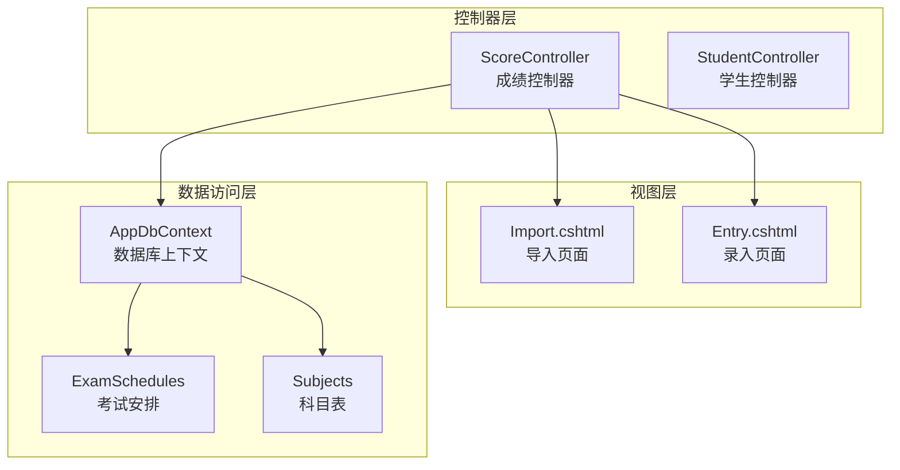
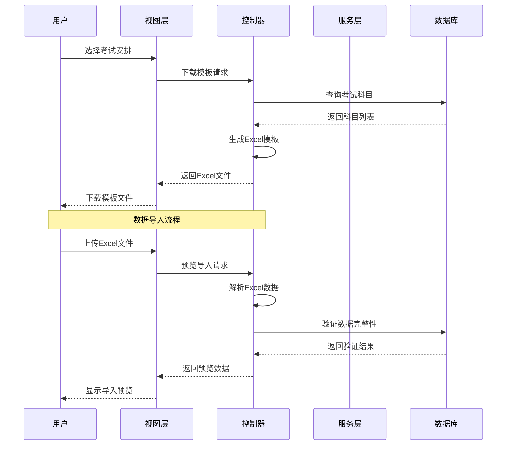
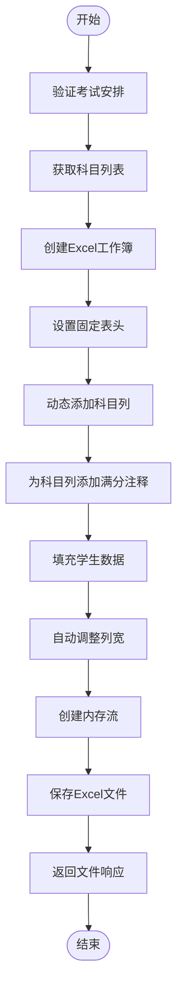
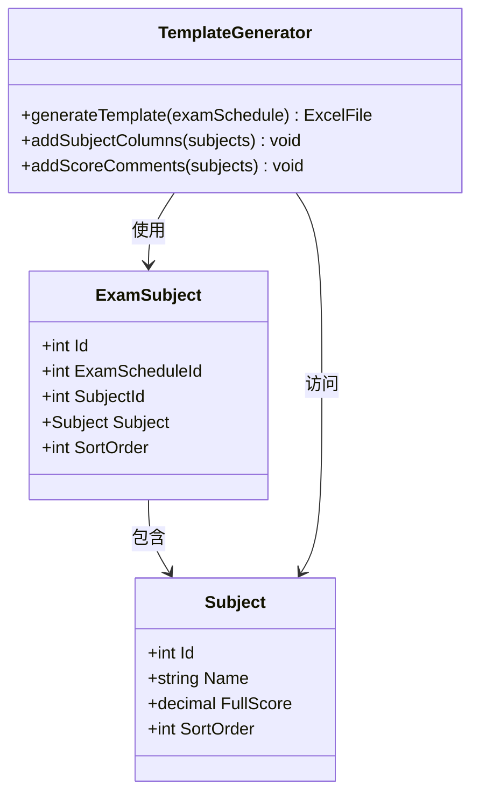
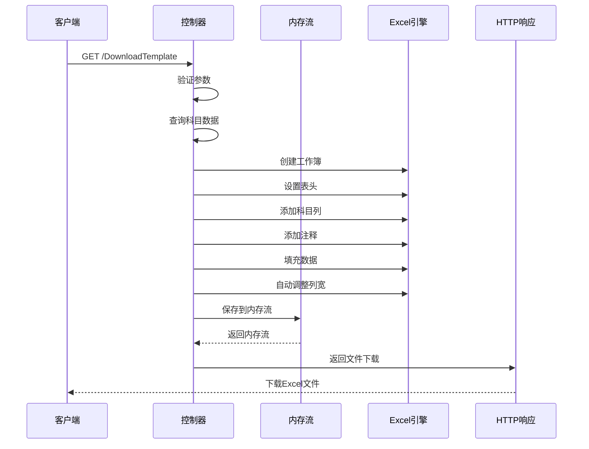
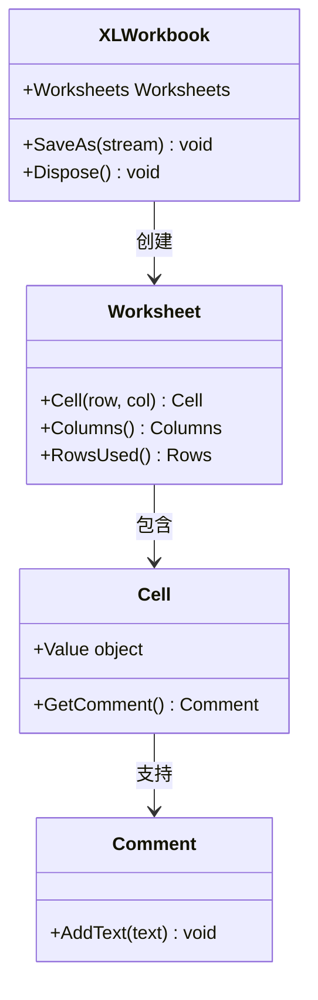
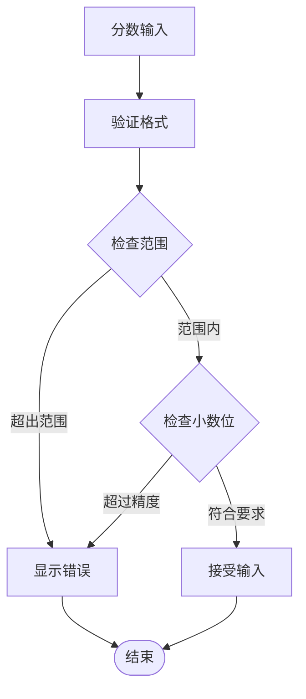
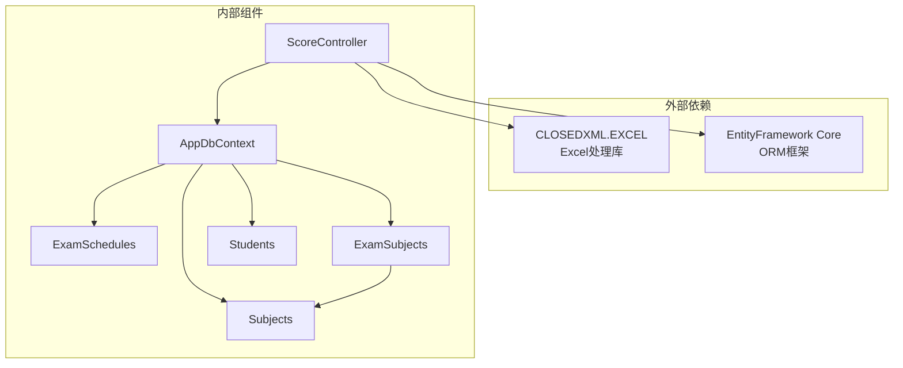

# 导入模板设计

<cite>
**本文档引用的文件**
- [ScoreController.cs](file://Controllers/ScoreController.cs)
- [Import.cshtml](file://Views/Score/Import.cshtml)
- [Entry.cshtml](file://Views/Score/Entry.cshtml)
- [StudentController.cs](file://Controllers/StudentController.cs)
</cite>

## 目录
1. [简介](#简介)
2. [项目结构](#项目结构)
3. [核心组件](#核心组件)
4. [架构概览](#架构概览)
5. [详细组件分析](#详细组件分析)
6. [依赖关系分析](#依赖关系分析)
7. [性能考虑](#性能考虑)
8. [故障排除指南](#故障排除指南)
9. [结论](#结论)
10. [附录](#附录)

## 简介

本文档详细阐述了学生管理系统中Excel导入模板的设计与实现。系统提供了标准化的成绩导入模板，包含固定的表头字段（序号、学号、姓名、年级、班级）和动态生成的科目列。模板根据考试安排自动生成，为每个科目添加满分注释说明，并采用统一的文件命名规则。

该设计确保了数据导入的一致性和准确性，通过前端验证和后端校验相结合的方式，提供了完整的数据质量保障机制。

## 项目结构

导入模板功能主要分布在以下模块中：

**图表来源**
- [ScoreController.cs:12-41](file://Controllers/ScoreController.cs#L12-L41)
- [Import.cshtml:33-61](file://Views/Score/Import.cshtml#L33-L61)

**章节来源**
- [ScoreController.cs:1-50](file://Controllers/ScoreController.cs#L1-L50)
- [Import.cshtml:1-45](file://Views/Score/Import.cshtml#L1-L45)

## 核心组件

### 模板生成组件

导入模板的核心生成逻辑由ScoreController负责，主要包括以下关键组件：

1. **表头字段定义**：固定包含序号、学号、姓名、年级、班级五个基础字段
2. **科目列动态生成**：根据考试安排中的科目列表动态添加科目列
3. **满分注释机制**：为每个科目列添加满分注释说明
4. **文件命名规则**：采用"导入模板_{考试名称}_{日期}.xlsx"的命名格式

### 前端交互组件

导入页面提供了完整的用户交互体验：

1. **考试选择界面**：允许用户选择目标考试安排
2. **模板下载功能**：一键下载符合当前考试安排的模板文件
3. **文件上传预览**：支持Excel文件上传并进行数据预览
4. **导入确认机制**：提供数据预览和确认导入的功能

**章节来源**
- [ScoreController.cs:384-419](file://Controllers/ScoreController.cs#L384-L419)
- [Import.cshtml:86-113](file://Views/Score/Import.cshtml#L86-L113)

## 架构概览

导入模板系统的整体架构采用经典的三层架构模式：

**图表来源**
- [ScoreController.cs:362-419](file://Controllers/ScoreController.cs#L362-L419)
- [Import.cshtml:104-139](file://Views/Score/Import.cshtml#L104-L139)

## 详细组件分析

### 模板生成算法

模板生成过程遵循严格的算法流程：

**图表来源**
- [ScoreController.cs:384-419](file://Controllers/ScoreController.cs#L384-L419)

#### 表头字段定义

模板采用固定的表头结构：

| 字段序号 | 字段名称 | 数据类型 | 格式要求 | 说明 |
|---------|----------|----------|----------|------|
| 1 | 序号 | 数字 | 自动递增 | 系统自动生成的行号 |
| 2 | 学号 | 文本 | 任意文本 | 学生唯一标识符 |
| 3 | 姓名 | 文本 | 任意文本 | 学生真实姓名 |
| 4 | 年级 | 文本 | 任意文本 | 学生所在年级 |
| 5 | 班级 | 文本 | 任意文本 | 学生所在班级 |

每个科目列的生成遵循以下规则：
- 列标题为科目名称
- 自动添加满分注释："满分 {科目满分}"
- 科目列按科目排序顺序排列

#### 科目列动态生成机制

**图表来源**
- [ScoreController.cs:393-398](file://Controllers/ScoreController.cs#L393-L398)

**章节来源**
- [ScoreController.cs:387-398](file://Controllers/ScoreController.cs#L387-L398)

### 文件生成与下载流程

模板文件的生成和下载采用内存流处理机制：

**图表来源**
- [ScoreController.cs:413-419](file://Controllers/ScoreController.cs#L413-L419)

#### 内存流处理机制

系统采用高效的内存流处理方式：

1. **内存分配**：创建MemoryStream对象用于临时存储Excel文件
2. **流操作**：使用SaveAs方法将Excel内容写入内存流
3. **位置重置**：将流位置设置为0以便后续读取
4. **文件传输**：通过File方法返回Excel文件给客户端

#### Excel工作簿创建

**图表来源**
- [ScoreController.cs:384-419](file://Controllers/ScoreController.cs#L384-L419)

**章节来源**
- [ScoreController.cs:384-419](file://Controllers/ScoreController.cs#L384-L419)

### 数据验证与格式约束

系统实现了多层次的数据验证机制：

#### 学号匹配规则

1. **唯一性验证**：学号必须在数据库中存在且唯一
2. **格式验证**：学号为必填字段，不能为空
3. **类型验证**：学号作为文本处理，支持数字和字母组合

#### 姓名一致性要求

1. **完整性验证**：姓名字段必须存在且非空
2. **字符限制**：支持中文、英文字母和常见字符
3. **长度控制**：建议姓名长度不超过20个字符

#### 分数输入格式规范

**图表来源**
- [Entry.cshtml:128-142](file://Views/Score/Entry.cshtml#L128-L142)

**章节来源**
- [Entry.cshtml:128-142](file://Views/Score/Entry.cshtml#L128-L142)

## 依赖关系分析

导入模板系统涉及多个组件间的复杂依赖关系：

**图表来源**
- [ScoreController.cs:5-7](file://Controllers/ScoreController.cs#L5-L7)

### 组件耦合度分析

系统采用松耦合设计原则：

1. **控制器与视图分离**：控制器专注于业务逻辑，视图负责展示
2. **数据访问抽象**：通过EF Core实现数据访问的抽象化
3. **第三方库封装**：Excel处理功能通过独立的类进行封装

**章节来源**
- [ScoreController.cs:14-19](file://Controllers/ScoreController.cs#L14-L19)

## 性能考虑

### 内存使用优化

1. **流式处理**：采用MemoryStream避免磁盘I/O操作
2. **及时释放**：确保Excel对象和流对象及时释放
3. **批量操作**：减少数据库查询次数，采用批量数据获取

### 并发处理能力

1. **异步操作**：所有数据库操作采用async/await模式
2. **线程安全**：Excel操作在单线程上下文中执行
3. **资源管理**：使用using语句确保资源正确释放

## 故障排除指南

### 常见问题及解决方案

#### 模板下载失败

**问题症状**：点击下载按钮无响应或出现错误提示

**可能原因**：
1. 考试安排参数缺失
2. 科目数据查询失败
3. Excel文件生成异常

**解决步骤**：
1. 检查网络连接稳定性
2. 确认考试安排状态正常
3. 查看服务器日志获取详细错误信息

#### 数据导入错误

**问题症状**：上传Excel文件后无法导入或导入结果显示错误

**可能原因**：
1. Excel格式不符合要求
2. 数据格式不正确
3. 学号或姓名缺失

**解决步骤**：
1. 确保使用系统提供的标准模板
2. 检查数据格式是否符合要求
3. 验证学号和姓名的完整性

**章节来源**
- [Import.cshtml:104-139](file://Views/Score/Import.cshtml#L104-L139)

## 结论

导入模板设计通过标准化的表头结构、动态的科目列生成机制和完善的验证体系，为成绩数据导入提供了高效、准确的解决方案。系统采用现代化的技术栈和最佳实践，确保了良好的用户体验和数据质量。

该设计的主要优势包括：
1. **灵活性**：支持不同考试安排的动态模板生成
2. **准确性**：多重验证机制确保数据质量
3. **易用性**：简洁直观的操作界面
4. **可维护性**：清晰的代码结构和完善的注释

## 附录

### 最佳实践建议

1. **模板使用规范**
   - 始终使用系统生成的标准模板
   - 不要修改固定表头字段
   - 确保科目列的正确对应

2. **数据录入规范**
   - 严格按照模板格式填写数据
   - 注意分数的数值范围和精度
   - 及时保存录入进度

3. **文件管理规范**
   - 保留原始模板文件
   - 备份重要的导入记录
   - 定期清理临时文件

### 技术规格说明

| 项目 | 规格要求 | 说明 |
|------|----------|------|
| 支持格式 | .xlsx, .xls | 推荐使用.xlsx格式 |
| 最大批量 | 1000+记录 | 根据系统性能调整 |
| 文件大小 | ≤10MB | 超大文件建议分批导入 |
| 浏览器兼容 | Chrome, Edge, Firefox | 推荐使用Chrome浏览器 |