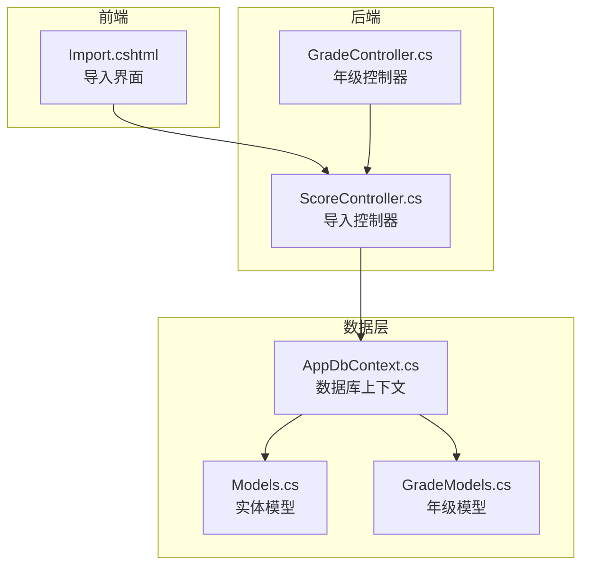
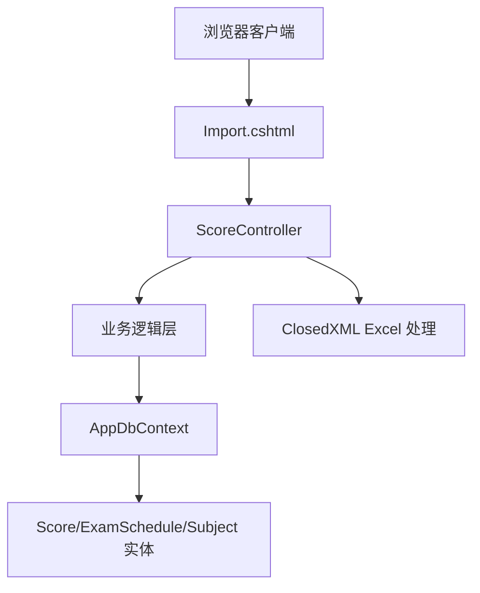
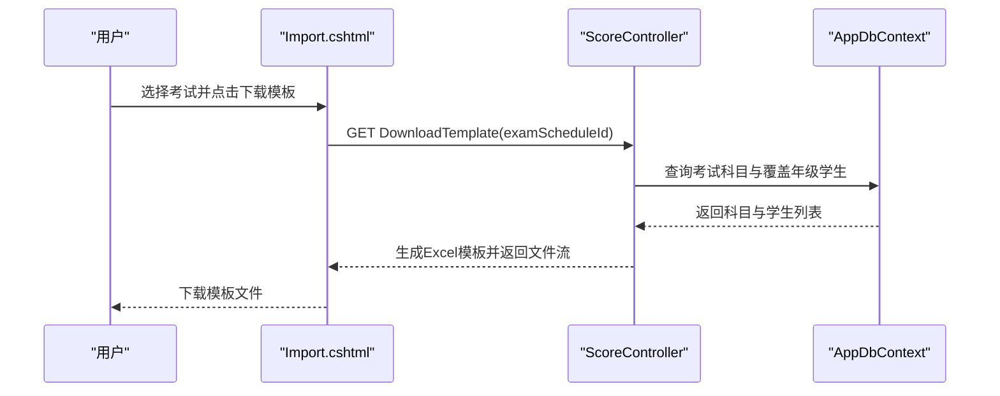
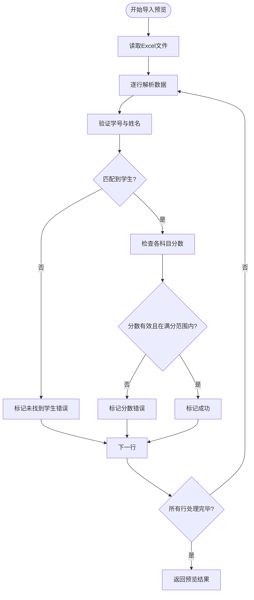
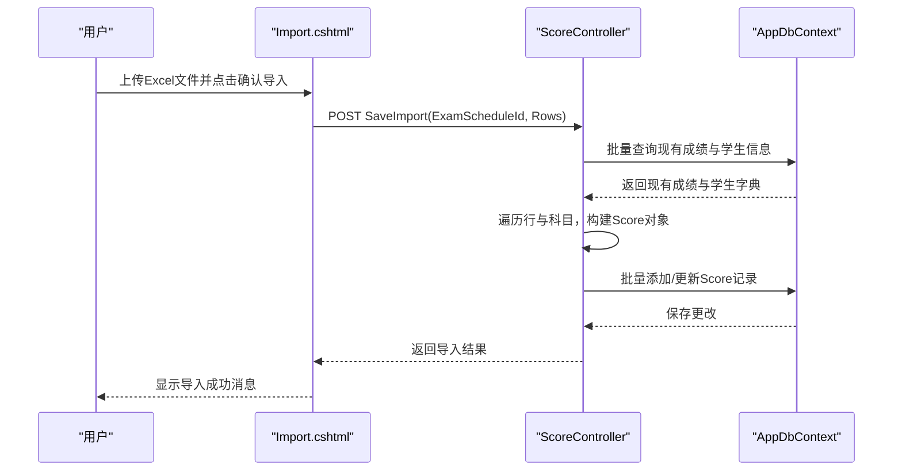
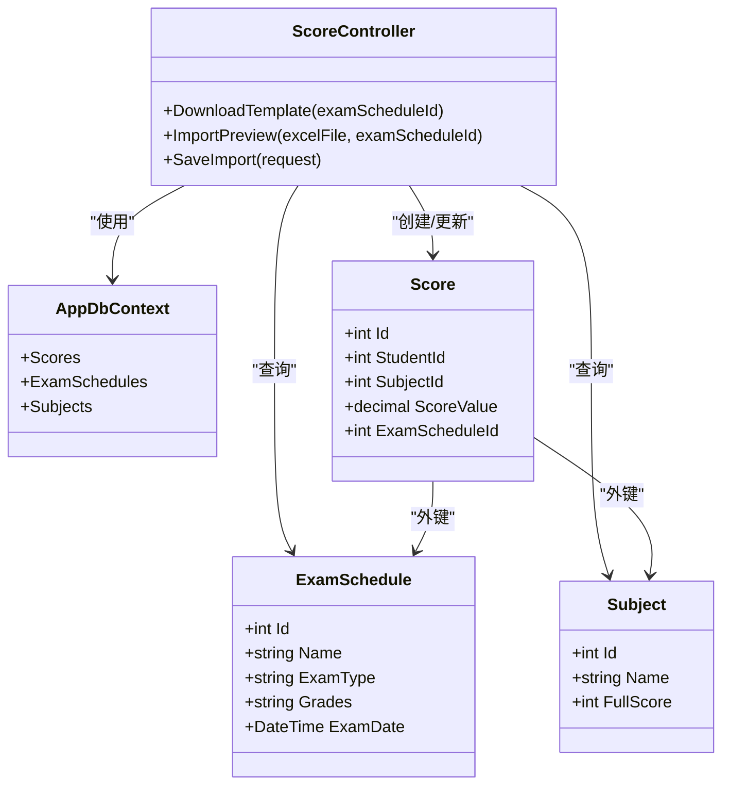

# 导入流程设计

<cite>
**本文档引用的文件**
- [ScoreController.cs](file://Controllers/ScoreController.cs)
- [Import.cshtml](file://Views/Score/Import.cshtml)
- [AppDbContext.cs](file://Data/AppDbContext.cs)
- [Models.cs](file://Models/Models.cs)
- [GradeModels.cs](file://Models/GradeModels.cs)
- [GradeController.cs](file://Controllers/GradeController.cs)
</cite>

## 目录
1. [简介](#简介)
2. [项目结构](#项目结构)
3. [核心组件](#核心组件)
4. [架构概览](#架构概览)
5. [详细组件分析](#详细组件分析)
6. [依赖关系分析](#依赖关系分析)
7. [性能考虑](#性能考虑)
8. [故障排除指南](#故障排除指南)
9. [结论](#结论)

## 简介
本文件详细阐述学生成绩管理系统的批量导入流程设计，涵盖从模板下载、数据验证、导入预览到批量保存的完整生命周期。系统采用前后端分离的交互方式，前端负责用户界面与数据收集，后端通过控制器处理业务逻辑，使用Entity Framework Core进行数据库访问与事务管理。

## 项目结构
导入流程涉及的关键文件分布如下：
- 控制器层：ScoreController.cs 提供导入相关的HTTP接口，包括模板下载、导入预览、保存导入等。
- 视图层：Import.cshtml 提供用户界面，支持选择考试、下载模板、上传文件、预览结果与确认导入。
- 数据模型层：AppDbContext.cs 定义数据库上下文与实体映射；Models.cs 和 GradeModels.cs 定义Score、ExamSchedule、Subject等核心模型。
- 辅助组件：GradeController.cs 中的GradeHelper提供年级到入学年的转换辅助方法，用于统计与展示。

**图表来源**
- [ScoreController.cs:1-620](file://Controllers/ScoreController.cs#L1-L620)
- [Import.cshtml:1-253](file://Views/Score/Import.cshtml#L1-L253)
- [AppDbContext.cs:1-295](file://Data/AppDbContext.cs#L1-L295)
- [Models.cs:314-358](file://Models/Models.cs#L314-L358)
- [GradeModels.cs:6-55](file://Models/GradeModels.cs#L6-L55)

**章节来源**
- [ScoreController.cs:350-591](file://Controllers/ScoreController.cs#L350-L591)
- [Import.cshtml:1-253](file://Views/Score/Import.cshtml#L1-L253)
- [AppDbContext.cs:204-224](file://Data/AppDbContext.cs#L204-L224)
- [Models.cs:314-358](file://Models/Models.cs#L314-L358)
- [GradeModels.cs:6-55](file://Models/GradeModels.cs#L6-L55)

## 核心组件
- 导入控制器（ScoreController）：提供导入相关接口，包括下载模板、导入预览、保存导入等。
- 导入视图（Import.cshtml）：提供用户交互界面，支持选择考试、下载模板、上传文件、预览与确认导入。
- 数据库上下文（AppDbContext）：定义Score、ExamSchedule、Subject等实体及其关系。
- 实体模型（Models.cs、GradeModels.cs）：定义Score、ExamSchedule、Subject、GradeLevel等核心模型及属性约束。
- 年级辅助（GradeHelper）：提供年级到入学年的转换逻辑，用于统计与展示。

**章节来源**
- [ScoreController.cs:11-591](file://Controllers/ScoreController.cs#L11-L591)
- [Import.cshtml:1-253](file://Views/Score/Import.cshtml#L1-L253)
- [AppDbContext.cs:204-224](file://Data/AppDbContext.cs#L204-L224)
- [Models.cs:314-358](file://Models/Models.cs#L314-L358)
- [GradeModels.cs:6-55](file://Models/GradeModels.cs#L6-L55)

## 架构概览
导入流程遵循典型的三层架构：
- 表现层：Import.cshtml 提供用户界面与交互。
- 业务层：ScoreController 处理导入逻辑，包括模板生成、数据校验、批量保存。
- 数据访问层：AppDbContext 使用Entity Framework Core进行数据库操作，确保数据一致性。

**图表来源**
- [ScoreController.cs:11-591](file://Controllers/ScoreController.cs#L11-L591)
- [Import.cshtml:1-253](file://Views/Score/Import.cshtml#L1-L253)
- [AppDbContext.cs:204-224](file://Data/AppDbContext.cs#L204-L224)

## 详细组件分析

### 模板下载与设计规范
- 模板生成：根据选定的考试安排，动态生成包含学号、姓名、年级、班级以及各科目的Excel模板。
- 设计规范：
  - 必需字段：学号、姓名、年级、班级。
  - 可选字段：各科目分数。
  - 数据类型：学号与姓名为文本类型；分数为数值类型。
  - 格式约束：分数列包含满分注释，提示每科目的满分值。
  - 唯一性：模板基于考试覆盖的年级与学生集合生成，确保数据范围准确。

**图表来源**
- [ScoreController.cs:362-419](file://Controllers/ScoreController.cs#L362-L419)
- [Import.cshtml:99-102](file://Views/Score/Import.cshtml#L99-L102)

**章节来源**
- [ScoreController.cs:362-419](file://Controllers/ScoreController.cs#L362-L419)
- [Import.cshtml:99-102](file://Views/Score/Import.cshtml#L99-L102)

### 导入预览功能实现
- 数据格式验证：逐行读取Excel数据，验证学号与姓名是否为空。
- 学生匹配验证：根据学号与姓名在数据库中查找对应学生，若未找到则标记错误。
- 满分范围检查：对每个科目的分数进行解析，判断是否在相应科目的满分范围内。
- 错误标记机制：为每行数据标记是否存在错误，并为每个科目列显示具体的错误信息。
- 重复数据处理：预览阶段不执行数据库写入，仅在确认导入时才进行批量保存。

**图表来源**
- [ScoreController.cs:421-521](file://Controllers/ScoreController.cs#L421-L521)

**章节来源**
- [ScoreController.cs:421-521](file://Controllers/ScoreController.cs#L421-L521)

### 批量导入技术实现
- 异步处理：前端通过AJAX异步请求导入预览与保存导入，避免页面刷新。
- 事务管理：导入保存阶段使用Entity Framework Core的事务特性，确保批量保存的一致性。
- 错误恢复：预览阶段已过滤掉错误行，保存阶段仅处理标记为成功的行，保证数据完整性。
- 进度反馈：前端在导入过程中显示加载动画与状态提示，提升用户体验。

**图表来源**
- [ScoreController.cs:523-591](file://Controllers/ScoreController.cs#L523-L591)
- [Import.cshtml:218-246](file://Views/Score/Import.cshtml#L218-L246)

**章节来源**
- [ScoreController.cs:523-591](file://Controllers/ScoreController.cs#L523-L591)
- [Import.cshtml:218-246](file://Views/Score/Import.cshtml#L218-L246)

### 数据验证规则
- 学号匹配验证：预览阶段通过学号与姓名双重条件匹配学生，未匹配到的学生将被标记为错误。
- 姓名一致性检查：与学号共同作为唯一标识，确保数据准确性。
- 分数范围验证：每个科目的分数必须在该科目的满分范围内，超出范围将被标记为错误。
- 空值处理：空分数将被视为未填写，不会产生错误标记，但也不会计入有效导入数据。

**章节来源**
- [ScoreController.cs:457-510](file://Controllers/ScoreController.cs#L457-L510)

### 导入失败处理策略与数据回滚
- 失败处理策略：预览阶段已过滤错误行，保存阶段仅处理标记为成功的行，避免错误数据进入数据库。
- 数据回滚机制：由于导入保存使用Entity Framework Core的事务特性，若保存过程中发生异常，系统将自动回滚，确保数据库一致性。

**章节来源**
- [ScoreController.cs:523-591](file://Controllers/ScoreController.cs#L523-L591)

## 依赖关系分析
导入流程涉及的主要依赖关系如下：
- ScoreController 依赖 AppDbContext 进行数据库操作。
- 导入视图 Import.cshtml 通过 AJAX 与 ScoreController 交互。
- 实体模型 Score、ExamSchedule、Subject 定义了导入数据的结构与约束。
- GradeHelper 提供年级到入学年的转换，辅助统计与展示。

**图表来源**
- [ScoreController.cs:11-591](file://Controllers/ScoreController.cs#L11-L591)
- [AppDbContext.cs:204-224](file://Data/AppDbContext.cs#L204-L224)
- [Models.cs:314-358](file://Models/Models.cs#L314-L358)

**章节来源**
- [ScoreController.cs:11-591](file://Controllers/ScoreController.cs#L11-L591)
- [AppDbContext.cs:204-224](file://Data/AppDbContext.cs#L204-L224)
- [Models.cs:314-358](file://Models/Models.cs#L314-L358)

## 性能考虑
- 批量查询优化：导入预览与保存阶段均采用批量查询与字典映射，减少数据库往返次数。
- 内存管理：Excel文件读取与处理使用内存流，避免大文件占用过多磁盘空间。
- 前端渲染：预览表格采用虚拟滚动与分页，提升大数据量下的渲染性能。

## 故障排除指南
- 文件格式错误：确保上传的Excel文件为.xlsx或.xls格式，且内容符合模板要求。
- 考试安排缺失：确认所选考试已正确配置科目与覆盖年级。
- 学生未找到：检查学号与姓名是否与数据库一致，避免大小写或空格问题。
- 分数超出范围：确保各科目分数不超过对应科目的满分值。

**章节来源**
- [ScoreController.cs:421-521](file://Controllers/ScoreController.cs#L421-L521)
- [Import.cshtml:115-136](file://Views/Score/Import.cshtml#L115-L136)

## 结论
本导入流程设计通过清晰的职责划分与严格的验证机制，实现了从模板下载到数据验证再到批量保存的完整闭环。系统采用异步处理与事务管理，确保用户体验与数据一致性。通过预览阶段的错误标记与过滤，有效降低了导入失败的风险，提升了系统的可靠性与可维护性。