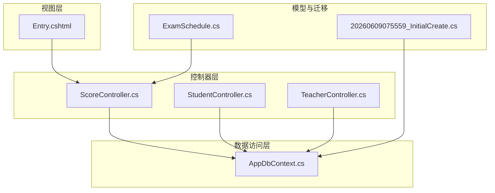
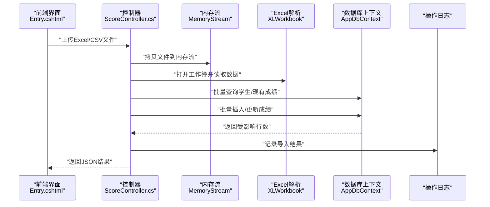
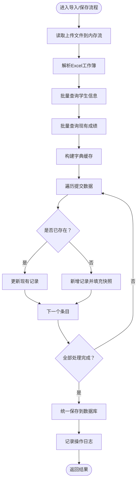
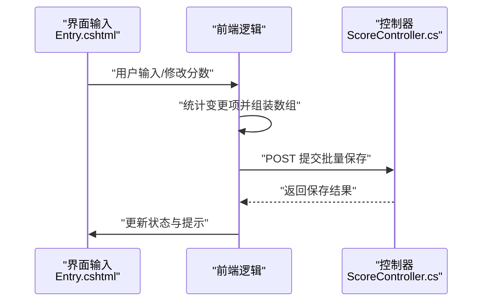
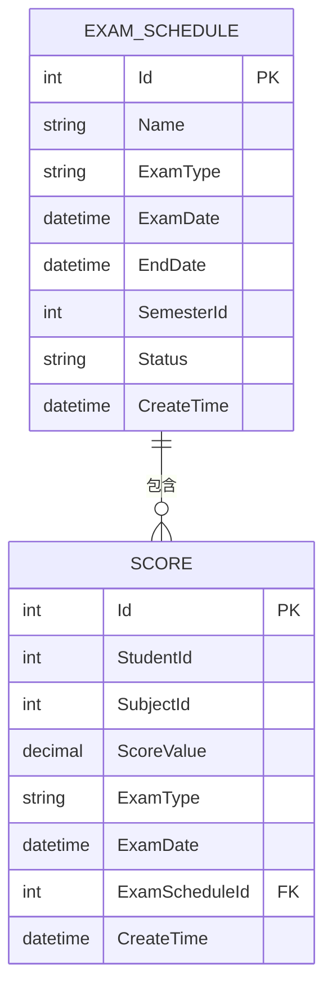
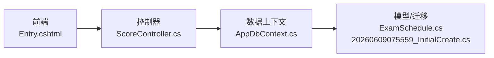

# 批量处理实现

<cite>
**本文引用的文件**
- [ScoreController.cs](file://Controllers/ScoreController.cs)
- [StudentController.cs](file://Controllers/StudentController.cs)
- [TeacherController.cs](file://Controllers/TeacherController.cs)
- [AppDbContext.cs](file://Data/AppDbContext.cs)
- [Entry.cshtml](file://Views/Score/Entry.cshtml)
- [ExamSchedule.cs](file://Models/ExamSchedule.cs)
- [20260609075559_InitialCreate.cs](file://Migrations/20260609075559_InitialCreate.cs)
</cite>

## 目录
1. [引言](#引言)
2. [项目结构](#项目结构)
3. [核心组件](#核心组件)
4. [架构总览](#架构总览)
5. [详细组件分析](#详细组件分析)
6. [依赖关系分析](#依赖关系分析)
7. [性能考量](#性能考量)
8. [故障排查指南](#故障排查指南)
9. [结论](#结论)
10. [附录](#附录)

## 引言
本文件系统化梳理学生成绩管理系统的批量处理实现，重点覆盖以下方面：
- 导入数据的批量处理流程：异步文件读取、内存流处理、Excel数据解析与批量数据库操作
- 批量保存技术实现：批量查询学生信息、批量加载现有成绩、字典缓存优化、批量插入/更新机制
- 事务管理与错误恢复策略：批量操作的原子性保证、部分失败时的数据回滚与错误记录
- 性能优化措施：批量查询减少数据库往返、内存使用优化、大文件处理策略
- 性能监控与错误处理最佳实践

## 项目结构
围绕批量处理的关键文件与职责如下：
- 控制器层
  - 成绩导入与保存：[ScoreController.cs](file://Controllers/ScoreController.cs)
  - 学生批量导入：[StudentController.cs](file://Controllers/StudentController.cs)
  - 教职工批量导入：[TeacherController.cs](file://Controllers/TeacherController.cs)
- 数据访问层
  - 上下文定义：[AppDbContext.cs](file://Data/AppDbContext.cs)
- 视图层
  - 成绩录入界面与前端交互：[Entry.cshtml](file://Views/Score/Entry.cshtml)
- 模型与迁移
  - 考试安排模型：[ExamSchedule.cs](file://Models/ExamSchedule.cs)
  - 成绩表结构迁移：[20260609075559_InitialCreate.cs](file://Migrations/20260609075559_InitialCreate.cs)

图表来源
- [ScoreController.cs](file://Controllers/ScoreController.cs)
- [StudentController.cs](file://Controllers/StudentController.cs)
- [TeacherController.cs](file://Controllers/TeacherController.cs)
- [AppDbContext.cs](file://Data/AppDbContext.cs)
- [Entry.cshtml](file://Views/Score/Entry.cshtml)
- [ExamSchedule.cs](file://Models/ExamSchedule.cs)
- [20260609075559_InitialCreate.cs](file://Migrations/20260609075559_InitialCreate.cs)

章节来源
- [ScoreController.cs](file://Controllers/ScoreController.cs)
- [StudentController.cs](file://Controllers/StudentController.cs)
- [TeacherController.cs](file://Controllers/TeacherController.cs)
- [AppDbContext.cs](file://Data/AppDbContext.cs)
- [Entry.cshtml](file://Views/Score/Entry.cshtml)
- [ExamSchedule.cs](file://Models/ExamSchedule.cs)
- [20260609075559_InitialCreate.cs](file://Migrations/20260609075559_InitialCreate.cs)

## 核心组件
- 批量导入控制器
  - 成绩导入预览与保存：[ScoreController.cs](file://Controllers/ScoreController.cs)
  - 学生批量导入：[StudentController.cs](file://Controllers/StudentController.cs)
  - 教职工批量导入：[TeacherController.cs](file://Controllers/TeacherController.cs)
- 数据上下文
  - 提供实体集与数据库连接：[AppDbContext.cs](file://Data/AppDbContext.cs)
- 前端交互
  - 成绩录入与批量保存触发：[Entry.cshtml](file://Views/Score/Entry.cshtml)
- 模型与表结构
  - 考试安排模型：[ExamSchedule.cs](file://Models/ExamSchedule.cs)
  - 成绩表结构：[20260609075559_InitialCreate.cs](file://Migrations/20260609075559_InitialCreate.cs)

章节来源
- [ScoreController.cs](file://Controllers/ScoreController.cs)
- [StudentController.cs](file://Controllers/StudentController.cs)
- [TeacherController.cs](file://Controllers/TeacherController.cs)
- [AppDbContext.cs](file://Data/AppDbContext.cs)
- [Entry.cshtml](file://Views/Score/Entry.cshtml)
- [ExamSchedule.cs](file://Models/ExamSchedule.cs)
- [20260609075559_InitialCreate.cs](file://Migrations/20260609075559_InitialCreate.cs)

## 架构总览
批量处理在系统中的整体交互路径如下：
- 前端通过视图提交Excel/CSV文件
- 控制器接收文件并使用内存流解析
- 使用EF Core进行批量查询与批量写入
- 记录操作日志以支持审计与回溯

图表来源
- [ScoreController.cs](file://Controllers/ScoreController.cs)
- [Entry.cshtml](file://Views/Score/Entry.cshtml)
- [AppDbContext.cs](file://Data/AppDbContext.cs)

## 详细组件分析

### 成绩批量导入与保存（后端）
- 异步文件读取与内存流处理
  - 将上传文件拷贝至内存流，避免临时磁盘占用，便于后续Excel解析与批量处理
  - 参考路径：[ScoreController.cs](file://Controllers/ScoreController.cs)
- Excel数据解析
  - 使用工作簿读取首张工作表，定位有效数据范围，逐行解析字段
  - 参考路径：[ScoreController.cs](file://Controllers/ScoreController.cs)
- 批量查询与字典缓存优化
  - 批量加载学生信息与现有成绩，构建字典键值映射，降低重复查询与循环查找成本
  - 参考路径：[ScoreController.cs](file://Controllers/ScoreController.cs)
- 批量插入/更新机制
  - 遍历提交的分数集合，若命中现有记录则更新，否则新增；同时填充班级/年级快照信息
  - 参考路径：[ScoreController.cs](file://Controllers/ScoreController.cs)
- 事务与持久化
  - EF Core在单请求内统一SaveChanges，保证批量写入的原子性
  - 参考路径：[ScoreController.cs](file://Controllers/ScoreController.cs)
- 错误处理与结果反馈
  - 对异常进行捕获并返回结构化JSON，包含成功/失败计数与提示信息
  - 参考路径：[ScoreController.cs](file://Controllers/ScoreController.cs)

图表来源
- [ScoreController.cs](file://Controllers/ScoreController.cs)

章节来源
- [ScoreController.cs](file://Controllers/ScoreController.cs)

### 成绩批量导入与保存（前端）
- 批量保存触发
  - 前端收集变更项，组装为列表并通过POST提交到后端
  - 参考路径：[Entry.cshtml](file://Views/Score/Entry.cshtml)
- 实时状态提示
  - 统计待保存数量，实时更新UI状态
  - 参考路径：[Entry.cshtml](file://Views/Score/Entry.cshtml)

图表来源
- [Entry.cshtml](file://Views/Score/Entry.cshtml)
- [ScoreController.cs](file://Controllers/ScoreController.cs)

章节来源
- [Entry.cshtml](file://Views/Score/Entry.cshtml)
- [ScoreController.cs](file://Controllers/ScoreController.cs)

### 学生批量导入
- 文件格式与校验
  - 接收Excel文件，读取有效数据范围，跳过表头
  - 参考路径：[StudentController.cs](file://Controllers/StudentController.cs)
- 内存流与解析
  - 同样采用内存流+XLWorkbook解析，确保大文件高效处理
  - 参考路径：[StudentController.cs](file://Controllers/StudentController.cs)

章节来源
- [StudentController.cs](file://Controllers/StudentController.cs)

### 教职工批量导入
- CSV文件处理
  - 校验扩展名为CSV，逐行读取并拆分字段
  - 参考路径：[TeacherController.cs](file://Controllers/TeacherController.cs)
- 内存流与解析
  - 使用内存流与XLWorkbook解析Excel，构建用户集合
  - 参考路径：[TeacherController.cs](file://Controllers/TeacherController.cs)

章节来源
- [TeacherController.cs](file://Controllers/TeacherController.cs)

### 数据模型与表结构
- 考试安排模型
  - 包含考试类型、日期、状态等关键属性，用于批量导入时的上下文约束
  - 参考路径：[ExamSchedule.cs](file://Models/ExamSchedule.cs)
- 成绩表结构
  - 主键、外键、数值精度与索引设计，支撑批量写入性能
  - 参考路径：[20260609075559_InitialCreate.cs](file://Migrations/20260609075559_InitialCreate.cs)

图表来源
- [ExamSchedule.cs](file://Models/ExamSchedule.cs)
- [20260609075559_InitialCreate.cs](file://Migrations/20260609075559_InitialCreate.cs)

章节来源
- [ExamSchedule.cs](file://Models/ExamSchedule.cs)
- [20260609075559_InitialCreate.cs](file://Migrations/20260609075559_InitialCreate.cs)

## 依赖关系分析
- 控制器对数据上下文的依赖
  - 批量查询与批量写入均通过AppDbContext执行
  - 参考路径：[ScoreController.cs](file://Controllers/ScoreController.cs)、[AppDbContext.cs](file://Data/AppDbContext.cs)
- 前端对控制器的依赖
  - 前端通过AJAX调用控制器接口，提交批量数据
  - 参考路径：[Entry.cshtml](file://Views/Score/Entry.cshtml)、[ScoreController.cs](file://Controllers/ScoreController.cs)
- 模型与迁移的耦合
  - 成绩实体与考试安排实体存在外键关系，影响批量导入时的完整性约束
  - 参考路径：[ExamSchedule.cs](file://Models/ExamSchedule.cs)、[20260609075559_InitialCreate.cs](file://Migrations/20260609075559_InitialCreate.cs)

图表来源
- [Entry.cshtml](file://Views/Score/Entry.cshtml)
- [ScoreController.cs](file://Controllers/ScoreController.cs)
- [AppDbContext.cs](file://Data/AppDbContext.cs)
- [ExamSchedule.cs](file://Models/ExamSchedule.cs)
- [20260609075559_InitialCreate.cs](file://Migrations/20260609075559_InitialCreate.cs)

章节来源
- [Entry.cshtml](file://Views/Score/Entry.cshtml)
- [ScoreController.cs](file://Controllers/ScoreController.cs)
- [AppDbContext.cs](file://Data/AppDbContext.cs)
- [ExamSchedule.cs](file://Models/ExamSchedule.cs)
- [20260609075559_InitialCreate.cs](file://Migrations/20260609075559_InitialCreate.cs)

## 性能考量
- 批量查询减少数据库往返
  - 通过一次性查询学生与现有成绩，避免N+1查询问题
  - 参考路径：[ScoreController.cs](file://Controllers/ScoreController.cs)
- 字典缓存优化
  - 使用字典快速判断是否存在与定位对象，降低时间复杂度
  - 参考路径：[ScoreController.cs](file://Controllers/ScoreController.cs)
- 内存使用优化
  - 使用内存流替代临时文件，减少磁盘IO；按需解析工作表范围
  - 参考路径：[ScoreController.cs](file://Controllers/ScoreController.cs)、[StudentController.cs](file://Controllers/StudentController.cs)、[TeacherController.cs](file://Controllers/TeacherController.cs)
- 大文件处理策略
  - 限制单次导入行数与并发，结合内存流与增量处理，避免内存峰值过高
  - 参考路径：[ScoreController.cs](file://Controllers/ScoreController.cs)、[StudentController.cs](file://Controllers/StudentController.cs)、[TeacherController.cs](file://Controllers/TeacherController.cs)

## 故障排查指南
- 常见错误与定位
  - 文件为空或格式不正确：检查上传文件扩展名与内容范围
    - 参考路径：[ScoreController.cs](file://Controllers/ScoreController.cs)、[StudentController.cs](file://Controllers/StudentController.cs)、[TeacherController.cs](file://Controllers/TeacherController.cs)
  - 考试安排不存在：确认ExamScheduleId有效性
    - 参考路径：[ScoreController.cs](file://Controllers/ScoreController.cs)
  - 批量保存无数据：检查前端提交的数组是否为空
    - 参考路径：[ScoreController.cs](file://Controllers/ScoreController.cs)
- 错误记录与审计
  - 导入完成后记录操作日志，包含新增/跳过计数，便于回溯
    - 参考路径：[ScoreController.cs](file://Controllers/ScoreController.cs)
- 事务与回滚
  - 单请求内统一SaveChanges，出现异常时由框架层保证回滚
    - 参考路径：[ScoreController.cs](file://Controllers/ScoreController.cs)

章节来源
- [ScoreController.cs](file://Controllers/ScoreController.cs)
- [StudentController.cs](file://Controllers/StudentController.cs)
- [TeacherController.cs](file://Controllers/TeacherController.cs)

## 结论
该批量处理实现通过“内存流+批量查询+字典缓存+统一保存”的组合，在保证性能的同时提升了可靠性。建议在生产环境中进一步完善：
- 增加分页/分批导入策略，避免超大数据集一次性处理
- 加强字段校验与数据清洗，提升导入质量
- 完善重试与补偿机制，增强部分失败场景的恢复能力

## 附录
- 关键实现位置参考
  - 批量导入与保存：[ScoreController.cs](file://Controllers/ScoreController.cs)
  - 学生批量导入：[StudentController.cs](file://Controllers/StudentController.cs)
  - 教职工批量导入：[TeacherController.cs](file://Controllers/TeacherController.cs)
  - 数据上下文：[AppDbContext.cs](file://Data/AppDbContext.cs)
  - 前端交互：[Entry.cshtml](file://Views/Score/Entry.cshtml)
  - 考试安排模型：[ExamSchedule.cs](file://Models/ExamSchedule.cs)
  - 成绩表结构：[20260609075559_InitialCreate.cs](file://Migrations/20260609075559_InitialCreate.cs)