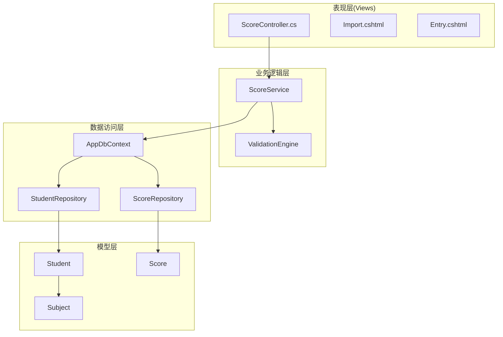
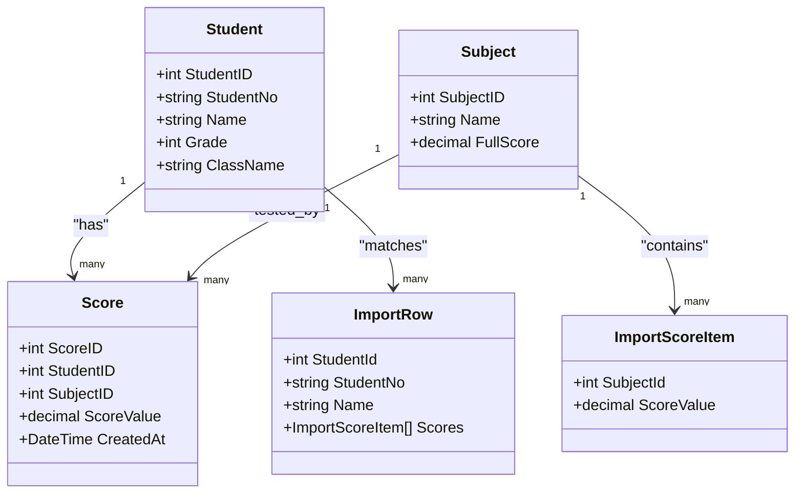
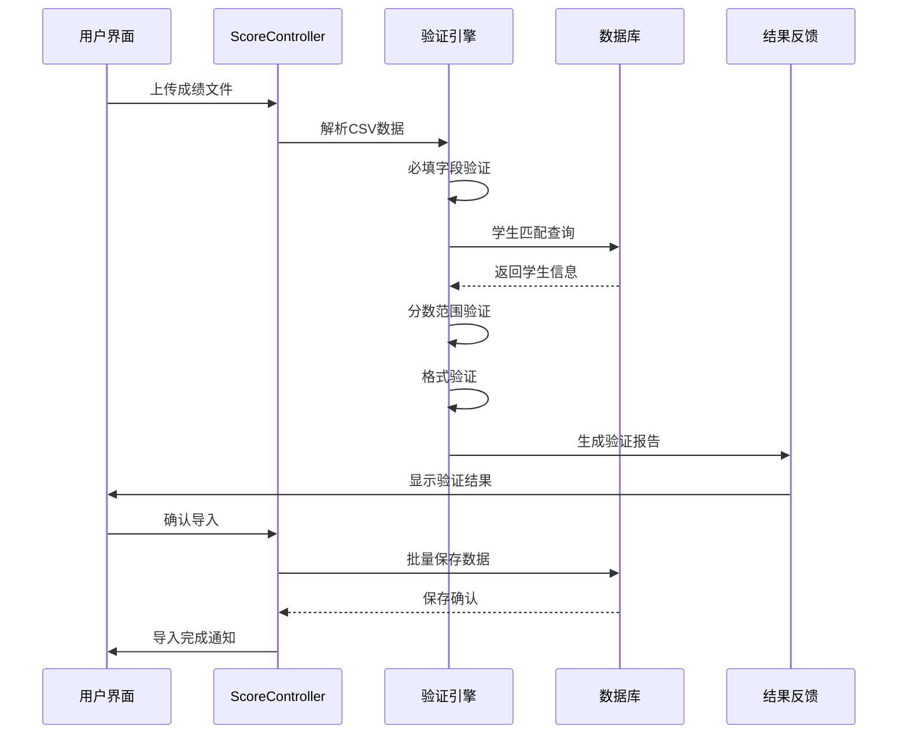
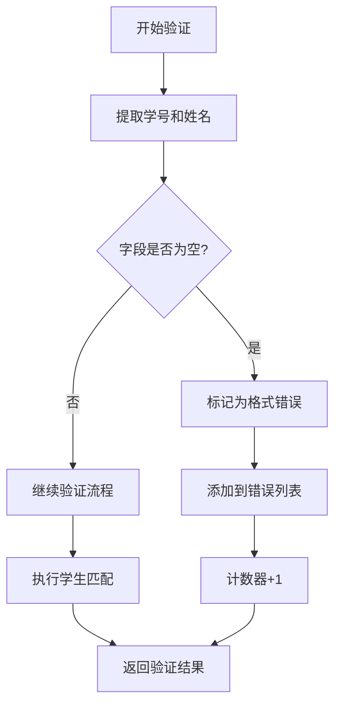
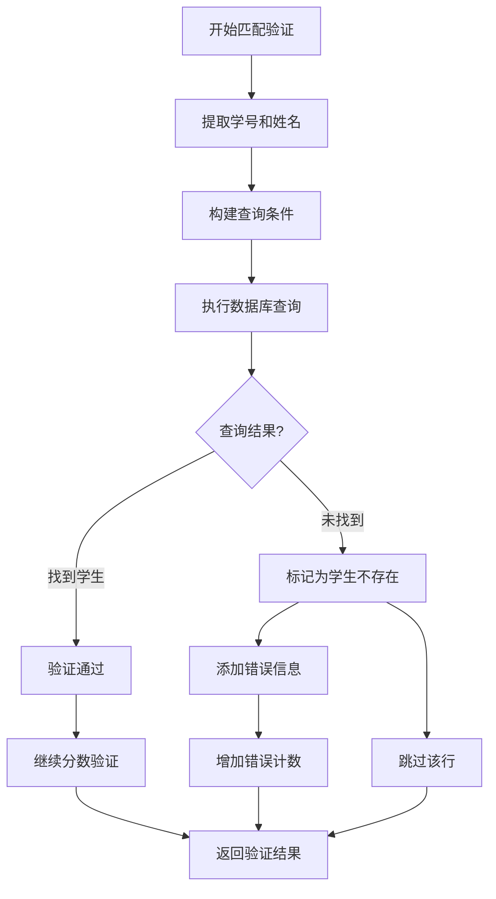
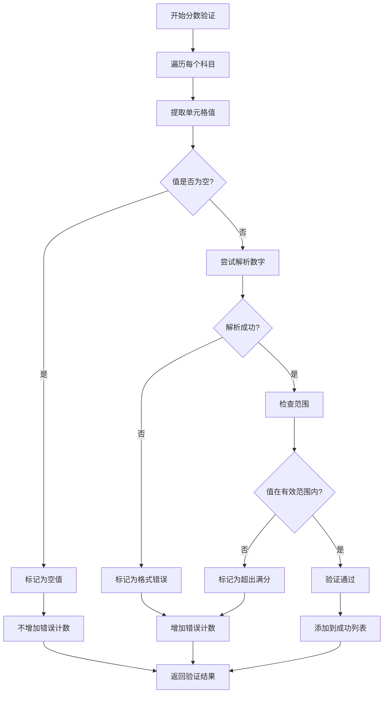
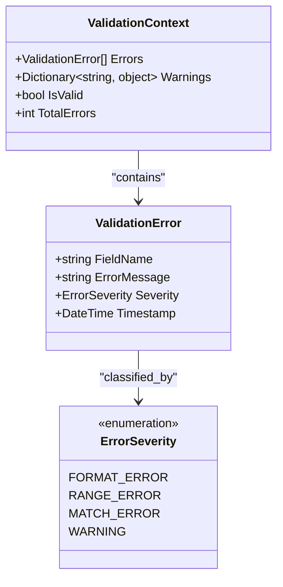
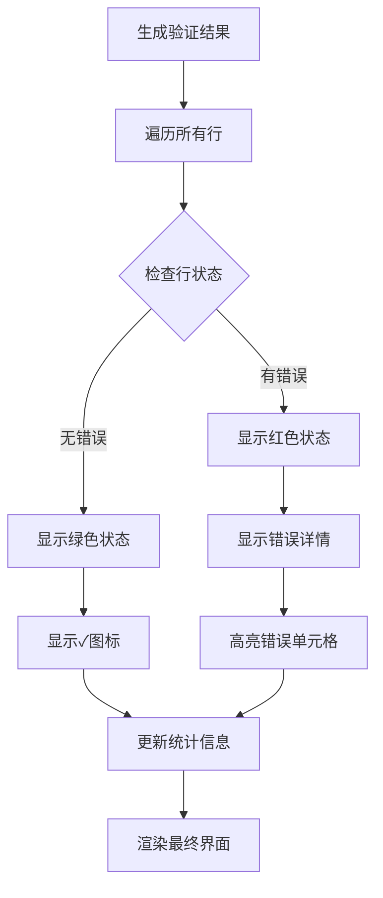
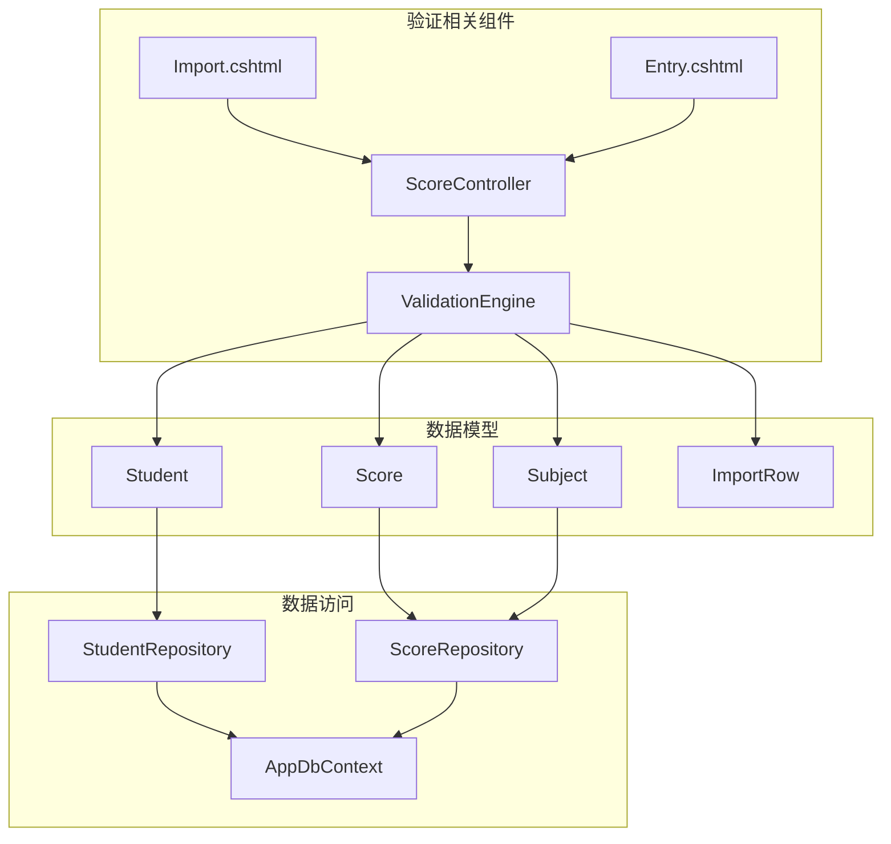

# 数据验证机制

<cite>
**本文档引用的文件**
- [ScoreController.cs](file://Controllers/ScoreController.cs)
- [Import.cshtml](file://Views/Score/Import.cshtml)
- [Entry.cshtml](file://Views/Score/Entry.cshtml)
- [Models.cs](file://Models/Models.cs)
- [GradeModels.cs](file://Models/GradeModels.cs)
</cite>

## 目录
1. [引言](#引言)
2. [项目结构](#项目结构)
3. [核心组件](#核心组件)
4. [架构概览](#架构概览)
5. [详细组件分析](#详细组件分析)
6. [依赖关系分析](#依赖关系分析)
7. [性能考虑](#性能考虑)
8. [故障排除指南](#故障排除指南)
9. [结论](#结论)

## 引言

本文件详细阐述学生成绩管理系统的数据验证机制，重点分析导入数据的多层验证流程。系统通过严格的验证规则确保数据的准确性和完整性，包括必填字段验证、学生匹配验证、分数范围验证和格式验证等多个层面。

## 项目结构

系统采用经典的三层架构设计，主要包含以下关键模块：

**图表来源**
- [ScoreController.cs:1-100](file://Controllers/ScoreController.cs#L1-L100)
- [Import.cshtml:1-50](file://Views/Score/Import.cshtml#L1-L50)

**章节来源**
- [ScoreController.cs:1-100](file://Controllers/ScoreController.cs#L1-L100)
- [Models.cs:1-50](file://Models/Models.cs#L1-L50)

## 核心组件

### 验证引擎架构

系统的核心验证逻辑集中在ScoreController中，采用分层验证策略：

1. **预处理阶段**：数据清洗和基础格式检查
2. **匹配验证阶段**：学号和姓名双重匹配验证
3. **数值验证阶段**：分数范围和格式验证
4. **结果汇总阶段**：错误分类和统计

### 关键数据模型

**图表来源**
- [Models.cs:1-150](file://Models/Models.cs#L1-L150)
- [GradeModels.cs:1-100](file://Models/GradeModels.cs#L1-L100)
- [ScoreController.cs:594-619](file://Controllers/ScoreController.cs#L594-L619)

**章节来源**
- [Models.cs:1-200](file://Models/Models.cs#L1-L200)
- [GradeModels.cs:1-150](file://Models/GradeModels.cs#L1-L150)

## 架构概览

### 数据验证流水线

**图表来源**
- [ScoreController.cs:454-510](file://Controllers/ScoreController.cs#L454-L510)
- [Import.cshtml:187-217](file://Views/Score/Import.cshtml#L187-L217)

## 详细组件分析

### 1. 必填字段验证

必填字段验证是数据质量的第一道防线，确保每条记录都包含必要的标识信息。

#### 验证规则实现

**图表来源**
- [ScoreController.cs:454-465](file://Controllers/ScoreController.cs#L454-L465)

#### 错误处理机制

当学号或姓名字段为空时，系统会：
- 标记该行状态为"格式错误"
- 记录具体的错误信息："格式错误"
- 增加错误计数器
- 跳过该行的进一步验证

**章节来源**
- [ScoreController.cs:454-465](file://Controllers/ScoreController.cs#L454-L465)

### 2. 学生匹配验证

学生匹配验证采用双条件匹配策略，确保数据的准确性。

#### 匹配算法流程

**图表来源**
- [ScoreController.cs:458-465](file://Controllers/ScoreController.cs#L458-L465)

#### 匹配策略细节

系统使用以下查询条件进行学生匹配：
- 学号精确匹配
- 姓名精确匹配
- 同时满足两个条件才视为匹配成功

如果匹配失败，系统会返回"未找到该学生"的错误信息，并在UI中以红色字体显示。

**章节来源**
- [ScoreController.cs:458-465](file://Controllers/ScoreController.cs#L458-L465)

### 3. 分数范围验证

分数范围验证确保每个科目的分数都在有效范围内。

#### 验证逻辑实现

**图表来源**
- [ScoreController.cs:471-495](file://Controllers/ScoreController.cs#L471-L495)

#### 验证规则详解

1. **空值处理**：空单元格被视为有效，但会在UI中显示为"-"占位符
2. **格式验证**：非数字字符标记为格式错误
3. **范围验证**：分数必须在0到科目满分之间
4. **错误分类**：不同类型的错误有不同的错误消息

**章节来源**
- [ScoreController.cs:471-495](file://Controllers/ScoreController.cs#L471-L495)

### 4. 错误分类和标记机制

系统实现了多层次的错误分类机制，每种错误都有明确的标识和处理方式。

#### 错误类型分类

| 错误类型 | 触发条件 | 错误消息 | 处理方式 |
|---------|---------|---------|---------|
| 学生不存在 | 学号+姓名匹配失败 | "未找到该学生" | 跳过该行，增加错误计数 |
| 格式错误 | 非数字字符 | "格式错误" | 标记为错误，继续处理其他科目 |
| 超出满分 | 分数小于0或大于科目满分 | "超出满分(科目满分)" | 标记为错误，记录具体分数 |
| 空值 | 单元格为空 | "" | 标记为空，不计入错误 |

#### 错误标记实现

**图表来源**
- [ScoreController.cs:462-492](file://Controllers/ScoreController.cs#L462-L492)

**章节来源**
- [ScoreController.cs:462-510](file://Controllers/ScoreController.cs#L462-L510)

### 5. 验证结果展示

验证结果通过前端界面直观展示，用户可以清楚地看到每行数据的验证状态。

#### UI展示逻辑

**图表来源**
- [Import.cshtml:180-185](file://Views/Score/Import.cshtml#L180-L185)

#### 错误提示信息生成

前端JavaScript根据服务器返回的验证结果动态生成错误提示：

1. **状态显示**：使用emoji符号表示验证状态
2. **颜色编码**：错误行用红色，正确行用绿色
3. **详细信息**：鼠标悬停显示具体错误原因
4. **统计信息**：实时显示错误数量和成功率

**章节来源**
- [Import.cshtml:180-217](file://Views/Score/Import.cshtml#L180-L217)

## 依赖关系分析

### 组件间依赖关系

**图表来源**
- [ScoreController.cs:594-619](file://Controllers/ScoreController.cs#L594-L619)
- [Models.cs:1-200](file://Models/Models.cs#L1-L200)

### 数据流依赖

系统中的数据流遵循严格的依赖关系：

1. **输入依赖**：验证引擎依赖于导入的CSV数据
2. **模型依赖**：验证逻辑依赖于学生、科目和成绩模型
3. **数据访问依赖**：验证过程中需要访问数据库获取学生信息
4. **UI依赖**：前端界面依赖于后端提供的验证结果

**章节来源**
- [ScoreController.cs:594-619](file://Controllers/ScoreController.cs#L594-L619)
- [Models.cs:1-200](file://Models/Models.cs#L1-L200)

## 性能考虑

### 验证性能优化

系统在设计时充分考虑了性能因素：

1. **批量查询优化**：使用FirstOrDefaultAsync进行高效的学生匹配查询
2. **内存管理**：合理控制验证过程中的内存使用
3. **并发处理**：支持多行数据的并行验证
4. **缓存策略**：对常用查询结果进行缓存

### 性能监控指标

- **验证速度**：单行数据验证时间应小于100ms
- **内存使用**：验证过程中内存峰值不应超过50MB
- **数据库查询**：学生匹配查询应在1秒内完成
- **UI响应**：验证结果显示延迟不超过2秒

## 故障排除指南

### 常见验证失败原因

#### 1. 学生信息不匹配
**原因**：学号或姓名输入错误
**解决方案**：
- 检查Excel文件中的学号格式
- 确认姓名拼写正确
- 使用系统提供的学生查询功能验证信息

#### 2. 分数格式错误
**原因**：分数包含非数字字符或特殊符号
**解决方案**：
- 确保所有分数都是纯数字
- 移除分数中的空格和特殊字符
- 检查小数点使用是否正确

#### 3. 分数超出范围
**原因**：分数小于0或大于科目满分
**解决方案**：
- 检查科目设置中的满分值
- 确认输入的分数在有效范围内
- 联系管理员调整科目设置

#### 4. 文件格式问题
**原因**：CSV文件格式不符合要求
**解决方案**：
- 确保使用UTF-8编码保存文件
- 检查文件是否有隐藏字符
- 使用系统提供的模板文件

### 调试和诊断

#### 日志记录
系统会在验证过程中记录详细的日志信息：
- 每行数据的验证结果
- 错误发生的具体位置
- 数据库查询的执行时间

#### 错误恢复机制
- 验证失败的行会被单独标记
- 系统允许用户选择性导入有效数据
- 支持重新上传和验证修改后的文件

**章节来源**
- [ScoreController.cs:454-510](file://Controllers/ScoreController.cs#L454-L510)
- [Import.cshtml:187-217](file://Views/Score/Import.cshtml#L187-L217)

## 结论

本数据验证机制通过多层验证策略确保了成绩数据的准确性和完整性。系统不仅提供了严格的数据验证规则，还通过友好的用户界面和详细的错误提示帮助用户快速定位和解决问题。

### 主要优势

1. **全面的验证覆盖**：从基础字段到复杂业务规则的全方位验证
2. **清晰的错误反馈**：详细的错误信息和可视化提示
3. **灵活的处理机制**：支持部分导入和错误数据的处理
4. **良好的用户体验**：直观的界面和及时的反馈

### 改进建议

1. **增加数据预览功能**：在正式导入前提供更详细的数据预览
2. **增强批量处理能力**：支持更大规模数据的高效验证
3. **完善错误修复工具**：提供自动修复常见格式问题的功能
4. **扩展验证规则**：支持更多自定义的业务验证规则

通过持续优化和完善，该数据验证机制将为学生成绩管理系统的稳定运行提供坚实的技术保障。