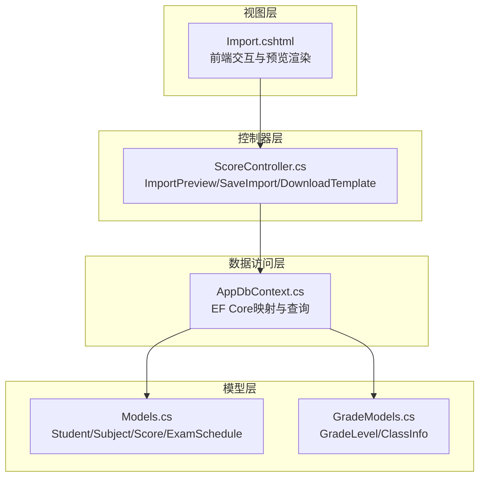
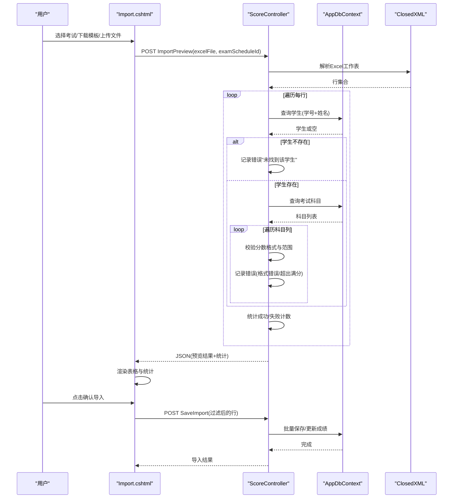
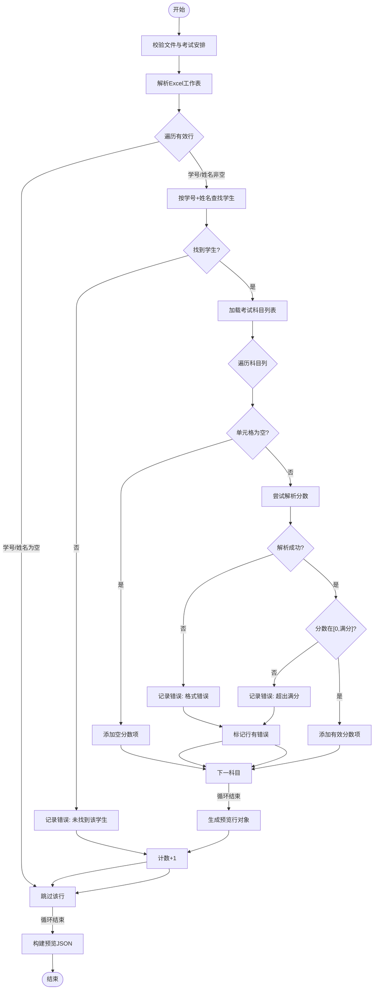
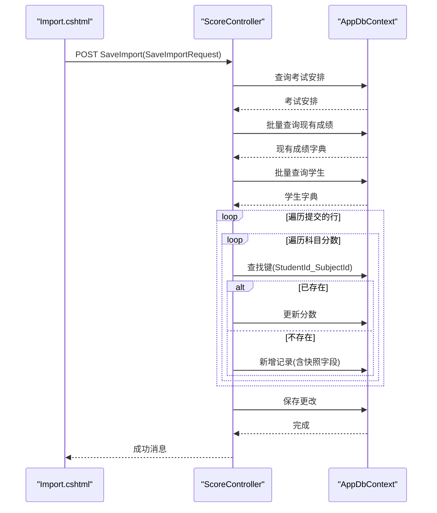
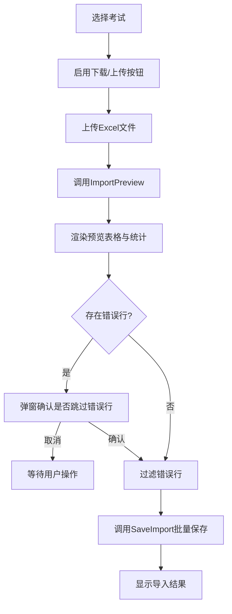
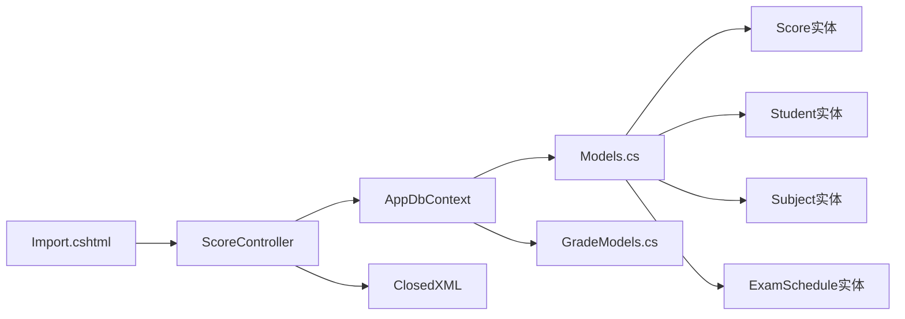

# 预览机制设计

<cite>
**本文引用的文件**
- [ScoreController.cs](file://Controllers/ScoreController.cs)
- [Import.cshtml](file://Views/Score/Import.cshtml)
- [Models.cs](file://Models/Models.cs)
- [GradeModels.cs](file://Models/GradeModels.cs)
- [AppDbContext.cs](file://Data/AppDbContext.cs)
</cite>

## 目录
1. [简介](#简介)
2. [项目结构](#项目结构)
3. [核心组件](#核心组件)
4. [架构概览](#架构概览)
5. [详细组件分析](#详细组件分析)
6. [依赖关系分析](#依赖关系分析)
7. [性能考量](#性能考量)
8. [故障排除指南](#故障排除指南)
9. [结论](#结论)

## 简介
本文件系统性阐述学生成绩管理系统的“导入预览”机制设计与实现。该机制涵盖文件上传处理、Excel数据读取、实时验证与预览结果展示，以及从Excel解析到预览对象的转换流程。文档详细说明预览数据的组织结构（学生基本信息、科目分数列表、错误标记与统计信息）、数据流转过程（从Excel解析到预览对象的转换、错误收集与汇总统计）、用户界面展示（成功行与错误行的区分显示、错误信息的可视化标记、批量操作的可行性判断），并提供用户体验优化与交互设计建议。

## 项目结构
导入预览功能主要由以下层次构成：
- 控制器层：负责接收上传文件、解析Excel、执行业务规则校验、生成预览结果与保存导入。
- 视图层：提供前端交互界面，包含模板下载、文件上传、预览渲染与确认导入。
- 模型层：定义实体与DTO，支撑数据结构与业务逻辑。
- 数据访问层：通过EF Core映射数据库表，提供查询与持久化能力。



图表来源
- [ScoreController.cs:1-620](file://Controllers/ScoreController.cs#L1-L620)
- [Import.cshtml:1-253](file://Views/Score/Import.cshtml#L1-L253)
- [Models.cs:295-358](file://Models/Models.cs#L295-L358)
- [GradeModels.cs:6-55](file://Models/GradeModels.cs#L6-L55)
- [AppDbContext.cs:174-225](file://Data/AppDbContext.cs#L174-L225)

章节来源
- [ScoreController.cs:1-620](file://Controllers/ScoreController.cs#L1-L620)
- [Import.cshtml:1-253](file://Views/Score/Import.cshtml#L1-L253)
- [Models.cs:295-358](file://Models/Models.cs#L295-L358)
- [GradeModels.cs:6-55](file://Models/GradeModels.cs#L6-L55)
- [AppDbContext.cs:174-225](file://Data/AppDbContext.cs#L174-L225)

## 核心组件
- Excel解析与预览控制器方法：ImportPreview
- 模板下载控制器方法：DownloadTemplate
- 导入保存控制器方法：SaveImport
- 前端预览渲染与交互脚本：Import.cshtml
- 数据模型与DTO：Student、Subject、Score、ExamSchedule、ImportRow、ImportScoreItem等
- EF Core上下文映射：AppDbContext

章节来源
- [ScoreController.cs:362-590](file://Controllers/ScoreController.cs#L362-L590)
- [Import.cshtml:86-252](file://Views/Score/Import.cshtml#L86-L252)
- [Models.cs:295-358](file://Models/Models.cs#L295-L358)
- [AppDbContext.cs:174-225](file://Data/AppDbContext.cs#L174-L225)

## 架构概览
导入预览的整体流程如下：
- 用户选择考试并下载模板；
- 用户在模板中填写分数并上传；
- 后端解析Excel，按行读取并进行实时验证；
- 返回预览JSON，前端渲染表格与统计信息；
- 用户确认后，过滤掉错误行并批量保存。



图表来源
- [ScoreController.cs:421-521](file://Controllers/ScoreController.cs#L421-L521)
- [ScoreController.cs:525-590](file://Controllers/ScoreController.cs#L525-L590)
- [Import.cshtml:104-139](file://Views/Score/Import.cshtml#L104-L139)
- [Import.cshtml:187-246](file://Views/Score/Import.cshtml#L187-L246)

## 详细组件分析

### Excel解析与预览（ImportPreview）
- 输入参数：IFormFile excelFile、int examScheduleId
- 处理步骤：
  - 校验文件与考试安排是否存在；
  - 读取Excel工作表首张表，跳过表头行；
  - 遍历有效行，提取学号与姓名；
  - 根据学号与姓名查找学生，若不存在则记录错误；
  - 查询该考试安排下的科目列表，并逐列读取分数；
  - 对分数进行格式与范围校验（非数字、负数、超过科目满分）；
  - 收集每行的科目分数列表与整体错误标记；
  - 统计成功/失败数量，返回JSON结果。



图表来源
- [ScoreController.cs:421-521](file://Controllers/ScoreController.cs#L421-L521)

章节来源
- [ScoreController.cs:421-521](file://Controllers/ScoreController.cs#L421-L521)

### 模板下载（DownloadTemplate）
- 功能：根据考试安排生成导入模板，包含序号、学号、姓名、年级、班级及各科目列，并为科目列添加“满分”注释。
- 流程：查询考试科目、查询覆盖年级的学生、写入表头与数据、调整列宽、输出Excel文件流。

章节来源
- [ScoreController.cs:362-419](file://Controllers/ScoreController.cs#L362-L419)

### 导入保存（SaveImport）
- 输入参数：SaveImportRequest（包含ExamScheduleId与Rows）
- 处理步骤：
  - 校验请求与考试安排；
  - 批量加载现有成绩，建立字典以避免重复插入；
  - 批量加载学生信息，用于填充班级与年级快照；
  - 遍历提交的行，对每条记录的每个科目分数：
    - 若已存在则更新；
    - 否则新增记录，并填充快照字段；
  - 提交事务并返回成功消息。



图表来源
- [ScoreController.cs:525-590](file://Controllers/ScoreController.cs#L525-L590)

章节来源
- [ScoreController.cs:525-590](file://Controllers/ScoreController.cs#L525-L590)

### 前端预览渲染与交互（Import.cshtml）
- 交互流程：
  - 选择考试后启用下载模板与上传按钮；
  - 上传文件后调用ImportPreview接口，显示“解析中”状态；
  - 成功后渲染预览表格，包含序号、学号、姓名、年级、班级、各科目分数与状态列；
  - 错误行高亮显示，科目分数旁显示错误提示；
  - 统计信息显示总数、成功数与失败数；
  - 确认导入时，若存在错误行弹窗确认是否跳过错误行继续；
  - 过滤错误行后调用SaveImport接口执行批量保存。



图表来源
- [Import.cshtml:86-252](file://Views/Score/Import.cshtml#L86-L252)

章节来源
- [Import.cshtml:86-252](file://Views/Score/Import.cshtml#L86-L252)

### 预览数据结构与组织
- 预览结果JSON包含：
  - success：布尔值，表示解析是否成功；
  - examScheduleId：考试安排ID；
  - rows：预览行数组；
  - successCount：成功行数；
  - errorCount：失败行数；
  - totalCount：总行数。
- 每行对象包含：
  - 学生基本信息：StudentNo、Name、StudentId、Grade、ClassName；
  - 错误标记：Error（若该行存在错误则标注）；
  - 科目分数列表：Scores，每项包含SubjectName、Score（可能为空）、Error（格式或范围错误）。
- 统计信息：
  - 总数、成功数、失败数，用于前端展示与交互判断。

章节来源
- [ScoreController.cs:512-521](file://Controllers/ScoreController.cs#L512-L521)
- [Import.cshtml:141-185](file://Views/Score/Import.cshtml#L141-L185)

### 数据模型与关系
- 实体关系：
  - Student：学生基本信息（学号、姓名、年级、班级等）；
  - Subject：科目信息（名称、排序、满分等）；
  - ExamSchedule：考试安排（名称、类型、日期、状态等）；
  - Score：成绩记录（分数、考试类型、日期、外键关联）；
  - ExamSubject：考试安排-科目关联；
  - GradeLevel/ClassInfo：年级与班级快照。
- EF Core映射：
  - Score实体映射到数据库表，包含唯一索引(StudentId, SubjectId, ExamScheduleId)，确保同一考试安排下同一学生同一科目的唯一性；
  - 外键约束连接Student、Subject、ExamSchedule、GradeLevel、ClassInfo。

```mermaid
erDiagram
STUDENT {
int StudentID PK
string StudentNo
string Name
string Grade
string ClassName
}
SUBJECT {
int Id PK
string Name
int SortOrder
int FullScore
}
EXAM_SCHEDULE {
int Id PK
string Name
string ExamType
datetime ExamDate
datetime EndDate
string Status
}
SCORE {
int Id PK
int StudentId FK
int SubjectId FK
decimal ScoreValue
string ExamType
datetime ExamDate
int ExamScheduleId FK
int? GradeLevelId FK
int? ClassInfoId FK
}
EXAM_SUBJECT {
int Id PK
int ExamScheduleId FK
int SubjectId FK
}
GRADE_LEVEL {
int GradeLevelID PK
int EntryYear
string SchoolType
}
CLASS_INFO {
int ClassInfoID PK
int GradeLevelID FK
string ClassName
}
STUDENT ||--o{ SCORE : "拥有"
SUBJECT ||--o{ SCORE : "被评分"
EXAM_SCHEDULE ||--o{ SCORE : "包含"
EXAM_SCHEDULE ||--o{ EXAM_SUBJECT : "关联"
SUBJECT ||--o{ EXAM_SUBJECT : "被关联"
GRADE_LEVEL ||--o{ CLASS_INFO : "包含"
CLASS_INFO ||--o{ SCORE : "被关联"
```

图表来源
- [Models.cs:88-358](file://Models/Models.cs#L88-L358)
- [GradeModels.cs:6-55](file://Models/GradeModels.cs#L6-L55)
- [AppDbContext.cs:174-225](file://Data/AppDbContext.cs#L174-L225)

章节来源
- [Models.cs:88-358](file://Models/Models.cs#L88-L358)
- [GradeModels.cs:6-55](file://Models/GradeModels.cs#L6-L55)
- [AppDbContext.cs:174-225](file://Data/AppDbContext.cs#L174-L225)

## 依赖关系分析
- 控制器依赖：
  - ScoreController依赖AppDbContext进行数据库查询与保存；
  - 使用ClosedXML读取Excel；
  - 使用System.Security.Claims进行权限判断。
- 视图依赖：
  - Import.cshtml依赖jQuery进行AJAX调用与DOM操作；
  - 依赖Bootstrap样式与图标库。
- 模型依赖：
  - Score实体依赖Student、Subject、ExamSchedule、GradeLevel、ClassInfo；
  - DTO（SaveImportRequest、ImportRow、ImportScoreItem）用于前后端数据传输。



图表来源
- [ScoreController.cs:1-620](file://Controllers/ScoreController.cs#L1-L620)
- [Import.cshtml:1-253](file://Views/Score/Import.cshtml#L1-L253)
- [Models.cs:295-358](file://Models/Models.cs#L295-L358)
- [GradeModels.cs:6-55](file://Models/GradeModels.cs#L6-L55)
- [AppDbContext.cs:174-225](file://Data/AppDbContext.cs#L174-L225)

章节来源
- [ScoreController.cs:1-620](file://Controllers/ScoreController.cs#L1-L620)
- [Import.cshtml:1-253](file://Views/Score/Import.cshtml#L1-L253)
- [Models.cs:295-358](file://Models/Models.cs#L295-L358)
- [GradeModels.cs:6-55](file://Models/GradeModels.cs#L6-L55)
- [AppDbContext.cs:174-225](file://Data/AppDbContext.cs#L174-L225)

## 性能考量
- Excel解析：
  - 使用ClosedXML一次性读取工作表，避免多次IO；
  - 跳过表头后按行遍历，复杂度O(R*C)，R为行数，C为科目数；
  - 建议限制单次导入最大行数，防止内存压力过大。
- 数据库查询：
  - 批量查询学生与科目，减少N+1查询；
  - 批量加载现有成绩并使用字典快速定位，提升更新效率；
  - 唯一索引保证同一考试安排下同一学生同一科目的唯一性，避免重复写入。
- 前端渲染：
  - 预览表格采用虚拟滚动或分页，避免超大表格导致页面卡顿；
  - 错误行高亮与错误提示采用轻量级DOM操作，避免频繁重排。

## 故障排除指南
- 常见问题与处理：
  - 未选择考试：前端禁用上传按钮，提示先选择考试；
  - 文件为空或格式不正确：ImportPreview返回错误消息，前端弹窗提示；
  - 学生不存在：预览行显示“未找到该学生”，错误计数+1；
  - 分数格式错误或超出满分：对应科目列显示错误提示，整行标记错误；
  - 确认导入前存在错误行：弹窗确认是否跳过错误行继续。
- 建议的日志与监控：
  - 记录每次导入的examScheduleId、文件大小、解析耗时、成功/失败计数；
  - 对异常（如Excel解析失败、数据库异常）进行捕获与上报。

章节来源
- [Import.cshtml:104-139](file://Views/Score/Import.cshtml#L104-L139)
- [Import.cshtml:187-246](file://Views/Score/Import.cshtml#L187-L246)
- [ScoreController.cs:421-521](file://Controllers/ScoreController.cs#L421-L521)

## 结论
导入预览机制通过“模板下载—文件上传—实时解析与验证—预览展示—批量保存”的闭环流程，实现了高效、可靠的批量成绩导入体验。其核心优势在于：
- 实时验证与错误可视化，帮助用户及时发现并修正问题；
- 成功/失败统计与交互确认，降低误操作风险；
- 前后端分离的DTO设计与批量数据库操作，兼顾易维护性与性能。

未来可进一步优化的方向包括：增加导入进度反馈、支持断点续传、扩展更多格式（CSV/TSV）、增强错误修复指引与模板自定义能力。