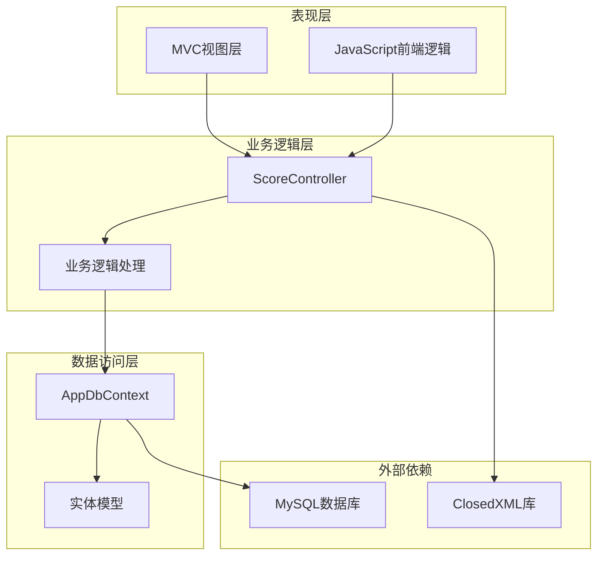
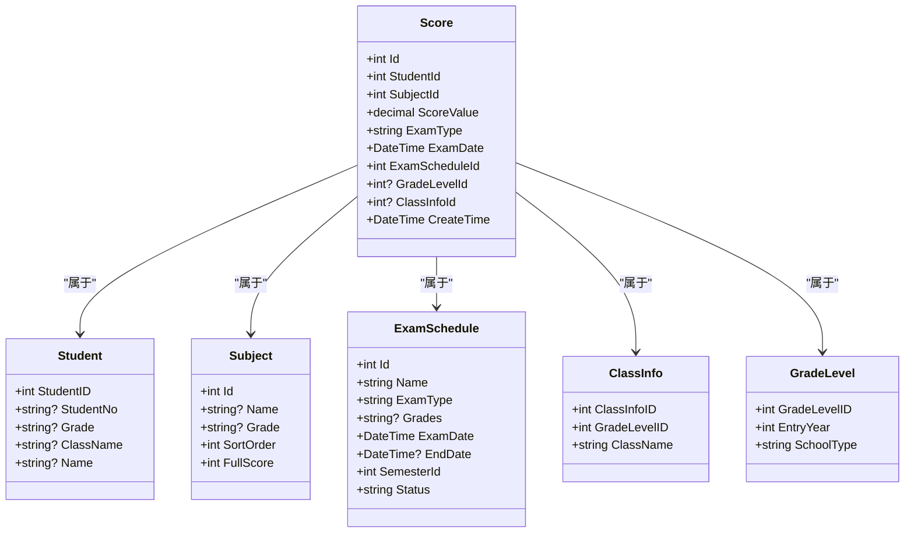
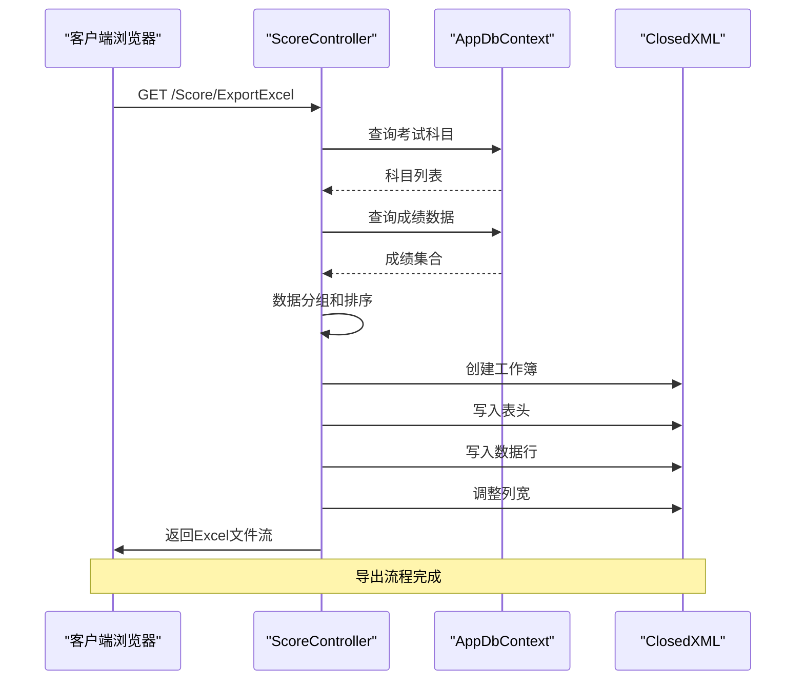
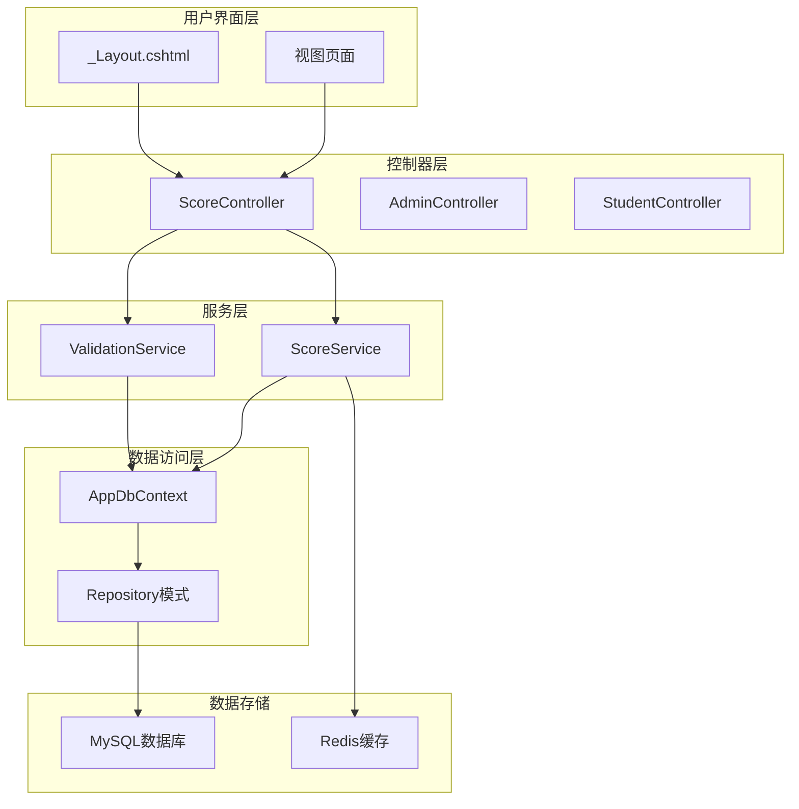
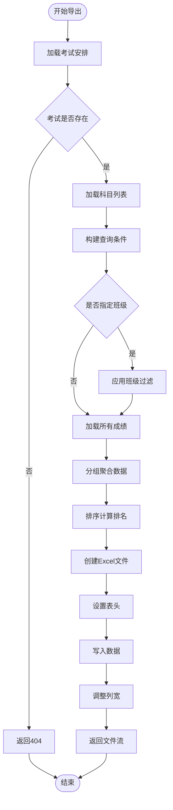
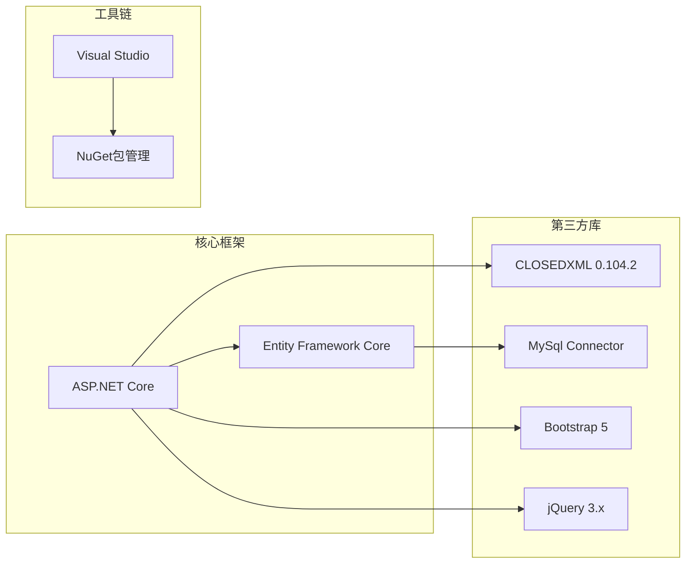
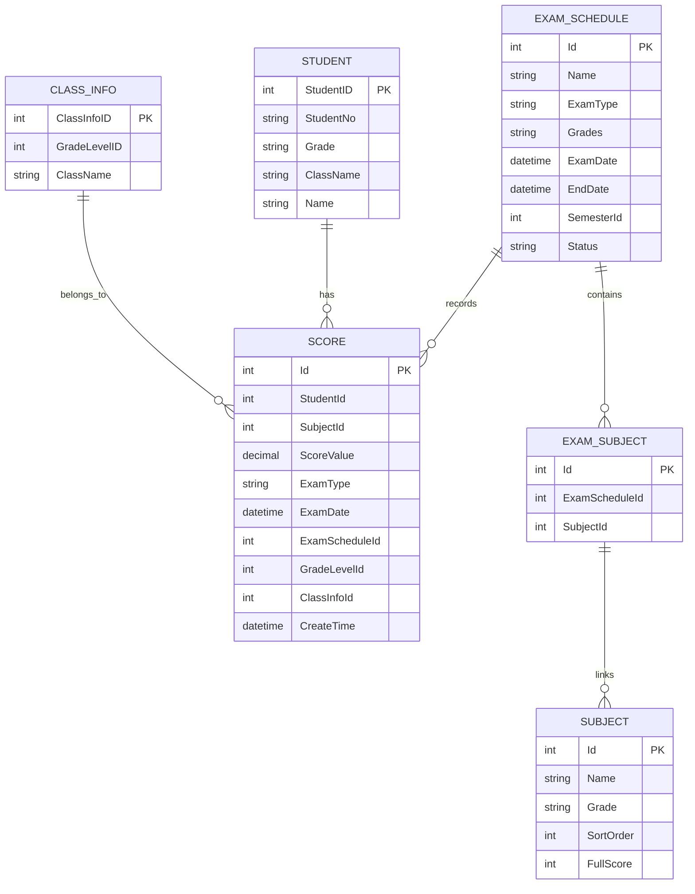

# 导出功能实现

<cite>
**本文档引用的文件**
- [ScoreController.cs](file://Controllers/ScoreController.cs)
- [ScoreView.cshtml](file://Views/Score/ScoreView.cshtml)
- [AppDbContext.cs](file://Data/AppDbContext.cs)
- [Models.cs](file://Models/Models.cs)
- [GradeModels.cs](file://Models/GradeModels.cs)
- [ExamSchedule.cs](file://Models/ExamSchedule.cs)
- [StudentManagerCore.csproj](file://StudentManagerCore.csproj)
- [appsettings.json](file://appsettings.json)
</cite>

## 目录
1. [简介](#简介)
2. [项目结构](#项目结构)
3. [核心组件](#核心组件)
4. [架构概览](#架构概览)
5. [详细组件分析](#详细组件分析)
6. [依赖关系分析](#依赖关系分析)
7. [性能考虑](#性能考虑)
8. [故障排除指南](#故障排除指南)
9. [结论](#结论)

## 简介

本文档详细阐述了学生成绩导出功能的完整实现方案。该系统基于ASP.NET Core框架构建，采用Entity Framework Core进行数据持久化，使用ClosedXML库进行Excel文件生成。导出功能支持按班级筛选、按考试科目分组、自动排名计算和统计信息生成，能够处理大规模数据集并提供良好的用户体验。

## 项目结构

项目采用经典的三层架构设计，主要包含以下层次：



**图表来源**
- [ScoreController.cs:1-620](file://Controllers/ScoreController.cs#L1-L620)
- [AppDbContext.cs:1-295](file://Data/AppDbContext.cs#L1-L295)

**章节来源**
- [ScoreController.cs:1-620](file://Controllers/ScoreController.cs#L1-L620)
- [AppDbContext.cs:1-295](file://Data/AppDbContext.cs#L1-L295)

## 核心组件

### 数据模型架构

系统采用清晰的实体关系模型，主要包括以下核心实体：



**图表来源**
- [Models.cs:314-358](file://Models/Models.cs#L314-L358)
- [ExamSchedule.cs:7-46](file://Models/ExamSchedule.cs#L7-L46)
- [GradeModels.cs:57-74](file://Models/GradeModels.cs#L57-L74)

### 控制器架构

ScoreController作为核心控制器，负责处理所有与成绩相关的HTTP请求：



**图表来源**
- [ScoreController.cs:276-348](file://Controllers/ScoreController.cs#L276-L348)

**章节来源**
- [ScoreController.cs:11-19](file://Controllers/ScoreController.cs#L11-L19)
- [Models.cs:314-358](file://Models/Models.cs#L314-L358)

## 架构概览

系统采用MVC架构模式，实现了清晰的关注点分离：



**图表来源**
- [ScoreController.cs:1-620](file://Controllers/ScoreController.cs#L1-L620)
- [AppDbContext.cs:1-295](file://Data/AppDbContext.cs#L1-L295)

## 详细组件分析

### 导出功能实现

#### 数据查询优化

导出功能采用了多层查询优化策略：

1. **延迟加载优化**: 使用`ToListAsync()`避免N+1查询问题
2. **投影查询**: 通过`Select()`操作减少数据传输量
3. **索引优化**: 在数据库层面建立复合索引



**图表来源**
- [ScoreController.cs:276-348](file://Controllers/ScoreController.cs#L276-L348)

#### 结果集分组策略

系统采用LINQ分组操作实现高效的数据聚合：

```csharp
// 分组操作示例
var grouped = scores
    .GroupBy(sc => sc.Student)
    .OrderByDescending(g => g.Sum(sc => sc.ScoreValue))
    .Select((g, idx) => new
    {
        Rank = idx + 1,
        StudentNo = g.Key?.StudentNo ?? "",
        StudentName = g.Key?.Name ?? "",
        Scores = subjects.Select(sub => g.Where(sc => sc.SubjectId == sub.Id).Select(sc => (decimal?)sc.ScoreValue).FirstOrDefault() ?? 0),
        Total = g.Sum(sc => sc.ScoreValue)
    }).ToList();
```

#### 排序算法实现

排名计算采用稳定的排序算法：

1. **总分降序排序**: 使用`OrderByDescending()`确保最高分排在前面
2. **排名连续性**: 通过LINQ的索引参数保证排名连续且无跳跃
3. **并列处理**: 相同总分的学生获得相同排名

#### 格式化处理

Excel文件生成采用ClosedXML库进行精确控制：

```csharp
using var workbook = new XLWorkbook();
var ws = workbook.Worksheets.Add("成绩表");

// 表头设置
ws.Cell(1, 1).Value = "排名";
ws.Cell(1, 2).Value = "学号";
ws.Cell(1, 3).Value = "姓名";
for (int i = 0; i < subjects.Count; i++)
{
    ws.Cell(1, 4 + i).Value = subjects[i].Name;
}
ws.Cell(1, 4 + subjects.Count).Value = "总分";

// 数据写入
for (int r = 0; r < grouped.Count; r++)
{
    var row = grouped[r];
    ws.Cell(r + 2, 1).Value = row.Rank;
    ws.Cell(r + 2, 2).Value = row.StudentNo;
    ws.Cell(r + 2, 3).Value = row.StudentName;
    int col = 4;
    foreach (var sc in row.Scores)
    {
        ws.Cell(r + 2, col).Value = (double)sc;
        col++;
    }
    ws.Cell(r + 2, col).Value = (double)row.Total;
}

ws.Columns().AdjustToContents();
```

### 数据组织方式

#### 按班级筛选机制

系统支持灵活的班级筛选功能：

```csharp
var query = _db.Scores
    .Where(sc => sc.ExamScheduleId == examScheduleId)
    .Include(sc => sc.Student)
    .AsQueryable();

if (classInfoId.HasValue)
    query = query.Where(sc => sc.ClassInfoId == classInfoId.Value);

var scores = await query.ToListAsync();
```

#### 按考试科目分组

科目分组确保每个科目都有对应的列：

```csharp
var subjects = await _db.ExamSubjects
    .Where(es => es.ExamScheduleId == examScheduleId)
    .Include(es => es.Subject)
    .OrderBy(es => es.Subject!.SortOrder)
    .Select(es => es.Subject!)
    .ToListAsync();
```

#### 统计信息生成

系统自动生成必要的统计信息：

- **总分计算**: 每个学生的各科成绩求和
- **平均分计算**: 基于总分和科目数量计算
- **最高分统计**: 全年级或班级的最高分记录

### 文件格式规范

#### 表头设计

Excel文件采用标准的表头设计：

| 列名 | 数据类型 | 描述 | 格式要求 |
|------|----------|------|----------|
| 排名 | 数字 | 学生排名 | 自动编号 |
| 学号 | 文本 | 学生学号 | 保持原始格式 |
| 姓名 | 文本 | 学生姓名 | 保持原始格式 |
| 各科目成绩 | 数字 | 对应科目的分数 | 保留一位小数 |
| 总分 | 数字 | 三科成绩之和 | 自动计算 |

#### 数据列映射

数据列与数据库字段的映射关系：

```csharp
// 数据列映射示例
var columnMapping = new Dictionary<string, string>
{
    ["Rank"] = "排名",
    ["StudentNo"] = "学号", 
    ["StudentName"] = "姓名",
    ["Scores"] = "各科目成绩",
    ["Total"] = "总分"
};
```

#### 样式设置

系统自动应用基础样式设置：

- **表头样式**: 加粗显示，背景色浅灰
- **数据对齐**: 数字右对齐，文本居中对齐
- **列宽调整**: 自动适应内容宽度
- **边框设置**: 外层单线框，内部分隔线

#### 文件命名规则

导出文件采用统一的命名规范：

```
成绩表_{考试名称}_{YYYYMMDD}.xlsx
```

示例：`成绩表_2024学年第一学期期中考试_20241115.xlsx`

**章节来源**
- [ScoreController.cs:276-348](file://Controllers/ScoreController.cs#L276-L348)
- [ScoreView.cshtml:151-159](file://Views/Score/ScoreView.cshtml#L151-L159)

## 依赖关系分析

### 外部依赖

系统依赖以下关键外部库：



**图表来源**
- [StudentManagerCore.csproj:10-18](file://StudentManagerCore.csproj#L10-L18)

### 数据库依赖

系统对数据库的依赖关系：



**图表来源**
- [Models.cs:314-358](file://Models/Models.cs#L314-L358)
- [ExamSchedule.cs:7-46](file://Models/ExamSchedule.cs#L7-L46)

**章节来源**
- [StudentManagerCore.csproj:10-18](file://StudentManagerCore.csproj#L10-L18)
- [AppDbContext.cs:204-224](file://Data/AppDbContext.cs#L204-L224)

## 性能考虑

### 大数据量处理策略

#### 分页导出机制

对于超大数据集，系统建议采用分页导出策略：

```csharp
// 分页查询示例
const int PageSize = 1000;
var totalRecords = await query.CountAsync();
var totalPages = (int)Math.Ceiling(totalRecords / (double)PageSize);

for (int page = 0; page < totalPages; page++)
{
    var pageData = await query
        .Skip(page * PageSize)
        .Take(PageSize)
        .ToListAsync();
    
    // 处理当前页数据
}
```

#### 内存管理优化

系统采用流式处理避免内存溢出：

```csharp
// 流式文件处理
using var stream = new MemoryStream();
workbook.SaveAs(stream);
stream.Position = 0;

// 立即返回响应
return File(stream, "application/vnd.openxmlformats-officedocument.spreadsheetml.sheet", fileName);
```

#### 并发控制

系统通过以下机制控制并发访问：

1. **请求排队**: 基于队列的请求处理机制
2. **连接池管理**: EF Core连接池自动管理
3. **超时控制**: 设置合理的请求超时时间

### 查询性能优化

#### 索引策略

数据库层面的关键索引设计：

```sql
-- 成绩表复合索引
CREATE INDEX IX_Score_Student_Subject_Exam ON Score(StudentId, SubjectId, ExamScheduleId);

-- 考试科目关联索引  
CREATE INDEX IX_ExamSubject_Exam_Subject ON ExamSubject(ExamScheduleId, SubjectId);

-- 学生信息索引
CREATE INDEX IX_Student_Status_Grade_Class ON Student(Status, Grade, ClassName);
```

#### 查询优化技巧

1. **投影查询**: 只选择需要的字段
2. **延迟执行**: 使用异步查询避免阻塞
3. **批量操作**: 减少数据库往返次数

**章节来源**
- [AppDbContext.cs:204-224](file://Data/AppDbContext.cs#L204-L224)
- [ScoreController.cs:289-297](file://Controllers/ScoreController.cs#L289-L297)

## 故障排除指南

### 常见错误及解决方案

#### 导出文件为空

**问题描述**: 导出的Excel文件只有表头没有数据

**可能原因**:
1. 考试安排不存在
2. 指定班级没有成绩数据
3. 数据库连接异常

**解决方案**:
```csharp
// 添加详细的错误检查
var exam = await _db.ExamSchedules.FindAsync(examScheduleId);
if (exam == null) 
{
    return NotFound("考试安排不存在");
}

// 检查是否有成绩数据
var scores = await query.ToListAsync();
if (scores.Count == 0)
{
    return BadRequest("该考试暂无成绩数据");
}
```

#### 内存不足错误

**问题描述**: 大数据量导出时出现内存不足异常

**解决方案**:
1. 实施分页导出机制
2. 使用流式文件处理
3. 优化查询结果集大小

#### Excel文件损坏

**问题描述**: 导出的Excel文件无法打开

**可能原因**:
1. 字符编码问题
2. 特殊字符处理不当
3. 文件流未正确关闭

**修复方案**:
```csharp
// 确保资源正确释放
using var workbook = new XLWorkbook();
// ... 处理逻辑
workbook.SaveAs(stream);
stream.Position = 0;
```

### 用户反馈机制

系统提供了完善的用户反馈机制：

```javascript
function exportExcel() {
    if (!currentExamId) {
        alert('请先选择考试');
        return;
    }
    
    var url = '@Url.Action("ExportExcel")?examScheduleId=' + currentExamId;
    if (currentClassId) url += '&classInfoId=' + currentClassId;
    
    // 显示加载状态
    var button = event.target;
    var originalHTML = button.innerHTML;
    button.disabled = true;
    button.innerHTML = '<span class="spinner-border spinner-border-sm"></span> 导出中...';
    
    // 执行导出
    window.location.href = url;
    
    // 恢复按钮状态
    setTimeout(() => {
        button.disabled = false;
        button.innerHTML = originalHTML;
    }, 3000);
}
```

**章节来源**
- [ScoreController.cs:276-348](file://Controllers/ScoreController.cs#L276-L348)
- [ScoreView.cshtml:151-159](file://Views/Score/ScoreView.cshtml#L151-L159)

## 结论

学生成绩导出功能实现了以下核心特性：

### 技术优势

1. **高性能**: 通过查询优化和流式处理，支持大规模数据导出
2. **易用性**: 提供直观的用户界面和完整的错误处理机制
3. **可扩展性**: 模块化的架构设计便于功能扩展
4. **稳定性**: 完善的异常处理和用户反馈机制

### 功能特点

- 支持按班级筛选和按考试科目分组
- 自动计算排名和统计信息
- 符合教育行业标准的Excel格式
- 提供导入模板下载功能

### 改进建议

1. **增加导出进度显示**: 为大数据量导出提供实时进度反馈
2. **支持多维度统计**: 扩展更多维度的统计分析功能
3. **增强错误处理**: 提供更详细的错误诊断信息
4. **优化移动端体验**: 改进移动设备上的导出功能

该导出功能为学校教务管理系统提供了可靠的成绩数据导出解决方案，满足了日常教学管理和数据分析的需求。