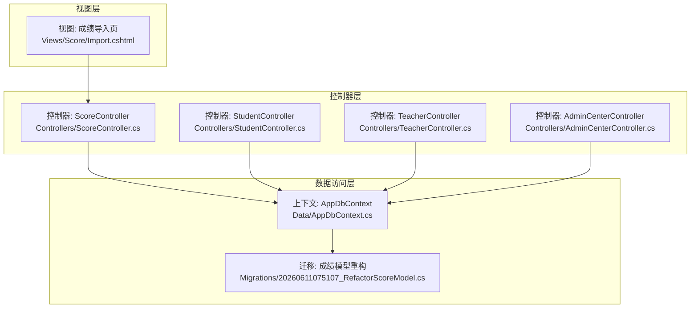
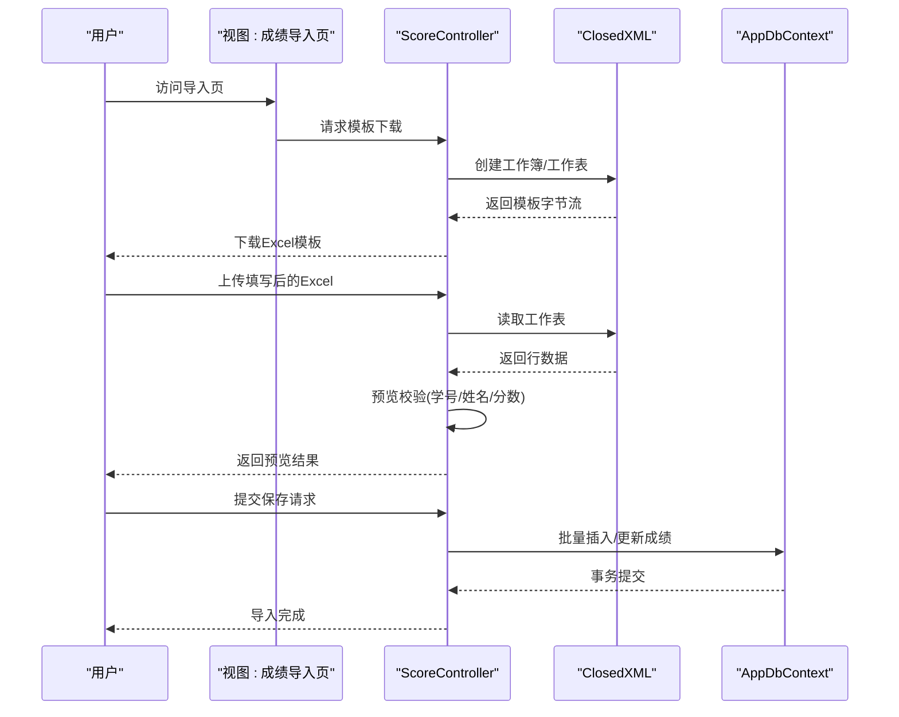
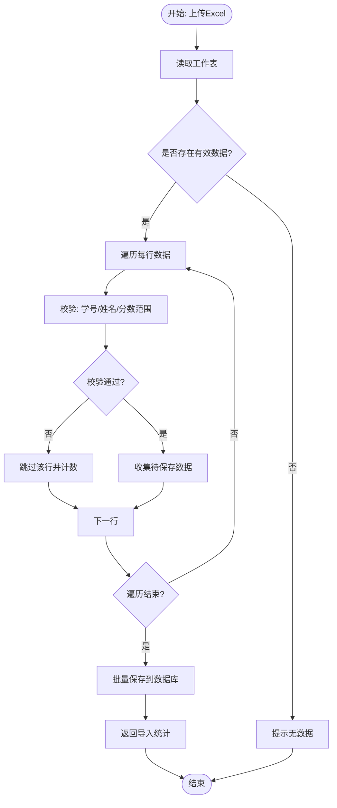
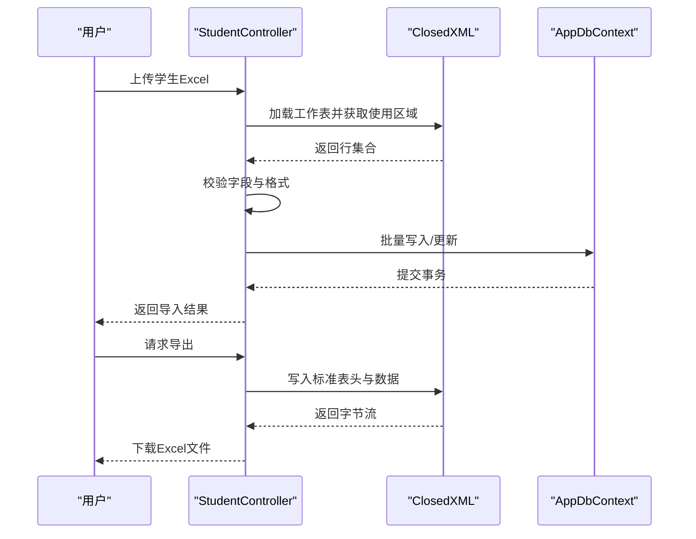
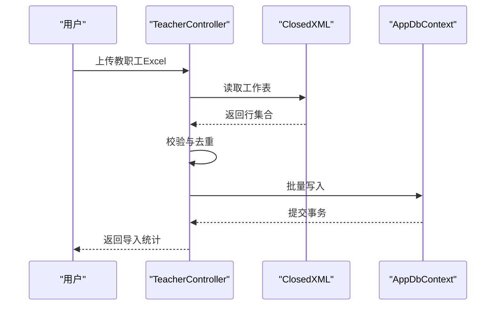
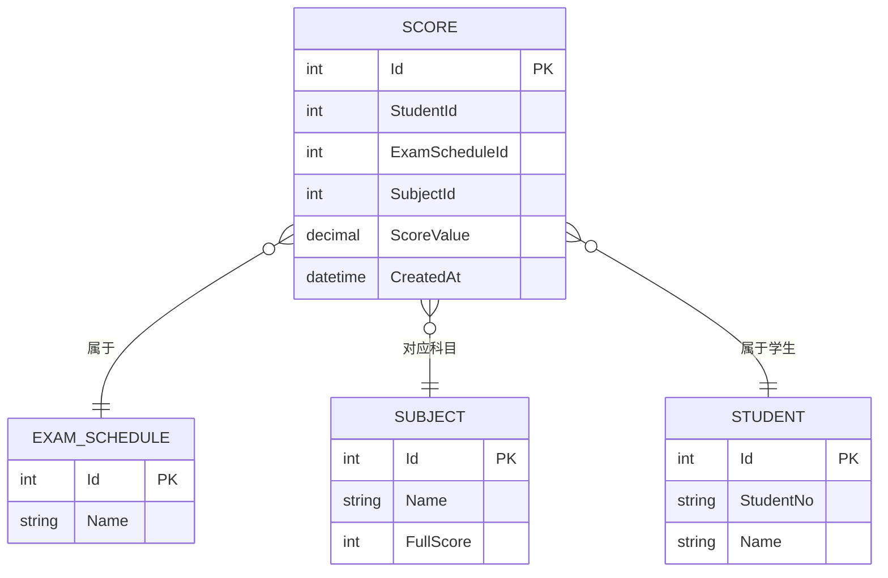
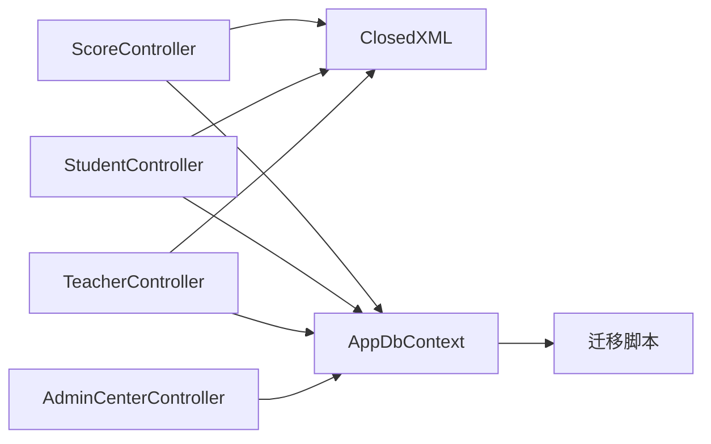

# 数据导入导出

<cite>
**本文引用的文件**
- [ScoreController.cs](file://Controllers/ScoreController.cs)
- [StudentController.cs](file://Controllers/StudentController.cs)
- [TeacherController.cs](file://Controllers/TeacherController.cs)
- [AppDbContext.cs](file://Data/AppDbContext.cs)
- [20260611075107_RefactorScoreModel.cs](file://Migrations/20260611075107_RefactorScoreModel.cs)
- [Import.cshtml](file://Views/Score/Import.cshtml)
- [AdminCenterController.cs](file://Controllers/AdminCenterController.cs)
</cite>

## 目录
1. [简介](#简介)
2. [项目结构](#项目结构)
3. [核心组件](#核心组件)
4. [架构总览](#架构总览)
5. [详细组件分析](#详细组件分析)
6. [依赖关系分析](#依赖关系分析)
7. [性能考虑](#性能考虑)
8. [故障排除指南](#故障排除指南)
9. [结论](#结论)
10. [附录](#附录)

## 简介
本文件围绕学生管理系统的“数据导入导出”能力进行系统化梳理，重点覆盖以下方面：
- Excel 文件处理机制与 ClosedXML 库的集成方式
- Excel 模板设计规范与字段映射
- 成绩导入流程：模板格式、数据验证、批量处理策略
- 数据导出实现：CSV 与 Excel 下载、格式转换
- 数据校验与清洗工具脚本：完整性检查、重复处理、异常修正
- 批量操作：异步处理、进度跟踪、错误恢复
- 数据迁移最佳实践：模型重构与迁移脚本
- 常见问题与性能优化建议

## 项目结构
系统采用经典的分层架构，数据导入导出功能主要集中在控制器层，通过 ClosedXML 实现 Excel 的读写，配合 Entity Framework 进行持久化。

图表来源
- [ScoreController.cs:1-620](file://Controllers/ScoreController.cs#L1-L620)
- [StudentController.cs:1-884](file://Controllers/StudentController.cs#L1-L884)
- [TeacherController.cs:1-500](file://Controllers/TeacherController.cs#L1-L500)
- [AdminCenterController.cs:1-400](file://Controllers/AdminCenterController.cs#L1-L400)
- [AppDbContext.cs:1-200](file://Data/AppDbContext.cs#L1-L200)
- [20260611075107_RefactorScoreModel.cs:1-227](file://Migrations/20260611075107_RefactorScoreModel.cs#L1-L227)

章节来源
- [ScoreController.cs:1-620](file://Controllers/ScoreController.cs#L1-L620)
- [StudentController.cs:1-884](file://Controllers/StudentController.cs#L1-L884)
- [TeacherController.cs:1-500](file://Controllers/TeacherController.cs#L1-L500)
- [AdminCenterController.cs:1-400](file://Controllers/AdminCenterController.cs#L1-L400)
- [AppDbContext.cs:1-200](file://Data/AppDbContext.cs#L1-L200)
- [20260611075107_RefactorScoreModel.cs:1-227](file://Migrations/20260611075107_RefactorScoreModel.cs#L1-L227)

## 核心组件
- 成绩导入导出控制器：负责模板生成、预览、保存、导出等全流程
- 学生导入导出控制器：支持学生数据的导入与导出
- 教职工导入控制器：支持教职工数据的导入
- 日志导出控制器：支持操作日志的导出
- 数据上下文与迁移：EF 上下文及成绩模型重构迁移

章节来源
- [ScoreController.cs:1-620](file://Controllers/ScoreController.cs#L1-L620)
- [StudentController.cs:1-884](file://Controllers/StudentController.cs#L1-L884)
- [TeacherController.cs:1-500](file://Controllers/TeacherController.cs#L1-L500)
- [AdminCenterController.cs:1-400](file://Controllers/AdminCenterController.cs#L1-L400)
- [AppDbContext.cs:1-200](file://Data/AppDbContext.cs#L1-L200)
- [20260611075107_RefactorScoreModel.cs:1-227](file://Migrations/20260611075107_RefactorScoreModel.cs#L1-L227)

## 架构总览
导入导出整体流程遵循“模板生成 → 用户填写 → 预览校验 → 保存入库”的闭环；导出则分为“模板导出”和“结果导出”。

图表来源
- [ScoreController.cs:276-455](file://Controllers/ScoreController.cs#L276-L455)
- [ScoreController.cs:524-620](file://Controllers/ScoreController.cs#L524-L620)

## 详细组件分析

### 成绩导入组件
- 模板生成：根据考试科目动态生成表头，包含各科目的“满分”备注，便于用户填写
- 预览校验：逐行读取并校验关键字段（如学号、姓名），过滤空行或缺失项
- 保存入库：接收前端提交的预览结果，执行批量写入，返回统计结果

图表来源
- [ScoreController.cs:421-455](file://Controllers/ScoreController.cs#L421-L455)
- [ScoreController.cs:524-620](file://Controllers/ScoreController.cs#L524-L620)

章节来源
- [ScoreController.cs:276-455](file://Controllers/ScoreController.cs#L276-L455)
- [ScoreController.cs:524-620](file://Controllers/ScoreController.cs#L524-L620)
- [Import.cshtml:1-200](file://Views/Score/Import.cshtml#L1-L200)

### 学生数据导入导出组件
- 导入：读取 Excel 的使用范围，跳过标题行，逐行解析字段，校验空值与格式
- 导出：生成标准化表头，设置列宽，输出 Excel 文件供下载

图表来源
- [StudentController.cs:574-620](file://Controllers/StudentController.cs#L574-L620)
- [StudentController.cs:729-884](file://Controllers/StudentController.cs#L729-L884)

章节来源
- [StudentController.cs:574-620](file://Controllers/StudentController.cs#L574-L620)
- [StudentController.cs:729-884](file://Controllers/StudentController.cs#L729-L884)

### 教职工导入组件
- 支持模板下载与 Excel 导入，提供导入统计（新增/跳过）
- 使用 ClosedXML 读取单元格，对空值进行安全处理

图表来源
- [TeacherController.cs:288-500](file://Controllers/TeacherController.cs#L288-L500)

章节来源
- [TeacherController.cs:288-500](file://Controllers/TeacherController.cs#L288-L500)

### 日志导出组件
- 支持按条件导出操作日志，便于审计与复盘

章节来源
- [AdminCenterController.cs:378-400](file://Controllers/AdminCenterController.cs#L378-L400)

### 数据模型与迁移
- 成绩模型重构迁移：清理无效数据、调整外键与约束、建立新的关联关系，确保数据一致性

图表来源
- [20260611075107_RefactorScoreModel.cs:1-227](file://Migrations/20260611075107_RefactorScoreModel.cs#L1-L227)
- [AppDbContext.cs:1-200](file://Data/AppDbContext.cs#L1-L200)

章节来源
- [20260611075107_RefactorScoreModel.cs:1-227](file://Migrations/20260611075107_RefactorScoreModel.cs#L1-L227)
- [AppDbContext.cs:1-200](file://Data/AppDbContext.cs#L1-L200)

## 依赖关系分析
- 控制器依赖 ClosedXML 进行 Excel 读写
- 控制器依赖 AppDbContext 进行数据持久化
- 成绩导入依赖考试安排与科目配置，确保模板与数据一致
- 迁移脚本保证历史数据清理与新约束生效

图表来源
- [ScoreController.cs:1-620](file://Controllers/ScoreController.cs#L1-L620)
- [StudentController.cs:1-884](file://Controllers/StudentController.cs#L1-L884)
- [TeacherController.cs:1-500](file://Controllers/TeacherController.cs#L1-L500)
- [AdminCenterController.cs:1-400](file://Controllers/AdminCenterController.cs#L1-L400)
- [AppDbContext.cs:1-200](file://Data/AppDbContext.cs#L1-L200)
- [20260611075107_RefactorScoreModel.cs:1-227](file://Migrations/20260611075107_RefactorScoreModel.cs#L1-L227)

章节来源
- [ScoreController.cs:1-620](file://Controllers/ScoreController.cs#L1-L620)
- [StudentController.cs:1-884](file://Controllers/StudentController.cs#L1-L884)
- [TeacherController.cs:1-500](file://Controllers/TeacherController.cs#L1-L500)
- [AdminCenterController.cs:1-400](file://Controllers/AdminCenterController.cs#L1-L400)
- [AppDbContext.cs:1-200](file://Data/AppDbContext.cs#L1-L200)
- [20260611075107_RefactorScoreModel.cs:1-227](file://Migrations/20260611075107_RefactorScoreModel.cs#L1-L227)

## 性能考虑
- 流式处理：使用内存流避免磁盘 IO，减少中间文件占用
- 批量写入：统一在事务内批量提交，降低往返次数
- 列宽与样式：仅设置必要样式，避免过度渲染影响性能
- 字段校验前置：在导入前进行严格校验，减少无效写入
- 异步与并发：导入接口应支持异步处理，结合进度反馈与错误恢复

## 故障排除指南
- 上传文件为空或无数据：检查 Excel 是否存在使用区域，确认标题行未被误删
- 模板字段不匹配：核对科目数量与顺序，确保与数据库配置一致
- 导入后无记录：检查迁移脚本是否执行，确认外键与约束已生效
- 导出乱码或格式异常：确认响应头与 MIME 类型正确，检查列宽与字体设置
- 错误恢复：捕获异常并回滚事务，向用户返回明确错误信息与修复建议

章节来源
- [ScoreController.cs:421-455](file://Controllers/ScoreController.cs#L421-L455)
- [StudentController.cs:603-620](file://Controllers/StudentController.cs#L603-L620)
- [TeacherController.cs:462-474](file://Controllers/TeacherController.cs#L462-L474)
- [20260611075107_RefactorScoreModel.cs:14-22](file://Migrations/20260611075107_RefactorScoreModel.cs#L14-L22)

## 结论
系统通过 ClosedXML 实现了高效的 Excel 读写，结合 EF 的批量持久化，构建了从模板生成、数据校验到批量导入导出的完整链路。迁移脚本保障了历史数据的清理与模型一致性。建议在生产环境中进一步完善异步处理、进度跟踪与错误恢复机制，以提升用户体验与系统稳定性。

## 附录

### Excel 模板设计规范
- 表头：包含序号、学号、姓名、年级、班级等基础字段，以及各科目列
- 秒数备注：为每个科目添加“满分”备注，指导用户填写
- 列宽：根据字段长度设置合理列宽，确保导出后清晰可读
- 样式：标题加粗、背景色区分，提升可读性

章节来源
- [ScoreController.cs:384-418](file://Controllers/ScoreController.cs#L384-L418)
- [StudentController.cs:803-874](file://Controllers/StudentController.cs#L803-L874)

### 数据验证与清洗要点
- 完整性检查：必填字段校验、空值处理、重复学号检测
- 重复数据处理：导入前去重，或在保存时合并更新
- 异常数据修正：分数范围校验、字符编码清理、日期格式统一

章节来源
- [ScoreController.cs:449-455](file://Controllers/ScoreController.cs#L449-L455)
- [StudentController.cs:607-620](file://Controllers/StudentController.cs#L607-L620)
- [TeacherController.cs:495-500](file://Controllers/TeacherController.cs#L495-L500)

### 批量操作实现原理
- 异步处理：导入接口支持异步执行，避免阻塞
- 进度跟踪：返回导入统计（新增/跳过/错误），前端轮询或一次性展示
- 错误恢复：事务回滚、错误日志记录、重试策略

章节来源
- [ScoreController.cs:462-474](file://Controllers/ScoreController.cs#L462-L474)
- [StudentController.cs:603-620](file://Controllers/StudentController.cs#L603-L620)
- [TeacherController.cs:462-474](file://Controllers/TeacherController.cs#L462-L474)

### 数据迁移最佳实践
- 先清理无效数据，再调整约束与外键
- 在迁移脚本中保留必要的数据清理 SQL
- 迁移前后进行数据一致性校验

章节来源
- [20260611075107_RefactorScoreModel.cs:14-32](file://Migrations/20260611075107_RefactorScoreModel.cs#L14-L32)