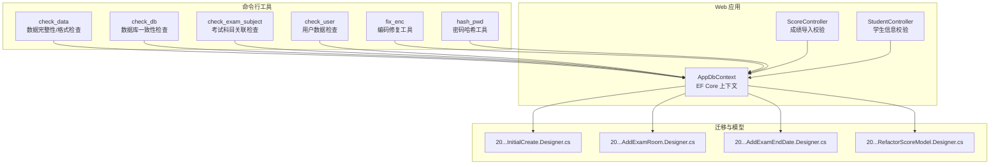
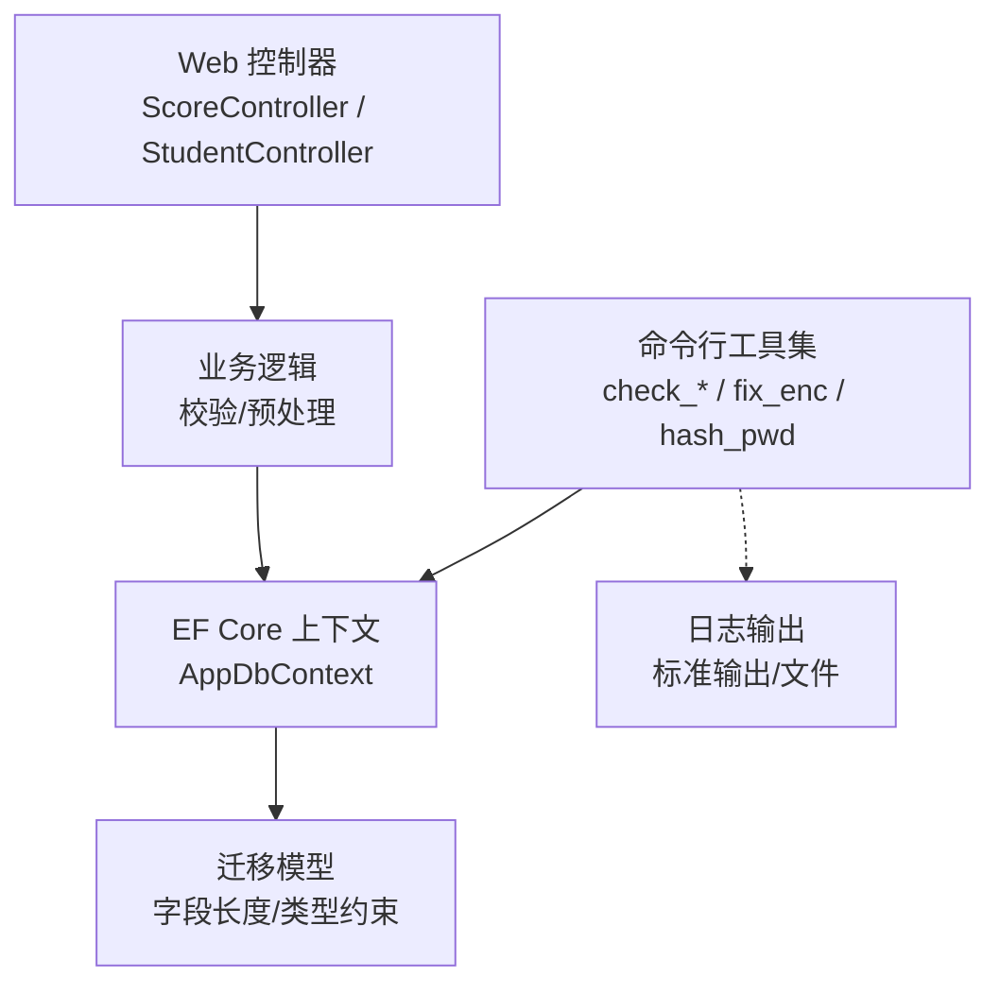
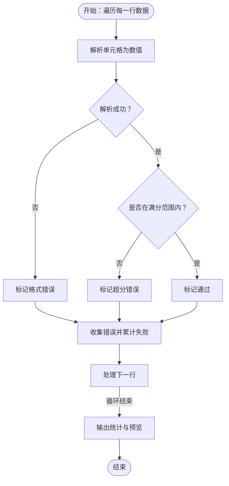
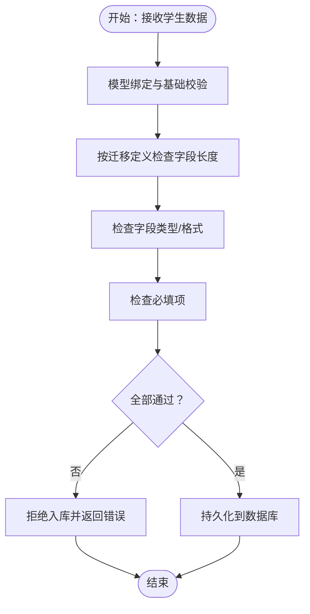
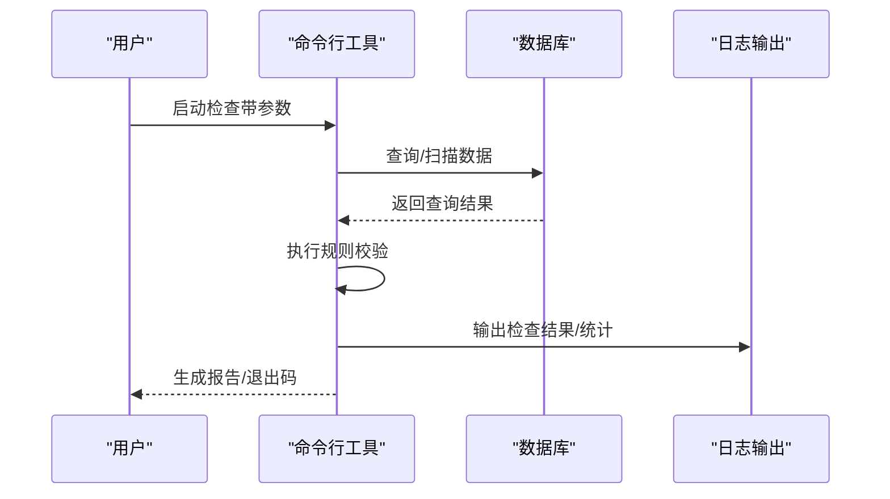
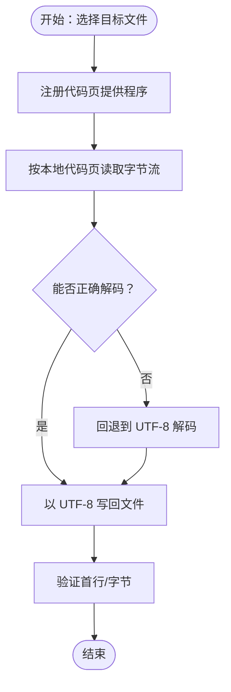
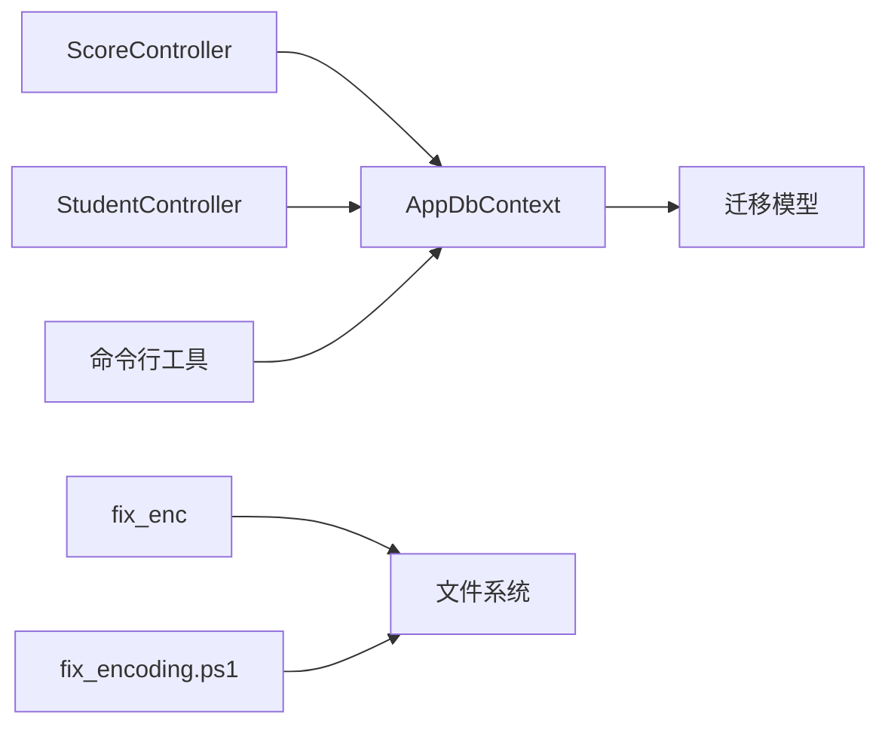

# 数据校验与清洗

<cite>
**本文引用的文件**
- [check_data.csproj](file://check_data/check_data.csproj)
- [Program.cs](file://check_data/Program.cs)
- [check_db.csproj](file://check_db/check_db.csproj)
- [Program.cs](file://check_db/Program.cs)
- [check_exam_subject.csproj](file://check_exam_subject/check_exam_subject.csproj)
- [Program.cs](file://check_exam_subject/Program.cs)
- [check_user.csproj](file://check_user/check_user.csproj)
- [Program.cs](file://check_user/Program.cs)
- [fix_enc.csproj](file://fix_enc/fix_enc.csproj)
- [Program.cs](file://fix_enc/Program.cs)
- [fix_encoding.ps1](file://fix_encoding.ps1)
- [hash_pwd.csproj](file://hash_pwd/hash_pwd.csproj)
- [Program.cs](file://hash_pwd/Program.cs)
- [ScoreController.cs](file://Controllers/ScoreController.cs)
- [StudentController.cs](file://Controllers/StudentController.cs)
- [AppDbContext.cs](file://Data/AppDbContext.cs)
- [20260609075559_InitialCreate.Designer.cs](file://Migrations/20260609075559_InitialCreate.Designer.cs)
- [20260610054012_AddExamRoom.Designer.cs](file://Migrations/20260610054012_AddExamRoom.Designer.cs)
- [20260611001601_AddExamEndDate.Designer.cs](file://Migrations/20260611001601_AddExamEndDate.Designer.cs)
- [20260611075107_RefactorScoreModel.Designer.cs](file://Migrations/20260611075107_RefactorScoreModel.Designer.cs)
- [appsettings.json](file://appsettings.json)
</cite>

## 目录
1. [简介](#简介)
2. [项目结构](#项目结构)
3. [核心组件](#核心组件)
4. [架构总览](#架构总览)
5. [详细组件分析](#详细组件分析)
6. [依赖关系分析](#依赖关系分析)
7. [性能考虑](#性能考虑)
8. [故障排查指南](#故障排查指南)
9. [结论](#结论)
10. [附录](#附录)

## 简介
本文件系统性梳理该学生管理系统的“数据校验与清洗”能力，覆盖以下方面：
- 数据质量检查：完整性验证、重复检测、格式标准化、异常值识别
- 数据清洗流程：编码修复、字符清理、数值规范化、日期格式统一
- 工具使用：命令行参数配置、批量处理、日志记录
- 修复策略：自动修复规则、人工干预流程、数据回滚方案
- 质量监控：规则配置、异常报告、修复效果评估
- 迁移质量保障：迁移过程中的数据一致性与可追溯性

## 项目结构
该项目采用分层与功能模块化组织，与数据校验/清洗直接相关的模块如下：
- 控制器层：负责业务入口与数据校验（如成绩导入、学生信息）
- 数据访问层：EF Core 上下文与迁移定义，约束字段长度与类型
- 命令行工具：独立的 .NET 控制台应用，用于数据检查、修复与迁移后验证
- PowerShell 脚本：辅助编码修复等运维任务
- 配置：应用设置文件，支持日志与运行时行为控制

图表来源
- [check_data.csproj](file://check_data/check_data.csproj)
- [check_db.csproj](file://check_db/check_db.csproj)
- [check_exam_subject.csproj](file://check_exam_subject/check_exam_subject.csproj)
- [check_user.csproj](file://check_user/check_user.csproj)
- [fix_enc.csproj](file://fix_enc/fix_enc.csproj)
- [hash_pwd.csproj](file://hash_pwd/hash_pwd.csproj)
- [ScoreController.cs](file://Controllers/ScoreController.cs)
- [StudentController.cs](file://Controllers/StudentController.cs)
- [AppDbContext.cs](file://Data/AppDbContext.cs)
- [20260609075559_InitialCreate.Designer.cs](file://Migrations/20260609075559_InitialCreate.Designer.cs)
- [20260610054012_AddExamRoom.Designer.cs](file://Migrations/20260610054012_AddExamRoom.Designer.cs)
- [20260611001601_AddExamEndDate.Designer.cs](file://Migrations/20260611001601_AddExamEndDate.Designer.cs)
- [20260611075107_RefactorScoreModel.Designer.cs](file://Migrations/20260611075107_RefactorScoreModel.Designer.cs)

章节来源
- [check_data.csproj](file://check_data/check_data.csproj)
- [check_db.csproj](file://check_db/check_db.csproj)
- [check_exam_subject.csproj](file://check_exam_subject/check_exam_subject.csproj)
- [check_user.csproj](file://check_user/check_user.csproj)
- [fix_enc.csproj](file://fix_enc/fix_enc.csproj)
- [hash_pwd.csproj](file://hash_pwd/hash_pwd.csproj)
- [ScoreController.cs](file://Controllers/ScoreController.cs)
- [StudentController.cs](file://Controllers/StudentController.cs)
- [AppDbContext.cs](file://Data/AppDbContext.cs)
- [20260609075559_InitialCreate.Designer.cs](file://Migrations/20260609075559_InitialCreate.Designer.cs)
- [20260610054012_AddExamRoom.Designer.cs](file://Migrations/20260610054012_AddExamRoom.Designer.cs)
- [20260611001601_AddExamEndDate.Designer.cs](file://Migrations/20260611001601_AddExamEndDate.Designer.cs)
- [20260611075107_RefactorScoreModel.Designer.cs](file://Migrations/20260611075107_RefactorScoreModel.Designer.cs)

## 核心组件
- 数据导入校验（成绩）：在控制器中对单元格内容进行解析与范围校验，输出逐行错误信息，统计成功/失败计数，便于前端预览与二次确认。
- 学生信息校验：通过模型映射与迁移定义的字段长度/类型约束，确保入库前的数据符合数据库规范。
- 数据检查工具集：独立命令行工具，分别针对数据完整性、数据库一致性、考试科目关联、用户数据进行批量检查。
- 编码修复工具：支持从本地代码页读取并写回 UTF-8，解决视图或文本文件乱码问题。
- 密码哈希工具：提供安全的密码哈希处理能力，保障用户凭据安全。

章节来源
- [ScoreController.cs](file://Controllers/ScoreController.cs)
- [StudentController.cs](file://Controllers/StudentController.cs)
- [AppDbContext.cs](file://Data/AppDbContext.cs)
- [20260609075559_InitialCreate.Designer.cs](file://Migrations/20260609075559_InitialCreate.Designer.cs)
- [20260610054012_AddExamRoom.Designer.cs](file://Migrations/20260610054012_AddExamRoom.Designer.cs)
- [20260611001601_AddExamEndDate.Designer.cs](file://Migrations/20260611001601_AddExamEndDate.Designer.cs)
- [20260611075107_RefactorScoreModel.Designer.cs](file://Migrations/20260611075107_RefactorScoreModel.Designer.cs)
- [check_data.csproj](file://check_data/check_data.csproj)
- [check_db.csproj](file://check_db/check_db.csproj)
- [check_exam_subject.csproj](file://check_exam_subject/check_exam_subject.csproj)
- [check_user.csproj](file://check_user/check_user.csproj)
- [fix_enc.csproj](file://fix_enc/fix_enc.csproj)
- [hash_pwd.csproj](file://hash_pwd/hash_pwd.csproj)

## 架构总览
整体架构围绕“Web 控制器 + EF Core 上下文 + 迁移模型 + 命令行工具”的组合展开。Web 层负责交互式校验与即时反馈；命令行工具负责离线批量检查与修复；迁移模型为数据结构与约束提供权威定义。

图表来源
- [ScoreController.cs](file://Controllers/ScoreController.cs)
- [StudentController.cs](file://Controllers/StudentController.cs)
- [AppDbContext.cs](file://Data/AppDbContext.cs)
- [check_data.csproj](file://check_data/check_data.csproj)
- [check_db.csproj](file://check_db/check_db.csproj)
- [check_exam_subject.csproj](file://check_exam_subject/check_exam_subject.csproj)
- [check_user.csproj](file://check_user/check_user.csproj)
- [fix_enc.csproj](file://fix_enc/fix_enc.csproj)
- [hash_pwd.csproj](file://hash_pwd/hash_pwd.csproj)

## 详细组件分析

### 成绩导入校验（ScoreController）
- 功能要点
  - 对每个单元格进行数值解析，判断是否在科目满分范围内
  - 记录每行的错误项（格式错误、超分等），并汇总成功/失败计数
  - 将结果返回给前端用于预览与二次确认
- 关键流程

图表来源
- [ScoreController.cs](file://Controllers/ScoreController.cs)

章节来源
- [ScoreController.cs](file://Controllers/ScoreController.cs)

### 学生信息校验（StudentController + 迁移模型）
- 功能要点
  - 依据迁移文件中对字段的最大长度与类型定义，确保入库前满足约束
  - 在控制器中结合业务规则进行额外校验（如必填字段、格式要求）
- 关键流程

图表来源
- [StudentController.cs](file://Controllers/StudentController.cs)
- [20260609075559_InitialCreate.Designer.cs](file://Migrations/20260609075559_InitialCreate.Designer.cs)
- [20260610054012_AddExamRoom.Designer.cs](file://Migrations/20260610054012_AddExamRoom.Designer.cs)
- [20260611001601_AddExamEndDate.Designer.cs](file://Migrations/20260611001601_AddExamEndDate.Designer.cs)
- [20260611075107_RefactorScoreModel.Designer.cs](file://Migrations/20260611075107_RefactorScoreModel.Designer.cs)

章节来源
- [StudentController.cs](file://Controllers/StudentController.cs)
- [20260609075559_InitialCreate.Designer.cs](file://Migrations/20260609075559_InitialCreate.Designer.cs)
- [20260610054012_AddExamRoom.Designer.cs](file://Migrations/20260610054012_AddExamRoom.Designer.cs)
- [20260611001601_AddExamEndDate.Designer.cs](file://Migrations/20260611001601_AddExamEndDate.Designer.cs)
- [20260611075107_RefactorScoreModel.Designer.cs](file://Migrations/20260611075107_RefactorScoreModel.Designer.cs)

### 数据检查工具集（check_data / check_db / check_exam_subject / check_user）
- 功能要点
  - check_data：通用数据完整性与格式检查
  - check_db：数据库一致性检查（表/列/索引/约束）
  - check_exam_subject：考试与科目关联一致性
  - check_user：用户数据有效性检查
- 处理流程

图表来源
- [check_data.csproj](file://check_data/check_data.csproj)
- [check_db.csproj](file://check_db/check_db.csproj)
- [check_exam_subject.csproj](file://check_exam_subject/check_exam_subject.csproj)
- [check_user.csproj](file://check_user/check_user.csproj)

章节来源
- [check_data.csproj](file://check_data/check_data.csproj)
- [check_db.csproj](file://check_db/check_db.csproj)
- [check_exam_subject.csproj](file://check_exam_subject/check_exam_subject.csproj)
- [check_user.csproj](file://check_user/check_user.csproj)

### 编码修复工具（fix_enc + fix_encoding.ps1）
- 功能要点
  - 自动注册代码页提供程序，尝试以本地代码页读取文件，再以 UTF-8 写回
  - 提供 PowerShell 辅助脚本，快速修复视图或文本文件的编码问题
- 处理流程

图表来源
- [fix_enc.csproj](file://fix_enc/fix_enc.csproj)
- [fix_encoding.ps1](file://fix_encoding.ps1)

章节来源
- [fix_enc.csproj](file://fix_enc/fix_enc.csproj)
- [fix_encoding.ps1](file://fix_encoding.ps1)

### 密码哈希工具（hash_pwd）
- 功能要点
  - 提供安全的密码哈希处理，避免明文存储
  - 可作为独立工具用于批量重算或迁移后的补救
- 使用场景
  - 用户首次登录、密码重置、迁移后补打补丁

章节来源
- [hash_pwd.csproj](file://hash_pwd/hash_pwd.csproj)

## 依赖关系分析
- 组件耦合
  - Web 控制器依赖 EF Core 上下文与迁移模型定义的约束
  - 命令行工具直接连接数据库，独立于 Web 层
  - 编码修复工具与具体业务无强耦合，仅操作文件系统
- 外部依赖
  - .NET 运行时与 EF Core
  - 数据库驱动（由上下文与迁移定义）
  - PowerShell 代码页支持（Windows 环境）

图表来源
- [ScoreController.cs](file://Controllers/ScoreController.cs)
- [StudentController.cs](file://Controllers/StudentController.cs)
- [AppDbContext.cs](file://Data/AppDbContext.cs)
- [check_data.csproj](file://check_data/check_data.csproj)
- [check_db.csproj](file://check_db/check_db.csproj)
- [check_exam_subject.csproj](file://check_exam_subject/check_exam_subject.csproj)
- [check_user.csproj](file://check_user/check_user.csproj)
- [fix_enc.csproj](file://fix_enc/fix_enc.csproj)
- [fix_encoding.ps1](file://fix_encoding.ps1)

章节来源
- [ScoreController.cs](file://Controllers/ScoreController.cs)
- [StudentController.cs](file://Controllers/StudentController.cs)
- [AppDbContext.cs](file://Data/AppDbContext.cs)
- [check_data.csproj](file://check_data/check_data.csproj)
- [check_db.csproj](file://check_db/check_db.csproj)
- [check_exam_subject.csproj](file://check_exam_subject/check_exam_subject.csproj)
- [check_user.csproj](file://check_user/check_user.csproj)
- [fix_enc.csproj](file://fix_enc/fix_enc.csproj)
- [fix_encoding.ps1](file://fix_encoding.ps1)

## 性能考虑
- 批量处理
  - 命令行工具应分批读取与处理，避免一次性加载过多数据导致内存压力
- I/O 优化
  - 文件编码修复建议先读取头部字节进行快速判定，减少不必要的全量解码
- 数据库查询
  - 检查工具应使用索引列过滤、限制返回字段、分页游标等方式降低锁竞争与网络开销
- 并发与事务
  - 写入修复操作建议在短事务内完成，并设置合理的重试与超时策略

## 故障排查指南
- 日志记录
  - 命令行工具通过标准输出输出检查结果与统计信息，建议结合重定向到文件进行归档
  - Web 层可在控制器中记录校验失败明细，便于前端展示与审计
- 常见问题
  - 编码问题：使用编码修复工具或 PowerShell 脚本统一为 UTF-8
  - 数值越界：检查科目满分配置与导入模板，必要时调整迁移模型或业务规则
  - 字段超长：根据迁移模型的长度限制修正输入源
- 回滚方案
  - 对于批量修复，建议在事务中执行并保留备份；若失败则回滚
  - Web 层的预览机制可用于二次确认，避免直接写入

章节来源
- [check_data.csproj](file://check_data/check_data.csproj)
- [check_db.csproj](file://check_db/check_db.csproj)
- [check_exam_subject.csproj](file://check_exam_subject/check_exam_subject.csproj)
- [check_user.csproj](file://check_user/check_user.csproj)
- [fix_enc.csproj](file://fix_enc/fix_enc.csproj)
- [fix_encoding.ps1](file://fix_encoding.ps1)
- [ScoreController.cs](file://Controllers/ScoreController.cs)

## 结论
该系统通过“Web 层即时校验 + 命令行工具批量检查 + 迁移模型约束 + 编码修复工具”的组合，构建了较为完整的数据质量保障体系。建议在现有基础上进一步完善：
- 规则引擎化：将校验规则抽象为可配置策略，提升灵活性
- 实时监控：在生产环境引入指标采集与告警
- 审计追踪：对修复操作建立变更日志与回滚点

## 附录

### 数据校验与清洗清单
- 完整性验证
  - 必填字段检查、外键关联检查、唯一性检查
- 重复数据检测
  - 基于主键/唯一索引的去重策略
- 格式标准化
  - 统一大小写、去除多余空白、标准化枚举值
- 异常值识别
  - 数值范围检查、日期合理性检查、异常分布检测
- 清洗流程
  - 编码修复（UTF-8）、字符清理（ASCII/Unicode）、数值规范化（0~满分）、日期统一（ISO 8601）

### 工具使用方法
- 命令行参数
  - 输入路径/文件模式、输出路径、日志级别、并发度、跳过/强制模式
- 批量处理
  - 支持目录递归扫描、文件白名单/黑名单、增量模式
- 日志记录
  - 标准输出 + 文件落盘，支持 JSON/CSV 报告导出

### 修复策略
- 自动修复
  - 编码转换、空值填充默认值、超界截断、格式归一化
- 人工干预
  - 生成差异报告，标注高风险项，交由管理员复核
- 回滚方案
  - 事务内修复 + 备份恢复；Web 预览确认后再提交

### 质量监控
- 规则配置
  - YAML/JSON 配置文件，定义字段规则、阈值、权重
- 异常报告
  - 每日/每周报告，包含趋势图与修复率
- 效果评估
  - 准确率、召回率、F1 分数、修复耗时与成本

### 迁移质量保证
- 迁移前
  - 全量快照、规则评审、灰度验证
- 迁移中
  - 分批执行、实时监控、异常告警
- 迁移后
  - 双写校验、交叉比对、回归测试、回滚预案