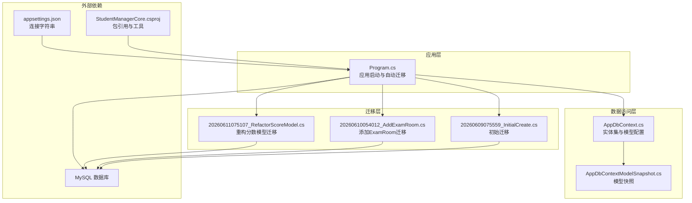
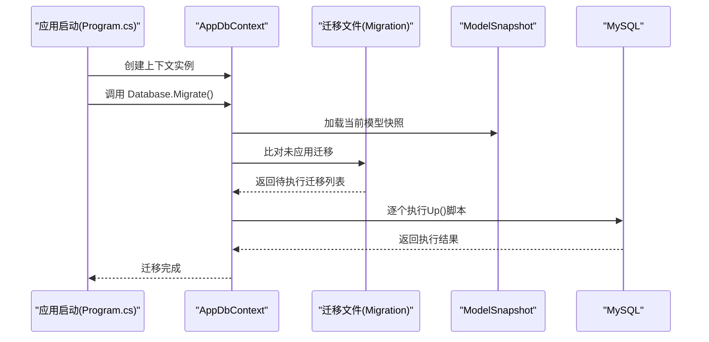
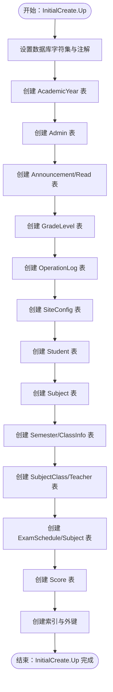
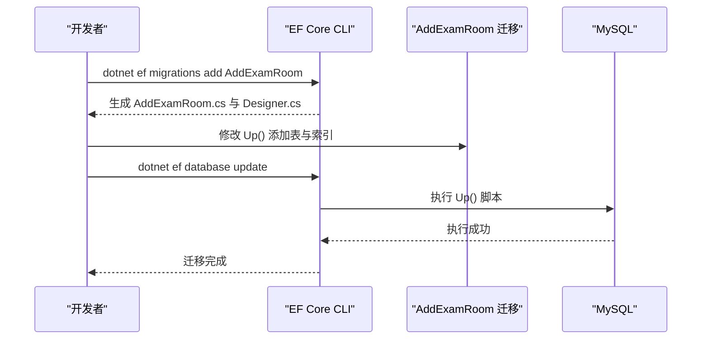
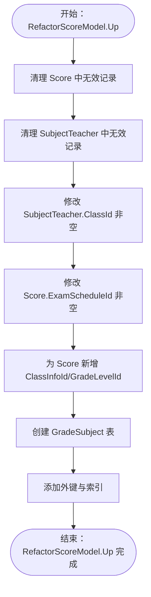
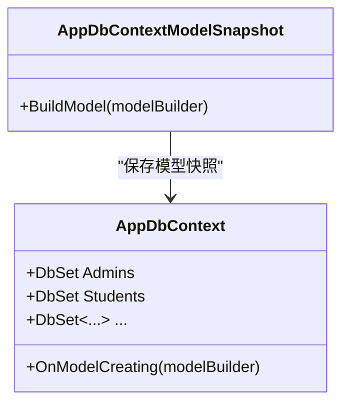
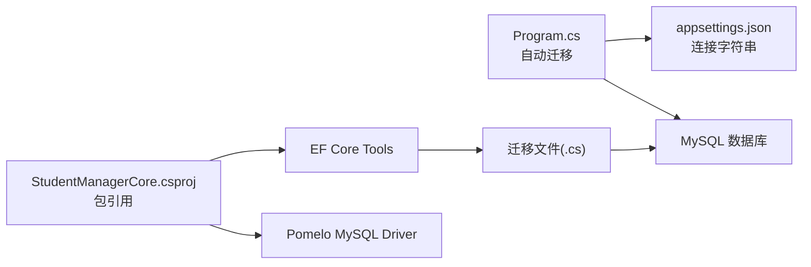

# EF Core迁移机制

<cite>
**本文档引用的文件**
- [AppDbContext.cs](file://Data/AppDbContext.cs)
- [AppDbContextModelSnapshot.cs](file://Migrations/AppDbContextModelSnapshot.cs)
- [20260609075559_InitialCreate.cs](file://Migrations/20260609075559_InitialCreate.cs)
- [20260610054012_AddExamRoom.cs](file://Migrations/20260610054012_AddExamRoom.cs)
- [20260611075107_RefactorScoreModel.cs](file://Migrations/20260611075107_RefactorScoreModel.cs)
- [Program.cs](file://Program.cs)
- [StudentManagerCore.csproj](file://StudentManagerCore.csproj)
- [DataMigrator.csproj](file://DataMigrator/DataMigrator.csproj)
- [appsettings.json](file://appsettings.json)
- [Create_Announcement_Tables.sql](file://Database/Create_Announcement_Tables.sql)
- [Add_GradeManagement_Tables.sql](file://Database/Add_GradeManagement_Tables.sql)
</cite>

## 目录
1. [简介](#简介)
2. [项目结构](#项目结构)
3. [核心组件](#核心组件)
4. [架构总览](#架构总览)
5. [详细组件分析](#详细组件分析)
6. [依赖关系分析](#依赖关系分析)
7. [性能考虑](#性能考虑)
8. [故障排除指南](#故障排除指南)
9. [结论](#结论)
10. [附录](#附录)

## 简介
本文件系统性阐述该ASP.NET Core项目基于EF Core Code First的数据库迁移机制，涵盖迁移文件生成原理、版本控制策略、数据库演进流程与最佳实践。文档以实际迁移文件与上下文代码为基础，解释初始迁移（InitialCreate）的创建过程、后续迁移（如添加ExamRoom表）的实现方式、ModelSnapshot的作用与更新机制、迁移命令使用指南、Up()/Down()方法的实现细节、数据迁移与结构变更处理，并提供常见问题解决方案。

## 项目结构
该项目采用标准的ASP.NET Core + EF Core架构，数据库访问通过AppDbContext进行建模，迁移文件位于Migrations目录，应用启动时自动执行数据库迁移。

**图表来源**
- [Program.cs:107-120](file://Program.cs#L107-L120)
- [AppDbContext.cs:6-295](file://Data/AppDbContext.cs#L6-L295)
- [AppDbContextModelSnapshot.cs:1-1038](file://Migrations/AppDbContextModelSnapshot.cs#L1-L1038)
- [20260609075559_InitialCreate.cs:1-563](file://Migrations/20260609075559_InitialCreate.cs#L1-L563)
- [20260610054012_AddExamRoom.cs:1-98](file://Migrations/20260610054012_AddExamRoom.cs#L1-L98)
- [20260611075107_RefactorScoreModel.cs:1-219](file://Migrations/20260611075107_RefactorScoreModel.cs#L1-L219)
- [StudentManagerCore.csproj:10-18](file://StudentManagerCore.csproj#L10-L18)
- [appsettings.json:12-14](file://appsettings.json#L12-L14)

**章节来源**
- [Program.cs:107-120](file://Program.cs#L107-L120)
- [StudentManagerCore.csproj:10-18](file://StudentManagerCore.csproj#L10-L18)
- [appsettings.json:12-14](file://appsettings.json#L12-L14)

## 核心组件
- AppDbContext：定义所有DbSet实体集合，并在OnModelCreating中完成表映射、主键、索引与外键约束配置。
- 迁移文件：每个迁移类对应一个Up()与Down()方法，描述数据库结构变更与回滚方案。
- ModelSnapshot：自动生成的模型快照，用于比较当前模型与历史快照，判断是否需要生成新迁移。
- 应用启动迁移：在Program.cs中调用Database.Migrate()实现应用启动时自动迁移。

**章节来源**
- [AppDbContext.cs:10-295](file://Data/AppDbContext.cs#L10-L295)
- [AppDbContextModelSnapshot.cs:16-20](file://Migrations/AppDbContextModelSnapshot.cs#L16-L20)
- [Program.cs:107-120](file://Program.cs#L107-L120)

## 架构总览
下图展示从应用启动到数据库迁移的整体流程，包括迁移命令生成、快照比对与执行阶段。

**图表来源**
- [Program.cs:107-120](file://Program.cs#L107-L120)
- [AppDbContextModelSnapshot.cs:16-20](file://Migrations/AppDbContextModelSnapshot.cs#L16-L20)
- [20260609075559_InitialCreate.cs:13-508](file://Migrations/20260609075559_InitialCreate.cs#L13-L508)
- [20260610054012_AddExamRoom.cs:13-85](file://Migrations/20260610054012_AddExamRoom.cs#L13-L85)
- [20260611075107_RefactorScoreModel.cs:13-146](file://Migrations/20260611075107_RefactorScoreModel.cs#L13-L146)

## 详细组件分析

### 初始迁移（InitialCreate）分析
- 生成原理：基于AppDbContext的OnModelCreating配置与DbSet集合，生成完整的数据库结构（表、列、主键、索引、外键）。
- 关键步骤：
  - 设置数据库字符集与版本注解。
  - 依次创建AcademicYear、Admin、Announcement、AnnouncementRead、GradeLevel、OperationLog、SiteConfig、Student、Subject、Semester、ClassInfo、SubjectClass、SubjectTeacher、ExamSchedule、ExamSubject、Score等表。
  - 建立必要的外键约束与复合唯一索引。
- 回滚策略：按逆序删除所有表，确保数据与结构完全恢复。

**图表来源**
- [20260609075559_InitialCreate.cs:13-508](file://Migrations/20260609075559_InitialCreate.cs#L13-L508)

**章节来源**
- [20260609075559_InitialCreate.cs:13-508](file://Migrations/20260609075559_InitialCreate.cs#L13-L508)

### 后续迁移（添加ExamRoom表）分析
- 目标：新增ExamRoom与ExamRoomStudent表，支持考场座位安排。
- 结构变更：
  - 新增ExamRoom表（主键Id、外键ExamScheduleId、字段Grade/ArrangeMode/RoomName/SeatCount/CreateTime）。
  - 新增ExamRoomStudent表（主键Id、双外键ExamRoomId/StudentId、SeatNumber）。
  - 添加相关索引与级联删除约束。
- 回滚策略：先删除ExamRoomStudent，再删除ExamRoom。

**图表来源**
- [20260610054012_AddExamRoom.cs:13-85](file://Migrations/20260610054012_AddExamRoom.cs#L13-L85)

**章节来源**
- [20260610054012_AddExamRoom.cs:13-95](file://Migrations/20260610054012_AddExamRoom.cs#L13-L95)

### 模型重构迁移（重构分数模型）分析
- 目标：清理无效数据、规范化外键、引入GradeLevel与ClassInfo关联、建立新的唯一索引。
- 数据清理：
  - 删除Score中ExamScheduleId为空的记录。
  - 删除SubjectTeacher中ClassId为空的记录。
- 结构变更：
  - 将SubjectTeacher.ClassId设为非空默认值。
  - 将Score.ExamScheduleId设为非空默认值。
  - 为Score新增ClassInfoId与GradeLevelId列。
  - 新增GradeSubject表并建立外键。
  - 更新索引与外键约束。
- 回滚策略：删除新增外键与索引，删除新增列，回退类型与默认值，重建旧外键。

**图表来源**
- [20260611075107_RefactorScoreModel.cs:13-146](file://Migrations/20260611075107_RefactorScoreModel.cs#L13-L146)

**章节来源**
- [20260611075107_RefactorScoreModel.cs:13-216](file://Migrations/20260611075107_RefactorScoreModel.cs#L13-L216)

### ModelSnapshot的作用与更新机制
- 作用：保存当前模型的序列化快照，作为“基线”用于检测模型变更。
- 更新机制：
  - 当模型（实体映射、索引、外键）发生变化时，运行迁移命令会重新生成快照文件。
  - 快照与当前模型对比决定是否生成新的迁移。
- 在本项目中，快照文件由EF Core工具自动生成与维护。

**图表来源**
- [AppDbContext.cs:30-293](file://Data/AppDbContext.cs#L30-L293)
- [AppDbContextModelSnapshot.cs:16-20](file://Migrations/AppDbContextModelSnapshot.cs#L16-L20)

**章节来源**
- [AppDbContextModelSnapshot.cs:16-20](file://Migrations/AppDbContextModelSnapshot.cs#L16-L20)

### 迁移命令使用指南
- 安装与工具：
  - 项目引用了EF Core工具包，支持迁移命令行操作。
- 常用命令（示例）：
  - 添加迁移：dotnet ef migrations add 名称
  - 应用迁移：dotnet ef database update
  - 回滚迁移：dotnet ef database update 上一版本
  - 查看迁移状态：dotnet ef migrations list
- 注意事项：
  - 始终在受控环境下测试迁移脚本。
  - 对生产环境迁移需提前备份数据库。
  - 大规模数据迁移建议分批执行并禁用外键检查（谨慎使用）。

**章节来源**
- [StudentManagerCore.csproj:14-17](file://StudentManagerCore.csproj#L14-L17)

### Up()与Down()方法实现要点
- Up()：描述“如何将数据库从上一个版本升级到当前版本”，通常包含创建表、列、索引与外键。
- Down()：描述“如何将数据库从当前版本回滚到上一个版本”，需与Up()一一对应。
- 数据迁移：在Up()中可使用原生SQL清理无效数据或转换字段；Down()中需能撤销这些更改。
- 复杂场景：当缺少外键约束或索引冲突时，需在Up()中显式处理，Down()中逆向还原。

**章节来源**
- [20260609075559_InitialCreate.cs:13-508](file://Migrations/20260609075559_InitialCreate.cs#L13-L508)
- [20260610054012_AddExamRoom.cs:13-95](file://Migrations/20260610054012_AddExamRoom.cs#L13-L95)
- [20260611075107_RefactorScoreModel.cs:13-216](file://Migrations/20260611075107_RefactorScoreModel.cs#L13-L216)

### 数据种子填充
- 本项目未见迁移内包含种子数据的实现。若需在迁移中填充初始数据，可在Up()中使用ExecuteSqlRaw或Sql()执行INSERT语句，并在Down()中清理。
- 建议：将种子数据与业务初始化逻辑分离，避免硬编码在迁移中，便于维护与回滚。

**章节来源**
- [20260609075559_InitialCreate.cs:13-508](file://Migrations/20260609075559_InitialCreate.cs#L13-L508)

## 依赖关系分析
- 包依赖：项目引用Pomelo.EntityFrameworkCore.MySql与Microsoft.EntityFrameworkCore.Tools，前者提供MySQL驱动，后者提供迁移命令行工具。
- 运行时依赖：Program.cs中通过appsettings.json提供的连接字符串配置数据库连接，并在应用启动时自动执行迁移。
- 迁移生成依赖：ModelSnapshot与OnModelCreating配置共同决定迁移内容。

**图表来源**
- [StudentManagerCore.csproj:10-18](file://StudentManagerCore.csproj#L10-L18)
- [Program.cs:107-120](file://Program.cs#L107-L120)
- [appsettings.json:12-14](file://appsettings.json#L12-L14)

**章节来源**
- [StudentManagerCore.csproj:10-18](file://StudentManagerCore.csproj#L10-L18)
- [Program.cs:107-120](file://Program.cs#L107-L120)
- [appsettings.json:12-14](file://appsettings.json#L12-L14)

## 性能考虑
- 大表迁移：对大表添加索引或修改列类型时，应评估锁表时间与在线迁移风险，必要时分批处理。
- 外键检查：批量导入数据时可临时关闭外键检查，完成后恢复，但需确保数据一致性。
- 迁移幂等：尽量使迁移具备幂等特性，避免重复执行导致异常。
- 生产部署：在低峰期执行迁移，准备回滚方案与数据备份。

## 故障排除指南
- 迁移失败：
  - 检查连接字符串与数据库权限。
  - 查看启动时生成的迁移错误文件，定位具体异常。
- 数据不一致：
  - 在Up()中使用原生SQL清理无效数据，在Down()中逆向恢复。
  - 对于缺失外键的场景，先在Up()中创建外键，Down()中删除。
- 启动自动迁移异常：
  - 确认Program.cs中的Database.Migrate()调用未被异常捕获逻辑吞没。
  - 检查数据库版本与驱动兼容性。

**章节来源**
- [Program.cs:116-120](file://Program.cs#L116-L120)

## 结论
本项目通过EF Core Code First实现了完善的数据库迁移机制：以AppDbContext为核心建模，借助ModelSnapshot进行模型变更检测，通过一系列迁移文件逐步演进数据库结构。初始迁移覆盖完整业务表结构，后续迁移聚焦功能扩展与模型重构，Down()方法保证了回滚能力。结合自动迁移与迁移命令，项目能够在不同环境中稳定地推进数据库演进。

## 附录
- 历史脚本参考：项目中仍保留部分历史SQL脚本，可用于理解早期数据库演进路径与兼容性需求。
- 历史脚本示例：
  - 公告表创建脚本
  - 年级与班级管理表创建脚本

**章节来源**
- [Create_Announcement_Tables.sql:1-31](file://Database/Create_Announcement_Tables.sql#L1-L31)
- [Add_GradeManagement_Tables.sql:1-20](file://Database/Add_GradeManagement_Tables.sql#L1-L20)