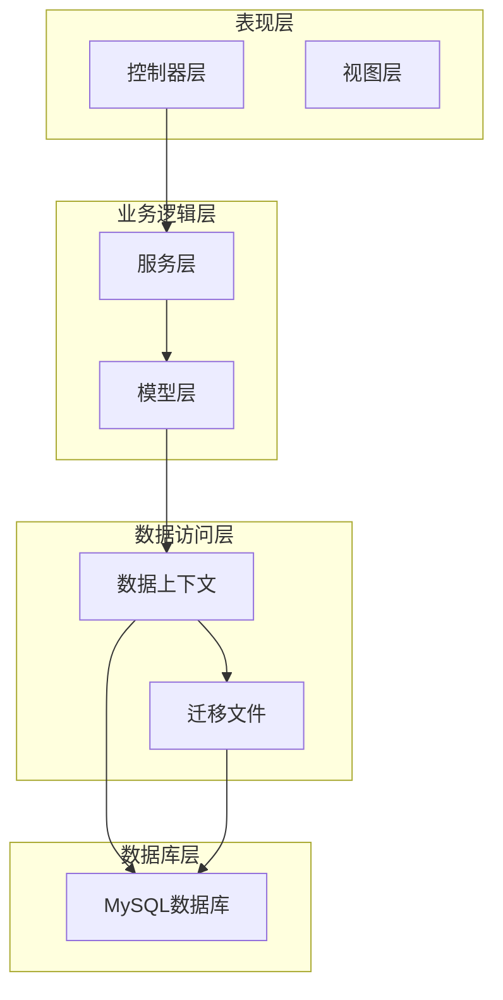
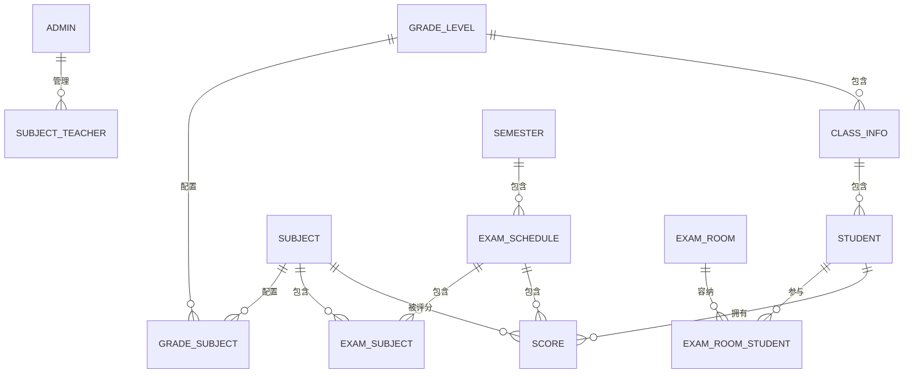
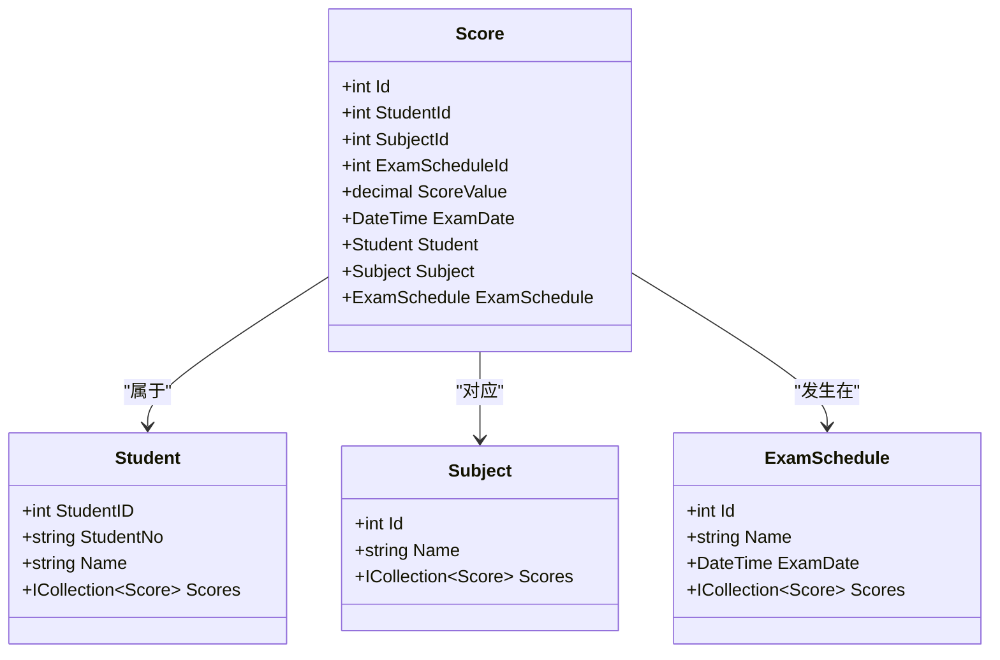
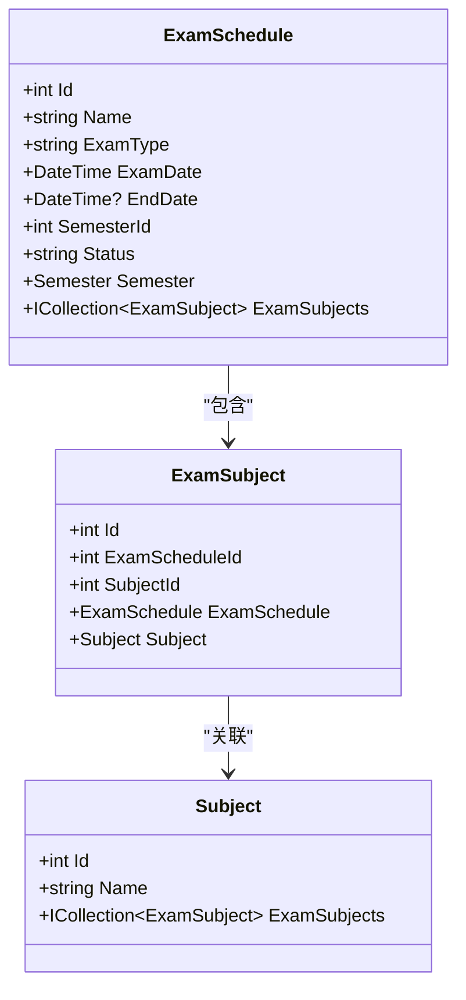
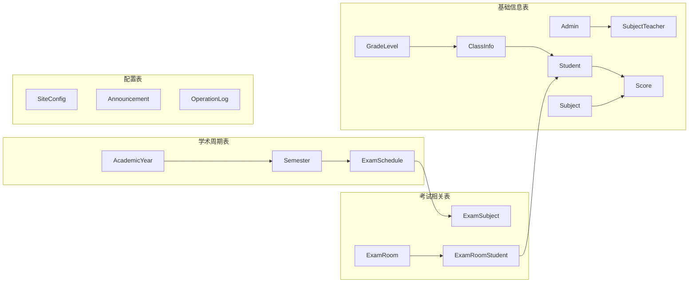

# 实体关系设计

<cite>
**本文档引用的文件**
- [Models.cs](file://Models/Models.cs)
- [ExamSchedule.cs](file://Models/ExamSchedule.cs)
- [GradeModels.cs](file://Models/GradeModels.cs)
- [AppDbContext.cs](file://Data/AppDbContext.cs)
- [20260609075559_InitialCreate.cs](file://Migrations/20260609075559_InitialCreate.cs)
- [20260610054012_AddExamRoom.cs](file://Migrations/20260610054012_AddExamRoom.cs)
- [20260611001601_AddExamEndDate.cs](file://Migrations/20260611001601_AddExamEndDate.cs)
- [20260611075107_RefactorScoreModel.cs](file://Migrations/20260611075107_RefactorScoreModel.cs)
</cite>

## 目录
1. [简介](#简介)
2. [项目结构](#项目结构)
3. [核心实体模型](#核心实体模型)
4. [架构概览](#架构概览)
5. [详细组件分析](#详细组件分析)
6. [依赖关系分析](#依赖关系分析)
7. [性能考虑](#性能考虑)
8. [故障排除指南](#故障排除指南)
9. [结论](#结论)

## 简介

学生管理系统是一个基于ASP.NET Core框架开发的教育管理平台，采用Entity Framework Core作为ORM工具，MySQL作为数据库存储。本系统旨在提供全面的学生信息管理、成绩管理和考试安排功能。

系统采用现代化的软件架构设计，通过清晰的实体关系模型实现了学生、教师、课程、成绩等核心教育资源的有效管理。系统支持多对多关系映射，如学生与课程的选课关系、教师与课程的教学关系等。

## 项目结构

系统采用典型的三层架构设计，主要分为以下层次：

**图表来源**
- [AppDbContext.cs:1-295](file://Data/AppDbContext.cs#L1-L295)
- [Models.cs:1-463](file://Models/Models.cs#L1-L463)

**章节来源**
- [AppDbContext.cs:1-295](file://Data/AppDbContext.cs#L1-L295)
- [Models.cs:1-463](file://Models/Models.cs#L1-L463)

## 核心实体模型

### 主要实体概述

系统包含以下核心实体，每个实体都经过精心设计以满足教育管理的实际需求：

#### Admin实体（管理员）
Admin实体代表系统管理员用户，负责整个系统的管理操作。该实体包含用户基本信息、权限管理和角色分配等功能。

**主键设计**: AdminID (自增整数)
**业务属性**: 用户名、密码、真实姓名、性别、联系方式等
**权限管理**: 支持多种权限组合，如学生管理、成绩管理、系统设置等

#### Student实体（学生）
Student实体存储学生的基本信息和家庭背景数据。该实体设计考虑了教育管理的完整性要求。

**主键设计**: StudentID (自增整数)
**核心属性**: 学号、姓名、性别、身份证号、家庭住址等
**扩展属性**: 父母信息、民族信息、户籍类型等

#### Score实体（成绩）
Score实体管理学生的考试成绩数据，支持多维度的成绩统计和查询。

**复合主键**: 唯一约束(StudentId, SubjectId, ExamScheduleId)
**关联属性**: 学生ID、科目ID、考试安排ID、分数值等
**快照机制**: 记录考试时的年级和班级信息

#### ExamSchedule实体（考试安排）
ExamSchedule实体管理考试的时间安排和状态控制。

**主键设计**: Id (自增整数)
**核心属性**: 考试名称、类型、适用年级、考试日期等
**状态管理**: 支持未开始、进行中、已结束三种状态

#### ExamRoom实体（考场）
ExamRoom实体管理考试的考场安排和座位分配。

**主键设计**: Id (自增整数)
**核心属性**: 考场名称、座位数量、安排模式等
**关联关系**: 与ExamSchedule建立一对多关系

**章节来源**
- [Models.cs:6-86](file://Models/Models.cs#L6-L86)
- [Models.cs:88-165](file://Models/Models.cs#L88-L165)
- [Models.cs:314-358](file://Models/Models.cs#L314-L358)
- [ExamSchedule.cs:6-47](file://Models/ExamSchedule.cs#L6-L47)
- [Models.cs:414-442](file://Models/Models.cs#L414-L442)

## 架构概览

系统采用Entity Framework Core进行数据持久化，通过模型配置实现了复杂的实体关系映射。

**图表来源**
- [AppDbContext.cs:30-293](file://Data/AppDbContext.cs#L30-L293)
- [Models.cs:314-462](file://Models/Models.cs#L314-L462)

**章节来源**
- [AppDbContext.cs:30-293](file://Data/AppDbContext.cs#L30-L293)

## 详细组件分析

### 实体关系映射

系统中的实体关系通过外键约束和级联删除策略实现数据一致性保证。

#### 一对一关系
- Admin与ClassInfo: 管理员可以管理特定班级
- GradeLevel与ClassInfo: 年级包含多个班级

#### 一对多关系
- GradeLevel到ClassInfo: 一个年级包含多个班级
- ClassInfo到Student: 一个班级包含多个学生
- Semester到ExamSchedule: 一个学期包含多个考试安排
- ExamSchedule到ExamSubject: 一个考试包含多个科目
- ExamRoom到ExamRoomStudent: 一个考场容纳多个学生

#### 多对多关系
- Student与Subject: 学生学习多门课程
- Admin与Subject: 教师教授多门课程
- Subject与Class: 课程在多个班级开设

### 复杂关系设计

#### 成绩管理关系

**图表来源**
- [Models.cs:314-358](file://Models/Models.cs#L314-L358)
- [Models.cs:88-165](file://Models/Models.cs#L88-L165)
- [Models.cs:295-312](file://Models/Models.cs#L295-L312)

#### 考试安排关系

**图表来源**
- [ExamSchedule.cs:6-47](file://Models/ExamSchedule.cs#L6-L47)
- [Models.cs:397-412](file://Models/Models.cs#L397-L412)
- [Models.cs:295-312](file://Models/Models.cs#L295-L312)

### 级联删除策略

系统采用智能的级联删除策略确保数据完整性：

#### 强制级联删除
- ClassInfo删除时自动删除关联的Student
- ExamSchedule删除时自动删除ExamSubject
- SubjectTeacher删除时自动删除关联的ClassInfo

#### 可选级联删除
- Score删除时不影响其他实体
- Student删除时保留Score记录（通过外键约束）

**章节来源**
- [AppDbContext.cs:108-111](file://Data/AppDbContext.cs#L108-L111)
- [AppDbContext.cs:191-192](file://Data/AppDbContext.cs#L191-L192)
- [AppDbContext.cs:249-250](file://Data/AppDbContext.cs#L249-L250)
- [AppDbContext.cs:265](file://Data/AppDbContext.cs#L265)
- [AppDbContext.cs:276-277](file://Data/AppDbContext.cs#L276-L277)

## 依赖关系分析

### 数据库表结构关系

**图表来源**
- [20260609075559_InitialCreate.cs:18-560](file://Migrations/20260609075559_InitialCreate.cs#L18-L560)
- [20260610054012_AddExamRoom.cs:15-95](file://Migrations/20260610054012_AddExamRoom.cs#L15-L95)

### 外键约束设计

系统通过外键约束确保实体间的数据一致性：

#### 主要外键关系
- Score.StudentId → Student.StudentID
- Score.SubjectId → Subject.Id
- Score.ExamScheduleId → ExamSchedule.Id
- ClassInfo.GradeLevelID → GradeLevel.GradeLevelID
- ExamSchedule.SemesterId → Semester.Id

#### 唯一约束设计
- Score: (StudentId, SubjectId, ExamScheduleId) 唯一
- ExamSubject: (ExamScheduleId, SubjectId) 唯一
- SubjectClass: (SubjectId, ClassId) 唯一
- SubjectTeacher: (SubjectId, AdminId, ClassId) 唯一

**章节来源**
- [AppDbContext.cs:204-224](file://Data/AppDbContext.cs#L204-L224)
- [20260609075559_InitialCreate.cs:451-507](file://Migrations/20260609075559_InitialCreate.cs#L451-L507)

## 性能考虑

### 索引优化策略

系统通过合理的索引设计提升查询性能：

#### 单列索引
- Student.StudentNo: 学号查询优化
- Subject.Name: 科目名称查询优化
- ExamSchedule.ExamDate: 考试日期范围查询优化

#### 复合索引
- Score: (StudentId, SubjectId, ExamScheduleId) 唯一索引
- ExamSubject: (ExamScheduleId, SubjectId) 唯一索引
- SubjectTeacher: (SubjectId, AdminId, ClassId) 唯一索引

### 查询优化建议

1. **批量查询**: 使用Include方法预加载关联实体
2. **分页查询**: 对大量数据使用Skip/Take进行分页
3. **条件过滤**: 在查询中尽早应用Where条件
4. **投影查询**: 使用Select只查询必要字段

## 故障排除指南

### 常见问题及解决方案

#### 实体关系异常
**问题**: 删除实体时出现外键约束错误
**解决方案**: 
1. 检查级联删除配置
2. 确保删除顺序正确
3. 验证唯一约束是否冲突

#### 性能问题
**问题**: 查询响应时间过长
**解决方案**:
1. 检查索引使用情况
2. 优化查询条件
3. 考虑使用缓存机制

#### 数据一致性问题
**问题**: 成绩数据不一致
**解决方案**:
1. 验证复合主键约束
2. 检查数据输入验证
3. 实施事务处理

**章节来源**
- [20260611075107_RefactorScoreModel.cs:15-18](file://Migrations/20260611075107_RefactorScoreModel.cs#L15-L18)

## 结论

学生管理系统通过精心设计的实体关系模型实现了教育管理的核心需求。系统采用现代化的架构设计，通过Entity Framework Core提供了强大的数据持久化能力。

### 设计亮点

1. **完整的实体关系**: 涵盖了教育管理的所有核心场景
2. **智能的级联策略**: 确保数据一致性和完整性
3. **灵活的权限管理**: 支持细粒度的权限控制
4. **高性能的查询优化**: 通过索引和查询优化提升性能

### 扩展性考虑

系统设计具有良好的扩展性，可以轻松添加新的实体和关系。通过模块化的架构设计，可以支持更大规模的教育管理需求。