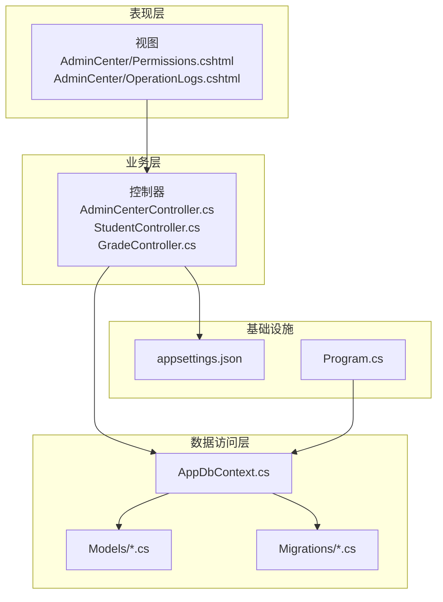
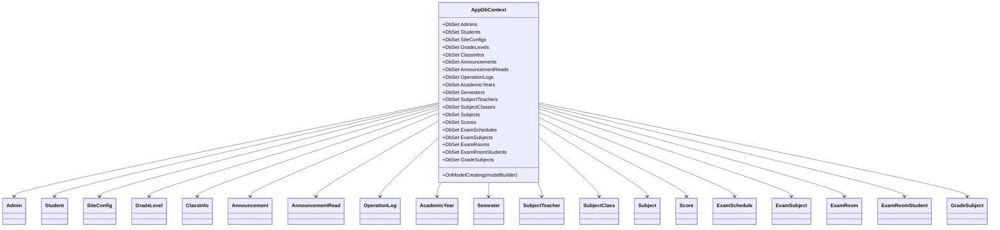
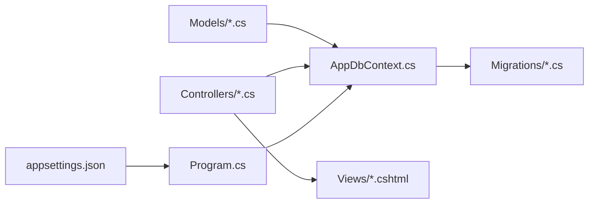

# 数据完整性约束

<cite>
**本文引用的文件**
- [AppDbContext.cs](file://Data/AppDbContext.cs)
- [Models.cs](file://Models/Models.cs)
- [GradeModels.cs](file://Models/GradeModels.cs)
- [20260609075559_InitialCreate.cs](file://Migrations/20260609075559_InitialCreate.cs)
- [appsettings.json](file://appsettings.json)
- [Program.cs](file://Program.cs)
- [AdminCenterController.cs](file://Controllers/AdminCenterController.cs)
- [StudentController.cs](file://Controllers/StudentController.cs)
- [GradeController.cs](file://Controllers/GradeController.cs)
- [OperationLogs.cshtml](file://Views/AdminCenter/OperationLogs.cshtml)
- [Permissions.cshtml](file://Views/AdminCenter/Permissions.cshtml)
</cite>

## 目录
1. [简介](#简介)
2. [项目结构](#项目结构)
3. [核心组件](#核心组件)
4. [架构总览](#架构总览)
5. [详细组件分析](#详细组件分析)
6. [依赖关系分析](#依赖关系分析)
7. [性能考虑](#性能考虑)
8. [故障排查指南](#故障排查指南)
9. [结论](#结论)
10. [附录](#附录)

## 简介
本文件围绕“数据完整性约束”主题，系统梳理并解释该学生管理系统的主键约束、外键约束与唯一性约束设计原则与实现方式；阐述域约束（如字段长度、数值范围）在 EF Core 中的映射与使用；说明级联删除与级联更新行为配置；给出数据验证规则的实现思路（客户端与服务端协同）；总结数据一致性保障机制（事务、并发控制）；并补充备份策略、恢复方案与灾难恢复计划建议，以及权限控制与审计日志的实现要点。

## 项目结构
该项目采用典型的分层架构：控制器负责请求入口与视图渲染；数据访问层基于 Entity Framework Core；模型定义位于 Models；数据库迁移脚本位于 Migrations；配置信息位于 appsettings.json；审计日志与权限控制在控制器与视图中体现。

图表来源
- [AppDbContext.cs:30-294](file://Data/AppDbContext.cs#L30-L294)
- [Models.cs:1-463](file://Models/Models.cs#L1-L463)
- [GradeModels.cs:1-100](file://Models/GradeModels.cs#L1-L100)
- [20260609075559_InitialCreate.cs:13-563](file://Migrations/20260609075559_InitialCreate.cs#L13-L563)
- [appsettings.json:1-16](file://appsettings.json#L1-L16)
- [Program.cs](file://Program.cs)

章节来源
- [AppDbContext.cs:10-29](file://Data/AppDbContext.cs#L10-L29)
- [20260609075559_InitialCreate.cs:18-563](file://Migrations/20260609075559_InitialCreate.cs#L18-L563)

## 核心组件
- 数据上下文：集中定义实体映射、主键、外键、索引与级联行为。
- 实体模型：通过特性标注实现域约束（长度、必填、类型），并与数据库列类型一致。
- 迁移脚本：生成数据库表结构、主键、外键、索引及约束。
- 控制器与视图：实现权限控制与审计日志记录，支撑数据一致性与合规要求。

章节来源
- [AppDbContext.cs:30-294](file://Data/AppDbContext.cs#L30-L294)
- [Models.cs:6-165](file://Models/Models.cs#L6-L165)
- [GradeModels.cs:6-99](file://Models/GradeModels.cs#L6-L99)
- [20260609075559_InitialCreate.cs:13-563](file://Migrations/20260609075559_InitialCreate.cs#L13-L563)

## 架构总览
系统通过 EF Core 将 C# 实体映射到 MySQL 数据库，利用 Fluent API 与迁移脚本定义约束与关系，控制器在业务流程中执行事务与日志记录，确保数据完整性与可追溯性。

图表来源
- [AppDbContext.cs:10-29](file://Data/AppDbContext.cs#L10-L29)
- [Models.cs:6-463](file://Models/Models.cs#L6-L463)
- [GradeModels.cs:6-99](file://Models/GradeModels.cs#L6-L99)

## 详细组件分析

### 主键约束（Primary Key）
- 设计原则：每张表均设置主键，确保记录唯一性与索引效率。
- 实现方式：
  - 在实体类中使用特性标注主键（如 Admin、Student、Score 等）。
  - 在 Fluent API 或迁移脚本中显式声明主键（如 Score 的复合唯一索引也依赖主键唯一性）。
- 复合主键示例：Score 的主键为 Id；SubjectTeacher 的主键为 Id；GradeSubject 的主键为 Id。
- 唯一性索引：Score 对 StudentId、SubjectId、ExamScheduleId 的组合建立唯一索引，避免重复录入同一场次同一学生的同一科目分数。

章节来源
- [Models.cs:6-165](file://Models/Models.cs#L6-L165)
- [GradeModels.cs:6-99](file://Models/GradeModels.cs#L6-L99)
- [AppDbContext.cs:208-224](file://Data/AppDbContext.cs#L208-L224)
- [20260609075559_InitialCreate.cs:414-449](file://Migrations/20260609075559_InitialCreate.cs#L414-L449)

### 外键约束（Foreign Key）
- 设计原则：通过外键维护引用完整性，确保子表记录指向有效父表记录。
- 实现方式：
  - 在实体类中使用 [ForeignKey] 特性或导航属性建立关系。
  - 在 Fluent API 中使用 HasOne(...).WithMany(...).HasForeignKey(...) 配置外键与级联行为。
  - 在迁移脚本中生成外键约束与级联删除/更新策略。
- 关系示例：
  - ClassInfo.GradeLevelID → GradeLevel.GradeLevelID（级联删除）。
  - Score.StudentId → Student.StudentID；Score.SubjectId → Subject.Id；Score.ExamScheduleId → ExamSchedule.Id。
  - ExamSubject.ExamScheduleId → ExamSchedule.Id；ExamSubject.SubjectId → Subject.Id（级联删除）。
  - ExamRoom.ExamScheduleId → ExamSchedule.Id（级联删除）。
  - ExamRoomStudent.ExamRoomId → ExamRoom.Id；ExamRoomStudent.StudentId → Student.Id（级联删除）。
  - GradeSubject.GradeLevelId → GradeLevel.Id；GradeSubject.SubjectId → Subject.Id（级联删除）。

章节来源
- [AppDbContext.cs:108-112](file://Data/AppDbContext.cs#L108-L112)
- [AppDbContext.cs:218-222](file://Data/AppDbContext.cs#L218-L222)
- [AppDbContext.cs:249-251](file://Data/AppDbContext.cs#L249-L251)
- [AppDbContext.cs:265](file://Data/AppDbContext.cs#L265)
- [AppDbContext.cs:276-277](file://Data/AppDbContext.cs#L276-L277)
- [AppDbContext.cs:289-291](file://Data/AppDbContext.cs#L289-L291)
- [20260609075559_InitialCreate.cs:284-305](file://Migrations/20260609075559_InitialCreate.cs#L284-L305)
- [20260609075559_InitialCreate.cs:386-411](file://Migrations/20260609075559_InitialCreate.cs#L386-L411)
- [20260609075559_InitialCreate.cs:413-449](file://Migrations/20260609075559_InitialCreate.cs#L413-L449)

### 唯一性约束（Unique Constraint）
- 设计原则：保证特定字段或字段组合的唯一性，防止重复数据。
- 实现方式：
  - Fluent API 中使用 HasIndex(...).IsUnique() 定义唯一索引。
  - 迁移脚本中生成唯一约束。
- 示例：
  - SubjectTeacher 的 (SubjectId, AdminId, ClassId) 唯一索引。
  - SubjectClass 的 (SubjectId, ClassId) 唯一索引。
  - Score 的 (StudentId, SubjectId, ExamScheduleId) 唯一索引。
  - ExamSubject 的 (ExamScheduleId, SubjectId) 唯一索引。
  - GradeSubject 的 (GradeLevelId, SubjectId) 唯一索引。

章节来源
- [AppDbContext.cs:193](file://Data/AppDbContext.cs#L193)
- [AppDbContext.cs:201](file://Data/AppDbContext.cs#L201)
- [AppDbContext.cs:223](file://Data/AppDbContext.cs#L223)
- [AppDbContext.cs:251](file://Data/AppDbContext.cs#L251)
- [AppDbContext.cs:291](file://Data/AppDbContext.cs#L291)
- [20260609075559_InitialCreate.cs:493-507](file://Migrations/20260609075559_InitialCreate.cs#L493-L507)

### 域约束（Check Constraints 与长度/范围控制）
- 设计原则：通过特性与数据库列类型限制输入范围与格式，减少无效数据进入系统。
- 实现方式：
  - 使用 [Required]、[StringLength]、[MaxLength] 等特性进行长度与必填约束。
  - 使用 [Column(TypeName = "...")] 指定精确的数据库列类型（如 decimal(5,1)）。
  - 在 Fluent API 中使用 HasMaxLength、HasColumnType、IsRequired 等方法。
- 示例：
  - SiteConfig.ConfigKey（主键，最大长度 100）、ConfigValue（最大长度 500）。
  - Announcement.Title（最大长度 200，必填）、Content（必填）。
  - Score.ScoreValue（decimal(5,1)，即最多 999.9）。
  - ClassInfo.ClassName（最大长度 20）。
  - GradeLevel.SchoolType（最大长度 10，必填）。
  - Subject.Name（最大长度 50，必填）。
  - Semester.SemesterName（最大长度 20，必填）。
  - AcademicYear.YearName（最大长度 20，必填）。
  - SubjectTeacher.ClassId（必填）。
  - Score.ExamScheduleId（必填）。

章节来源
- [Models.cs:167-175](file://Models/Models.cs#L167-L175)
- [Models.cs:200-220](file://Models/Models.cs#L200-L220)
- [Models.cs:314-358](file://Models/Models.cs#L314-L358)
- [GradeModels.cs:57-74](file://Models/GradeModels.cs#L57-L74)
- [GradeModels.cs:76-99](file://Models/GradeModels.cs#L76-L99)
- [AppDbContext.cs:84-87](file://Data/AppDbContext.cs#L84-L87)
- [AppDbContext.cs:119](file://Data/AppDbContext.cs#L119)
- [AppDbContext.cs:211](file://Data/AppDbContext.cs#L211)
- [AppDbContext.cs:105](file://Data/AppDbContext.cs#L105)
- [AppDbContext.cs:18](file://Data/AppDbContext.cs#L18)
- [AppDbContext.cs:178](file://Data/AppDbContext.cs#L178)
- [AppDbContext.cs:267](file://Data/AppDbContext.cs#L267)
- [AppDbContext.cs:232](file://Data/AppDbContext.cs#L232)
- [AppDbContext.cs:191](file://Data/AppDbContext.cs#L191)
- [AppDbContext.cs:215](file://Data/AppDbContext.cs#L215)

### 级联删除与级联更新（Cascade、SetNull、Restrict）
- 设计原则：根据业务关系选择合适的级联策略，避免孤儿数据与违反引用完整性的异常。
- 实现方式：
  - 在 Fluent API 中使用 OnDelete(DeleteBehavior.Cascade/Restrict/SetNull) 配置级联行为。
  - 在迁移脚本中生成对应的外键约束与删除规则。
- 级联删除示例：
  - ClassInfo.GradeLevelID → GradeLevel.GradeLevelID（Cascade）。
  - ExamSubject.ExamScheduleId → ExamSchedule.Id（Cascade）。
  - ExamSubject.SubjectId → Subject.Id（Cascade）。
  - ExamRoom.ExamScheduleId → ExamSchedule.Id（Cascade）。
  - ExamRoomStudent.ExamRoomId → ExamRoom.Id（Cascade）。
  - ExamRoomStudent.StudentId → Student.Id（Cascade）。
  - GradeSubject.GradeLevelId → GradeLevel.Id（Cascade）。
  - GradeSubject.SubjectId → Subject.Id（Cascade）。
- 级联更新示例：
  - 多处外键关系未显式指定 OnDelete，默认遵循数据库默认策略；若需 SET NULL 或 RESTRICT，应在 Fluent API 中明确配置。
- 注意：迁移脚本中部分外键未显式声明删除行为，应以 Fluent API 为准；若需要 SET NULL 或 RESTRICT，应在 OnModelCreating 中补充。

章节来源
- [AppDbContext.cs:111](file://Data/AppDbContext.cs#L111)
- [AppDbContext.cs:192](file://Data/AppDbContext.cs#L192)
- [AppDbContext.cs:249-251](file://Data/AppDbContext.cs#L249-L251)
- [AppDbContext.cs:265](file://Data/AppDbContext.cs#L265)
- [AppDbContext.cs:276-277](file://Data/AppDbContext.cs#L276-L277)
- [AppDbContext.cs:289-291](file://Data/AppDbContext.cs#L289-L291)
- [20260609075559_InitialCreate.cs:298-304](file://Migrations/20260609075559_InitialCreate.cs#L298-L304)
- [20260609075559_InitialCreate.cs:398-410](file://Migrations/20260609075559_InitialCreate.cs#L398-L410)
- [20260609075559_InitialCreate.cs:431-448](file://Migrations/20260609075559_InitialCreate.cs#L431-L448)

### 数据验证规则（客户端与服务器端）
- 客户端验证：
  - 视图中使用 HTML5 必填与长度校验（如 Required、maxlength）。
  - JavaScript/Ajax 提交前进行基础校验，减少无效请求。
- 服务器端验证：
  - 使用 Data Annotations（如 [Required]、[StringLength]、[MaxLength]）在模型层强制约束。
  - 控制器中使用 ModelState.IsValid 检查请求参数合法性。
  - 对关键操作（如导出日志、清空日志、批量权限管理）进行角色与权限校验。
- 建议：
  - 在控制器中对敏感操作增加AntiForgeryToken校验。
  - 对批量导入/导出场景，先在内存中校验再入库，必要时使用事务包裹。

章节来源
- [Models.cs:167-175](file://Models/Models.cs#L167-L175)
- [Models.cs:200-220](file://Models/Models.cs#L200-L220)
- [Models.cs:314-358](file://Models/Models.cs#L314-L358)
- [GradeModels.cs:57-74](file://Models/GradeModels.cs#L57-L74)
- [GradeModels.cs:76-99](file://Models/GradeModels.cs#L76-L99)
- [AdminCenterController.cs:378-446](file://Controllers/AdminCenterController.cs#L378-L446)
- [StudentController.cs:949-996](file://Controllers/StudentController.cs#L949-L996)
- [GradeController.cs:384-399](file://Controllers/GradeController.cs#L384-L399)
- [OperationLogs.cshtml:60-115](file://Views/AdminCenter/OperationLogs.cshtml#L60-L115)
- [Permissions.cshtml:1-145](file://Views/AdminCenter/Permissions.cshtml#L1-L145)

### 数据一致性保障机制（事务、并发控制）
- 事务处理：
  - 控制器中对批量恢复、日志清理等操作使用 SaveChangesAsync，可在需要时封装事务以保证原子性。
  - 数据迁移器中使用 BeginTransactionAsync 包裹批量插入，失败时逐行回退，提升健壮性。
- 并发控制：
  - 当前模型未引入显式的并发标记（如 [ConcurrencyCheck] 或时间戳列），建议在关键实体（如 Score、ClassInfo）增加并发标记以支持乐观锁。
- 建议：
  - 对高并发写入场景（如批量导入分数）使用事务与批量提交，减少锁竞争。
  - 引入乐观锁（并发标记）与重试逻辑，降低死锁概率。

章节来源
- [StudentController.cs:950-967](file://Controllers/StudentController.cs#L950-L967)
- [AdminCenterController.cs:431-439](file://Controllers/AdminCenterController.cs#L431-L439)
- [DataMigrator/Program.cs:347-386](file://DataMigrator/Program.cs#L347-L386)

### 权限控制与审计日志
- 权限控制：
  - 通过 Claims（角色、手机号、权限字符串）在控制器中进行授权判断（如仅管理员可导出/清空日志、批量权限管理）。
  - 角色与权限在视图中进行前端提示与交互控制。
- 审计日志：
  - 操作日志实体记录操作人、角色、操作类型、目标、详情与时间。
  - 控制器中封装日志记录方法，在关键业务操作后调用，确保可追溯。
  - 支持按操作类型与关键词检索、导出与清空。

章节来源
- [AdminCenterController.cs:346-446](file://Controllers/AdminCenterController.cs#L346-L446)
- [StudentController.cs:978-996](file://Controllers/StudentController.cs#L978-L996)
- [GradeController.cs:384-399](file://Controllers/GradeController.cs#L384-L399)
- [OperationLogs.cshtml:60-115](file://Views/AdminCenter/OperationLogs.cshtml#L60-L115)
- [Permissions.cshtml:1-145](file://Views/AdminCenter/Permissions.cshtml#L1-L145)
- [Models.cs:236-260](file://Models/Models.cs#L236-L260)

## 依赖关系分析
- 实体与上下文：所有实体由 AppDbContext 管理，通过 Fluent API 明确主外键与索引。
- 上下文与迁移：OnModelCreating 与迁移脚本共同决定数据库结构，迁移脚本生成外键与唯一索引。
- 控制器与模型：控制器依赖模型进行数据验证与业务处理，并记录审计日志。
- 配置与连接：appsettings.json 提供数据库连接字符串，Program.cs 注册服务并启用 EF Core。

图表来源
- [AppDbContext.cs:30-294](file://Data/AppDbContext.cs#L30-L294)
- [20260609075559_InitialCreate.cs:13-563](file://Migrations/20260609075559_InitialCreate.cs#L13-L563)
- [appsettings.json:12-14](file://appsettings.json#L12-L14)
- [Program.cs](file://Program.cs)

章节来源
- [AppDbContext.cs:30-294](file://Data/AppDbContext.cs#L30-L294)
- [20260609075559_InitialCreate.cs:13-563](file://Migrations/20260609075559_InitialCreate.cs#L13-L563)
- [appsettings.json:12-14](file://appsettings.json#L12-L14)

## 性能考虑
- 索引与查询：
  - 为常用过滤字段（如 ExamScheduleId、StudentId、SubjectId）建立索引，提升查询与去重效率。
  - 唯一索引避免重复写入，减少后续校验成本。
- 级联策略：
  - 合理使用 Cascade/DeleteBehavior.Restrict/SetNull，避免大规模删除引发的性能问题。
- 批量操作：
  - 使用批量插入与事务提交，减少往返次数与锁持有时间。
- 字段类型：
  - 使用精确的数据类型（如 decimal(5,1)）避免精度损失与额外转换开销。

## 故障排查指南
- 外键冲突：
  - 插入子表记录时检查父表是否存在对应主键；若使用 Cascade，确认父表删除不会误删子表数据。
- 唯一约束冲突：
  - 写入重复组合键时会触发唯一约束异常；建议在写入前进行唯一性检查或捕获异常并提示用户。
- 长度/必填校验失败：
  - 模型层注解与数据库列长度不一致会导致插入失败；核对 Fluent API 与迁移脚本中的长度与必填配置。
- 审计日志缺失：
  - 确认控制器中日志记录方法被正确调用；检查角色与权限判断逻辑。
- 连接与迁移：
  - 检查 appsettings.json 中连接字符串；确保数据库服务可用且版本兼容。

章节来源
- [AppDbContext.cs:193](file://Data/AppDbContext.cs#L193)
- [AppDbContext.cs:223](file://Data/AppDbContext.cs#L223)
- [AdminCenterController.cs:378-446](file://Controllers/AdminCenterController.cs#L378-L446)
- [appsettings.json:12-14](file://appsettings.json#L12-L14)

## 结论
本系统通过 EF Core 的 Fluent API 与迁移脚本，实现了完善的主键、外键与唯一性约束；借助 Data Annotations 与控制器层面的权限与审计机制，构建了较为完整的数据完整性与可追溯体系。建议进一步引入并发标记与更细粒度的级联策略配置，以增强一致性与性能表现。

## 附录
- 备份策略与恢复方案（建议）
  - 定期全量备份与增量备份相结合；对关键表（如 Score、ExamSchedule、ClassInfo）进行重点保护。
  - 使用数据库自带工具（如 MySQL 的 mysqldump 或物理备份）定期导出。
  - 制定恢复演练计划，验证备份数据的可用性与恢复时间目标。
- 灾难恢复计划（建议）
  - 明确 RPO/RTO 目标；准备异地容灾环境。
  - 对审计日志与权限配置进行独立备份，确保可追溯性与合规性。
- 权限控制与审计日志（建议）
  - 引入更细粒度的权限位；对敏感操作增加二次确认与审批流程。
  - 审计日志保留周期与归档策略明确，满足合规要求。