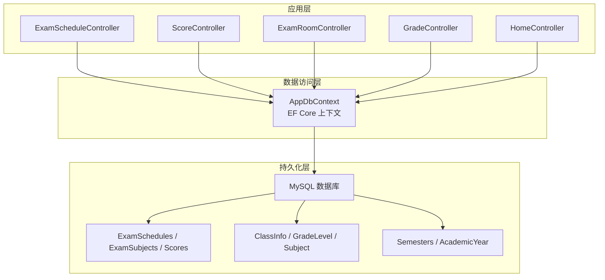
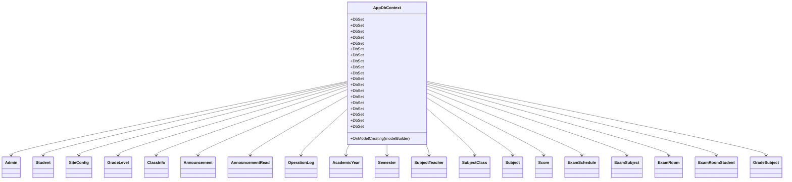
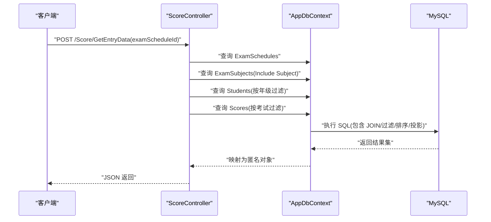
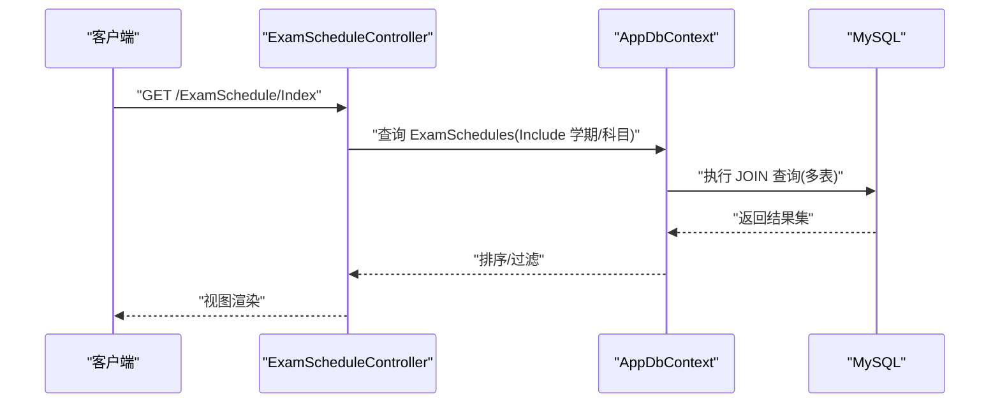
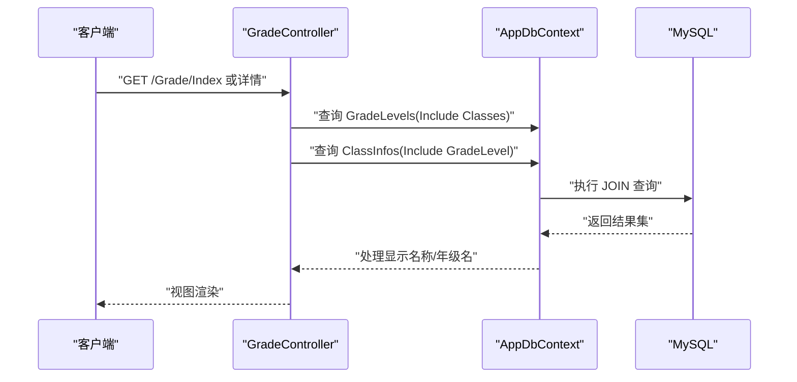
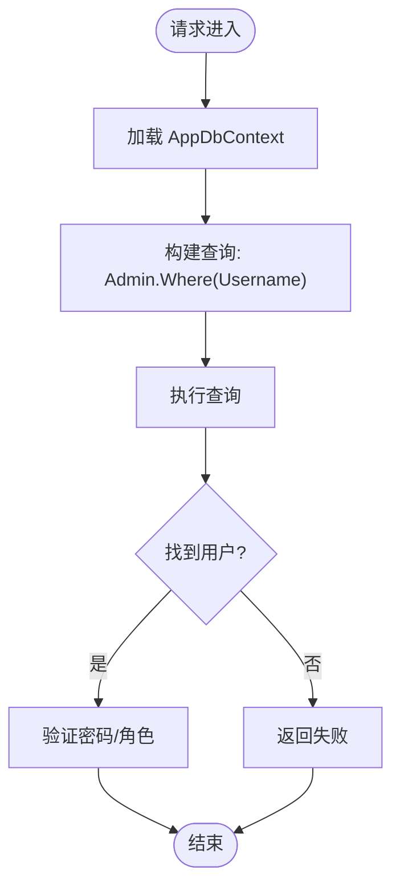
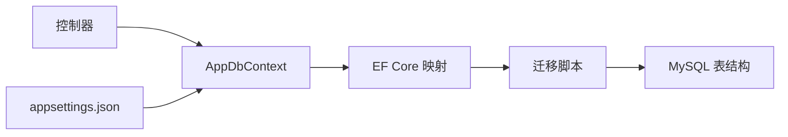

# 数据库性能优化

<cite>
**本文引用的文件**
- [AppDbContext.cs](file://Data/AppDbContext.cs)
- [Models.cs](file://Models/Models.cs)
- [GradeModels.cs](file://Models/GradeModels.cs)
- [appsettings.json](file://appsettings.json)
- [20260609075559_InitialCreate.cs](file://Migrations/20260609075559_InitialCreate.cs)
- [20260609075559_InitialCreate.Designer.cs](file://Migrations/20260609075559_InitialCreate.Designer.cs)
- [ExamScheduleController.cs](file://Controllers/ExamScheduleController.cs)
- [ScoreController.cs](file://Controllers/ScoreController.cs)
- [ExamRoomController.cs](file://Controllers/ExamRoomController.cs)
- [GradeController.cs](file://Controllers/GradeController.cs)
- [HomeController.cs](file://Controllers/HomeController.cs)
- [SubjectController.cs](file://Controllers/SubjectController.cs)
- [Add_GradeManagement_Tables.sql](file://Database/Add_GradeManagement_Tables.sql)
- [Create_Announcement_Tables.sql](file://Database/Create_Announcement_Tables.sql)
- [check_data.csproj](file://check_data/check_data.csproj)
- [DataMigrator.csproj](file://DataMigrator/DataMigrator.csproj)
</cite>

## 目录
1. [简介](#简介)
2. [项目结构](#项目结构)
3. [核心组件](#核心组件)
4. [架构总览](#架构总览)
5. [详细组件分析](#详细组件分析)
6. [依赖关系分析](#依赖关系分析)
7. [性能考量与优化策略](#性能考量与优化策略)
8. [故障排查指南](#故障排查指南)
9. [结论](#结论)
10. [附录](#附录)

## 简介
本文件面向学生管理系统的数据库性能优化，结合现有代码库中的实体模型、EF Core 映射、迁移脚本与控制器查询模式，系统阐述索引设计策略、查询优化技术、连接池与事务配置、锁机制、慢查询分析与执行计划解读、分区与归档、监控与容量规划，并补充 MySQL 特定优化技巧与最佳实践。

## 项目结构
- 数据访问层采用 EF Core，核心上下文为 AppDbContext，集中定义实体映射与索引约束。
- 控制器层展示典型查询模式，包括包含查询、条件过滤、投影查询等，为性能优化提供切入点。
- 迁移脚本与 SQL 文件体现底层表结构与字段类型，便于评估索引与约束需求。
- 应用配置包含连接字符串，指向 MySQL 数据库。

图表来源
- [AppDbContext.cs:30-293](file://Data/AppDbContext.cs#L30-L293)
- [ExamScheduleController.cs:20-70](file://Controllers/ExamScheduleController.cs#L20-L70)
- [ScoreController.cs:32-88](file://Controllers/ScoreController.cs#L32-L88)
- [ExamRoomController.cs:20-70](file://Controllers/ExamRoomController.cs#L20-L70)
- [GradeController.cs:35-340](file://Controllers/GradeController.cs#L35-L340)
- [HomeController.cs:95-155](file://Controllers/HomeController.cs#L95-L155)

章节来源
- [AppDbContext.cs:10-29](file://Data/AppDbContext.cs#L10-L29)
- [appsettings.json:12-14](file://appsettings.json#L12-L14)

## 核心组件
- 实体与关系
  - 考试相关：ExamSchedule、ExamSubjects、ExamRoom、ExamRoomStudent、Score
  - 班级与年级：GradeLevel、ClassInfo、Subject、SubjectClass、GradeSubject
  - 其他：Student、Admin、Announcement、AnnouncementRead、OperationLog、Semester、AcademicYear、SiteConfig
- EF Core 映射要点
  - 复合唯一索引：SubjectTeacher(学科-教师-班级)、SubjectClass(学科-班级)、Score(学生-学科-考试)、ExamSubject(考试-学科)、GradeSubject(年级-学科)
  - 外键关系：多对一/一对多，Cascade 删除行为用于级联清理
  - 字段类型：decimal(5,1)、char/nvarchar、datetime/datetime6、tinyint(1) 等
- 控制器查询模式
  - 包含查询：Include/ThenInclude 展开导航属性
  - 条件过滤：基于字符串关键字、枚举状态、日期范围
  - 投影查询：Select 投影到匿名对象以减少传输与内存占用
  - 批量加载：批量查询学生/成绩以降低 N+1 风险

章节来源
- [Models.cs:6-462](file://Models/Models.cs#L6-L462)
- [GradeModels.cs:6-99](file://Models/GradeModels.cs#L6-L99)
- [AppDbContext.cs:30-293](file://Data/AppDbContext.cs#L30-L293)
- [ExamScheduleController.cs:20-70](file://Controllers/ExamScheduleController.cs#L20-L70)
- [ScoreController.cs:32-88](file://Controllers/ScoreController.cs#L32-L88)
- [ExamRoomController.cs:20-70](file://Controllers/ExamRoomController.cs#L20-L70)
- [GradeController.cs:35-340](file://Controllers/GradeController.cs#L35-L340)
- [HomeController.cs:95-155](file://Controllers/HomeController.cs#L95-L155)

## 架构总览

图表来源
- [AppDbContext.cs:10-29](file://Data/AppDbContext.cs#L10-L29)
- [Models.cs:6-462](file://Models/Models.cs#L6-L462)
- [GradeModels.cs:6-99](file://Models/GradeModels.cs#L6-L99)

## 详细组件分析

### 考试与成绩查询路径

图表来源
- [ScoreController.cs:44-88](file://Controllers/ScoreController.cs#L44-L88)
- [AppDbContext.cs:204-224](file://Data/AppDbContext.cs#L204-L224)

章节来源
- [ScoreController.cs:44-88](file://Controllers/ScoreController.cs#L44-L88)
- [AppDbContext.cs:204-224](file://Data/AppDbContext.cs#L204-L224)

### 考试安排列表与科目关联

图表来源
- [ExamScheduleController.cs:20-70](file://Controllers/ExamScheduleController.cs#L20-L70)
- [AppDbContext.cs:226-252](file://Data/AppDbContext.cs#L226-L252)

章节来源
- [ExamScheduleController.cs:20-70](file://Controllers/ExamScheduleController.cs#L20-L70)
- [AppDbContext.cs:226-252](file://Data/AppDbContext.cs#L226-L252)

### 班级与年级导航查询

图表来源
- [GradeController.cs:35-340](file://Controllers/GradeController.cs#L35-L340)
- [GradeModels.cs:22-52](file://Models/GradeModels.cs#L22-L52)
- [AppDbContext.cs:89-112](file://Data/AppDbContext.cs#L89-L112)

章节来源
- [GradeController.cs:35-340](file://Controllers/GradeController.cs#L35-L340)
- [GradeModels.cs:22-52](file://Models/GradeModels.cs#L22-L52)
- [AppDbContext.cs:89-112](file://Data/AppDbContext.cs#L89-L112)

### 登录与权限校验查询

图表来源
- [AccountController.cs:75-190](file://Controllers/AccountController.cs#L75-L190)
- [AppDbContext.cs:10-18](file://Data/AppDbContext.cs#L10-L18)

章节来源
- [AccountController.cs:75-190](file://Controllers/AccountController.cs#L75-L190)
- [AppDbContext.cs:10-18](file://Data/AppDbContext.cs#L10-L18)

## 依赖关系分析
- 控制器依赖 AppDbContext 提供 DbSet 与查询能力
- AppDbContext 通过 OnModelCreating 定义实体映射、索引与外键
- 迁移脚本定义底层表结构与字段类型，决定索引与约束的可行性
- 连接字符串指向 MySQL，需确保驱动与字符集配置正确

图表来源
- [ExamScheduleController.cs:13-18](file://Controllers/ExamScheduleController.cs#L13-L18)
- [AppDbContext.cs:30-293](file://Data/AppDbContext.cs#L30-L293)
- [20260609075559_InitialCreate.cs:13-563](file://Migrations/20260609075559_InitialCreate.cs#L13-L563)
- [appsettings.json:12-14](file://appsettings.json#L12-L14)

章节来源
- [ExamScheduleController.cs:13-18](file://Controllers/ExamScheduleController.cs#L13-L18)
- [AppDbContext.cs:30-293](file://Data/AppDbContext.cs#L30-L293)
- [20260609075559_InitialCreate.cs:13-563](file://Migrations/20260609075559_InitialCreate.cs#L13-L563)
- [appsettings.json:12-14](file://appsettings.json#L12-L14)

## 性能考量与优化策略

### 索引设计策略
- 唯一索引
  - 选择原则：保证业务唯一性且常作为过滤条件
  - 示例：SubjectTeacher(学科-教师-班级)、SubjectClass(学科-班级)、Score(学生-学科-考试)、ExamSubject(考试-学科)、GradeSubject(年级-学科)
  - 依据：EF Core 映射中定义了复合唯一索引
- 复合索引
  - 选择原则：多列过滤/排序/连接常用组合
  - 建议：
    - 考试相关：ExamSchedules(ExamDate/Status/SemesterId)、ExamSubjects(ExamScheduleId/SubjectId)
    - 成绩相关：Scores(ExamScheduleId/StudentId/SubjectId)、Scores(StudentId/ExamScheduleId)
    - 班级相关：ClassInfos(GradeLevelID/ClassName)、GradeLevels(EntryYear/SchoolType)
    - 用户相关：Admins(Username/Role)
- 全文索引
  - 适用场景：公告内容、操作日志详情等大文本检索
  - 注意：MySQL InnoDB 支持全文索引；需评估写入成本与维护代价

章节来源
- [AppDbContext.cs:193-194](file://Data/AppDbContext.cs#L193-L194)
- [AppDbContext.cs:201](file://Data/AppDbContext.cs#L201)
- [AppDbContext.cs:223](file://Data/AppDbContext.cs#L223)
- [AppDbContext.cs:251](file://Data/AppDbContext.cs#L251)
- [AppDbContext.cs:291](file://Data/AppDbContext.cs#L291)

### 查询优化技术
- 避免 N+1 查询
  - 使用 Include/ThenInclude 预加载导航属性
  - 示例：ExamScheduleController 的 Include/ThenInclude；GradeController 的 Include
- 合理使用连接查询与子查询
  - 对于“存在性检查”优先使用 AnyAsync，减少数据传输
  - 对于“聚合/去重”使用 GroupBy/ Distinct
- 投影与分页
  - Select 投影只取必要字段，降低网络与内存压力
  - 使用 Skip/Take 实现分页，避免一次性加载全量数据
- 批量加载
  - 批量查询学生/成绩，减少多次往返

章节来源
- [ExamScheduleController.cs:22-27](file://Controllers/ExamScheduleController.cs#L22-L27)
- [GradeController.cs:39-335](file://Controllers/GradeController.cs#L39-L335)
- [ScoreController.cs:64-72](file://Controllers/ScoreController.cs#L64-L72)
- [ScoreController.cs:104-114](file://Controllers/ScoreController.cs#L104-L114)

### 数据库连接池配置、事务隔离级别与锁优化
- 连接池
  - 建议：启用连接池，设置最小/最大池大小、连接超时、命令超时
  - 驱动：使用 MySqlConnector 以获得更好的性能与稳定性
- 事务隔离级别
  - 默认 READ COMMITTED 可满足大多数场景；高并发写入场景可考虑 REPEATABLE READ
  - 避免长事务，及时提交或回滚
- 锁机制
  - 写操作尽量批量提交，减少行锁持有时间
  - 使用乐观锁版本号或并发标记字段，避免死锁

章节来源
- [check_data.csproj:9-11](file://check_data/check_data.csproj#L9-L11)
- [DataMigrator.csproj:10-13](file://DataMigrator/DataMigrator.csproj#L10-L13)

### 慢查询分析与执行计划解读
- 开启慢查询日志与通用查询日志（谨慎开启生产环境）
- 使用 EXPLAIN/EXPLAIN ANALYZE 分析 SQL
  - 关注：全表扫描、索引未命中、Extra 中 Using filesort/Using temporary
- 结合控制器查询模式定位热点
  - ExamSchedule/Index 的多表 JOIN
  - Score/GetEntryData 的多源聚合
- 优化手段
  - 为高频过滤/排序列建立合适索引
  - 减少 SELECT *
  - 使用覆盖索引避免回表

章节来源
- [ExamScheduleController.cs:20-70](file://Controllers/ExamScheduleController.cs#L20-L70)
- [ScoreController.cs:44-88](file://Controllers/ScoreController.cs#L44-L88)

### 分区表、数据归档与压缩
- 分区表
  - 建议：按时间维度（ExamDate/CreateTime）对 Scores、ExamSchedules 进行分区
  - 优势：快速删除历史数据、提升查询局部性
- 归档
  - 将历史年度数据归档至独立库或表，保留最近 N 年热数据
- 压缩
  - 启用表压缩（InnoDB page compression），适用于冷数据

### 监控指标、性能测试与容量规划
- 监控指标
  - QPS、TP99 延迟、连接数、缓存命中率、锁等待、慢查询数量
- 性能测试
  - 使用基准工具模拟并发读写，识别瓶颈
- 容量规划
  - 基于增长趋势与峰值估算 CPU/内存/IO/存储需求
  - 为热点表预留索引空间与缓冲池

### MySQL 特定优化技巧与最佳实践
- 字符集与排序规则
  - 统一使用 utf8mb4，排序规则选择不区分大小写的场景更友好
- 引擎选择
  - InnoDB 作为默认引擎，支持事务与行级锁
- 页大小与缓冲池
  - 合理设置 innodb_buffer_pool_size，通常占物理内存 60%-80%
- 日志与刷盘
  - 调整 innodb_flush_log_at_trx_commit 以平衡一致性与性能
- 连接与线程
  - max_connections、thread_cache_size 与连接池协同配置

## 故障排查指南
- 常见问题
  - 查询缓慢：检查索引使用情况与执行计划
  - 死锁：减少长事务、统一锁顺序、降低锁粒度
  - 连接耗尽：检查连接池参数与泄漏
- 排查步骤
  - 开启慢查询日志，定位 TOP SQL
  - 使用 EXPLAIN 分析 JOIN/过滤/排序
  - 核对 EF Core 生成的 SQL 与预期是否一致
- 参考实现位置
  - 控制器查询：ExamScheduleController、ScoreController、ExamRoomController、GradeController、HomeController
  - EF Core 映射：AppDbContext
  - 迁移脚本：20260609075559_InitialCreate

章节来源
- [ExamScheduleController.cs:20-70](file://Controllers/ExamScheduleController.cs#L20-L70)
- [ScoreController.cs:44-88](file://Controllers/ScoreController.cs#L44-L88)
- [ExamRoomController.cs:20-70](file://Controllers/ExamRoomController.cs#L20-L70)
- [GradeController.cs:35-340](file://Controllers/GradeController.cs#L35-L340)
- [HomeController.cs:95-155](file://Controllers/HomeController.cs#L95-L155)
- [AppDbContext.cs:30-293](file://Data/AppDbContext.cs#L30-L293)
- [20260609075559_InitialCreate.cs:13-563](file://Migrations/20260609075559_InitialCreate.cs#L13-L563)

## 结论
通过对实体关系、EF Core 映射与控制器查询模式的系统分析，可以明确索引设计重点、查询优化方向与 MySQL 参数调优策略。建议优先完善热点表的复合唯一与过滤索引，配合投影、分页与批量加载，持续监控执行计划与慢查询，逐步引入分区与归档，最终实现稳定高效的数据库性能。

## 附录

### 关键表与字段概览（基于映射与迁移）
- 考试安排：ExamSchedules(ExamDate/Status/SemesterId/Grades)
- 考试科目：ExamSubjects(ExamScheduleId/SubjectId)
- 成绩：Scores(ExamScheduleId/StudentId/SubjectId/ScoreValue/ExamDate)
- 班级：ClassInfos(GradeLevelID/ClassName)
- 年级：GradeLevels(EntryYear/SchoolType)
- 用户：Admins(Username/Role/Phone)
- 公告：Announcements(Title/TargetRole/Content/CreateTime/CreatedBy)

章节来源
- [AppDbContext.cs:226-292](file://Data/AppDbContext.cs#L226-L292)
- [20260609075559_InitialCreate.cs:18-563](file://Migrations/20260609075559_InitialCreate.cs#L18-L563)