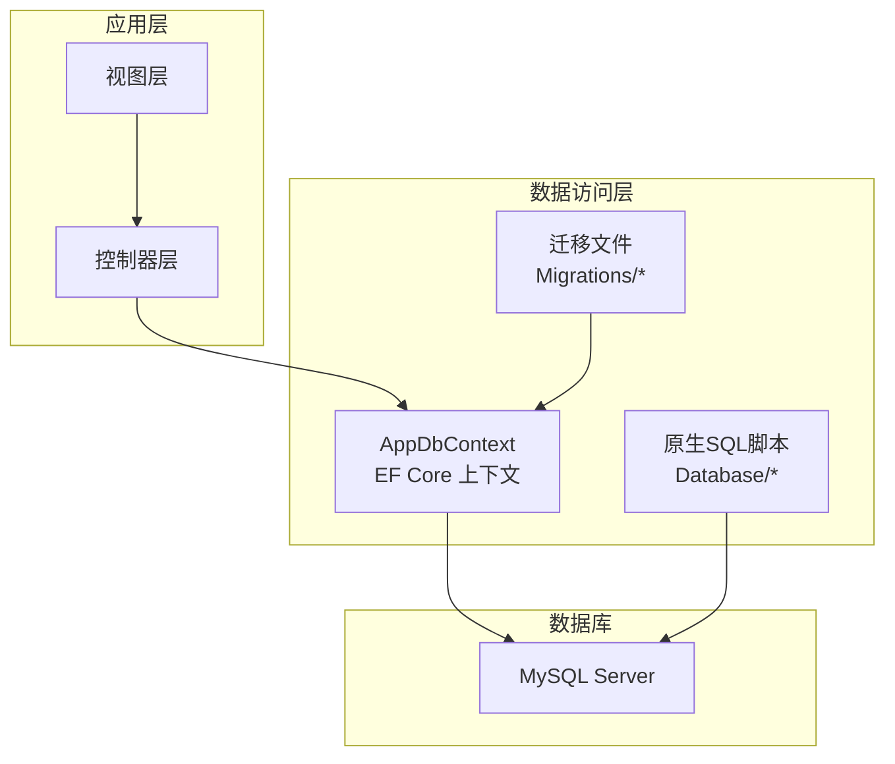
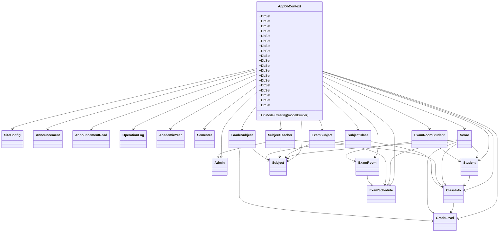
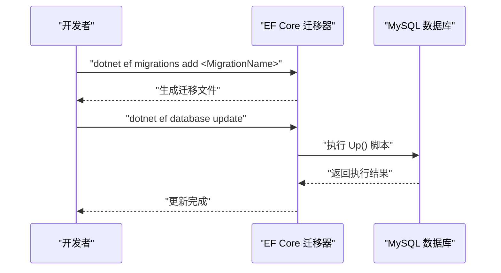
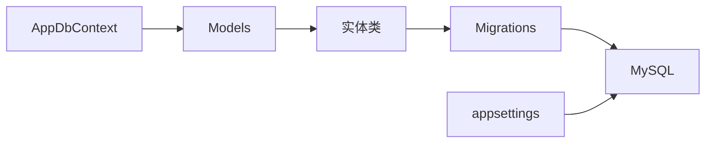
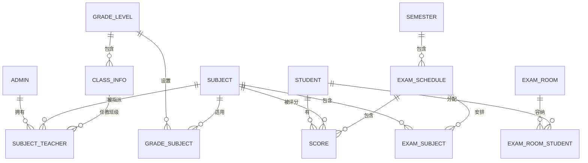

# 数据库设计

<cite>
**本文引用的文件**
- [AppDbContext.cs](file://Data/AppDbContext.cs)
- [Models.cs](file://Models/Models.cs)
- [GradeModels.cs](file://Models/GradeModels.cs)
- [20260609075559_InitialCreate.cs](file://Migrations/20260609075559_InitialCreate.cs)
- [20260611075107_RefactorScoreModel.cs](file://Migrations/20260611075107_RefactorScoreModel.cs)
- [Create_Announcement_Tables.sql](file://Database/Create_Announcement_Tables.sql)
- [Add_GradeManagement_Tables.sql](file://Database/Add_GradeManagement_Tables.sql)
- [Add_Teacher_Fields.sql](file://Database/Add_Teacher_Fields.sql)
- [Add_Permissions_Field.sql](file://Database/Add_Permissions_Field.sql)
- [Update_Permission_Keys.sql](file://Database/Update_Permission_Keys.sql)
- [appsettings.json](file://appsettings.json)
</cite>

## 目录
1. [简介](#简介)
2. [项目结构](#项目结构)
3. [核心组件](#核心组件)
4. [架构总览](#架构总览)
5. [详细组件分析](#详细组件分析)
6. [依赖分析](#依赖分析)
7. [性能考虑](#性能考虑)
8. [故障排查指南](#故障排查指南)
9. [结论](#结论)
10. [附录](#附录)

## 简介
本文件面向学生管理系统（基于 ASP.NET Core + EF Core Code First + MySQL）的数据库设计与实现，系统采用关系型数据库进行数据持久化，并通过 EF Core 迁移机制管理数据库版本演进。本文档聚焦于核心实体模型（学生、教师、管理员、成绩、考试安排等）的表结构设计、字段定义、主外键约束与索引策略；同时说明 EF Core Code First 的迁移流程（初始迁移、版本升级、数据清理与约束增强），并给出数据库性能优化建议、数据完整性与并发控制策略以及备份恢复思路。

## 项目结构
系统采用分层组织方式：
- 数据访问层：EF Core 上下文 AppDbContext.cs 定义 DbSet 集合与模型映射规则
- 模型层：Models/Models.cs 与 Models/GradeModels.cs 定义实体类及导航属性
- 迁移层：Migrations/* 下的迁移文件，记录数据库版本变更历史
- 原生 SQL：Database/* 提供补充性脚本（公告、教师字段、权限字段等）

图表来源
- [AppDbContext.cs:1-295](file://Data/AppDbContext.cs#L1-L295)
- [20260609075559_InitialCreate.cs:1-563](file://Migrations/20260609075559_InitialCreate.cs#L1-L563)
- [Create_Announcement_Tables.sql:1-31](file://Database/Create_Announcement_Tables.sql#L1-L31)

章节来源
- [AppDbContext.cs:1-295](file://Data/AppDbContext.cs#L1-L295)
- [Models.cs:1-463](file://Models/Models.cs#L1-L463)
- [GradeModels.cs:1-100](file://Models/GradeModels.cs#L1-L100)

## 核心组件
本系统的核心实体围绕“学生—班级—年级—科目—考试—成绩”主线展开，辅以“教师/管理员—权限—公告—操作日志—配置”等支撑实体。以下为关键实体与职责概览：
- 学生：记录学生基本信息、家庭信息、班级归属与状态
- 班级/年级：组织层次结构，支持按学段（小学/初中）与入学年份划分
- 科目：课程名称、排序、默认满分
- 考试安排：考试名称、类型、时间范围、学期归属、状态
- 考试科目/考场/考场学生：考试科目关联、考场座位分配
- 成绩：分数、考试类型、考试日期、外键关联学生/科目/考试安排/快照年级/快照班级
- 教师/管理员：用户身份、角色、权限、联系方式
- 公告/公告已读：消息发布与阅读追踪
- 操作日志：审计轨迹
- 配置：站点配置项

章节来源
- [Models.cs:88-165](file://Models/Models.cs#L88-L165)
- [Models.cs:57-74](file://Models/Models.cs#L57-L74)
- [Models.cs:295-312](file://Models/Models.cs#L295-L312)
- [Models.cs:314-358](file://Models/Models.cs#L314-L358)
- [Models.cs:397-412](file://Models/Models.cs#L397-L412)
- [Models.cs:414-442](file://Models/Models.cs#L414-L442)
- [Models.cs:444-462](file://Models/Models.cs#L444-L462)
- [Models.cs:200-234](file://Models/Models.cs#L200-L234)
- [Models.cs:236-260](file://Models/Models.cs#L236-L260)
- [Models.cs:167-175](file://Models/Models.cs#L167-L175)
- [GradeModels.cs:6-55](file://Models/GradeModels.cs#L6-L55)
- [GradeModels.cs:57-74](file://Models/GradeModels.cs#L57-L74)
- [GradeModels.cs:77-99](file://Models/GradeModels.cs#L77-L99)

## 架构总览
EF Core Code First 通过 AppDbContext 在运行时生成或同步数据库结构，迁移文件记录了数据库版本演进过程。系统还保留部分原生 SQL 脚本用于补充性建表与字段扩展。

图表来源
- [AppDbContext.cs:10-29](file://Data/AppDbContext.cs#L10-L29)
- [Models.cs:6-86](file://Models/Models.cs#L6-L86)
- [Models.cs:88-165](file://Models/Models.cs#L88-L165)
- [Models.cs:167-175](file://Models/Models.cs#L167-L175)
- [Models.cs:262-293](file://Models/Models.cs#L262-L293)
- [Models.cs:295-312](file://Models/Models.cs#L295-L312)
- [Models.cs:314-358](file://Models/Models.cs#L314-L358)
- [Models.cs:397-412](file://Models/Models.cs#L397-L412)
- [Models.cs:414-442](file://Models/Models.cs#L414-L442)
- [Models.cs:444-462](file://Models/Models.cs#L444-L462)
- [GradeModels.cs:6-55](file://Models/GradeModels.cs#L6-L55)
- [GradeModels.cs:57-74](file://Models/GradeModels.cs#L57-L74)
- [GradeModels.cs:77-99](file://Models/GradeModels.cs#L77-L99)

## 详细组件分析

### 实体与表结构设计
- Admin（管理员/教师）
  - 主键：AdminID（自增）
  - 关键字段：Username、Password、RealName、Role、Phone、ClassID、ClassName、Grade、Position、Permissions、Status、CreateTime
  - 约束与索引：无显式索引；权限字段用于权限控制
  - 复杂度与性能：字段较多但无复杂索引，适合按角色/权限过滤
- Student（学生）
  - 主键：StudentID（自增）
  - 关键字段：StudentNo、Grade、ClassName、Name、Gender、IDCardNumber、Nation、家庭与现居地址、父母亲姓名与电话、ClassID、Status、Remark、CreateTime、UpdateTime
  - 约束与索引：无显式索引；ClassID 用于班级筛选
  - 复杂度与性能：信息丰富，适合按班级/年级检索
- SiteConfig（站点配置）
  - 主键：ConfigKey（字符串）
  - 关键字段：ConfigValue
  - 约束与索引：主键唯一
- GradeLevel（年级）
  - 主键：GradeLevelID（自增）
  - 关键字段：EntryYear、SchoolType、CreateTime
  - 导航：Classes（一对多）
  - 约束与索引：主键唯一
- ClassInfo（班级）
  - 主键：ClassInfoID（自增）
  - 外键：GradeLevelID（级联删除）
  - 关键字段：GradeLevelID、ClassName、CreateTime
  - 约束与索引：外键约束
- Announcement（公告）
  - 主键：Id（自增）
  - 关键字段：Title、TargetRole、Content、CreateTime、CreatedBy
  - 约束与索引：主键唯一
- AnnouncementRead（公告已读）
  - 主键：Id（自增）
  - 关键字段：AnnouncementId、TeacherPhone、ReadTime
  - 约束与索引：主键唯一
- OperationLog（操作日志）
  - 主键：Id（自增）
  - 关键字段：OperatorName、OperatorRole、ActionType、TargetNo、TargetName、Detail、CreateTime
  - 约束与索引：主键唯一
- AcademicYear（学年）
  - 主键：Id（自增）
  - 关键字段：YearName、IsCurrent、CreateTime
  - 约束与索引：主键唯一
- Semester（学期）
  - 主键：Id（自增）
  - 外键：AcademicYearId（级联删除）
  - 关键字段：AcademicYearId、SemesterName、IsCurrent、CreateTime
  - 约束与索引：外键约束
- Subject（科目）
  - 主键：Id（自增）
  - 关键字段：Name、Grade、SortOrder、FullScore、CreateTime
  - 约束与索引：主键唯一
- SubjectTeacher（科目-教师）
  - 主键：Id（自增）
  - 外键：SubjectId、AdminId、ClassId（级联删除）
  - 唯一索引：(SubjectId, AdminId, ClassId)
  - 约束与索引：唯一组合索引
- SubjectClass（科目-班级）
  - 主键：Id（自增）
  - 外键：SubjectId、ClassId
  - 唯一索引：(SubjectId, ClassId)
  - 约束与索引：唯一组合索引
- Score（成绩）
  - 主键：Id（自增）
  - 外键：StudentId、SubjectId、ExamScheduleId、GradeLevelId、ClassInfoId
  - 唯一索引：(StudentId, SubjectId, ExamScheduleId)
  - 关键字段：ScoreValue、ExamType、ExamDate、ExamScheduleId、GradeLevelId、ClassInfoId、CreateTime
  - 约束与索引：唯一组合索引；外键约束
- ExamSchedule（考试安排）
  - 主键：Id（自增）
  - 外键：SemesterId（级联删除）
  - 关键字段：Name、ExamType、Grades、ExamDate、EndDate、SemesterId、Status、CreateTime
  - 约束与索引：外键约束
- ExamSubject（考试安排-科目）
  - 主键：Id（自增）
  - 外键：ExamScheduleId、SubjectId（级联删除）
  - 唯一索引：(ExamScheduleId, SubjectId)
  - 约束与索引：唯一组合索引
- ExamRoom（考场）
  - 主键：Id（自增）
  - 外键：ExamScheduleId（级联删除）
  - 关键字段：ExamScheduleId、Grade、ArrangeMode、RoomName、SeatCount、CreateTime
  - 约束与索引：外键约束
- ExamRoomStudent（考场学生）
  - 主键：Id（自增）
  - 外键：ExamRoomId、StudentId（级联删除）
  - 关键字段：ExamRoomId、StudentId、SeatNumber
  - 约束与索引：外键约束
- GradeSubject（年级-科目）
  - 主键：Id（自增）
  - 外键：GradeLevelId、SubjectId（级联删除）
  - 唯一索引：(GradeLevelId, SubjectId)
  - 关键字段：GradeLevelId、SubjectId、FullScore、CreateTime
  - 约束与索引：唯一组合索引

章节来源
- [Models.cs:6-86](file://Models/Models.cs#L6-L86)
- [Models.cs:88-165](file://Models/Models.cs#L88-L165)
- [Models.cs:167-175](file://Models/Models.cs#L167-L175)
- [Models.cs:262-293](file://Models/Models.cs#L262-L293)
- [Models.cs:295-312](file://Models/Models.cs#L295-L312)
- [Models.cs:314-358](file://Models/Models.cs#L314-L358)
- [Models.cs:397-412](file://Models/Models.cs#L397-L412)
- [Models.cs:414-442](file://Models/Models.cs#L414-L442)
- [Models.cs:444-462](file://Models/Models.cs#L444-L462)
- [GradeModels.cs:6-55](file://Models/GradeModels.cs#L6-L55)
- [GradeModels.cs:57-74](file://Models/GradeModels.cs#L57-L74)
- [GradeModels.cs:77-99](file://Models/GradeModels.cs#L77-L99)

### 关系映射与约束
- 一对多
  - GradeLevel → ClassInfo：一个年级对应多个班级（级联删除）
  - AcademicYear → Semester：一个学年对应多个学期（级联删除）
  - ExamSchedule → ExamSubject：一次考试安排包含多个科目（级联删除）
  - ExamRoom → ExamRoomStudent：一个考场包含多名学生（级联删除）
  - GradeLevel → GradeSubject：一个年级可设置多门科目（级联删除）
- 多对多（通过中间表）
  - Subject ↔ ClassInfo：SubjectClass
  - Subject ↔ Admin：SubjectTeacher
- 唯一性约束
  - SubjectTeacher：(SubjectId, AdminId, ClassId) 唯一
  - SubjectClass：(SubjectId, ClassId) 唯一
  - ExamSubject：(ExamScheduleId, SubjectId) 唯一
  - GradeSubject：(GradeLevelId, SubjectId) 唯一
  - Score：(StudentId, SubjectId, ExamScheduleId) 唯一
- 外键约束
  - Score.ExamScheduleId、Score.GradeLevelId、Score.ClassInfoId 引用相应实体
  - SubjectTeacher.ClassId 引用 ClassInfo
  - 其他均为标准外键

章节来源
- [AppDbContext.cs:108-112](file://Data/AppDbContext.cs#L108-L112)
- [AppDbContext.cs:170-171](file://Data/AppDbContext.cs#L170-L171)
- [AppDbContext.cs:249-251](file://Data/AppDbContext.cs#L249-L251)
- [AppDbContext.cs:276-278](file://Data/AppDbContext.cs#L276-L278)
- [AppDbContext.cs:290-291](file://Data/AppDbContext.cs#L290-L291)
- [AppDbContext.cs:223-224](file://Data/AppDbContext.cs#L223-L224)
- [AppDbContext.cs:193-194](file://Data/AppDbContext.cs#L193-L194)
- [AppDbContext.cs:201-202](file://Data/AppDbContext.cs#L201-L202)
- [AppDbContext.cs:251-252](file://Data/AppDbContext.cs#L251-L252)
- [AppDbContext.cs:291-292](file://Data/AppDbContext.cs#L291-L292)

### EF Core Code First 迁移机制
- 初始迁移（InitialCreate）
  - 创建基础表：AcademicYear、Admin、Announcement、AnnouncementRead、GradeLevel、OperationLog、SiteConfig、Student、Subject、Semester、ClassInfo、SubjectClass、SubjectTeacher、ExamSchedule、ExamSubject、Score
  - 建立外键关系与索引（如 Semester.AcademicYearId、ExamSchedule.SemesterId、Score.StudentId/SubjectId/ExamScheduleId 等）
- 版本升级（RefactorScoreModel）
  - 数据清理：删除无考试安排的成绩记录与无班级的科目-教师记录
  - 字段调整：SubjectTeacher.ClassId、Score.ExamScheduleId 变更为非空
  - 新增字段：Score.GradeLevelId、Score.ClassInfoId
  - 新增表：GradeSubject（年级-科目）
  - 新增索引：SubjectTeacher.ClassId、Score.ClassInfoId、Score.GradeLevelId、Score.StudentId+SubjectId+ExamScheduleId 唯一
  - 新增外键：Score.ClassInfoId、Score.ExamScheduleId、Score.GradeLevelId、SubjectTeacher.ClassId
- 迁移执行顺序
  - 由 EF Core 按迁移时间戳顺序执行 Up/Down，确保数据库结构与模型一致
- 数据种子
  - 代码中未见 Seed 数据逻辑；可通过迁移或服务启动时初始化配置与演示数据

图表来源
- [20260609075559_InitialCreate.cs:13-508](file://Migrations/20260609075559_InitialCreate.cs#L13-L508)
- [20260611075107_RefactorScoreModel.cs:13-146](file://Migrations/20260611075107_RefactorScoreModel.cs#L13-L146)

章节来源
- [20260609075559_InitialCreate.cs:1-563](file://Migrations/20260609075559_InitialCreate.cs#L1-L563)
- [20260611075107_RefactorScoreModel.cs:1-219](file://Migrations/20260611075107_RefactorScoreModel.cs#L1-L219)

### 原生 SQL 补充脚本
- 公告表：Create_Announcement_Tables.sql
- 年级/班级：Add_GradeManagement_Tables.sql
- 教职工字段：Add_Teacher_Fields.sql
- 权限字段：Add_Permissions_Field.sql
- 权限键名迁移：Update_Permission_Keys.sql

这些脚本用于早期部署或补充 EF Core 无法直接表达的场景（如条件性建表、字段扩展、权限初始化与迁移）。

章节来源
- [Create_Announcement_Tables.sql:1-31](file://Database/Create_Announcement_Tables.sql#L1-L31)
- [Add_GradeManagement_Tables.sql:1-20](file://Database/Add_GradeManagement_Tables.sql#L1-L20)
- [Add_Teacher_Fields.sql:1-41](file://Database/Add_Teacher_Fields.sql#L1-L41)
- [Add_Permissions_Field.sql:1-44](file://Database/Add_Permissions_Field.sql#L1-L44)
- [Update_Permission_Keys.sql:1-36](file://Database/Update_Permission_Keys.sql#L1-L36)

## 依赖分析
- 组件耦合
  - AppDbContext 对所有实体进行集中管理，模型映射集中在 OnModelCreating 中
  - 实体间通过外键建立强依赖，避免数据漂移
- 外部依赖
  - MySQL 数据库连接字符串位于 appsettings.json
  - EF Core 依赖 MySQL Provider
- 潜在风险
  - 唯一索引覆盖多字段，写入成本上升；需结合查询模式评估
  - 级联删除广泛使用，需谨慎处理删除操作

图表来源
- [AppDbContext.cs:30-293](file://Data/AppDbContext.cs#L30-L293)
- [Models.cs:1-463](file://Models/Models.cs#L1-L463)
- [appsettings.json:12-14](file://appsettings.json#L12-L14)

章节来源
- [AppDbContext.cs:1-295](file://Data/AppDbContext.cs#L1-L295)
- [Models.cs:1-463](file://Models/Models.cs#L1-L463)
- [appsettings.json:12-14](file://appsettings.json#L12-L14)

## 性能考虑
- 查询优化
  - 常用过滤字段（如 Score.StudentId、Score.SubjectId、Score.ExamScheduleId、ClassInfo.GradeLevelID、Semester.AcademicYearId）已建立索引，有利于筛选与连接
  - 唯一索引（Score.StudentId+SubjectId+ExamScheduleId）可避免重复录入，但写入时需注意唯一性检查开销
- 索引设计
  - 建议对高频搜索字段（如 Student.StudentNo、Admin.Username、ExamSchedule.Name、Subject.Name）增加索引
  - 对公告相关字段（Announcement.TargetRole、Announcement.CreateTime）建立复合索引以提升公告列表与按角色推送效率
- 事务管理
  - 批量导入成绩、批量分配考场座位等操作应使用事务，保证一致性
  - 写密集场景（如成绩导入）建议分批提交，减少锁竞争
- 缓存与分页
  - 列表查询建议分页，结合唯一索引与覆盖索引减少回表
- 连接池与字符集
  - 使用 utf8mb4 字符集，确保表情符号与多语言支持
  - 合理配置连接池大小与超时参数

## 故障排查指南
- 迁移失败
  - 检查迁移文件的 Up/Down 是否匹配当前数据库状态
  - 若出现唯一索引冲突，先清理脏数据再重试
- 外键约束错误
  - 插入或更新时违反外键约束，检查关联实体是否存在且状态有效
- 权限问题
  - 管理员权限字段缺失或格式不正确，参考 Add_Permissions_Field.sql 与 Update_Permission_Keys.sql 进行修复与迁移
- 字段缺失
  - 教职工字段缺失时，参考 Add_Teacher_Fields.sql 补齐
- 公告表缺失
  - 参考 Create_Announcement_Tables.sql 创建公告相关表
- 数据不一致
  - 使用 RefactorScoreModel 的清理逻辑删除无效记录，确保数据质量

章节来源
- [20260611075107_RefactorScoreModel.cs:15-18](file://Migrations/20260611075107_RefactorScoreModel.cs#L15-L18)
- [Add_Permissions_Field.sql:24-28](file://Database/Add_Permissions_Field.sql#L24-L28)
- [Update_Permission_Keys.sql:10-31](file://Database/Update_Permission_Keys.sql#L10-L31)
- [Add_Teacher_Fields.sql:2-40](file://Database/Add_Teacher_Fields.sql#L2-L40)
- [Create_Announcement_Tables.sql:1-30](file://Database/Create_Announcement_Tables.sql#L1-L30)

## 结论
本数据库设计以 EF Core Code First 为核心，结合迁移机制实现了结构化演进与版本控制。通过清晰的实体关系、主外键约束与索引策略，满足了学生管理场景下的数据完整性与查询性能需求。配合原生 SQL 脚本与权限迁移脚本，系统具备良好的可维护性与可扩展性。建议在生产环境中进一步完善索引覆盖、事务边界与缓存策略，以应对高并发与大数据量场景。

## 附录
- 数据库连接配置
  - 连接字符串位于 appsettings.json 的 DefaultConnection 键位
- ER 图（概念示意）
