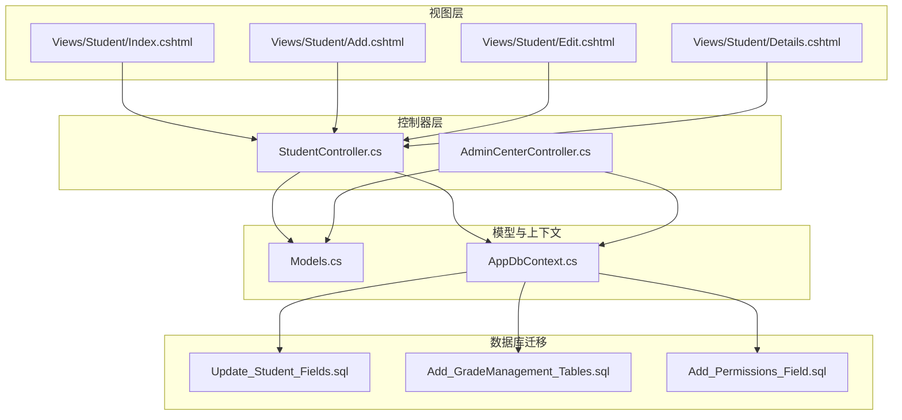
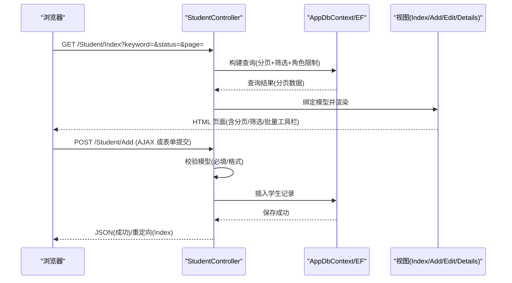
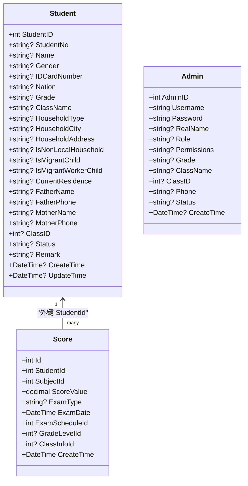
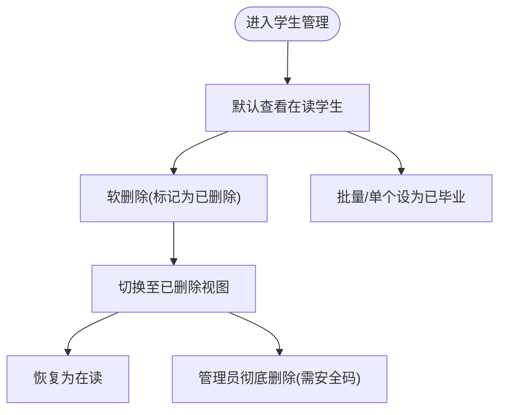
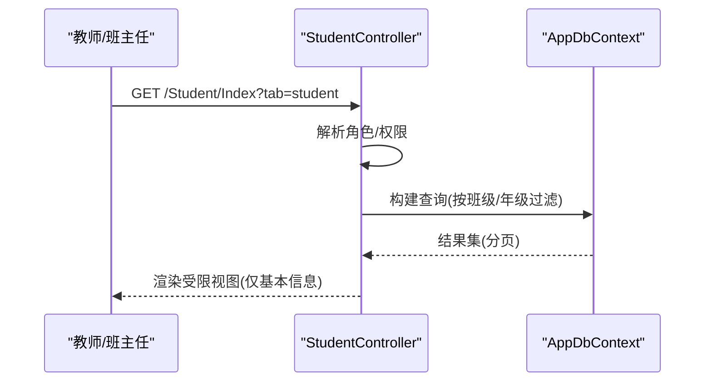
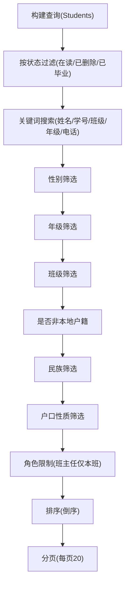
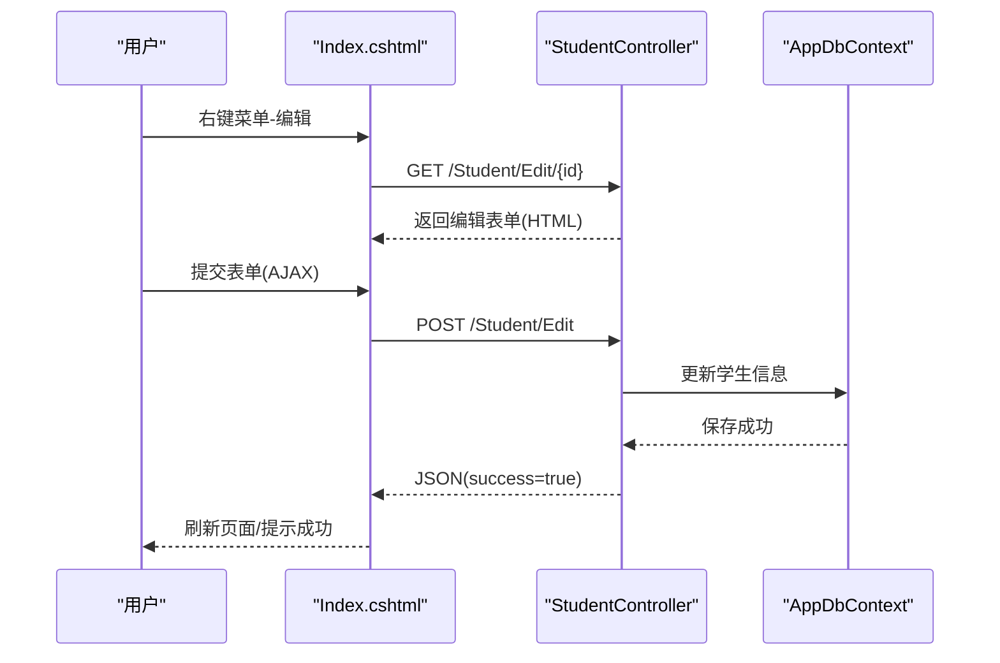
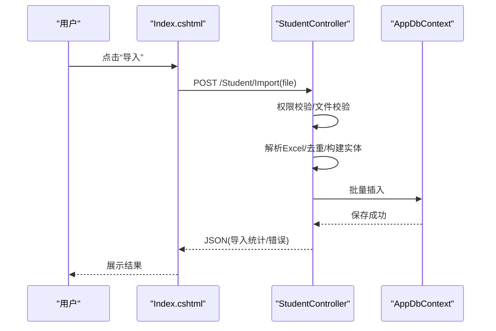
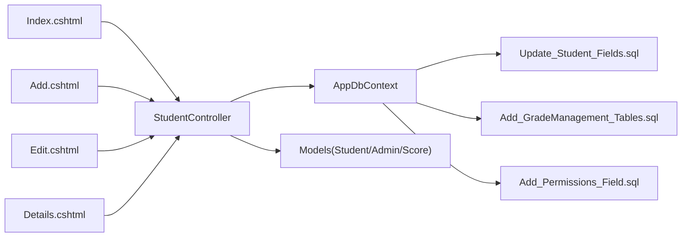

# 学生信息管理

<cite>
**本文引用的文件**
- [Controllers/StudentController.cs](file://Controllers/StudentController.cs)
- [Models/Models.cs](file://Models/Models.cs)
- [Data/AppDbContext.cs](file://Data/AppDbContext.cs)
- [Views/Student/Index.cshtml](file://Views/Student/Index.cshtml)
- [Views/Student/Add.cshtml](file://Views/Student/Add.cshtml)
- [Views/Student/Edit.cshtml](file://Views/Student/Edit.cshtml)
- [Views/Student/Details.cshtml](file://Views/Student/Details.cshtml)
- [Database/Update_Student_Fields.sql](file://Database/Update_Student_Fields.sql)
- [Database/Add_GradeManagement_Tables.sql](file://Database/Add_GradeManagement_Tables.sql)
- [Database/Add_Permissions_Field.sql](file://Database/Add_Permissions_Field.sql)
- [Controllers/AdminCenterController.cs](file://Controllers/AdminCenterController.cs)
- [Views/AdminCenter/StudentPermissions.cshtml](file://Views/AdminCenter/StudentPermissions.cshtml)
</cite>

## 目录
1. [简介](#简介)
2. [项目结构](#项目结构)
3. [核心组件](#核心组件)
4. [架构总览](#架构总览)
5. [详细组件分析](#详细组件分析)
6. [依赖关系分析](#依赖关系分析)
7. [性能考虑](#性能考虑)
8. [故障排查指南](#故障排查指南)
9. [结论](#结论)
10. [附录](#附录)

## 简介
本模块围绕“学生信息管理”展开，覆盖学生基本信息维护（增删改查）、批量导入导出、软删除与恢复、状态管理（在读、已删除、已毕业等）、权限控制（管理员、班主任、普通教师）、分页查询与多条件筛选、AJAX 异步交互、Excel 模板下载与批量导入、数据导出等完整能力。本文档基于实际源码进行分析，提供架构、数据模型、业务流程、权限与错误处理、性能优化建议等内容。

## 项目结构
- 控制器层：集中于 Controllers/StudentController.cs，负责路由、鉴权、业务编排、数据校验、导入导出、软/硬删除、批量操作等。
- 模型层：Models/Models.cs 定义实体模型（Student、Admin、Score 等）及 EF 映射配置。
- 数据访问层：Data/AppDbContext.cs 提供 EF 上下文与实体映射。
- 视图层：Views/Student/* 提供列表、新增、编辑、详情、导入导出等页面与交互。
- 数据库迁移：Database/* 提供字段扩展、班级管理表、权限字段等迁移脚本。

图表来源
- [Controllers/StudentController.cs:12-997](file://Controllers/StudentController.cs#L12-L997)
- [Models/Models.cs:88-165](file://Models/Models.cs#L88-L165)
- [Data/AppDbContext.cs:10-295](file://Data/AppDbContext.cs#L10-L295)
- [Views/Student/Index.cshtml:1-1030](file://Views/Student/Index.cshtml#L1-L1030)
- [Views/Student/Add.cshtml:1-210](file://Views/Student/Add.cshtml#L1-L210)
- [Views/Student/Edit.cshtml:1-225](file://Views/Student/Edit.cshtml#L1-L225)
- [Views/Student/Details.cshtml:1-197](file://Views/Student/Details.cshtml#L1-L197)
- [Database/Update_Student_Fields.sql:1-51](file://Database/Update_Student_Fields.sql#L1-L51)
- [Database/Add_GradeManagement_Tables.sql:1-20](file://Database/Add_GradeManagement_Tables.sql#L1-L20)
- [Database/Add_Permissions_Field.sql:1-44](file://Database/Add_Permissions_Field.sql#L1-L44)

章节来源
- [Controllers/StudentController.cs:12-997](file://Controllers/StudentController.cs#L12-L997)
- [Models/Models.cs:88-165](file://Models/Models.cs#L88-L165)
- [Data/AppDbContext.cs:10-295](file://Data/AppDbContext.cs#L10-L295)

## 核心组件
- 学生控制器（StudentController）：实现学生列表、新增、编辑、详情、删除（软/硬）、恢复、批量操作、导入、导出、AJAX 异步交互、权限与角色控制。
- 实体模型（Student、Admin、Score 等）：定义字段、长度约束、枚举化状态、外键关系。
- EF 上下文（AppDbContext）：配置实体表映射、索引、级联删除策略。
- 视图（Index/Add/Edit/Details）：提供搜索、筛选、分页、批量工具栏、导入导出、AJAX 弹窗与右键菜单。
- 权限与角色：管理员、班主任、普通教师；权限位（如 student_add、student_edit、student_delete）；后台批量权限管理页面。

章节来源
- [Controllers/StudentController.cs:22-997](file://Controllers/StudentController.cs#L22-L997)
- [Models/Models.cs:88-165](file://Models/Models.cs#L88-L165)
- [Data/AppDbContext.cs:30-295](file://Data/AppDbContext.cs#L30-L295)
- [Views/Student/Index.cshtml:1-1030](file://Views/Student/Index.cshtml#L1-L1030)
- [Views/Student/Add.cshtml:1-210](file://Views/Student/Add.cshtml#L1-L210)
- [Views/Student/Edit.cshtml:1-225](file://Views/Student/Edit.cshtml#L1-L225)
- [Views/Student/Details.cshtml:1-197](file://Views/Student/Details.cshtml#L1-L197)

## 架构总览
系统采用经典的 MVC 架构，控制器负责接收请求、组装查询条件、调用仓储（EF）执行数据库操作、返回视图或 JSON；模型定义数据结构与约束；视图负责展示与交互；数据库迁移脚本保证表结构演进。

图表来源
- [Controllers/StudentController.cs:22-335](file://Controllers/StudentController.cs#L22-L335)
- [Views/Student/Index.cshtml:254-512](file://Views/Student/Index.cshtml#L254-L512)
- [Views/Student/Add.cshtml:15-182](file://Views/Student/Add.cshtml#L15-L182)

## 详细组件分析

### 数据模型与状态管理
- 学生实体（Student）包含基础信息（学号、姓名、性别、民族、身份证号）、家庭与户籍信息（户口性质、户口所在地、现居住地址、是否非本地户籍、随迁子女、进城务工子女）、家长信息（父亲/母亲姓名与电话）、班级与状态（Grade、ClassName、Status）、备注与时间戳（Remark、CreateTime、UpdateTime）。
- 状态字段（Status）支持多种值，如“在读”、“已删除”、“已毕业”等，用于区分不同生命周期阶段。
- Admin 实体包含角色（Role）、权限（Permissions，逗号分隔）、班级/年级归属等，支撑角色与权限控制。
- EF 映射在 AppDbContext 中完成，确保字段名、类型、长度与约束一致。

图表来源
- [Models/Models.cs:88-165](file://Models/Models.cs#L88-L165)
- [Models/Models.cs:6-86](file://Models/Models.cs#L6-L86)
- [Models/Models.cs:314-358](file://Models/Models.cs#L314-L358)
- [Data/AppDbContext.cs:50-78](file://Data/AppDbContext.cs#L50-L78)
- [Data/AppDbContext.cs:174-224](file://Data/AppDbContext.cs#L174-L224)

章节来源
- [Models/Models.cs:88-165](file://Models/Models.cs#L88-L165)
- [Data/AppDbContext.cs:50-78](file://Data/AppDbContext.cs#L50-L78)

### 学生状态管理与软删除机制
- 软删除：将 Status 设为“已删除”，不在默认列表中显示，可在“已删除”标签页查看并恢复。
- 恢复：将 Status 恢复为“在读”。
- 硬删除：管理员凭安全码执行物理删除，仅管理员可见入口。
- 已毕业：通过批量操作或直接编辑将状态设为“已毕业”。

图表来源
- [Controllers/StudentController.cs:487-540](file://Controllers/StudentController.cs#L487-L540)
- [Views/Student/Index.cshtml:334-341](file://Views/Student/Index.cshtml#L334-L341)

章节来源
- [Controllers/StudentController.cs:487-540](file://Controllers/StudentController.cs#L487-L540)
- [Views/Student/Index.cshtml:334-341](file://Views/Student/Index.cshtml#L334-L341)

### 权限控制与角色划分
- 角色：管理员、班主任、普通教师。
- 权限位：student_add、student_edit、student_delete 等；通过 Admin.Permissions 逗号分隔存储。
- 角色限制：
  - 班主任仅能查看/编辑/导入本班学生，导出也受限制。
  - 非班主任/非管理员仅显示基本信息。
  - 后台提供批量权限管理页面，管理员可为班主任设置学生相关权限。
- AJAX 请求通过 X-Requested-With 头识别，便于前后端分离交互。

图表来源
- [Controllers/StudentController.cs:22-264](file://Controllers/StudentController.cs#L22-L264)
- [Views/Student/Index.cshtml:35-76](file://Views/Student/Index.cshtml#L35-L76)

章节来源
- [Controllers/StudentController.cs:22-264](file://Controllers/StudentController.cs#L22-L264)
- [Views/Student/Index.cshtml:35-76](file://Views/Student/Index.cshtml#L35-L76)
- [Database/Add_Permissions_Field.sql:1-44](file://Database/Add_Permissions_Field.sql#L1-L44)
- [Controllers/AdminCenterController.cs:262-289](file://Controllers/AdminCenterController.cs#L262-L289)
- [Views/AdminCenter/StudentPermissions.cshtml:1-117](file://Views/AdminCenter/StudentPermissions.cshtml#L1-L117)

### 分页查询与多条件筛选
- 分页：每页固定 20 条，支持页码切换。
- 筛选：关键词（姓名/学号/班级/年级/民族/家长电话）、性别、年级、班级、是否非本地户籍、民族、户口性质等。
- 角色限制：班主任仅能看到本班学生；非班主任/非管理员仅显示基本信息。
- AJAX：支持局部刷新与异步提交，提升交互体验。

图表来源
- [Controllers/StudentController.cs:112-222](file://Controllers/StudentController.cs#L112-L222)
- [Views/Student/Index.cshtml:254-331](file://Views/Student/Index.cshtml#L254-L331)

章节来源
- [Controllers/StudentController.cs:112-222](file://Controllers/StudentController.cs#L112-L222)
- [Views/Student/Index.cshtml:254-331](file://Views/Student/Index.cshtml#L254-L331)

### AJAX 异步操作与交互
- 右键菜单：编辑、查看、删除、恢复、彻底删除（管理员）。
- 弹窗：编辑/添加/查看使用模态框，支持异步加载与提交。
- 导入：弹窗上传 Excel，异步导入并返回进度与结果。
- 批量操作：批量转班、批量毕业、批量删除、批量恢复。

图表来源
- [Views/Student/Index.cshtml:675-782](file://Views/Student/Index.cshtml#L675-L782)
- [Controllers/StudentController.cs:337-454](file://Controllers/StudentController.cs#L337-L454)

章节来源
- [Views/Student/Index.cshtml:675-782](file://Views/Student/Index.cshtml#L675-L782)
- [Controllers/StudentController.cs:337-454](file://Controllers/StudentController.cs#L337-L454)

### Excel 模板下载、批量导入与导出
- 下载模板：生成标准列头（学号、姓名、性别、民族、身份证号、年级、班级、状态、户口性质、户口所在地、户口地址、是否非本地户籍、随迁子女、进城务工子女、现居住地址、父亲姓名、父亲电话、母亲姓名、母亲电话、备注），返回 Excel 文件。
- 批量导入：校验权限（班主任无导入权限，或需具备 student_add 权限），读取 Excel，逐行解析，去重（依据在读学号集合），插入数据库，返回导入统计与错误明细。
- 批量导出：根据筛选条件（状态、性别、年级、班级、是否非本地户籍、民族、户口性质、关键词）生成导出数据，班主任仅能导出本班。

图表来源
- [Controllers/StudentController.cs:575-701](file://Controllers/StudentController.cs#L575-L701)
- [Views/Student/Index.cshtml:515-557](file://Views/Student/Index.cshtml#L515-L557)

章节来源
- [Controllers/StudentController.cs:575-701](file://Controllers/StudentController.cs#L575-L701)
- [Views/Student/Index.cshtml:515-557](file://Views/Student/Index.cshtml#L515-L557)

### API 接口概览
- GET /Student/Index：分页与筛选查询，支持 tab（student/grade/class/teaching）与多条件筛选。
- GET /Student/Details/{id}：详情（受限视图仅基本信息）。
- GET /Student/GetClassesByGrade/{id} 与 GET /Student/GetClassesByGradeName/{name}：级联班级下拉。
- POST /Student/Add：新增学生（支持 AJAX）。
- POST /Student/Edit/{id}：编辑学生（支持 AJAX）。
- POST /Student/Delete/{id}：软删除。
- POST /Student/Restore/{id}：恢复。
- POST /Student/HardDelete/{id}?securityCode=：管理员彻底删除。
- POST /Student/BatchTransfer：批量转班。
- POST /Student/BatchGraduate：批量毕业。
- POST /Student/BatchDelete：批量删除。
- POST /Student/BatchRestore：批量恢复。
- POST /Student/Import：批量导入。
- GET /Student/DownloadTemplate：下载导入模板。
- GET /Student/Export：导出当前筛选条件下的数据。

章节来源
- [Controllers/StudentController.cs:22-997](file://Controllers/StudentController.cs#L22-L997)
- [Views/Student/Index.cshtml:1-1030](file://Views/Student/Index.cshtml#L1-L1030)

### 错误处理机制
- 参数校验：ModelState.AddModelError 用于必填字段与格式校验；AJAX 返回 JSON 包含错误消息。
- 权限校验：无权限时返回明确提示；班主任无导入权限；硬删除需管理员与安全码。
- 导入异常：捕获解析异常，记录错误行号与原因，返回汇总结果。
- AJAX 失败：前端统一处理 .fail，提示网络错误。
- 视图受限：非管理员/非班主任仅显示基本信息，避免敏感字段泄露。

章节来源
- [Controllers/StudentController.cs:304-335](file://Controllers/StudentController.cs#L304-L335)
- [Controllers/StudentController.cs:575-701](file://Controllers/StudentController.cs#L575-L701)
- [Views/Student/Index.cshtml:733-753](file://Views/Student/Index.cshtml#L733-L753)

## 依赖关系分析
- 控制器依赖 EF 上下文与模型，视图依赖控制器输出的数据模型。
- 权限与角色通过 Claims 与 Admin 表字段组合判断。
- 数据库迁移脚本驱动表结构演进，确保字段与模型一致。

图表来源
- [Controllers/StudentController.cs:15-20](file://Controllers/StudentController.cs#L15-L20)
- [Data/AppDbContext.cs:10-295](file://Data/AppDbContext.cs#L10-L295)
- [Models/Models.cs:88-165](file://Models/Models.cs#L88-L165)
- [Database/Update_Student_Fields.sql:1-51](file://Database/Update_Student_Fields.sql#L1-L51)
- [Database/Add_GradeManagement_Tables.sql:1-20](file://Database/Add_GradeManagement_Tables.sql#L1-L20)
- [Database/Add_Permissions_Field.sql:1-44](file://Database/Add_Permissions_Field.sql#L1-L44)

章节来源
- [Controllers/StudentController.cs:15-20](file://Controllers/StudentController.cs#L15-L20)
- [Data/AppDbContext.cs:10-295](file://Data/AppDbContext.cs#L10-L295)
- [Models/Models.cs:88-165](file://Models/Models.cs#L88-L165)

## 性能考虑
- 分页与排序：固定每页大小，避免一次性加载大量数据；使用 Skip/Take 进行服务端分页。
- 查询优化：按需拼接筛选条件，避免不必要的 OR 条件；对常用筛选字段建立数据库索引（如学号、姓名、班级、年级）。
- AJAX 异步：减少页面整体刷新，提升交互响应速度。
- 导入批处理：批量插入后一次性 SaveChanges，降低往返次数。
- 视图简化：受限视图仅渲染必要字段，缩短渲染时间。
- 数据库迁移：确保字段长度与约束与模型一致，避免运行时转换开销。

## 故障排查指南
- 登录失败：检查验证码、时间同步、账户是否存在与状态。
- 导入失败：确认文件格式（.xlsx/.xls）、列顺序与模板一致；查看返回的错误行号与原因。
- 无导入权限：确认角色为管理员或具备 student_add 权限；班主任无导入权限。
- 班主任看不到学生：确认其 ClassID 与班级是否正确绑定；未分配班级将看不到任何学生。
- AJAX 失败：检查 X-Requested-With 头是否正确传递；查看浏览器网络面板与控制台错误。
- 硬删除失败：确认安全码正确且当前用户为管理员。

章节来源
- [Controllers/StudentController.cs:575-701](file://Controllers/StudentController.cs#L575-L701)
- [Views/Student/Index.cshtml:733-753](file://Views/Student/Index.cshtml#L733-L753)

## 结论
本模块通过清晰的角色与权限体系、完善的软删除与状态管理、灵活的分页与筛选、丰富的 AJAX 交互与批量操作，以及标准化的 Excel 导入导出流程，实现了稳定可靠的学生信息管理能力。结合数据库迁移脚本与 EF 映射，系统具备良好的可维护性与扩展性。

## 附录
- 数据库迁移要点
  - 学生表字段扩展：删除冗余字段、重命名字段、新增户籍与随迁相关字段。
  - 班级管理表：GradeLevel 与 ClassInfo，支持年级-班级层级。
  - 权限字段：Admins 表增加 Permissions 字段，并为现有班主任初始化权限。

章节来源
- [Database/Update_Student_Fields.sql:1-51](file://Database/Update_Student_Fields.sql#L1-L51)
- [Database/Add_GradeManagement_Tables.sql:1-20](file://Database/Add_GradeManagement_Tables.sql#L1-L20)
- [Database/Add_Permissions_Field.sql:1-44](file://Database/Add_Permissions_Field.sql#L1-L44)