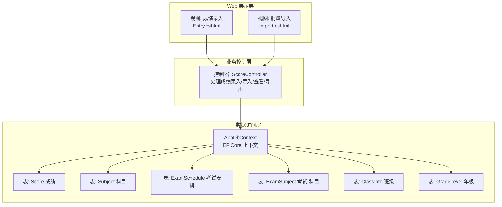
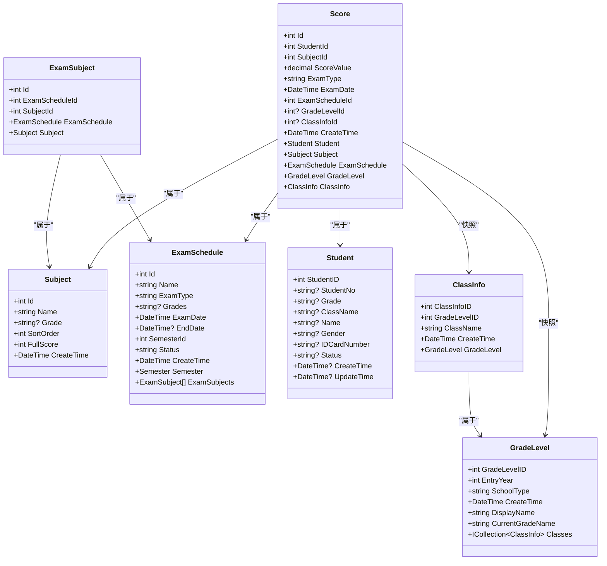
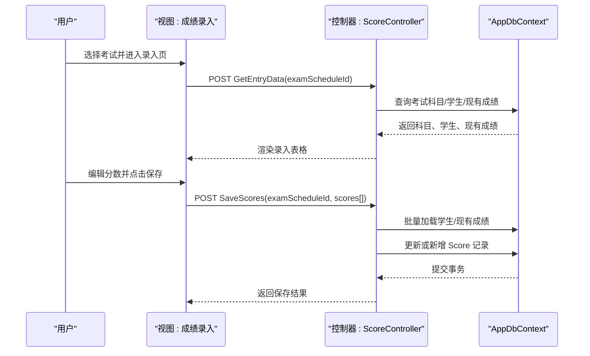
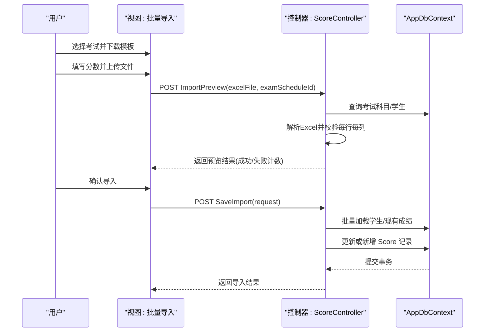
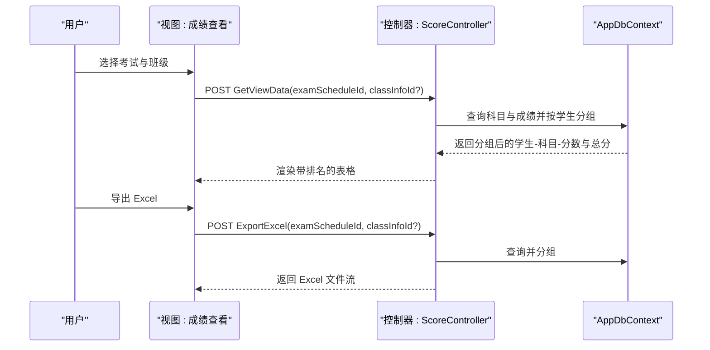
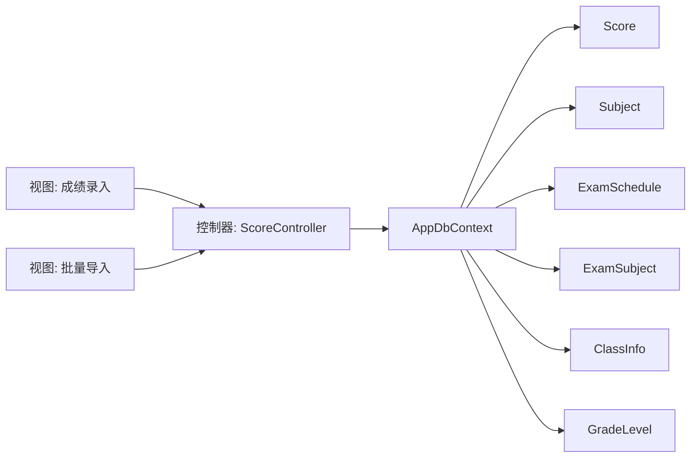

# 成绩管理系统

<cite>
**本文引用的文件**
- [Controllers/ScoreController.cs](file://Controllers/ScoreController.cs)
- [Views/Score/Entry.cshtml](file://Views/Score/Entry.cshtml)
- [Views/Score/Import.cshtml](file://Views/Score/Import.cshtml)
- [Models/Models.cs](file://Models/Models.cs)
- [Models/ExamSchedule.cs](file://Models/ExamSchedule.cs)
- [Models/GradeModels.cs](file://Models/GradeModels.cs)
- [Data/AppDbContext.cs](file://Data/AppDbContext.cs)
- [appsettings.json](file://appsettings.json)
- [Database/Add_GradeManagement_Tables.sql](file://Database/Add_GradeManagement_Tables.sql)
- [Database/Create_Announcement_Tables.sql](file://Database/Create_Announcement_Tables.sql)
</cite>

## 目录
1. [简介](#简介)
2. [项目结构](#项目结构)
3. [核心组件](#核心组件)
4. [架构总览](#架构总览)
5. [详细组件分析](#详细组件分析)
6. [依赖关系分析](#依赖关系分析)
7. [性能考虑](#性能考虑)
8. [故障排查指南](#故障排查指南)
9. [结论](#结论)
10. [附录](#附录)

## 简介
本文件面向“成绩管理系统”的开发与运维人员，系统性梳理成绩录入、批量导入、统计分析、报表生成、数据模型、权限控制、导入导出流程及性能优化策略。文档以控制器、视图、模型与数据库上下文为核心，结合数据库脚本与配置文件，形成端到端的技术说明。

## 项目结构
系统采用经典的三层架构（Web层、业务层、数据访问层），围绕“成绩”这一核心领域对象展开，配合“考试安排-科目-学生-班级-年级”等关联实体，支撑完整的教学成绩生命周期管理。

**图表来源**
- [Controllers/ScoreController.cs:11-620](file://Controllers/ScoreController.cs#L11-L620)
- [Views/Score/Entry.cshtml:1-226](file://Views/Score/Entry.cshtml#L1-L226)
- [Views/Score/Import.cshtml:1-253](file://Views/Score/Import.cshtml#L1-L253)
- [Data/AppDbContext.cs:6-295](file://Data/AppDbContext.cs#L6-L295)

**章节来源**
- [Controllers/ScoreController.cs:11-620](file://Controllers/ScoreController.cs#L11-L620)
- [Data/AppDbContext.cs:6-295](file://Data/AppDbContext.cs#L6-L295)

## 核心组件
- 控制器：负责接收请求、调用数据访问、组装响应；实现成绩录入、批量导入、查看、导出等功能。
- 视图：提供录入表单与导入流程界面，支持模板下载、预览、确认导入。
- 数据模型：定义成绩、科目、考试安排、班级与年级等实体及其关系。
- 数据上下文：配置实体映射、索引与外键约束，确保数据一致性与查询效率。

**章节来源**
- [Controllers/ScoreController.cs:11-620](file://Controllers/ScoreController.cs#L11-L620)
- [Views/Score/Entry.cshtml:1-226](file://Views/Score/Entry.cshtml#L1-L226)
- [Views/Score/Import.cshtml:1-253](file://Views/Score/Import.cshtml#L1-L253)
- [Models/Models.cs:295-358](file://Models/Models.cs#L295-L358)
- [Models/ExamSchedule.cs:6-47](file://Models/ExamSchedule.cs#L6-L47)
- [Models/GradeModels.cs:6-100](file://Models/GradeModels.cs#L6-L100)
- [Data/AppDbContext.cs:204-252](file://Data/AppDbContext.cs#L204-L252)

## 架构总览
系统围绕“考试安排”组织一次成绩周期，一个考试安排可关联多个科目，覆盖若干年级，从而影响参与考试的学生范围。成绩实体记录学生在某次考试中的各科分数，并快照其当时所在班级与年级，便于后续统计分析。

**图表来源**
- [Models/Models.cs:295-358](file://Models/Models.cs#L295-L358)
- [Models/ExamSchedule.cs:6-47](file://Models/ExamSchedule.cs#L6-L47)
- [Models/GradeModels.cs:6-100](file://Models/GradeModels.cs#L6-L100)

## 详细组件分析

### 成绩录入（手动录入）
- 功能要点
  - 选择考试安排，加载该考试覆盖的科目与符合条件的学生列表。
  - 支持按行编辑分数，自动校验输入范围（0~科目满分）。
  - 批量保存，支持增量更新与新增记录。
- 关键流程（序列图）

**图表来源**
- [Controllers/ScoreController.cs:32-157](file://Controllers/ScoreController.cs#L32-L157)
- [Views/Score/Entry.cshtml:69-219](file://Views/Score/Entry.cshtml#L69-L219)

**章节来源**
- [Controllers/ScoreController.cs:32-157](file://Controllers/ScoreController.cs#L32-L157)
- [Views/Score/Entry.cshtml:69-219](file://Views/Score/Entry.cshtml#L69-L219)

### 批量导入（Excel 模板）
- 功能要点
  - 下载模板：包含学号、姓名、年级、班级与各科分数列，注释提示各科满分。
  - 预览：读取 Excel，按科目逐列校验分数格式与范围，标注错误行。
  - 导入：确认后提交，批量更新或新增成绩记录。
- 关键流程（序列图）

**图表来源**
- [Controllers/ScoreController.cs:350-590](file://Controllers/ScoreController.cs#L350-L590)
- [Views/Score/Import.cshtml:99-246](file://Views/Score/Import.cshtml#L99-L246)

**章节来源**
- [Controllers/ScoreController.cs:350-590](file://Controllers/ScoreController.cs#L350-L590)
- [Views/Score/Import.cshtml:99-246](file://Views/Score/Import.cshtml#L99-L246)

### 成绩查看与导出
- 功能要点
  - 按考试筛选，按班级过滤，按总分排序并生成排名。
  - 导出 Excel：按科目顺序输出，包含总分列。
- 关键流程（序列图）

**图表来源**
- [Controllers/ScoreController.cs:159-348](file://Controllers/ScoreController.cs#L159-L348)

**章节来源**
- [Controllers/ScoreController.cs:159-348](file://Controllers/ScoreController.cs#L159-L348)

### 数据模型设计
- Score 实体
  - 字段：学生、科目、考试安排、分数、考试类型与日期、创建时间、班级与年级快照。
  - 约束：唯一索引（学生+科目+考试安排）避免重复录入。
- Subject 实体
  - 字段：名称、适用年级、排序、满分、创建时间。
- ExamSchedule 实体
  - 字段：名称、类型、适用年级集合、开始/结束日期、学期、状态、创建时间。
  - 关系：一对多（ExamSubjects）。
- ExamSubject 实体
  - 关联考试安排与科目，唯一索引保证不重复。
- ClassInfo 与 GradeLevel 实体
  - 班级归属年级，年级提供“当前年级名”计算逻辑。
- 映射与索引
  - EF Core 在 OnModelCreating 中完成表名、字段名、外键与索引配置。

**章节来源**
- [Models/Models.cs:295-358](file://Models/Models.cs#L295-L358)
- [Models/ExamSchedule.cs:6-47](file://Models/ExamSchedule.cs#L6-L47)
- [Models/GradeModels.cs:6-100](file://Models/GradeModels.cs#L6-L100)
- [Data/AppDbContext.cs:204-252](file://Data/AppDbContext.cs#L204-L252)

### 权限控制机制
- 角色与声明
  - 登录后在 Claims 中携带角色与扩展信息（例如 AdminID）。
  - 控制器方法使用 Authorize 特性保护，部分操作通过 IsAdmin 与 GetAdminId 辅助判断。
- 在线输分权限
  - SubjectTeacher 关联“科目-教师-班级”，用于限定教师仅能查看/编辑其任教班级的科目数据。
- 建议
  - 对敏感操作增加更细粒度的授权策略（如基于 ExamSchedule 的覆盖范围与班级范围）。

**章节来源**
- [Controllers/ScoreController.cs:21-29](file://Controllers/ScoreController.cs#L21-L29)
- [Models/Models.cs:360-381](file://Models/Models.cs#L360-L381)

### 成绩统计分析
- 班级平均分
  - 按班级分组，计算各科与总分均值。
- 年级排名
  - 按考试安排聚合学生总分，生成排名序列。
- 科目分析
  - 统计各科最高分、最低分、平均分、不及格人数等。
- 成绩分布统计
  - 按分数区间（如 0-59、60-69、...）统计人数分布。
- 复杂度与实现建议
  - 使用 GroupBy 与聚合函数一次性完成统计，避免 N+1 查询。
  - 对大表建议建立复合索引与物化视图（数据库层面）。

**章节来源**
- [Controllers/ScoreController.cs:199-226](file://Controllers/ScoreController.cs#L199-L226)

### 报表生成
- 成绩单打印
  - 导出 Excel，包含排名、学号、姓名、各科分数与总分。
- 成绩汇总表
  - 可按班级/年级/科目维度汇总。
- 各科成绩对比图表
  - 建议前端使用图表库展示柱状图/箱线图，数据来源于后端聚合接口。

**章节来源**
- [Controllers/ScoreController.cs:277-348](file://Controllers/ScoreController.cs#L277-L348)

### 导入导出流程与数据转换规则
- Excel 模板规范
  - 必填列：序号、学号、姓名、年级、班级。
  - 科目列：按考试安排中科目顺序排列，单元格注释提示满分。
- 数据转换规则
  - 学号+姓名匹配学生；空值表示缺考；分数格式错误或超出满分标记错误。
  - 保存时区分更新与新增，按“学生ID+科目ID+考试安排ID”去重。
- 安全与校验
  - 服务端二次校验，防止前端绕过；对空文件与空行进行容错处理。

**章节来源**
- [Controllers/ScoreController.cs:362-590](file://Controllers/ScoreController.cs#L362-L590)
- [Views/Score/Import.cshtml:99-246](file://Views/Score/Import.cshtml#L99-L246)

## 依赖关系分析
- 控制器依赖数据上下文进行查询与持久化。
- 视图通过 AJAX 与控制器交互，减少页面刷新。
- 数据模型与上下文映射决定查询路径与性能表现。
- 数据库脚本定义基础表结构，迁移文件补充字段与索引。

**图表来源**
- [Controllers/ScoreController.cs:11-620](file://Controllers/ScoreController.cs#L11-L620)
- [Data/AppDbContext.cs:6-295](file://Data/AppDbContext.cs#L6-L295)

**章节来源**
- [Controllers/ScoreController.cs:11-620](file://Controllers/ScoreController.cs#L11-L620)
- [Data/AppDbContext.cs:6-295](file://Data/AppDbContext.cs#L6-L295)

## 性能考虑
- 查询优化
  - 使用 Include/ThenInclude 减少 N+1；对高频查询建立复合索引（如 Score 的学生+科目+考试安排）。
- 批量操作
  - SaveChanges 调用前合并多次插入/更新，减少往返次数。
- 前端体验
  - 录入表按需渲染，限制最大高度；导入预览分页或虚拟滚动。
- 缓存策略
  - 考试科目与班级列表短期缓存；成绩快照（班级/年级ID）降低关联查询成本。
- 数据库脚本
  - 基础表结构由脚本初始化，迁移文件补充字段与索引，确保查询性能。

**章节来源**
- [Data/AppDbContext.cs:204-252](file://Data/AppDbContext.cs#L204-L252)
- [Database/Add_GradeManagement_Tables.sql:1-20](file://Database/Add_GradeManagement_Tables.sql#L1-L20)
- [Database/Create_Announcement_Tables.sql:1-31](file://Database/Create_Announcement_Tables.sql#L1-L31)

## 故障排查指南
- 常见问题
  - 无法加载考试科目：检查 ExamSchedule 是否关联 ExamSubject。
  - 学生找不到：确认学号与姓名一致，且状态为在读。
  - 分数越界：检查科目 FullScore 设置与输入范围。
  - 导入失败：确认文件格式为 .xlsx/.xls，模板列顺序正确。
- 日志与配置
  - 日志级别在 appsettings.json 中配置；连接字符串指向 MySQL。
- 建议
  - 对异常场景返回明确错误消息；对关键操作记录操作日志。

**章节来源**
- [Controllers/ScoreController.cs:44-521](file://Controllers/ScoreController.cs#L44-L521)
- [appsettings.json:1-16](file://appsettings.json#L1-L16)

## 结论
本系统围绕“考试安排—科目—学生—成绩”构建了完整的成绩管理闭环，具备手动录入、批量导入、统计分析与报表导出能力。通过清晰的模型设计、严格的权限控制与可扩展的性能策略，满足日常教学管理需求。建议后续增强可视化分析与移动端适配，持续优化大数据量下的查询与缓存策略。

## 附录
- 数据库初始化与脚本
  - 年级与班级基础表：Add_GradeManagement_Tables.sql
  - 公告相关表：Create_Announcement_Tables.sql
- 运行环境
  - 连接字符串与日志配置位于 appsettings.json

**章节来源**
- [Database/Add_GradeManagement_Tables.sql:1-20](file://Database/Add_GradeManagement_Tables.sql#L1-L20)
- [Database/Create_Announcement_Tables.sql:1-31](file://Database/Create_Announcement_Tables.sql#L1-L31)
- [appsettings.json:1-16](file://appsettings.json#L1-L16)