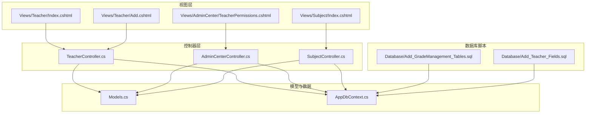
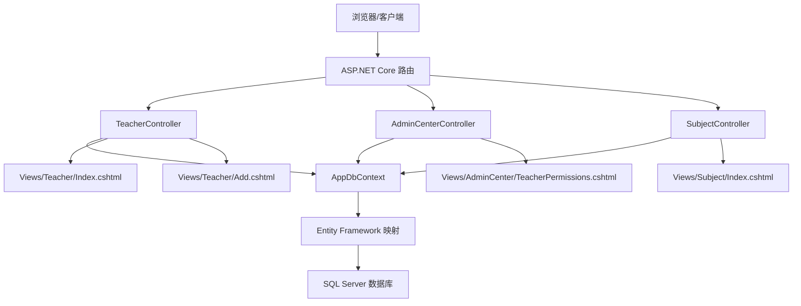
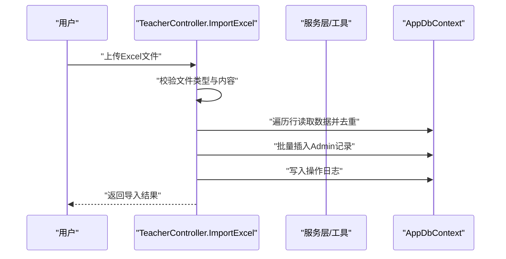
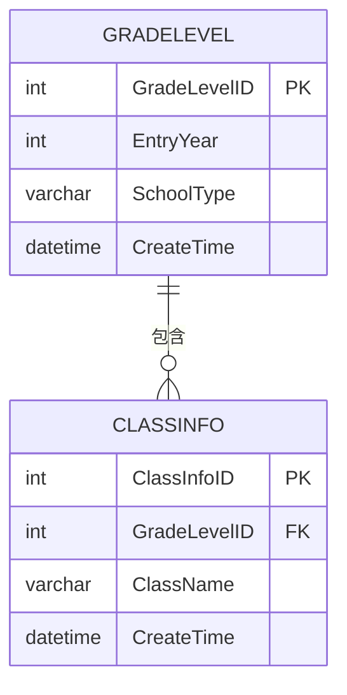
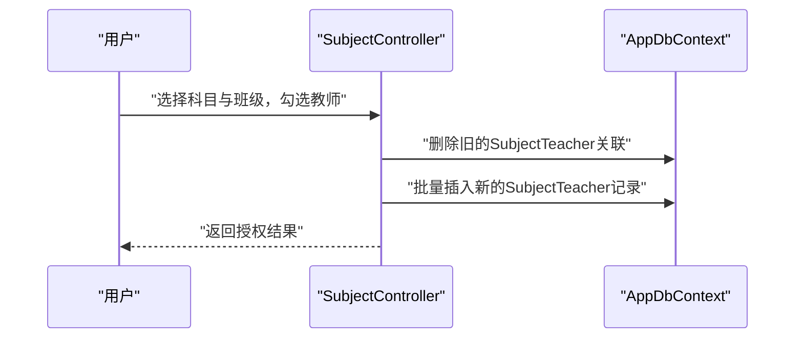
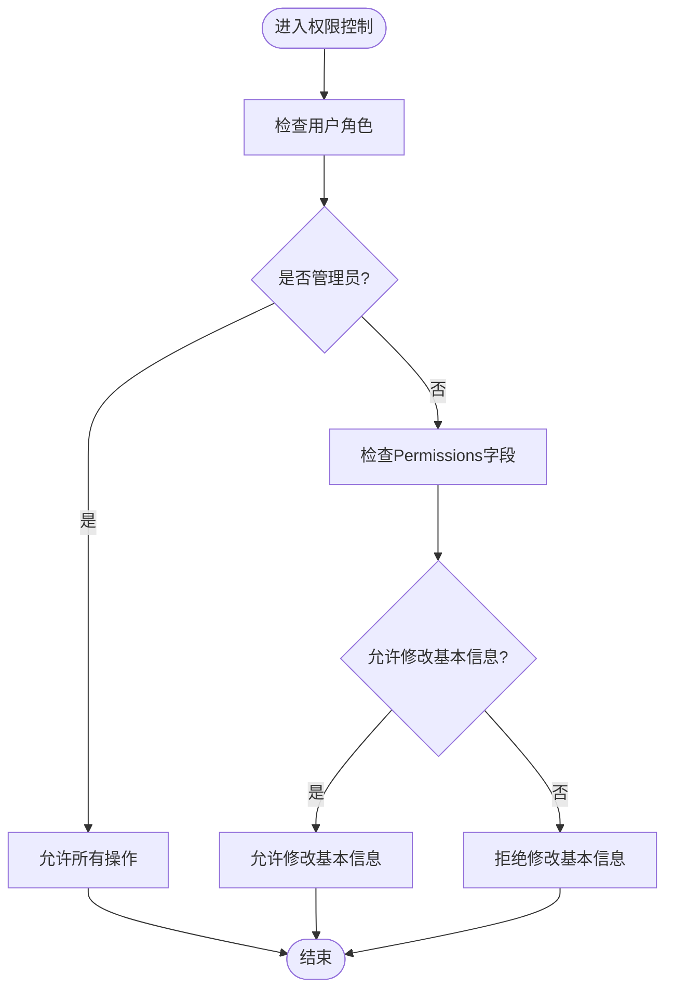
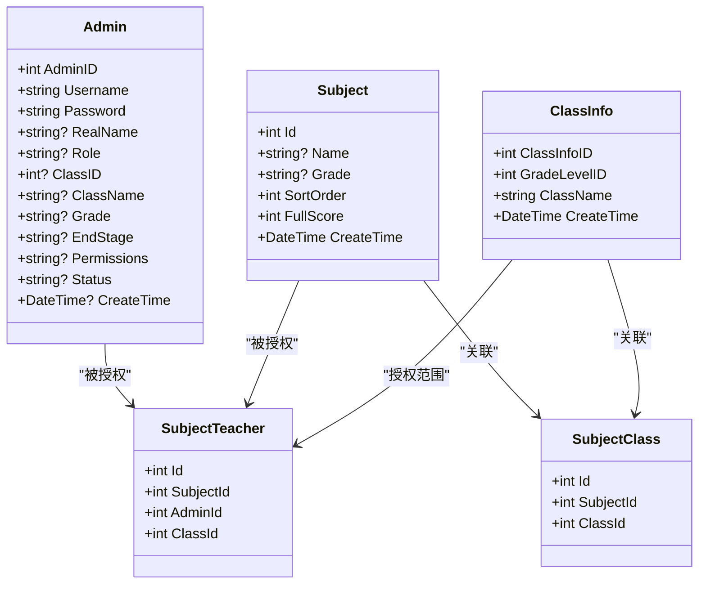
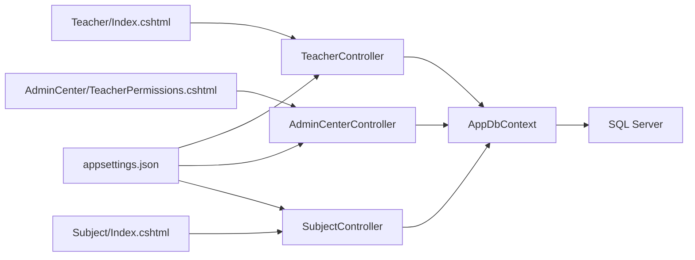

# 教师班级管理

<cite>
**本文档引用的文件**
- [Controllers/TeacherController.cs](file://Controllers/TeacherController.cs)
- [Controllers/AdminCenterController.cs](file://Controllers/AdminCenterController.cs)
- [Controllers/SubjectController.cs](file://Controllers/SubjectController.cs)
- [Models/Models.cs](file://Models/Models.cs)
- [Data/AppDbContext.cs](file://Data/AppDbContext.cs)
- [Views/Teacher/Index.cshtml](file://Views/Teacher/Index.cshtml)
- [Views/Teacher/Add.cshtml](file://Views/Teacher/Add.cshtml)
- [Views/Subject/Index.cshtml](file://Views/Subject/Index.cshtml)
- [Views/AdminCenter/TeacherPermissions.cshtml](file://Views/AdminCenter/TeacherPermissions.cshtml)
- [appsettings.json](file://appsettings.json)
- [Database/Add_GradeManagement_Tables.sql](file://Database/Add_GradeManagement_Tables.sql)
- [Database/Add_Teacher_Fields.sql](file://Database/Add_Teacher_Fields.sql)
</cite>

## 目录
1. [简介](#简介)
2. [项目结构](#项目结构)
3. [核心组件](#核心组件)
4. [架构总览](#架构总览)
5. [详细组件分析](#详细组件分析)
6. [依赖关系分析](#依赖关系分析)
7. [性能考虑](#性能考虑)
8. [故障排除指南](#故障排除指南)
9. [结论](#结论)
10. [附录](#附录)

## 简介
本文件面向“教师班级管理”模块，系统性梳理教师信息管理、班级信息维护、科目管理与权限控制等核心能力，覆盖数据模型设计、控制器逻辑、视图交互与数据库迁移脚本，并提供批量导入导出、报表与安全加固建议。读者可据此快速理解模块职责、调用流程与扩展点。

## 项目结构
- 控制器层：负责路由、鉴权、业务编排与响应输出
  - 教师管理：TeacherController
  - 管理中心：AdminCenterController
  - 科目管理：SubjectController
- 模型与数据上下文：定义实体、关系与EF映射
- 视图层：提供教师管理、科目管理与权限配置的UI
- 数据库脚本：提供班级管理与教师字段的初始化与迁移

**图表来源**
- [Controllers/TeacherController.cs:12-501](file://Controllers/TeacherController.cs#L12-L501)
- [Controllers/AdminCenterController.cs:12-491](file://Controllers/AdminCenterController.cs#L12-L491)
- [Controllers/SubjectController.cs:11-351](file://Controllers/SubjectController.cs#L11-L351)
- [Models/Models.cs:6-463](file://Models/Models.cs#L6-L463)
- [Data/AppDbContext.cs:6-295](file://Data/AppDbContext.cs#L6-L295)
- [Views/Teacher/Index.cshtml:1-720](file://Views/Teacher/Index.cshtml#L1-L720)
- [Views/Teacher/Add.cshtml:1-163](file://Views/Teacher/Add.cshtml#L1-L163)
- [Views/Subject/Index.cshtml:1-566](file://Views/Subject/Index.cshtml#L1-L566)
- [Views/AdminCenter/TeacherPermissions.cshtml:1-124](file://Views/AdminCenter/TeacherPermissions.cshtml#L1-L124)
- [Database/Add_GradeManagement_Tables.sql:1-20](file://Database/Add_GradeManagement_Tables.sql#L1-L20)
- [Database/Add_Teacher_Fields.sql:1-41](file://Database/Add_Teacher_Fields.sql#L1-L41)

**章节来源**
- [Controllers/TeacherController.cs:12-501](file://Controllers/TeacherController.cs#L12-L501)
- [Controllers/AdminCenterController.cs:12-491](file://Controllers/AdminCenterController.cs#L12-L491)
- [Controllers/SubjectController.cs:11-351](file://Controllers/SubjectController.cs#L11-L351)
- [Models/Models.cs:6-463](file://Models/Models.cs#L6-L463)
- [Data/AppDbContext.cs:6-295](file://Data/AppDbContext.cs#L6-L295)
- [Views/Teacher/Index.cshtml:1-720](file://Views/Teacher/Index.cshtml#L1-L720)
- [Views/Teacher/Add.cshtml:1-163](file://Views/Teacher/Add.cshtml#L1-L163)
- [Views/Subject/Index.cshtml:1-566](file://Views/Subject/Index.cshtml#L1-L566)
- [Views/AdminCenter/TeacherPermissions.cshtml:1-124](file://Views/AdminCenter/TeacherPermissions.cshtml#L1-L124)
- [Database/Add_GradeManagement_Tables.sql:1-20](file://Database/Add_GradeManagement_Tables.sql#L1-L20)
- [Database/Add_Teacher_Fields.sql:1-41](file://Database/Add_Teacher_Fields.sql#L1-L41)

## 核心组件
- 教师信息管理
  - 基本信息维护：姓名、性别、民族、出生日期、户口所在地、最高学历、教师资格信息、手机号、创建时间等
  - 角色权限分配：支持班主任、科任教师、年级级长、教务主任、校长等角色
  - 班级管理权限：通过Admin实体中的ClassID/ClassName/Grade字段体现
  - 导入导出：支持CSV与Excel批量导入，Excel模板下载
  - 状态管理：正常/已删除；支持恢复与彻底删除（带安全码）
- 班级信息维护
  - 班级创建：通过GradeLevel与ClassInfo表实现年级与班级的层级关系
  - 年级分配：基于GradeLevel表的EntryYear与SchoolType
  - 班主任指派：通过Admin的ClassID/ClassName/Grade字段关联
  - 班级人数统计：可通过查询ClassInfo与Student关联统计
  - 班级状态管理：通过状态字段与软删除策略实现
- 科目管理
  - 科目设置：名称、适用年级、排序、满分
  - 教师关联：SubjectTeacher按科目与班级维度授权教师
  - 教学任务分配：通过SubjectClass与SubjectTeacher建立科目-班级-教师关系
  - 课时统计：结合Score与ExamSchedule统计教学任务执行情况
- 权限控制
  - 基于角色的访问控制（RBAC）：管理员、班主任、科任教师、年级级长等
  - 个人中心权限：通过Permissions字段细粒度控制基本信息、手机号、身份证、证书等修改权限
  - 操作审计：OperationLog记录管理员操作轨迹

**章节来源**
- [Controllers/TeacherController.cs:22-78](file://Controllers/TeacherController.cs#L22-L78)
- [Controllers/SubjectController.cs:21-61](file://Controllers/SubjectController.cs#L21-L61)
- [Models/Models.cs:6-86](file://Models/Models.cs#L6-L86)
- [Data/AppDbContext.cs:30-295](file://Data/AppDbContext.cs#L30-L295)
- [Views/Teacher/Index.cshtml:48-85](file://Views/Teacher/Index.cshtml#L48-L85)
- [Views/Subject/Index.cshtml:14-79](file://Views/Subject/Index.cshtml#L14-L79)
- [Views/AdminCenter/TeacherPermissions.cshtml:34-77](file://Views/AdminCenter/TeacherPermissions.cshtml#L34-L77)

## 架构总览
系统采用经典的三层架构：控制器负责请求处理与响应，模型封装业务实体，数据上下文负责ORM映射与持久化。权限控制贯穿控制器与视图层，数据库通过脚本与迁移确保结构演进。

**图表来源**
- [Controllers/TeacherController.cs:12-501](file://Controllers/TeacherController.cs#L12-L501)
- [Controllers/AdminCenterController.cs:12-491](file://Controllers/AdminCenterController.cs#L12-L491)
- [Controllers/SubjectController.cs:11-351](file://Controllers/SubjectController.cs#L11-L351)
- [Data/AppDbContext.cs:6-295](file://Data/AppDbContext.cs#L6-L295)
- [Views/Teacher/Index.cshtml:1-720](file://Views/Teacher/Index.cshtml#L1-L720)
- [Views/Teacher/Add.cshtml:1-163](file://Views/Teacher/Add.cshtml#L1-L163)
- [Views/Subject/Index.cshtml:1-566](file://Views/Subject/Index.cshtml#L1-L566)
- [Views/AdminCenter/TeacherPermissions.cshtml:1-124](file://Views/AdminCenter/TeacherPermissions.cshtml#L1-L124)

## 详细组件分析

### 教师信息管理（TeacherController）
- 功能要点
  - 列表检索与筛选：关键词、状态、角色
  - 统计展示：在职总数、班主任、科任教师、年级级长数量
  - CRUD操作：添加、编辑、修改密码、删除（软删）、恢复、彻底删除（安全码）
  - 批量导入：CSV与Excel两种方式；Excel模板下载
  - 操作日志：记录管理员操作行为
- 关键流程（批量导入Excel）

**图表来源**
- [Controllers/TeacherController.cs:387-474](file://Controllers/TeacherController.cs#L387-L474)
- [Data/AppDbContext.cs:10-295](file://Data/AppDbContext.cs#L10-L295)

**章节来源**
- [Controllers/TeacherController.cs:22-386](file://Controllers/TeacherController.cs#L22-L386)
- [Views/Teacher/Index.cshtml:211-386](file://Views/Teacher/Index.cshtml#L211-L386)
- [Views/Teacher/Add.cshtml:1-163](file://Views/Teacher/Add.cshtml#L1-L163)

### 班级信息维护（数据库脚本）
- 年级表（GradeLevel）：记录入学年份与学段类型
- 班级表（ClassInfo）：记录班级名称并外键关联年级
- 外键约束：删除年级时级联删除班级

**图表来源**
- [Database/Add_GradeManagement_Tables.sql:1-20](file://Database/Add_GradeManagement_Tables.sql#L1-L20)
- [Data/AppDbContext.cs:99-112](file://Data/AppDbContext.cs#L99-L112)

**章节来源**
- [Database/Add_GradeManagement_Tables.sql:1-20](file://Database/Add_GradeManagement_Tables.sql#L1-L20)
- [Data/AppDbContext.cs:99-112](file://Data/AppDbContext.cs#L99-L112)

### 科目管理（SubjectController）
- 功能要点
  - 科目列表：名称、适用年级、班级、满分、排序、创建时间
  - 批量新增：支持按科目×年级组合生成多条记录
  - 编辑/删除：支持修改名称、年级、排序、满分；删除前检查是否存在成绩记录
  - 教师授权：按科目与班级维度授权教师（SubjectTeacher）
  - 班级关联：科目与班级的多对多关系（SubjectClass）
- 关键流程（科目教师授权）

**图表来源**
- [Controllers/SubjectController.cs:264-289](file://Controllers/SubjectController.cs#L264-L289)
- [Data/AppDbContext.cs:184-194](file://Data/AppDbContext.cs#L184-L194)

**章节来源**
- [Controllers/SubjectController.cs:21-332](file://Controllers/SubjectController.cs#L21-L332)
- [Views/Subject/Index.cshtml:81-319](file://Views/Subject/Index.cshtml#L81-L319)

### 权限控制机制
- 角色与权限
  - 角色：管理员、班主任、科任教师、年级级长、教务主任、校长
  - 个人中心权限：通过Permissions字段以逗号分隔的键值控制（如profile_basic、profile_phone等）
  - 管理员页面：批量个人中心权限管理（TeacherPermissions.cshtml）
- 安全与审计
  - 操作日志：记录操作人、角色、类型、目标与详情
  - 安全码：彻底删除教师时要求输入安全码
  - 密码策略：管理员可直接修改密码；普通用户需提供旧密码并满足强度规则

**图表来源**
- [Controllers/AdminCenterController.cs:34-151](file://Controllers/AdminCenterController.cs#L34-L151)
- [Views/AdminCenter/TeacherPermissions.cshtml:34-77](file://Views/AdminCenter/TeacherPermissions.cshtml#L34-L77)

**章节来源**
- [Controllers/AdminCenterController.cs:34-337](file://Controllers/AdminCenterController.cs#L34-L337)
- [Views/AdminCenter/TeacherPermissions.cshtml:1-124](file://Views/AdminCenter/TeacherPermissions.cshtml#L1-L124)

### 数据模型设计
- 实体关系
  - Admin：教职工基础信息与角色、班级关联
  - Subject：科目信息
  - SubjectTeacher：科目-教师-班级授权
  - SubjectClass：科目-班级关联
  - ClassInfo：班级信息
  - OperationLog：操作日志
- 关键字段与约束
  - Admin：Role、ClassID、ClassName、Grade、EndStage、Permissions、Status、CreateTime
  - Subject：Name、Grade、SortOrder、FullScore
  - SubjectTeacher：唯一索引(SubjectId, AdminId, ClassId)
  - SubjectClass：唯一索引(SubjectId, ClassId)
  - ClassInfo：GradeLevelID外键级联删除

**图表来源**
- [Models/Models.cs:6-463](file://Models/Models.cs#L6-L463)
- [Data/AppDbContext.cs:30-295](file://Data/AppDbContext.cs#L30-L295)

**章节来源**
- [Models/Models.cs:6-463](file://Models/Models.cs#L6-L463)
- [Data/AppDbContext.cs:30-295](file://Data/AppDbContext.cs#L30-L295)

## 依赖关系分析
- 控制器依赖数据上下文进行CRUD与查询
- 视图依赖控制器提供的模型与分页、筛选参数
- 数据库脚本与迁移确保实体关系与索引一致性
- appsettings.json提供连接字符串与IP限制配置

**图表来源**
- [Controllers/TeacherController.cs:15-20](file://Controllers/TeacherController.cs#L15-L20)
- [Controllers/AdminCenterController.cs:15-20](file://Controllers/AdminCenterController.cs#L15-L20)
- [Controllers/SubjectController.cs:14-19](file://Controllers/SubjectController.cs#L14-L19)
- [Data/AppDbContext.cs:8-295](file://Data/AppDbContext.cs#L8-L295)
- [Views/Teacher/Index.cshtml:1-720](file://Views/Teacher/Index.cshtml#L1-L720)
- [Views/Subject/Index.cshtml:1-566](file://Views/Subject/Index.cshtml#L1-L566)
- [Views/AdminCenter/TeacherPermissions.cshtml:1-124](file://Views/AdminCenter/TeacherPermissions.cshtml#L1-L124)
- [appsettings.json:12-14](file://appsettings.json#L12-L14)

**章节来源**
- [Controllers/TeacherController.cs:15-20](file://Controllers/TeacherController.cs#L15-L20)
- [Controllers/AdminCenterController.cs:15-20](file://Controllers/AdminCenterController.cs#L15-L20)
- [Controllers/SubjectController.cs:14-19](file://Controllers/SubjectController.cs#L14-L19)
- [Data/AppDbContext.cs:8-295](file://Data/AppDbContext.cs#L8-L295)
- [Views/Teacher/Index.cshtml:1-720](file://Views/Teacher/Index.cshtml#L1-L720)
- [Views/Subject/Index.cshtml:1-566](file://Views/Subject/Index.cshtml#L1-L566)
- [Views/AdminCenter/TeacherPermissions.cshtml:1-124](file://Views/AdminCenter/TeacherPermissions.cshtml#L1-L124)
- [appsettings.json:12-14](file://appsettings.json#L12-L14)

## 性能考虑
- 查询优化
  - 列表分页：固定页大小，避免一次性加载大量数据
  - 索引设计：SubjectTeacher与SubjectClass的复合唯一索引减少重复与提升查询效率
- 导入性能
  - Excel批量导入采用流式读取与批量写入，降低内存占用
- 缓存与并发
  - 对常用枚举（如角色、年级）可在控制器侧缓存，减少数据库查询
- 数据库层面
  - 级联删除保证数据一致性，避免孤立记录

[本节为通用指导，无需特定文件引用]

## 故障排除指南
- 导入失败
  - 检查文件格式（CSV/Excel）与表头是否正确
  - 确认用户名唯一性，避免重复导入
- 权限不足
  - 确认当前用户角色是否具备相应操作权限
  - 个人中心权限需在管理员页面批量配置
- 删除异常
  - 彻底删除需输入安全码；软删除后可在已删除视图恢复
- 数据库迁移
  - 班级管理与教师字段需按脚本执行初始化

**章节来源**
- [Controllers/TeacherController.cs:288-359](file://Controllers/TeacherController.cs#L288-L359)
- [Controllers/SubjectController.cs:127-141](file://Controllers/SubjectController.cs#L127-L141)
- [Controllers/AdminCenterController.cs:291-337](file://Controllers/AdminCenterController.cs#L291-L337)
- [Database/Add_GradeManagement_Tables.sql:1-20](file://Database/Add_GradeManagement_Tables.sql#L1-L20)
- [Database/Add_Teacher_Fields.sql:1-41](file://Database/Add_Teacher_Fields.sql#L1-L41)

## 结论
本模块围绕“教师—班级—科目”三者关系构建，通过清晰的控制器职责划分、完善的权限体系与可扩展的数据模型，实现了教师信息管理、班级维护与科目教学任务分配的闭环。配合批量导入导出、操作日志与安全码机制，保障了系统的可用性与安全性。建议在生产环境中持续完善报表统计与监控告警，进一步提升运维效率。

## 附录
- 数据库初始化脚本
  - [Add_GradeManagement_Tables.sql:1-20](file://Database/Add_GradeManagement_Tables.sql#L1-L20)
  - [Add_Teacher_Fields.sql:1-41](file://Database/Add_Teacher_Fields.sql#L1-L41)
- 运行配置
  - [appsettings.json:12-14](file://appsettings.json#L12-L14)