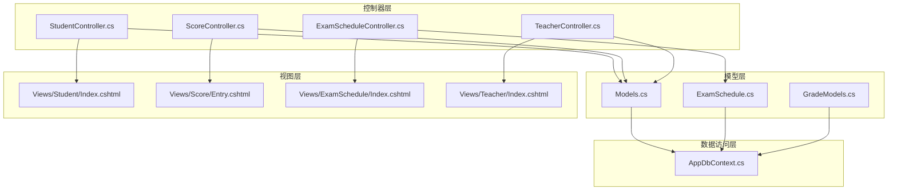
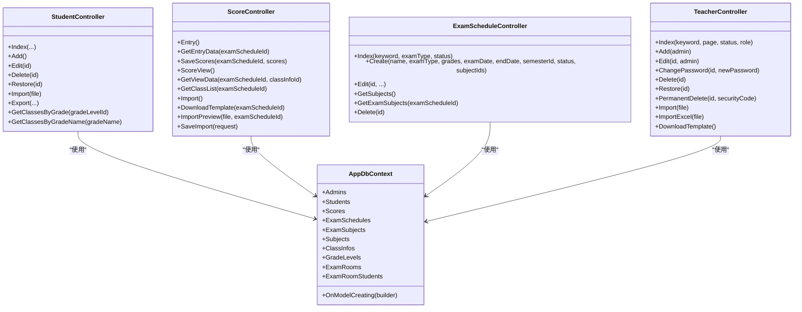
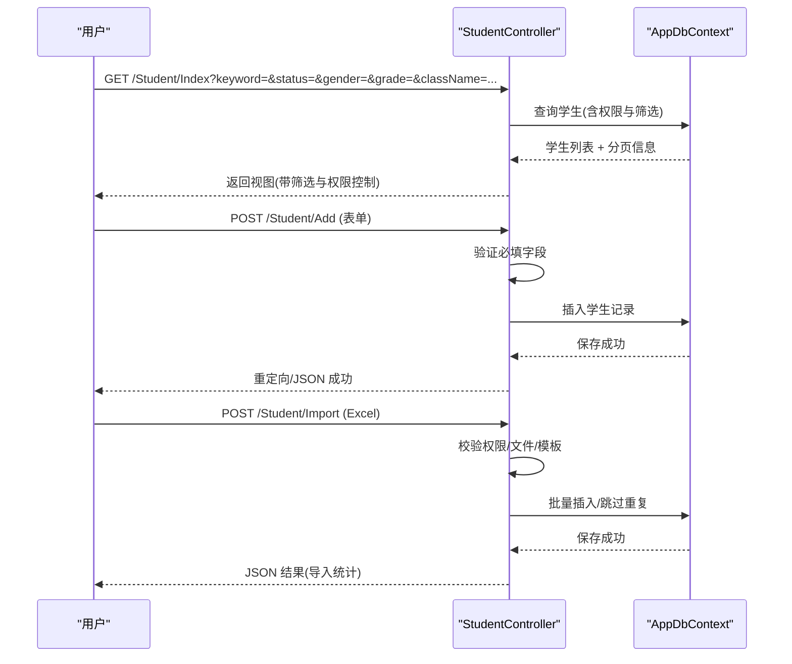
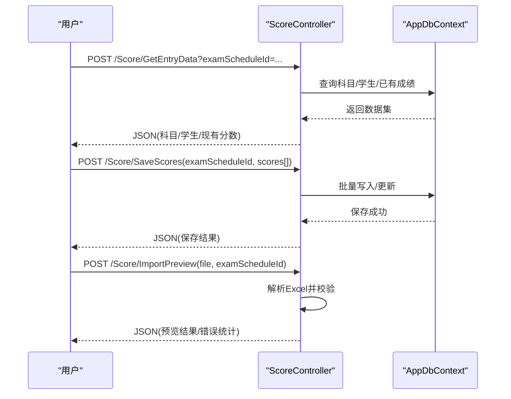
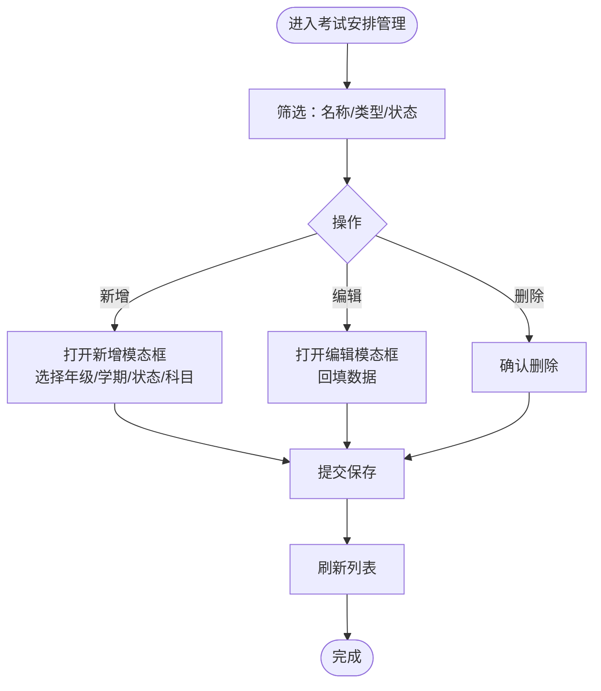
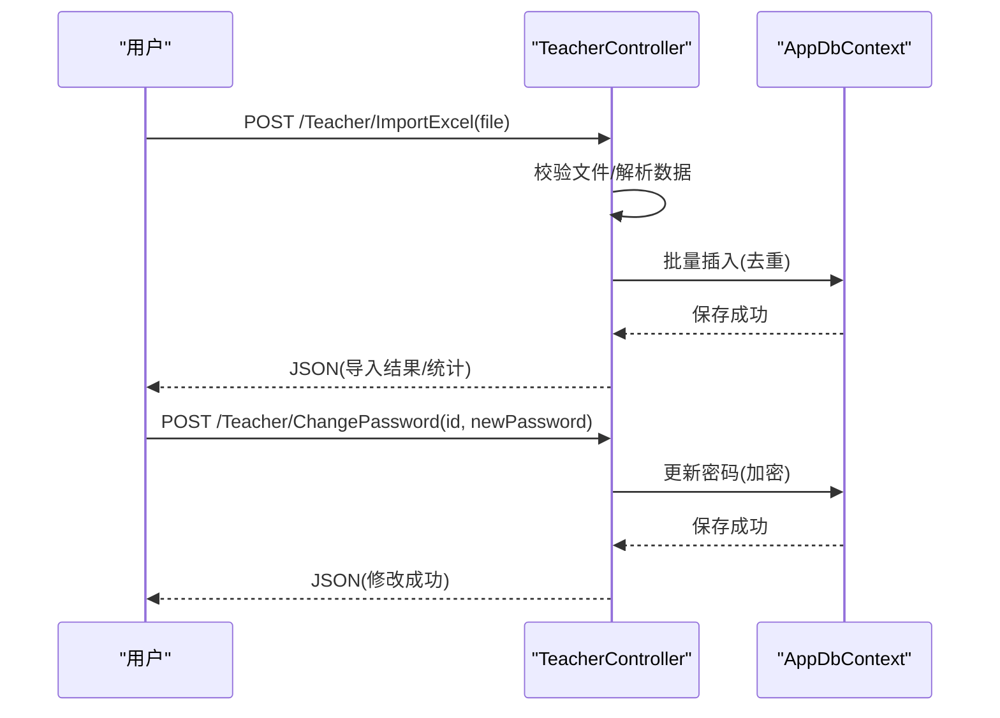
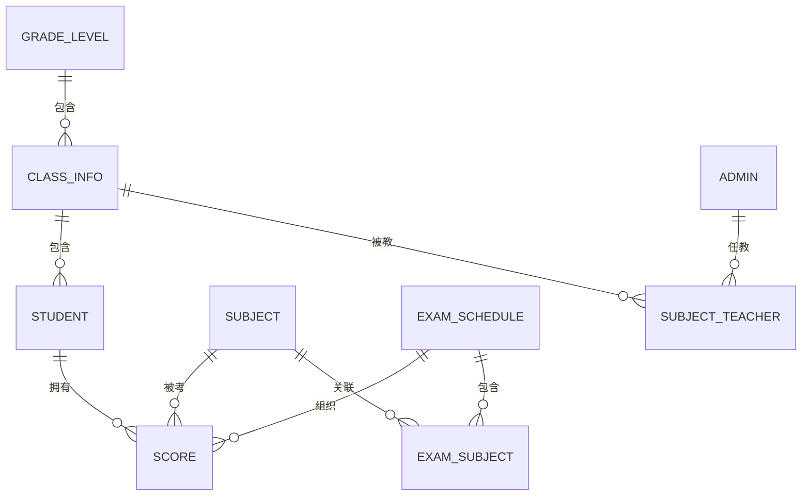

# 核心功能模块

<cite>
**本文档引用的文件**
- [Controllers/StudentController.cs](file://Controllers/StudentController.cs)
- [Controllers/ScoreController.cs](file://Controllers/ScoreController.cs)
- [Controllers/ExamScheduleController.cs](file://Controllers/ExamScheduleController.cs)
- [Controllers/TeacherController.cs](file://Controllers/TeacherController.cs)
- [Models/Models.cs](file://Models/Models.cs)
- [Models/ExamSchedule.cs](file://Models/ExamSchedule.cs)
- [Models/GradeModels.cs](file://Models/GradeModels.cs)
- [Data/AppDbContext.cs](file://Data/AppDbContext.cs)
- [Views/Student/Index.cshtml](file://Views/Student/Index.cshtml)
- [Views/Score/Entry.cshtml](file://Views/Score/Entry.cshtml)
- [Views/ExamSchedule/Index.cshtml](file://Views/ExamSchedule/Index.cshtml)
- [Views/Teacher/Index.cshtml](file://Views/Teacher/Index.cshtml)
</cite>

## 目录
1. [简介](#简介)
2. [项目结构](#项目结构)
3. [核心组件](#核心组件)
4. [架构概览](#架构概览)
5. [详细组件分析](#详细组件分析)
6. [依赖分析](#依赖分析)
7. [性能考虑](#性能考虑)
8. [故障排查指南](#故障排查指南)
9. [结论](#结论)

## 简介
本文件面向学生管理系统的核心功能模块，围绕四大模块展开：学生信息管理、成绩管理、考试安排、教师与班级管理。内容涵盖业务流程、API 接口、数据模型、前端交互逻辑以及模块间的数据流转关系，帮助开发者与使用者全面理解系统设计与实现。

## 项目结构
系统采用经典的三层架构（控制器-服务-数据访问），配合 Entity Framework Core 进行数据持久化，前端使用 Razor Pages 实现视图层与交互逻辑。

图表来源
- [Controllers/StudentController.cs](file://Controllers/StudentController.cs)
- [Controllers/ScoreController.cs](file://Controllers/ScoreController.cs)
- [Controllers/ExamScheduleController.cs](file://Controllers/ExamScheduleController.cs)
- [Controllers/TeacherController.cs](file://Controllers/TeacherController.cs)
- [Models/Models.cs](file://Models/Models.cs)
- [Models/ExamSchedule.cs](file://Models/ExamSchedule.cs)
- [Models/GradeModels.cs](file://Models/GradeModels.cs)
- [Data/AppDbContext.cs](file://Data/AppDbContext.cs)
- [Views/Student/Index.cshtml](file://Views/Student/Index.cshtml)
- [Views/Score/Entry.cshtml](file://Views/Score/Entry.cshtml)
- [Views/ExamSchedule/Index.cshtml](file://Views/ExamSchedule/Index.cshtml)
- [Views/Teacher/Index.cshtml](file://Views/Teacher/Index.cshtml)

章节来源
- [Controllers/StudentController.cs](file://Controllers/StudentController.cs)
- [Controllers/ScoreController.cs](file://Controllers/ScoreController.cs)
- [Controllers/ExamScheduleController.cs](file://Controllers/ExamScheduleController.cs)
- [Controllers/TeacherController.cs](file://Controllers/TeacherController.cs)
- [Models/Models.cs](file://Models/Models.cs)
- [Models/ExamSchedule.cs](file://Models/ExamSchedule.cs)
- [Models/GradeModels.cs](file://Models/GradeModels.cs)
- [Data/AppDbContext.cs](file://Data/AppDbContext.cs)
- [Views/Student/Index.cshtml](file://Views/Student/Index.cshtml)
- [Views/Score/Entry.cshtml](file://Views/Score/Entry.cshtml)
- [Views/ExamSchedule/Index.cshtml](file://Views/ExamSchedule/Index.cshtml)
- [Views/Teacher/Index.cshtml](file://Views/Teacher/Index.cshtml)

## 核心组件
- 学生信息管理模块：负责学生基础信息维护、批量导入导出、状态管理与数据校验；支持按角色与权限控制展示范围。
- 成绩管理模块：支持在线录入、批量导入、统计分析、Excel 导出与报表生成。
- 考试安排模块：提供考试计划制定、科目关联、状态管理与考场管理入口。
- 教师与班级管理模块：负责教师信息维护、角色分配、导入导出与教学管理。

章节来源
- [Controllers/StudentController.cs](file://Controllers/StudentController.cs)
- [Controllers/ScoreController.cs](file://Controllers/ScoreController.cs)
- [Controllers/ExamScheduleController.cs](file://Controllers/ExamScheduleController.cs)
- [Controllers/TeacherController.cs](file://Controllers/TeacherController.cs)

## 架构概览
系统采用 MVC 架构，控制器处理请求与响应，模型定义实体与关系，上下文负责数据库映射与迁移，视图承载前端交互与展示。

图表来源
- [Controllers/StudentController.cs](file://Controllers/StudentController.cs)
- [Controllers/ScoreController.cs](file://Controllers/ScoreController.cs)
- [Controllers/ExamScheduleController.cs](file://Controllers/ExamScheduleController.cs)
- [Controllers/TeacherController.cs](file://Controllers/TeacherController.cs)
- [Data/AppDbContext.cs](file://Data/AppDbContext.cs)

## 详细组件分析

### 学生信息管理模块
- 业务流程
  - 角色与权限：管理员可全量管理；班主任仅能查看/编辑本班学生；其他角色受限制展示。
  - 查询与筛选：支持关键字、性别、年级、班级、是否非本地户籍、民族、户口性质等条件组合。
  - 状态管理：支持“在读”“已删除”“已毕业”等状态；提供软删除、恢复与彻底删除（管理员+安全码）。
  - 批量导入导出：支持 Excel 模板下载与导入；导出支持筛选条件。
  - 班级联动：按年级动态加载班级选项。
- API 接口
  - GET /Student/Index：分页查询与筛选
  - GET /Student/Add：加载年级/班级选项
  - POST /Student/Add：新增学生
  - GET /Student/Edit/{id}：加载编辑表单
  - POST /Student/Edit/{id}：更新学生
  - POST /Student/Delete/{id}：软删除
  - POST /Student/Restore/{id}：恢复
  - POST /Student/HardDelete/{id}?securityCode=...：彻底删除（管理员）
  - POST /Student/Import：批量导入
  - GET /Student/DownloadTemplate：下载导入模板
  - GET /Student/Export：导出
  - GET /Student/GetClassesByGrade/{id}：按年级获取班级
  - GET /Student/GetClassesByGradeName/{name}：按年级名获取班级
- 数据模型
  - Student：学生基本信息、户籍、监护人、状态、备注等字段。
  - ClassInfo/GradeLevel：班级与年级层级关系。
- 前端交互
  - 支持 Tab 切换（学生管理/管理年级/管理班级/所教班级）、高级筛选、分页、右键菜单、模态框编辑/添加/查看。
  - Ajax 异步提交与结果反馈，支持进度条与错误提示。

图表来源
- [Controllers/StudentController.cs](file://Controllers/StudentController.cs)
- [Views/Student/Index.cshtml](file://Views/Student/Index.cshtml)

章节来源
- [Controllers/StudentController.cs](file://Controllers/StudentController.cs)
- [Views/Student/Index.cshtml](file://Views/Student/Index.cshtml)
- [Models/Models.cs](file://Models/Models.cs)
- [Models/GradeModels.cs](file://Models/GradeModels.cs)
- [Data/AppDbContext.cs](file://Data/AppDbContext.cs)

### 成绩管理模块
- 业务流程
  - 在线录入：按考试选择学生与科目，支持批量保存与实时校验。
  - 批量导入：下载模板，填写后预览校验，再保存入库。
  - 成绩查看：按考试与班级聚合，支持排序与导出。
  - 统计分析：按班级/年级维度汇总，生成排名与总分。
- API 接口
  - GET /Score/Entry：进入录入页
  - POST /Score/GetEntryData：加载考试关联科目与学生
  - POST /Score/SaveScores：保存全部分数
  - GET /Score/ScoreView：进入查看页
  - POST /Score/GetViewData：按班级分组返回成绩
  - POST /Score/GetClassList：获取参与考试的班级
  - GET /Score/Import：进入导入页
  - GET /Score/DownloadTemplate/{examScheduleId}：下载导入模板
  - POST /Score/ImportPreview：预览导入数据
  - POST /Score/SaveImport：保存导入数据
  - GET /Score/ExportExcel/{examScheduleId}/{classInfoId?}：导出 Excel
- 数据模型
  - Score：学生-科目-考试三元唯一索引，包含快照的年级与班级信息。
  - ExamSchedule/ExamSubject/Subject：考试与科目关联。
- 前端交互
  - 录入表单：动态渲染科目列，输入校验与变更追踪，批量保存。
  - 导入预览：逐行校验，错误高亮，统计成功/失败数量。
  - 成绩表格：按班级/年级分组，支持导出。

图表来源
- [Controllers/ScoreController.cs](file://Controllers/ScoreController.cs)
- [Views/Score/Entry.cshtml](file://Views/Score/Entry.cshtml)

章节来源
- [Controllers/ScoreController.cs](file://Controllers/ScoreController.cs)
- [Views/Score/Entry.cshtml](file://Views/Score/Entry.cshtml)
- [Models/Models.cs](file://Models/Models.cs)
- [Models/ExamSchedule.cs](file://Models/ExamSchedule.cs)
- [Data/AppDbContext.cs](file://Data/AppDbContext.cs)

### 考试安排模块
- 业务流程
  - 创建/编辑考试：设置名称、类型、日期区间、适用年级、学期、状态与关联科目。
  - 状态管理：未开始/进行中/已结束；自动检测日期过期但状态未更新的记录。
  - 考场管理入口：点击“考场管理”跳转至考场模块（由 ExamRoomController 提供）。
- API 接口
  - GET /ExamSchedule/Index：筛选与分页
  - POST /ExamSchedule/Create：新增
  - POST /ExamSchedule/Edit：编辑
  - GET /ExamSchedule/GetSubjects：获取全部科目
  - GET /ExamSchedule/GetExamSubjects/{id}：获取已关联科目
  - POST /ExamSchedule/Delete：删除
- 数据模型
  - ExamSchedule：考试安排主表，包含名称、类型、日期、适用年级、学期、状态与创建时间。
  - ExamSubject：考试与科目多对多中间表。
- 前端交互
  - 新增/编辑模态框：年级多选联动科目显示；学期下拉；状态选择。
  - 列表页：状态徽章、日期过期提醒、操作按钮（编辑/考场管理/删除）。

图表来源
- [Controllers/ExamScheduleController.cs](file://Controllers/ExamScheduleController.cs)
- [Views/ExamSchedule/Index.cshtml](file://Views/ExamSchedule/Index.cshtml)
- [Models/ExamSchedule.cs](file://Models/ExamSchedule.cs)

章节来源
- [Controllers/ExamScheduleController.cs](file://Controllers/ExamScheduleController.cs)
- [Views/ExamSchedule/Index.cshtml](file://Views/ExamSchedule/Index.cshtml)
- [Models/ExamSchedule.cs](file://Models/ExamSchedule.cs)
- [Data/AppDbContext.cs](file://Data/AppDbContext.cs)

### 教师与班级管理模块
- 业务流程
  - 教师信息维护：支持添加、编辑、修改密码、删除、恢复、彻底删除（管理员+安全码）。
  - 批量导入：支持 CSV/Excel 模板导入，自动跳过重复用户名。
  - 角色与任教：支持班主任/科任教师/年级级长等角色，绑定年级与班级。
- API 接口
  - GET /Teacher/Index：分页与筛选（状态/角色）
  - GET /Teacher/Add：加载年级选项
  - POST /Teacher/Add：新增
  - GET /Teacher/Edit/{id}：加载编辑表单
  - POST /Teacher/Edit/{id}：更新
  - POST /Teacher/ChangePassword/{id}：修改密码
  - POST /Teacher/Delete/{id}：删除
  - POST /Teacher/Restore/{id}：恢复
  - POST /Teacher/PermanentDelete/{id}?securityCode=...：彻底删除
  - POST /Teacher/Import：导入 CSV
  - POST /Teacher/ImportExcel：导入 Excel
  - GET /Teacher/DownloadTemplate：下载模板
- 数据模型
  - Admin：教职工信息与角色、任教信息、状态、创建时间等。
  - SubjectTeacher：科目-教师-班级关联，用于在线输分权限控制。
  - ClassInfo/GradeLevel：班级与年级层级。
- 前端交互
  - 统计卡片：在职人数、班主任、科任教师、年级级长等。
  - 右键菜单：编辑、修改密码、删除、恢复、彻底删除。
  - 模态框：添加/编辑表单，导入进度与结果提示。

图表来源
- [Controllers/TeacherController.cs](file://Controllers/TeacherController.cs)
- [Views/Teacher/Index.cshtml](file://Views/Teacher/Index.cshtml)

章节来源
- [Controllers/TeacherController.cs](file://Controllers/TeacherController.cs)
- [Views/Teacher/Index.cshtml](file://Views/Teacher/Index.cshtml)
- [Models/Models.cs](file://Models/Models.cs)
- [Models/GradeModels.cs](file://Models/GradeModels.cs)
- [Data/AppDbContext.cs](file://Data/AppDbContext.cs)

## 依赖分析
- 控制器依赖 AppDbContext 进行数据访问，所有实体通过 OnModelCreating 映射与约束。
- 成绩模块依赖考试安排与科目配置，形成“考试-科目-学生-分数”的闭环。
- 教师模块通过 SubjectTeacher 与班级/科目建立教学关系，支撑“所教班级”视图。
- 学生模块与班级/年级模型耦合，支持按角色与权限的范围控制。

图表来源
- [Data/AppDbContext.cs](file://Data/AppDbContext.cs)
- [Models/Models.cs](file://Models/Models.cs)
- [Models/GradeModels.cs](file://Models/GradeModels.cs)
- [Models/ExamSchedule.cs](file://Models/ExamSchedule.cs)

章节来源
- [Data/AppDbContext.cs](file://Data/AppDbContext.cs)
- [Models/Models.cs](file://Models/Models.cs)
- [Models/GradeModels.cs](file://Models/GradeModels.cs)
- [Models/ExamSchedule.cs](file://Models/ExamSchedule.cs)

## 性能考虑
- 批量操作：导入/保存采用批量加载与字典缓存，减少重复查询与 IO。
- 分页与筛选：控制器侧进行分页与条件拼装，避免一次性加载全量数据。
- 前端优化：表格滚动区域与列宽自适应，减少渲染压力；异步提交与进度反馈提升体验。
- 数据一致性：唯一索引（如 Score 的三元唯一）避免重复写入，保障统计准确性。

## 故障排查指南
- 权限不足
  - 症状：无导入/编辑/删除等权限按钮或操作失败。
  - 处理：确认当前用户角色与权限字符串；管理员可执行彻底删除需安全码。
- Excel 导入失败
  - 症状：文件格式不符、模板列不匹配、重复学号/用户名。
  - 处理：使用系统提供的模板；确保列顺序与必填项；重复项会被跳过。
- 成绩保存异常
  - 症状：分数越界、未选择考试、科目未关联。
  - 处理：检查考试状态与科目配置；确保分数在满分范围内。
- 班级联动无效
  - 症状：选择年级后班级下拉为空。
  - 处理：确认年级与班级数据已创建；检查控制器返回的班级列表。

章节来源
- [Controllers/StudentController.cs](file://Controllers/StudentController.cs)
- [Controllers/ScoreController.cs](file://Controllers/ScoreController.cs)
- [Controllers/ExamScheduleController.cs](file://Controllers/ExamScheduleController.cs)
- [Controllers/TeacherController.cs](file://Controllers/TeacherController.cs)

## 结论
四大核心模块围绕“学生-成绩-考试-教师”主线构建，控制器层承担业务编排，模型与上下文保证数据一致性，视图层提供直观的交互体验。模块间通过实体关系与控制器协作实现数据流转，满足学校日常管理需求。建议持续完善权限体系与审计日志，进一步增强系统的安全性与可追溯性。