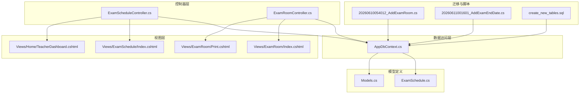
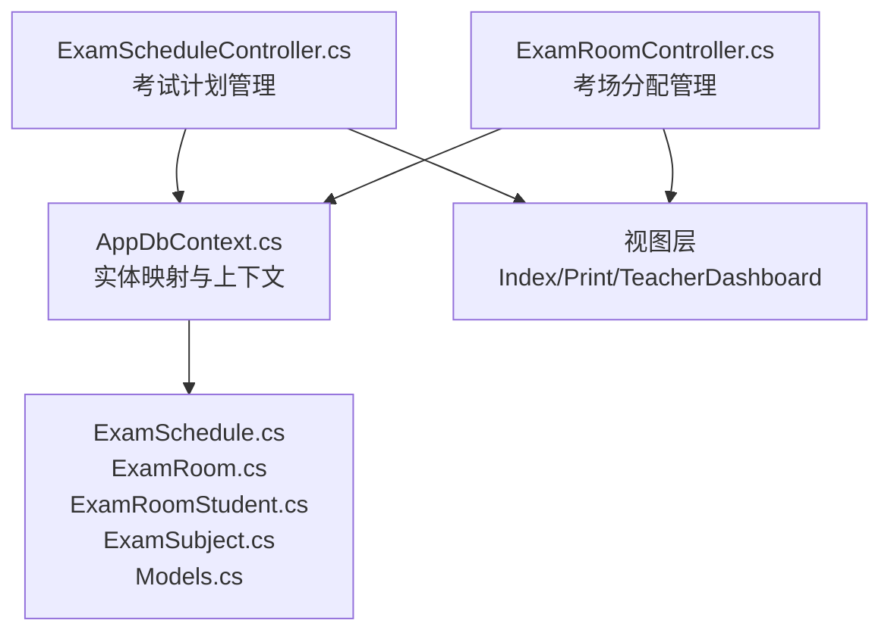
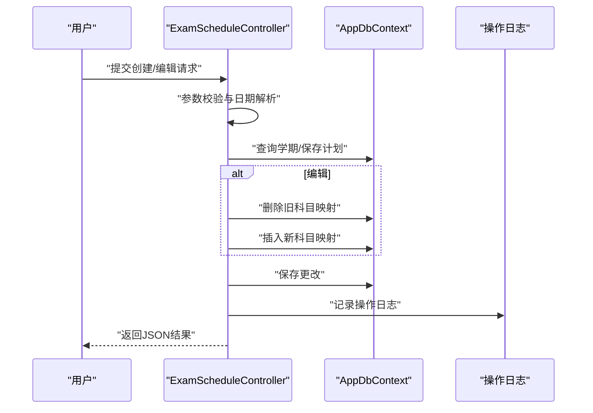
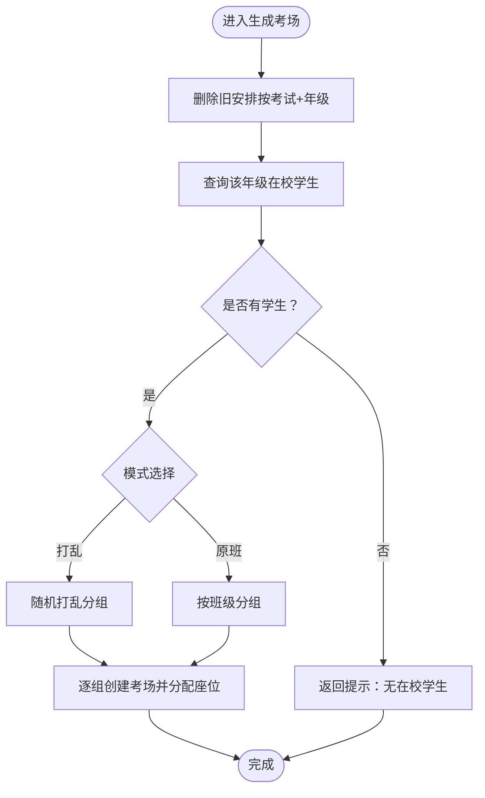
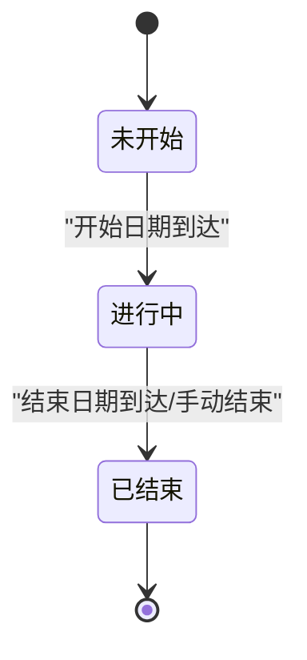
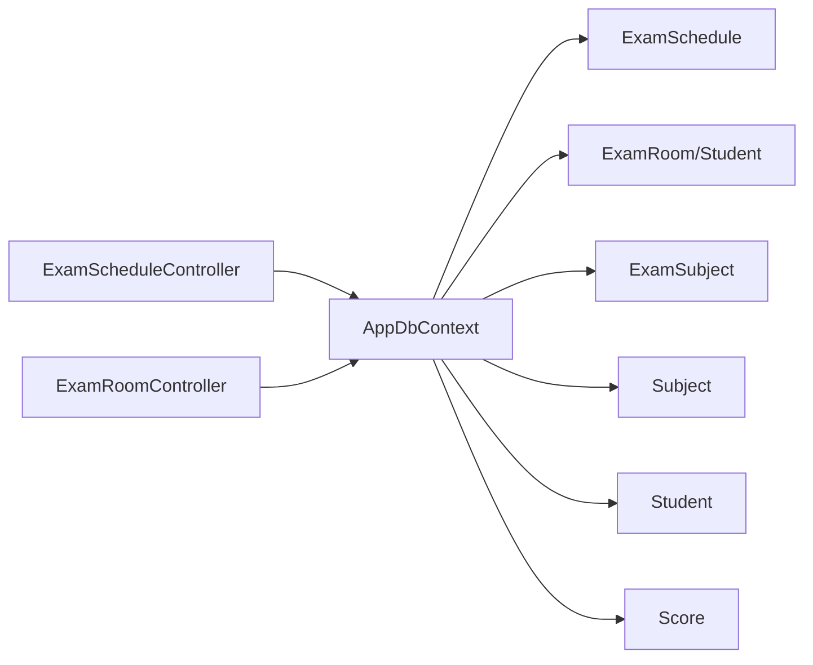

# 考试安排管理

<cite>
**本文引用的文件**
- [ExamScheduleController.cs](file://Controllers/ExamScheduleController.cs)
- [ExamRoomController.cs](file://Controllers/ExamRoomController.cs)
- [AppDbContext.cs](file://Data/AppDbContext.cs)
- [ExamSchedule.cs](file://Models/ExamSchedule.cs)
- [Models.cs](file://Models/Models.cs)
- [20260610054012_AddExamRoom.cs](file://Migrations/20260610054012_AddExamRoom.cs)
- [20260611001601_AddExamEndDate.cs](file://Migrations/20260611001601_AddExamEndDate.cs)
- [create_new_tables.sql](file://create_new_tables.sql)
- [TeacherDashboard.cshtml](file://Views/Home/TeacherDashboard.cshtml)
- [ExamSchedule_Index.cshtml](file://Views/ExamSchedule/Index.cshtml)
- [ExamRoom_Index.cshtml](file://Views/ExamRoom/Index.cshtml)
- [ExamRoom_Print.cshtml](file://Views/ExamRoom/Print.cshtml)
</cite>

## 目录
1. [简介](#简介)
2. [项目结构](#项目结构)
3. [核心组件](#核心组件)
4. [架构总览](#架构总览)
5. [详细组件分析](#详细组件分析)
6. [依赖分析](#依赖分析)
7. [性能考虑](#性能考虑)
8. [故障排查指南](#故障排查指南)
9. [结论](#结论)
10. [附录](#附录)

## 简介
本文件面向“考试安排管理”模块，系统化梳理从考试计划制定、考场分配、监控统计到权限控制与并发一致性保障的完整方案。内容覆盖：
- 考试计划制定：科目设置、时间安排、年级范围、状态管理
- 考场分配机制：容量管理、座位安排、冲突检测与清理
- 考试监控：进度跟踪、缺考处理、异常处理、统计报表
- 数据模型设计：ExamSchedule、ExamRoom、ExamRoomStudent、ExamSubject 等实体关系
- 生命周期流程：创建→排考→打印→结束
- 权限与并发：角色授权、操作日志、事务与索引优化

## 项目结构
围绕考试安排管理的关键代码分布在控制器、数据上下文、模型与迁移脚本中，前端视图负责展示与交互。



**图表来源**
- [ExamScheduleController.cs:10-250](file://Controllers/ExamScheduleController.cs#L10-L250)
- [ExamRoomController.cs:10-200](file://Controllers/ExamRoomController.cs#L10-L200)
- [AppDbContext.cs:10-295](file://Data/AppDbContext.cs#L10-L295)
- [ExamSchedule.cs:1-47](file://Models/ExamSchedule.cs#L1-L47)
- [Models.cs:398-462](file://Models/Models.cs#L398-L462)
- [20260610054012_AddExamRoom.cs:1-98](file://Migrations/20260610054012_AddExamRoom.cs#L1-L98)
- [20260611001601_AddExamEndDate.cs:1-30](file://Migrations/20260611001601_AddExamEndDate.cs#L1-L30)
- [create_new_tables.sql:87-115](file://create_new_tables.sql#L87-L115)
- [ExamSchedule_Index.cshtml](file://Views/ExamSchedule/Index.cshtml)
- [ExamRoom_Index.cshtml](file://Views/ExamRoom/Index.cshtml)
- [ExamRoom_Print.cshtml](file://Views/ExamRoom/Print.cshtml)
- [TeacherDashboard.cshtml:42-68](file://Views/Home/TeacherDashboard.cshtml#L42-L68)

**章节来源**
- [ExamScheduleController.cs:10-250](file://Controllers/ExamScheduleController.cs#L10-L250)
- [ExamRoomController.cs:10-200](file://Controllers/ExamRoomController.cs#L10-L200)
- [AppDbContext.cs:10-295](file://Data/AppDbContext.cs#L10-L295)

## 核心组件
- 考试计划控制器：提供考试创建、编辑、删除、科目关联查询接口，支持按关键词、类型、状态筛选，维护操作日志。
- 考场控制器：提供按年级生成考场（打乱/原班）、清理安排、打印视图等功能。
- 数据上下文：集中声明实体集与映射配置，含外键约束、唯一索引与级联删除。
- 模型定义：ExamSchedule、ExamSubject、ExamRoom、ExamRoomStudent 等核心实体及其属性与关系。
- 迁移与脚本：新增考场表、考场学生表、结束日期字段，以及为成绩表补充外键与索引。

**章节来源**
- [ExamScheduleController.cs:20-250](file://Controllers/ExamScheduleController.cs#L20-L250)
- [ExamRoomController.cs:21-200](file://Controllers/ExamRoomController.cs#L21-L200)
- [AppDbContext.cs:24-295](file://Data/AppDbContext.cs#L24-L295)
- [ExamSchedule.cs:1-47](file://Models/ExamSchedule.cs#L1-L47)
- [Models.cs:398-462](file://Models/Models.cs#L398-L462)
- [20260610054012_AddExamRoom.cs:13-98](file://Migrations/20260610054012_AddExamRoom.cs#L13-L98)
- [20260611001601_AddExamEndDate.cs:12-27](file://Migrations/20260611001601_AddExamEndDate.cs#L12-L27)
- [create_new_tables.sql:87-115](file://create_new_tables.sql#L87-L115)

## 架构总览
考试安排管理采用经典的三层架构：控制器负责请求处理与参数校验，数据上下文封装实体关系与持久化，模型定义数据契约，迁移与脚本确保数据库演进。



**图表来源**
- [ExamScheduleController.cs:10-250](file://Controllers/ExamScheduleController.cs#L10-L250)
- [ExamRoomController.cs:10-200](file://Controllers/ExamRoomController.cs#L10-L200)
- [AppDbContext.cs:24-295](file://Data/AppDbContext.cs#L24-L295)
- [ExamSchedule.cs:1-47](file://Models/ExamSchedule.cs#L1-L47)
- [Models.cs:398-462](file://Models/Models.cs#L398-L462)

## 详细组件分析

### 考试计划制定（ExamScheduleController）
- 功能要点
  - 列表筛选：支持关键词、考试类型、状态过滤，按考试日期倒序。
  - 创建/编辑：校验必填项与日期格式，关联学期与科目集合，先删后增更新科目映射。
  - 删除：软删除逻辑由控制器直接移除记录并写入操作日志。
  - 科目查询：提供全量科目与指定考试的已选科目ID列表。
- 处理流程



**图表来源**
- [ExamScheduleController.cs:72-194](file://Controllers/ExamScheduleController.cs#L72-L194)
- [AppDbContext.cs:24-295](file://Data/AppDbContext.cs#L24-L295)

**章节来源**
- [ExamScheduleController.cs:20-194](file://Controllers/ExamScheduleController.cs#L20-L194)

### 考场分配机制（ExamRoomController）
- 功能要点
  - 生成考场：按“全年级打乱”或“原班考试”两种模式，按每室人数分组，创建考场并分配座位。
  - 清理安排：按考试+年级删除旧考场与座位。
  - 打印视图：输出可打印的考场与座位清单。
- 容量与冲突检测
  - 容量管理：座位数等于分组人数，避免超载。
  - 冲突检测：按“考试+年级”维度进行清理与重建，避免重复分配。
- 流程图



**图表来源**
- [ExamRoomController.cs:54-148](file://Controllers/ExamRoomController.cs#L54-L148)

**章节来源**
- [ExamRoomController.cs:21-182](file://Controllers/ExamRoomController.cs#L21-L182)

### 数据模型设计（实体关系）
- 实体与关系
  - ExamSchedule：考试计划，关联 Semester 与 ExamSubjects。
  - ExamSubject：考试计划与科目多对多中间表，唯一索引约束。
  - ExamRoom：考场，关联 ExamSchedule，包含安排模式与座位数。
  - ExamRoomStudent：考场与学生多对多中间表，记录座位号。
  - Score：成绩表，补充了 ExamScheduleId 外键与复合唯一索引。
- ER 图

```mermaid
erDiagram
EXAM_SCHEDULE {
int Id PK
string Name
string ExamType
string Grades
datetime ExamDate
datetime EndDate
int SemesterId FK
string Status
datetime CreateTime
}
SEMESTER {
int Id PK
int AcademicYearId FK
string SemesterName
bool IsCurrent
datetime CreateTime
}
EXAM_SUBJECT {
int Id PK
int ExamScheduleId FK
int SubjectId FK
}
EXAM_ROOM {
int Id PK
int ExamScheduleId FK
string Grade
string ArrangeMode
string RoomName
int SeatCount
datetime CreateTime
}
EXAM_ROOM_STUDENT {
int Id PK
int ExamRoomId FK
int StudentId FK
int SeatNumber
}
SUBJECT {
int Id PK
string Name
string Grade
int SortOrder
int FullScore
datetime CreateTime
}
STUDENT {
int StudentID PK
string StudentNo
string Grade
string ClassName
string Name
string Gender
string IDCardNumber
string Status
datetime CreateTime
datetime UpdateTime
}
SCORE {
int Id PK
int StudentId FK
int SubjectId FK
decimal ScoreValue
string ExamType
datetime ExamDate
int ExamScheduleId FK
int? GradeLevelId FK
int? ClassInfoId FK
datetime CreateTime
}
EXAM_SCHEDULE ||--o{ EXAM_SUBJECT : "包含"
SEMESTER ||--o{ EXAM_SCHEDULE : "属于"
EXAM_SCHEDULE ||--o{ EXAM_ROOM : "安排"
EXAM_ROOM ||--o{ EXAM_ROOM_STUDENT : "容纳"
SUBJECT ||--o{ EXAM_SUBJECT : "被包含"
STUDENT ||--o{ EXAM_ROOM_STUDENT : "就座"
STUDENT ||--o{ SCORE : "产生"
SUBJECT ||--o{ SCORE : "评分"
EXAM_SCHEDULE ||--o{ SCORE : "承载"
```

**图表来源**
- [AppDbContext.cs:226-292](file://Data/AppDbContext.cs#L226-L292)
- [ExamSchedule.cs:1-47](file://Models/ExamSchedule.cs#L1-L47)
- [Models.cs:398-462](file://Models/Models.cs#L398-L462)
- [create_new_tables.sql:87-115](file://create_new_tables.sql#L87-L115)

**章节来源**
- [AppDbContext.cs:226-292](file://Data/AppDbContext.cs#L226-L292)
- [ExamSchedule.cs:1-47](file://Models/ExamSchedule.cs#L1-L47)
- [Models.cs:398-462](file://Models/Models.cs#L398-L462)

### 业务流程（从创建到结束）
- 创建阶段：填写名称、类型、年级范围、日期、学期、状态，选择关联科目。
- 排考阶段：按年级生成考场，支持打乱或原班模式，座位号自增。
- 打印阶段：输出考场与座位清单，便于监考与巡考。
- 结束阶段：更新状态为“已结束”，归档数据。
- 监控阶段：教师仪表盘展示待录入考试提醒，便于进度跟踪。



**图表来源**
- [ExamSchedule.cs:25-36](file://Models/ExamSchedule.cs#L25-L36)
- [ExamRoomController.cs:167-182](file://Controllers/ExamRoomController.cs#L167-L182)
- [TeacherDashboard.cshtml:42-68](file://Views/Home/TeacherDashboard.cshtml#L42-L68)

**章节来源**
- [ExamSchedule.cs:25-36](file://Models/ExamSchedule.cs#L25-L36)
- [ExamRoomController.cs:167-182](file://Controllers/ExamRoomController.cs#L167-L182)
- [TeacherDashboard.cshtml:42-68](file://Views/Home/TeacherDashboard.cshtml#L42-L68)

### 权限控制策略
- 角色授权
  - 考试计划与考场管理仅管理员可用（控制器使用角色授权特性）。
- 数据可见性
  - 列表页支持按学期、年级、科目筛选，便于限定范围。
- 操作审计
  - 所有增删改均写入操作日志，包含操作人、角色、目标与详情。

**章节来源**
- [ExamScheduleController.cs:10-10](file://Controllers/ExamScheduleController.cs#L10-L10)
- [ExamRoomController.cs:10-10](file://Controllers/ExamRoomController.cs#L10-L10)
- [ExamScheduleController.cs:232-248](file://Controllers/ExamScheduleController.cs#L232-L248)

### 并发控制与一致性
- 事务与保存
  - 控制器内调用保存方法，确保单次操作的原子性。
- 级联删除与唯一索引
  - 外键级联删除保证子表数据一致性；唯一索引避免重复映射。
- 数据库索引
  - 成绩表与操作日志等建立索引，提升查询性能与稳定性。

**章节来源**
- [AppDbContext.cs:242-292](file://Data/AppDbContext.cs#L242-L292)
- [create_new_tables.sql:109-115](file://create_new_tables.sql#L109-L115)

## 依赖分析
- 控制器依赖数据上下文与模型，控制器之间无直接耦合，职责清晰。
- 考场控制器依赖学生与班级信息，生成过程受年级在校状态影响。
- 迁移与脚本确保数据库结构演进与性能优化。



**图表来源**
- [ExamScheduleController.cs:13-18](file://Controllers/ExamScheduleController.cs#L13-L18)
- [ExamRoomController.cs:13-17](file://Controllers/ExamRoomController.cs#L13-L17)
- [AppDbContext.cs:24-295](file://Data/AppDbContext.cs#L24-L295)

**章节来源**
- [ExamScheduleController.cs:13-18](file://Controllers/ExamScheduleController.cs#L13-L18)
- [ExamRoomController.cs:13-17](file://Controllers/ExamRoomController.cs#L13-L17)
- [AppDbContext.cs:24-295](file://Data/AppDbContext.cs#L24-L295)

## 性能考虑
- 查询优化
  - 使用 Include/ThenInclude 进行必要关联加载，避免 N+1 查询。
  - 列表页按日期倒序，结合数据库索引提升排序效率。
- 写入优化
  - 先删除旧映射再插入新映射，减少冗余数据；分批保存降低锁竞争。
- 索引建议
  - 成绩表已建关键索引；可按实际查询场景增加复合索引以进一步优化。

**章节来源**
- [ExamScheduleController.cs:22-39](file://Controllers/ExamScheduleController.cs#L22-L39)
- [create_new_tables.sql:109-115](file://create_new_tables.sql#L109-L115)

## 故障排查指南
- 常见问题
  - 日期格式错误：检查客户端传参与服务端解析。
  - 学期不存在：确认学期ID有效且未被删除。
  - 无在校学生：确认年级状态与在校状态筛选条件。
  - 生成失败：查看异常消息并核对参数与数据库连接。
- 审计与追踪
  - 通过操作日志定位具体操作人、角色与目标对象，辅助问题复盘。

**章节来源**
- [ExamScheduleController.cs:76-131](file://Controllers/ExamScheduleController.cs#L76-L131)
- [ExamRoomController.cs:58-147](file://Controllers/ExamRoomController.cs#L58-L147)
- [ExamScheduleController.cs:232-248](file://Controllers/ExamScheduleController.cs#L232-L248)

## 结论
本模块以清晰的控制器职责、严谨的实体关系与完善的迁移脚本为基础，实现了从考试计划制定到考场分配与监控统计的闭环管理。通过角色授权、操作日志与数据库索引，兼顾安全性与性能。建议在后续迭代中引入更细粒度的权限控制与异常处理策略，持续优化查询与并发性能。

## 附录
- 视图参考
  - 考试计划列表：[ExamSchedule_Index.cshtml](file://Views/ExamSchedule/Index.cshtml)
  - 考场管理列表：[ExamRoom_Index.cshtml](file://Views/ExamRoom/Index.cshtml)
  - 考场打印视图：[ExamRoom_Print.cshtml](file://Views/ExamRoom/Print.cshtml)
  - 教师仪表盘：[TeacherDashboard.cshtml:42-68](file://Views/Home/TeacherDashboard.cshtml#L42-L68)
- 迁移与脚本
  - 新增考场与考场学生表：[20260610054012_AddExamRoom.cs:13-98](file://Migrations/20260610054012_AddExamRoom.cs#L13-L98)
  - 新增考试结束日期字段：[20260611001601_AddExamEndDate.cs:12-27](file://Migrations/20260611001601_AddExamEndDate.cs#L12-L27)
  - 成绩表外键与索引：[create_new_tables.sql:87-115](file://create_new_tables.sql#L87-L115)