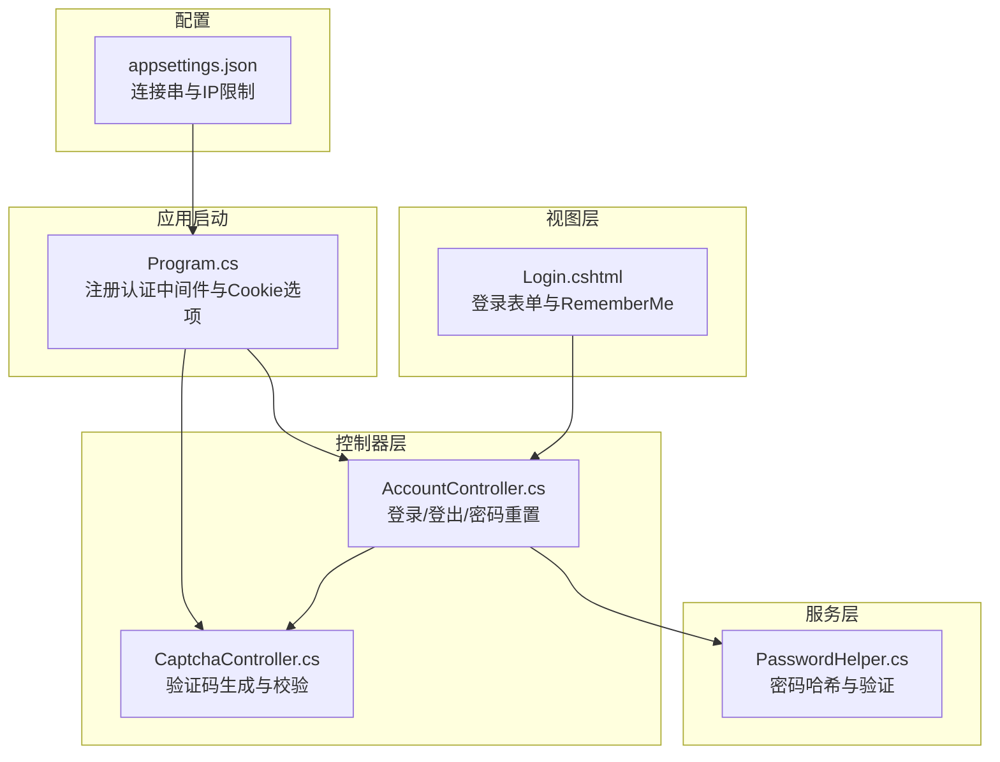
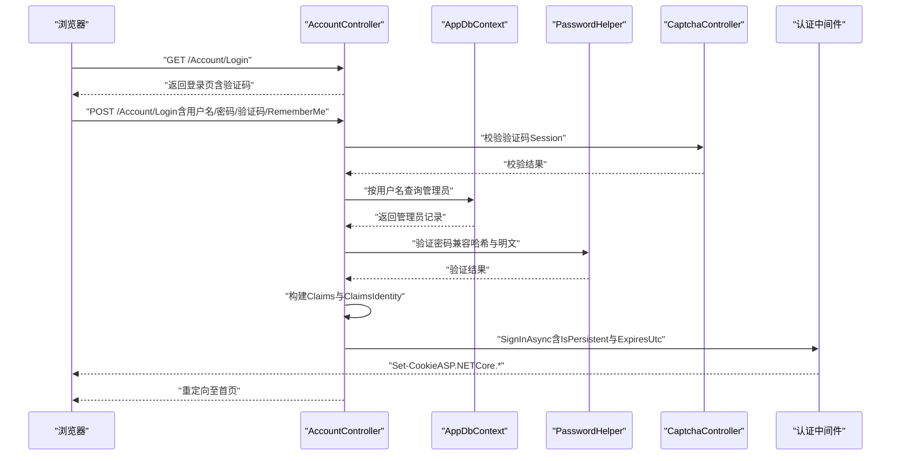
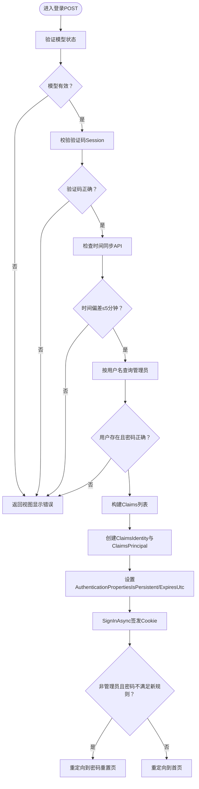
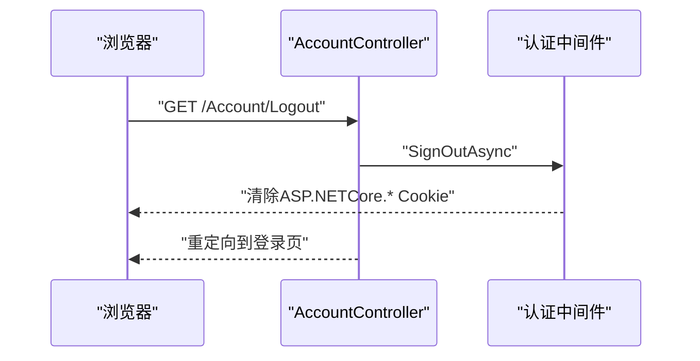
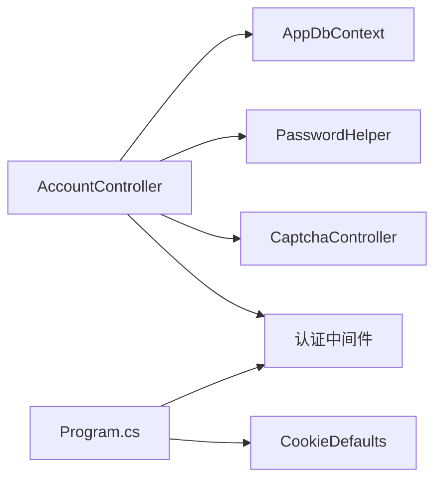

# Cookie认证机制

<cite>
**本文档引用的文件**
- [Program.cs](file://Program.cs)
- [AccountController.cs](file://Controllers/AccountController.cs)
- [PasswordHelper.cs](file://Services/PasswordHelper.cs)
- [CaptchaController.cs](file://Controllers/CaptchaController.cs)
- [Login.cshtml](file://Views/Account/Login.cshtml)
- [appsettings.json](file://appsettings.json)
</cite>

## 目录
1. [引言](#引言)
2. [项目结构](#项目结构)
3. [核心组件](#核心组件)
4. [架构总览](#架构总览)
5. [详细组件分析](#详细组件分析)
6. [依赖关系分析](#依赖关系分析)
7. [性能考虑](#性能考虑)
8. [故障排除指南](#故障排除指南)
9. [结论](#结论)

## 引言
本文件面向希望深入理解并正确实施ASP.NET Core Cookie身份认证的开发者与运维人员。文档基于仓库中现有实现，系统阐述了ClaimsIdentity的创建与配置、AuthenticationProperties的属性设置（如RememberMe持久化与过期时间）、登录流程（从用户输入验证到Claims声明构建再到Cookie签发）、会话管理策略（2小时有效期与持久化登录）、登出机制与Cookie清理、认证中间件配置与最佳实践，以及常见问题排查与性能优化建议。

## 项目结构
本项目的认证相关代码主要分布在以下位置：
- 应用启动与认证中间件配置：Program.cs
- 认证控制器与业务逻辑：Controllers/AccountController.cs
- 密码安全工具：Services/PasswordHelper.cs
- 验证码生成与校验：Controllers/CaptchaController.cs
- 登录视图与前端交互：Views/Account/Login.cshtml
- 运行时连接串与IP限制配置：appsettings.json

**图表来源**
- [Program.cs:23-32](file://Program.cs#L23-L32)
- [AccountController.cs:50-125](file://Controllers/AccountController.cs#L50-L125)
- [CaptchaController.cs:12-24](file://Controllers/CaptchaController.cs#L12-L24)
- [PasswordHelper.cs:8-41](file://Services/PasswordHelper.cs#L8-L41)
- [Login.cshtml:408-446](file://Views/Account/Login.cshtml#L408-L446)
- [appsettings.json:9-14](file://appsettings.json#L9-L14)

**章节来源**
- [Program.cs:1-123](file://Program.cs#L1-L123)
- [AccountController.cs:15-261](file://Controllers/AccountController.cs#L15-L261)
- [CaptchaController.cs:5-40](file://Controllers/CaptchaController.cs#L5-L40)
- [PasswordHelper.cs:1-41](file://Services/PasswordHelper.cs#L1-L41)
- [Login.cshtml:366-462](file://Views/Account/Login.cshtml#L366-L462)
- [appsettings.json:1-16](file://appsettings.json#L1-L16)

## 核心组件
- 认证中间件与Cookie选项
  - 在应用启动阶段通过AddAuthentication与AddCookie注册Cookie认证，默认登录路径、登出路径、访问被拒绝路径、滑动过期等均在此处配置。
  - 关键点：ExpireTimeSpan设置为15分钟，SlidingExpiration启用；同时在登录流程中通过AuthenticationProperties显式设置2小时过期时间，覆盖全局默认。
- 登录控制器
  - 处理登录GET/POST请求，执行模型验证、验证码校验、时间同步检测、数据库用户查询与密码验证、Claims构建、ClaimsPrincipal创建、AuthenticationProperties持久化与过期设置、签发Cookie。
  - 同时处理“记住我”选项，决定Cookie是否持久化。
- 密码安全工具
  - 基于ASP.NET Core Identity的PasswordHasher实现PBKDF2哈希，支持对旧版明文密码的兼容验证。
- 验证码控制器
  - 生成4位数字验证码并存入Session，供登录页使用。
- 登录视图
  - 提供用户名、密码、验证码与“记住我”复选框，配合后端登录流程完成认证。

**章节来源**
- [Program.cs:23-32](file://Program.cs#L23-L32)
- [AccountController.cs:50-125](file://Controllers/AccountController.cs#L50-L125)
- [PasswordHelper.cs:8-41](file://Services/PasswordHelper.cs#L8-L41)
- [CaptchaController.cs:12-24](file://Controllers/CaptchaController.cs#L12-L24)
- [Login.cshtml:408-446](file://Views/Account/Login.cshtml#L408-L446)

## 架构总览
下图展示了从浏览器发起登录请求到Cookie签发与后续请求认证的整体流程。

**图表来源**
- [AccountController.cs:50-125](file://Controllers/AccountController.cs#L50-L125)
- [CaptchaController.cs:12-24](file://Controllers/CaptchaController.cs#L12-L24)
- [PasswordHelper.cs:18-34](file://Services/PasswordHelper.cs#L18-L34)
- [Program.cs:23-32](file://Program.cs#L23-L32)

## 详细组件分析

### 认证中间件与Cookie选项配置
- 登录/登出/访问被拒绝路径：统一由AddCookie配置，便于集中管理。
- 会话超时与滑动过期：全局ExpireTimeSpan设为15分钟，SlidingExpiration启用，确保空闲用户自动过期。
- 注意：登录流程中通过AuthenticationProperties显式设置2小时过期时间，覆盖全局默认，形成“全局短会话+登录后长有效期”的策略。

最佳实践
- 将登录页与静态资源路径加入白名单，避免未认证用户被重定向到登录页。
- 对生产环境建议启用HttpOnly、SameSite、Secure等Cookie安全属性（可在AddCookie中扩展）。
- 滑动过期与固定过期结合使用，平衡用户体验与安全性。

**章节来源**
- [Program.cs:23-32](file://Program.cs#L23-L32)

### 登录流程实现
- 输入验证与验证码校验：先校验模型状态，再校验验证码（Session中存储的4位数字）。
- 时间同步检测：通过外部API获取互联网时间，若偏差超过5分钟则阻止登录。
- 用户与权限校验：查询用户、验证密码（兼容哈希与明文），网站关闭状态下仅管理员可登录。
- Claims构建：包含Name、Role、MobilePhone、自定义RealName与AdminID等声明。
- ClaimsPrincipal与AuthenticationProperties：创建ClaimsIdentity与ClaimsPrincipal，设置IsPersistent与ExpiresUtc。
- Cookie签发：调用SignInAsync完成Cookie写入，随后根据密码强度策略决定是否跳转到密码重置页。

**图表来源**
- [AccountController.cs:50-125](file://Controllers/AccountController.cs#L50-L125)
- [CaptchaController.cs:12-24](file://Controllers/CaptchaController.cs#L12-L24)
- [PasswordHelper.cs:18-34](file://Services/PasswordHelper.cs#L18-L34)

**章节来源**
- [AccountController.cs:50-125](file://Controllers/AccountController.cs#L50-L125)
- [Login.cshtml:408-446](file://Views/Account/Login.cshtml#L408-L446)

### ClaimsIdentity与Claims声明
- 声明类型：使用标准ClaimTypes.Name、ClaimTypes.Role、ClaimTypes.MobilePhone，以及自定义声明如RealName与AdminID。
- 身份创建：以CookieAuthenticationDefaults.AuthenticationScheme为认证方案创建ClaimsIdentity，并包装为ClaimsPrincipal。
- 权限控制：后续授权可通过Role或自定义声明进行判定。

复杂度与性能
- 声明数量较少，构建成本低；建议仅存放必要声明，避免Cookie体积过大影响网络传输与存储。

**章节来源**
- [AccountController.cs:97-107](file://Controllers/AccountController.cs#L97-L107)

### AuthenticationProperties属性设置
- IsPersistent：来源于登录表单的“记住我”选项，决定Cookie是否持久化（跨浏览器会话）。
- ExpiresUtc：在登录流程中显式设置为2小时后过期，覆盖全局15分钟的默认过期策略。
- 滑动过期：全局启用SlidingExpiration，空闲期间每次请求都会延长会话有效期。

注意
- 若用户勾选“记住我”，IsPersistent为true，结合ExpiresUtc可实现跨会话的2小时有效期。
- 未勾选“记住我”时，仍受全局15分钟滑动过期约束，空闲超时将自动失效。

**章节来源**
- [AccountController.cs:109-115](file://Controllers/AccountController.cs#L109-L115)
- [Program.cs:30-31](file://Program.cs#L30-L31)

### 会话管理策略
- 全局策略：15分钟滑动过期，适合一般页面浏览场景，降低长期挂起带来的风险。
- 登录后策略：2小时固定过期，适用于管理员等需要较长在线时间的场景。
- “记住我”持久化：当IsPersistent为true时，Cookie具备持久性，结合ExpiresUtc实现跨会话的有效期。

建议
- 对高敏感操作增加二次确认或更短的会话窗口。
- 结合IP限制中间件与HTTPS，进一步提升会话安全性。

**章节来源**
- [Program.cs:30-31](file://Program.cs#L30-L31)
- [AccountController.cs:109-115](file://Controllers/AccountController.cs#L109-L115)

### 登出机制与Cookie清理
- 登出流程：调用SignOutAsync清除当前认证Cookie，然后重定向到登录页。
- 效果：客户端不再携带认证Cookie，后续请求将被重定向到登录页（除非重新登录）。

**图表来源**
- [AccountController.cs:175-179](file://Controllers/AccountController.cs#L175-L179)
- [Program.cs:23-32](file://Program.cs#L23-L32)

**章节来源**
- [AccountController.cs:175-179](file://Controllers/AccountController.cs#L175-L179)

### 密码安全与兼容性
- 哈希算法：采用ASP.NET Core Identity的PasswordHasher（PBKDF2）进行哈希。
- 兼容旧密码：若存储值不是哈希格式，则直接比较明文，保证平滑迁移。
- 新密码规则：长度≥8、包含字母与数字，登录后若不满足规则将引导修改。

**章节来源**
- [PasswordHelper.cs:8-41](file://Services/PasswordHelper.cs#L8-L41)
- [AccountController.cs:205-225](file://Controllers/AccountController.cs#L205-L225)

### 验证码与时间同步
- 验证码：4位数字，生成后存入Session，登录时校验。
- 时间同步：通过外部API获取互联网时间戳，计算与服务器时间差，超过阈值则提示并阻止登录。

**章节来源**
- [CaptchaController.cs:12-24](file://Controllers/CaptchaController.cs#L12-L24)
- [AccountController.cs:233-259](file://Controllers/AccountController.cs#L233-L259)

## 依赖关系分析
- AccountController依赖：
  - AppDbContext：用于查询管理员信息。
  - PasswordHelper：用于密码验证与哈希。
  - CaptchaController：用于验证码校验。
  - 认证中间件：用于签发/清除Cookie。
- Program.cs依赖：
  - CookieAuthenticationDefaults：用于指定认证方案。
  - Cookie选项：LoginPath/LogoutPath/AccessDeniedPath/ExpireTimeSpan/SlidingExpiration。

**图表来源**
- [AccountController.cs:17-26](file://Controllers/AccountController.cs#L17-L26)
- [Program.cs:23-32](file://Program.cs#L23-L32)

**章节来源**
- [AccountController.cs:17-26](file://Controllers/AccountController.cs#L17-L26)
- [Program.cs:23-32](file://Program.cs#L23-L32)

## 性能考虑
- Cookie大小控制：尽量减少声明数量与字符串长度，避免Cookie过大导致带宽浪费与存储压力。
- 滑动过期与空闲检测：合理设置ExpireTimeSpan与SlidingExpiration，平衡安全与性能。
- 数据库查询：密码验证采用两步查询（先查用户再验证密码），避免EF Core无法翻译Verify到SQL造成的性能问题。
- 外部API调用：时间同步检测使用短超时HTTP客户端，失败时不阻断登录，保证可用性。

**章节来源**
- [AccountController.cs:80-88](file://Controllers/AccountController.cs#L80-L88)
- [Program.cs:18-21](file://Program.cs#L18-L21)
- [Program.cs:18-21](file://Program.cs#L18-L21)

## 故障排除指南
- 登录后立即跳转到登录页
  - 检查是否正确调用SignInAsync，确认AuthenticationProperties的IsPersistent与ExpiresUtc设置。
  - 确认认证中间件已在管道中注册（UseAuthentication/UseAuthorization顺序正确）。
- Cookie未持久化
  - 确认登录表单中“记住我”已勾选，IsPersistent应为true。
  - 检查浏览器Cookie策略与域名/路径设置。
- 验证码无效
  - 确认Session中验证码已正确生成与保存，登录时从Session读取并比对。
- 时间同步错误
  - 外部API不可达或响应异常会导致时间检测失败，系统会忽略该限制但仍可能因其他原因拒绝登录。
- 密码验证失败
  - 确认存储密码格式（哈希或明文），使用PasswordHelper.Verify进行兼容验证。
- 会话频繁过期
  - 检查全局滑动过期设置与登录后的2小时过期策略，确认用户是否频繁请求导致滑动更新。

**章节来源**
- [AccountController.cs:109-115](file://Controllers/AccountController.cs#L109-L115)
- [Program.cs:95-96](file://Program.cs#L95-L96)
- [CaptchaController.cs:18-24](file://Controllers/CaptchaController.cs#L18-L24)
- [PasswordHelper.cs:18-34](file://Services/PasswordHelper.cs#L18-L34)

## 结论
本项目实现了基于ASP.NET Core Cookie的身份认证，通过合理的Claims设计、AuthenticationProperties配置与登录流程控制，提供了“全局短会话+登录后长有效期”的会话管理策略，并辅以验证码、时间同步与密码规则等安全措施。遵循本文档的最佳实践与故障排除建议，可进一步提升系统的安全性与稳定性。