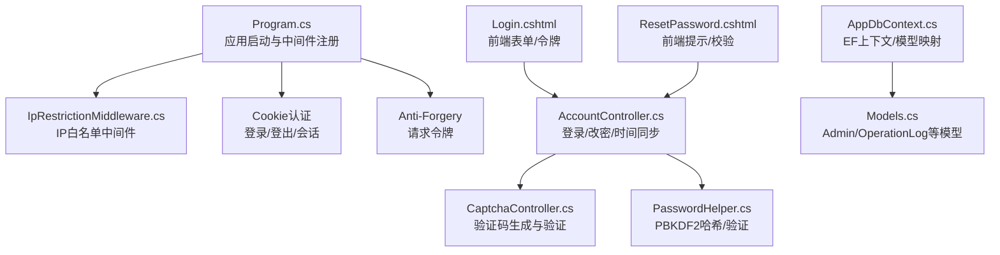
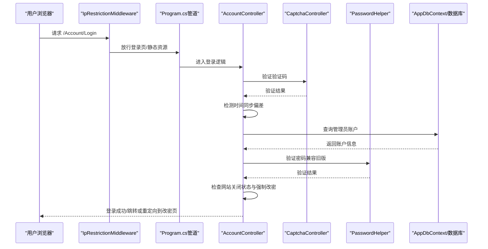
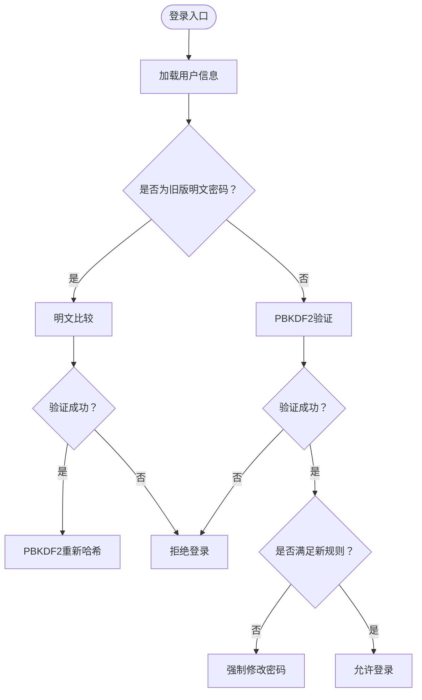
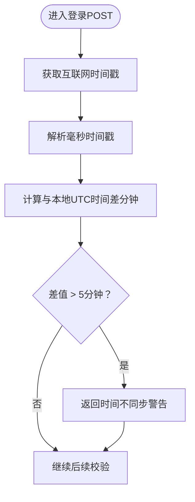
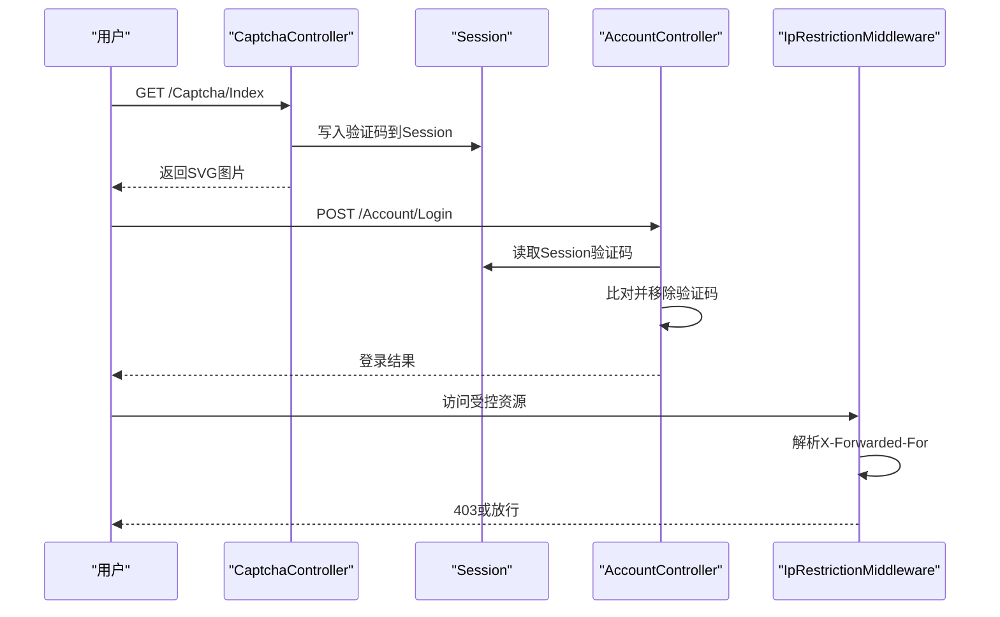
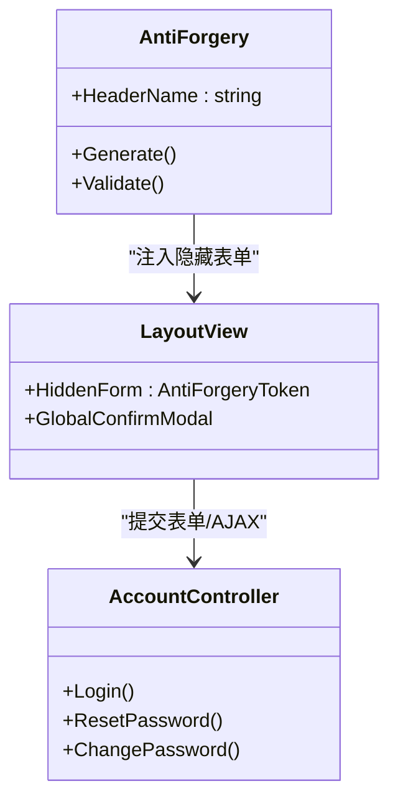
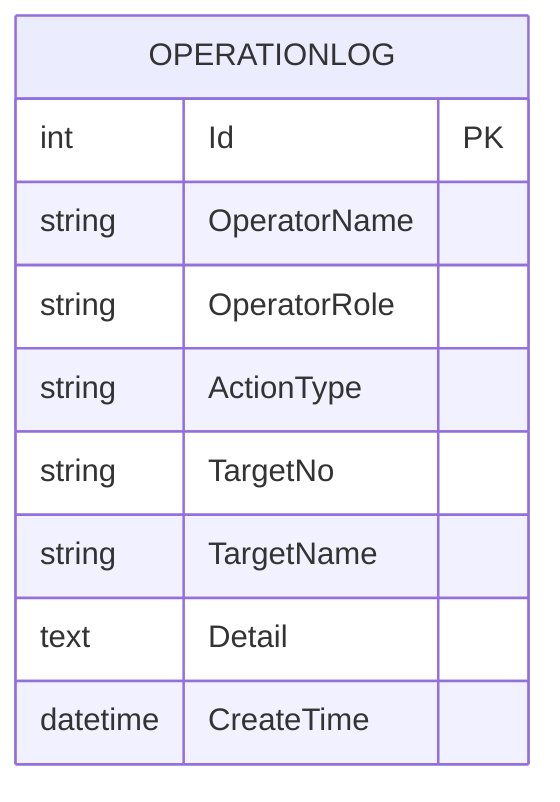
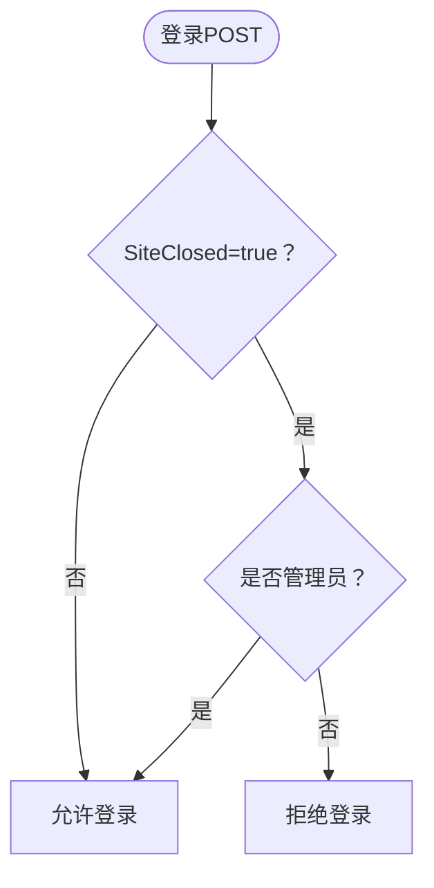
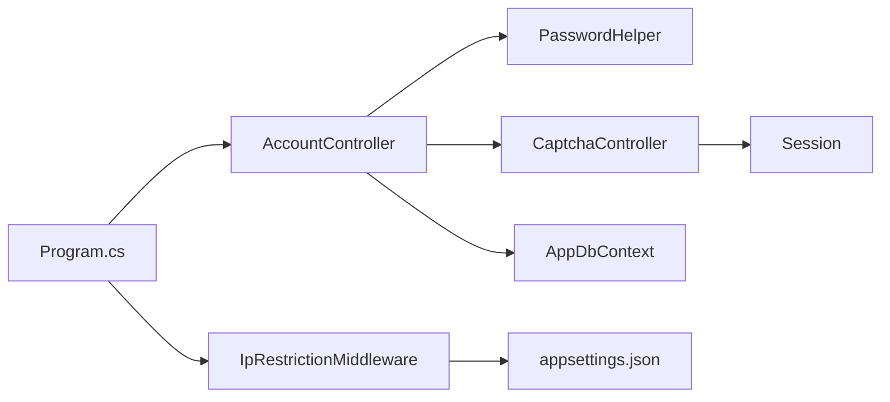

# 安全策略与防护

<cite>
**本文档引用的文件**
- [Program.cs](file://Program.cs)
- [appsettings.json](file://appsettings.json)
- [PasswordHelper.cs](file://Services/PasswordHelper.cs)
- [AccountController.cs](file://Controllers/AccountController.cs)
- [CaptchaController.cs](file://Controllers/CaptchaController.cs)
- [IpRestrictionMiddleware.cs](file://Middleware/IpRestrictionMiddleware.cs)
- [Login.cshtml](file://Views/Account/Login.cshtml)
- [ResetPassword.cshtml](file://Views/Account/ResetPassword.cshtml)
- [AppDbContext.cs](file://Data/AppDbContext.cs)
- [Models.cs](file://Models/Models.cs)
- [_Layout.cshtml](file://Views/Shared/_Layout.cshtml)
</cite>

## 目录
1. [引言](#引言)
2. [项目结构](#项目结构)
3. [核心组件](#核心组件)
4. [架构总览](#架构总览)
5. [详细组件分析](#详细组件分析)
6. [依赖关系分析](#依赖关系分析)
7. [性能考虑](#性能考虑)
8. [故障排除指南](#故障排除指南)
9. [结论](#结论)
10. [附录](#附录)

## 引言
本文件面向安全与运维团队，系统梳理该学生管理系统的安全策略与防护措施，覆盖密码安全、时间同步检测、验证码与IP限制、CSRF/XSS/SQL注入防护、安全审计与日志、以及网站关闭状态下的访问控制。文档基于仓库实际代码实现进行分析，并提供可视化图示帮助理解。

## 项目结构
系统采用ASP.NET Core MVC架构，主要安全相关模块分布如下：
- 启动与中间件配置：Program.cs、appsettings.json
- 认证与会话：Cookie认证、Anti-Forgery令牌
- 密码安全：PasswordHelper（PBKDF2哈希）
- 登录流程：AccountController（验证码、时间同步、强制改密）
- 验证码：CaptchaController（Session存储）
- 访问控制：IpRestrictionMiddleware（白名单）
- 安全审计：OperationLog实体与控制器日志记录
- 视图层：Login.cshtml、ResetPassword.cshtml（前端提示与令牌）

图表来源
- [Program.cs:1-123](file://Program.cs#L1-L123)
- [IpRestrictionMiddleware.cs:1-98](file://Middleware/IpRestrictionMiddleware.cs#L1-L98)
- [AccountController.cs:1-261](file://Controllers/AccountController.cs#L1-L261)
- [CaptchaController.cs:1-96](file://Controllers/CaptchaController.cs#L1-L96)
- [PasswordHelper.cs:1-42](file://Services/PasswordHelper.cs#L1-L42)
- [Login.cshtml:1-463](file://Views/Account/Login.cshtml#L1-L463)
- [ResetPassword.cshtml:1-84](file://Views/Account/ResetPassword.cshtml#L1-L84)
- [AppDbContext.cs:1-295](file://Data/AppDbContext.cs#L1-L295)
- [Models.cs:1-463](file://Models/Models.cs#L1-L463)

章节来源
- [Program.cs:1-123](file://Program.cs#L1-L123)
- [appsettings.json:1-16](file://appsettings.json#L1-L16)

## 核心组件
- 密码哈希与验证：使用ASP.NET Core Identity的PBKDF2算法，兼容旧版明文密码，支持重新哈希。
- 登录流程：验证码校验、时间同步检测、网站关闭状态控制、强制密码修改。
- 访问控制：IP白名单中间件，支持反向代理场景。
- 请求安全：Anti-Forgery令牌，Cookie会话配置。
- 安全审计：操作日志实体与控制器日志记录。

章节来源
- [PasswordHelper.cs:1-42](file://Services/PasswordHelper.cs#L1-L42)
- [AccountController.cs:1-261](file://Controllers/AccountController.cs#L1-L261)
- [IpRestrictionMiddleware.cs:1-98](file://Middleware/IpRestrictionMiddleware.cs#L1-L98)
- [Program.cs:15-41](file://Program.cs#L15-L41)
- [AppDbContext.cs:136-149](file://Data/AppDbContext.cs#L136-L149)

## 架构总览
系统在请求进入时先经过IP白名单中间件，再进入全局异常处理与路由，随后进行认证与授权。登录页面与验证码接口放行，避免阻断登录流程。

图表来源
- [Program.cs:46-96](file://Program.cs#L46-L96)
- [IpRestrictionMiddleware.cs:34-96](file://Middleware/IpRestrictionMiddleware.cs#L34-L96)
- [AccountController.cs:50-125](file://Controllers/AccountController.cs#L50-L125)
- [CaptchaController.cs:85-94](file://Controllers/CaptchaController.cs#L85-L94)
- [PasswordHelper.cs:18-34](file://Services/PasswordHelper.cs#L18-L34)

## 详细组件分析

### 密码安全策略
- 哈希算法：使用ASP.NET Core Identity的PBKDF2，具备足够抗暴力破解能力。
- 兼容性：支持旧版明文密码，验证失败时自动降级为明文比较，验证成功后触发重新哈希。
- 新密码规则：至少8位、包含字母与数字，登录后非管理员若密码不满足规则将被强制修改。
- 存储：密码字段直接存储哈希值，不保存明文。

图表来源
- [PasswordHelper.cs:18-34](file://Services/PasswordHelper.cs#L18-L34)
- [AccountController.cs:117-124](file://Controllers/AccountController.cs#L117-L124)
- [AccountController.cs:205-225](file://Controllers/AccountController.cs#L205-L225)

章节来源
- [PasswordHelper.cs:1-42](file://Services/PasswordHelper.cs#L1-L42)
- [AccountController.cs:205-225](file://Controllers/AccountController.cs#L205-L225)

### 时间同步检测机制
- 目的：防止时钟偏差导致的TTL/令牌失效或安全事件误判。
- 实现：登录前调用第三方接口获取互联网时间戳，计算与本地UTC时间差，超过5分钟则提示错误（不阻断页面渲染）。
- 配置：网络异常时静默处理，不影响登录。

图表来源
- [AccountController.cs:233-259](file://Controllers/AccountController.cs#L233-L259)

章节来源
- [AccountController.cs:233-259](file://Controllers/AccountController.cs#L233-L259)

### 验证码与IP限制中间件
- 验证码：生成4位数字SVG图片，存入Session，提交时比对并立即清除，防止复用。
- IP限制：支持白名单配置，支持反向代理场景（X-Forwarded-For），本地回环地址放行，登录页与静态资源放行。
- 配置：appsettings.json中的IpRestriction:AllowedIPs，默认放行所有。

图表来源
- [CaptchaController.cs:12-24](file://Controllers/CaptchaController.cs#L12-L24)
- [CaptchaController.cs:85-94](file://Controllers/CaptchaController.cs#L85-L94)
- [IpRestrictionMiddleware.cs:34-96](file://Middleware/IpRestrictionMiddleware.cs#L34-L96)
- [appsettings.json:9-11](file://appsettings.json#L9-L11)

章节来源
- [CaptchaController.cs:1-96](file://Controllers/CaptchaController.cs#L1-L96)
- [IpRestrictionMiddleware.cs:1-98](file://Middleware/IpRestrictionMiddleware.cs#L1-L98)
- [appsettings.json:9-11](file://appsettings.json#L9-L11)

### CSRF保护、XSS防护与SQL注入防护
- CSRF保护：启用Anti-Forgery，Header名为RequestVerificationToken，视图中通过隐藏表单注入令牌，AJAX请求需携带该头部。
- XSS防护：前端模板未直接拼接用户输入；登录页与改密页均使用服务端渲染，避免DOM XSS风险。
- SQL注入防护：使用Entity Framework Core进行ORM查询，参数化执行，避免字符串拼接SQL。

图表来源
- [Program.cs:15-16](file://Program.cs#L15-L16)
- [_Layout.cshtml:161-180](file://Views/Shared/_Layout.cshtml#L161-L180)
- [AccountController.cs:50-203](file://Controllers/AccountController.cs#L50-L203)

章节来源
- [Program.cs:15-16](file://Program.cs#L15-L16)
- [_Layout.cshtml:161-180](file://Views/Shared/_Layout.cshtml#L161-L180)
- [AccountController.cs:50-203](file://Controllers/AccountController.cs#L50-L203)

### 安全审计与日志记录
- 模型：OperationLog记录操作人、角色、动作类型、目标、详情与时间。
- 记录：控制器中封装日志记录方法，统一写入数据库。
- 清理：管理员可清空日志（需CSRF保护）。

图表来源
- [AppDbContext.cs:136-149](file://Data/AppDbContext.cs#L136-L149)
- [Models.cs:236-260](file://Models/Models.cs#L236-L260)

章节来源
- [AppDbContext.cs:136-149](file://Data/AppDbContext.cs#L136-L149)
- [Models.cs:236-260](file://Models/Models.cs#L236-L260)

### 网站关闭状态下的访问控制策略
- 配置：SiteClosed键控制网站状态，true时仅管理员可登录。
- 表现：登录页显示“仅管理员可登录”的提示；登录POST阶段进行角色校验。

图表来源
- [AccountController.cs:58-95](file://Controllers/AccountController.cs#L58-L95)
- [Login.cshtml:383-388](file://Views/Account/Login.cshtml#L383-L388)

章节来源
- [AccountController.cs:58-95](file://Controllers/AccountController.cs#L58-L95)
- [Login.cshtml:383-388](file://Views/Account/Login.cshtml#L383-L388)

## 依赖关系分析
- 组件耦合：AccountController依赖PasswordHelper、CaptchaController、AppDbContext；IpRestrictionMiddleware依赖配置；Program.cs集中注册认证、会话与中间件。
- 外部依赖：MySQL连接字符串、第三方时间接口。
- 潜在风险：IP白名单配置不当可能导致误封；验证码Session过期或并发冲突需关注。

图表来源
- [Program.cs:15-41](file://Program.cs#L15-L41)
- [IpRestrictionMiddleware.cs:16-32](file://Middleware/IpRestrictionMiddleware.cs#L16-L32)
- [AccountController.cs:17-26](file://Controllers/AccountController.cs#L17-L26)
- [CaptchaController.cs:18-19](file://Controllers/CaptchaController.cs#L18-L19)
- [appsettings.json:9-11](file://appsettings.json#L9-L11)

章节来源
- [Program.cs:15-41](file://Program.cs#L15-L41)
- [IpRestrictionMiddleware.cs:16-32](file://Middleware/IpRestrictionMiddleware.cs#L16-L32)
- [AccountController.cs:17-26](file://Controllers/AccountController.cs#L17-L26)
- [CaptchaController.cs:18-19](file://Controllers/CaptchaController.cs#L18-L19)
- [appsettings.json:9-11](file://appsettings.json#L9-L11)

## 性能考虑
- 验证码生成：SVG即时生成，Session存储简单，性能开销低。
- 时间同步检测：HTTP请求第三方接口，超时短（5秒），异常时静默处理，避免阻塞登录。
- IP白名单：HashSet查找O(1)，支持大量IP时仍具高效。
- Anti-Forgery：令牌生成与验证成本极低，建议保持开启。

## 故障排除指南
- 登录频繁提示时间不同步：检查服务器NTP同步；确认外网可达性。
- 验证码无效：确认Session可用、验证码未过期、提交时大小写不敏感。
- IP被拒绝：核对appsettings.json中AllowedIPs配置；反向代理需正确设置X-Forwarded-For。
- CSRF失败：确保AJAX请求携带RequestVerificationToken头部；表单包含隐藏令牌。
- 日志无法查看：确认数据库连接正常；检查OperationLogs表是否存在；管理员可清空日志。

章节来源
- [AccountController.cs:233-259](file://Controllers/AccountController.cs#L233-L259)
- [CaptchaController.cs:85-94](file://Controllers/CaptchaController.cs#L85-L94)
- [IpRestrictionMiddleware.cs:51-56](file://Middleware/IpRestrictionMiddleware.cs#L51-L56)
- [Program.cs:15-16](file://Program.cs#L15-L16)
- [AppDbContext.cs:136-149](file://Data/AppDbContext.cs#L136-L149)

## 结论
该系统在密码安全、访问控制、请求安全与审计方面实现了较为完善的多层防护。建议持续优化包括：强化IP白名单策略、引入更严格的会话安全配置、增强日志脱敏与归档、定期进行渗透测试与代码审计。

## 附录
- 最佳实践清单
  - 密码：强制8+字符、字母+数字；定期轮换；启用重新哈希。
  - 时间：启用NTP同步，监控偏差阈值。
  - 验证码：Session超时合理设置，提交后立即清理。
  - IP：生产环境明确白名单，记录拒绝日志。
  - CSRF：保持开启，AJAX统一携带令牌。
  - XSS：避免动态拼接HTML，使用HTML编码。
  - SQL注入：坚持ORM与参数化查询。
  - 审计：保留操作日志，定期备份与轮转，管理员权限最小化。