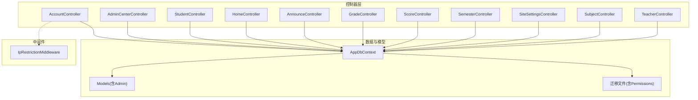
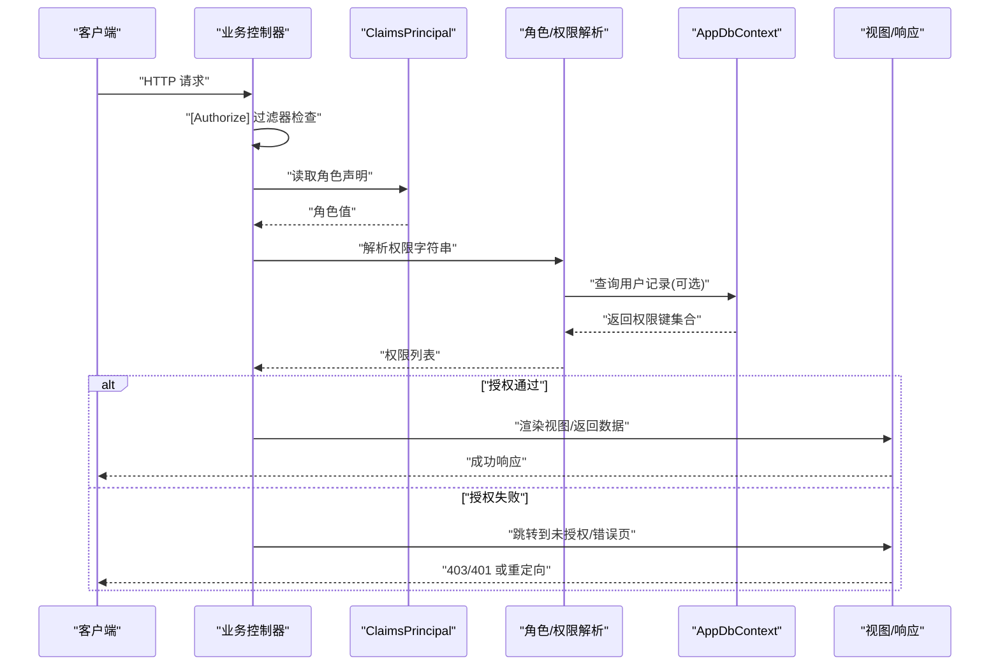
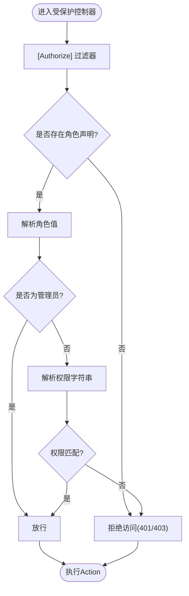
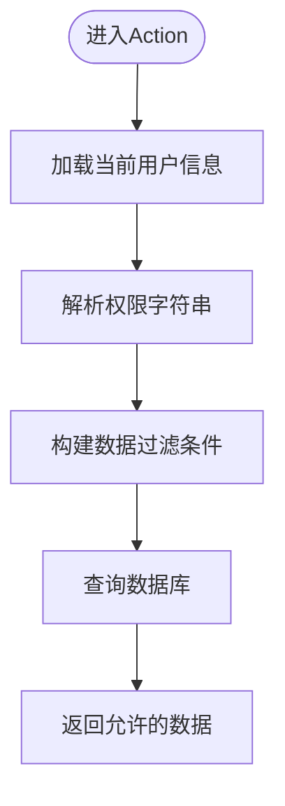
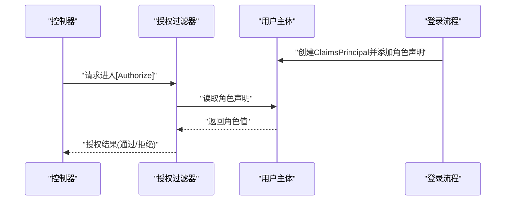
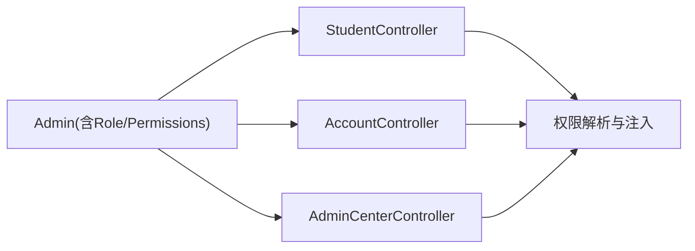
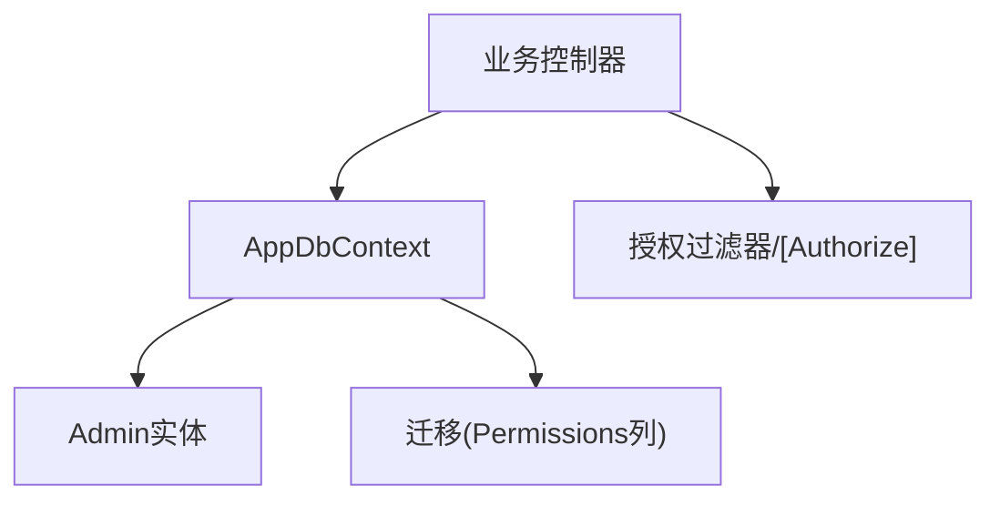

# 授权与访问控制

<cite>
**本文引用的文件**
- [Controllers/AccountController.cs](file://Controllers/AccountController.cs)
- [Controllers/AdminCenterController.cs](file://Controllers/AdminCenterController.cs)
- [Controllers/StudentController.cs](file://Controllers/StudentController.cs)
- [Controllers/HomeController.cs](file://Controllers/HomeController.cs)
- [Controllers/AnnounceController.cs](file://Controllers/AnnounceController.cs)
- [Controllers/GradeController.cs](file://Controllers/GradeController.cs)
- [Controllers/ScoreController.cs](file://Controllers/ScoreController.cs)
- [Controllers/SemesterController.cs](file://Controllers/SemesterController.cs)
- [Controllers/SiteSettingsController.cs](file://Controllers/SiteSettingsController.cs)
- [Controllers/StudentController.cs](file://Controllers/StudentController.cs)
- [Controllers/SubjectController.cs](file://Controllers/SubjectController.cs)
- [Controllers/TeacherController.cs](file://Controllers/TeacherController.cs)
- [Data/AppDbContext.cs](file://Data/AppDbContext.cs)
- [Middleware/IpRestrictionMiddleware.cs](file://Middleware/IpRestrictionMiddleware.cs)
- [Migrations/20260609075559_InitialCreate.cs](file://Migrations/20260609075559_InitialCreate.cs)
- [Migrations/20260609075559_InitialCreate.Designer.cs](file://Migrations/20260609075559_InitialCreate.Designer.cs)
- [Models/Models.cs](file://Models/Models.cs)
</cite>

## 目录
1. [引言](#引言)
2. [项目结构](#项目结构)
3. [核心组件](#核心组件)
4. [架构总览](#架构总览)
5. [详细组件分析](#详细组件分析)
6. [依赖关系分析](#依赖关系分析)
7. [性能考虑](#性能考虑)
8. [故障排除指南](#故障排除指南)
9. [结论](#结论)
10. [附录](#附录)

## 引言
本文件系统性梳理该学生管理系统的授权与访问控制机制，重点覆盖以下方面：
- 基于角色的授权实现：[Authorize]特性的使用、角色声明与权限校验流程
- 动态授权策略：基于用户角色的功能访问控制与数据访问权限
- 授权过滤器与自定义授权逻辑：ClaimsPrincipal、角色与权限字段的使用
- 跨控制器的权限传递与继承：权限字符串在控制器间的共享与复用
- 授权失败处理与用户体验优化：未授权/无权限时的响应与页面提示
- 授权缓存与性能优化：权限解析与缓存策略建议
- 多租户权限隔离：当前模型中角色/权限字段的分布与扩展思路

## 项目结构
系统采用经典的分层与按功能模块划分的控制器组织方式，授权相关的关键点集中在：
- 控制器层：大量控制器通过[Authorize]特性保护，部分登录/验证码等控制器使用[AllowAnonymous]
- 数据层：DbContext与迁移文件中包含“Permissions”字段，用于存储用户权限键集合
- 模型层：Admin实体包含“Permissions”和“Role”，作为授权判断的核心数据源
- 中间件层：IP限制中间件用于网络层面的访问控制

**图表来源**
- [Controllers/AccountController.cs:20-120](file://Controllers/AccountController.cs#L20-L120)
- [Controllers/AdminCenterController.cs:1-80](file://Controllers/AdminCenterController.cs#L1-L80)
- [Controllers/StudentController.cs:200-600](file://Controllers/StudentController.cs#L200-L600)
- [Data/AppDbContext.cs](file://Data/AppDbContext.cs)
- [Models/Models.cs:40-60](file://Models/Models.cs#L40-L60)
- [Migrations/20260609075559_InitialCreate.cs:50-70](file://Migrations/20260609075559_InitialCreate.cs#L50-L70)
- [Middleware/IpRestrictionMiddleware.cs](file://Middleware/IpRestrictionMiddleware.cs)

**章节来源**
- [Controllers/AccountController.cs:20-120](file://Controllers/AccountController.cs#L20-L120)
- [Controllers/AdminCenterController.cs:1-80](file://Controllers/AdminCenterController.cs#L1-L80)
- [Controllers/StudentController.cs:200-600](file://Controllers/StudentController.cs#L200-L600)
- [Data/AppDbContext.cs](file://Data/AppDbContext.cs)
- [Models/Models.cs:40-60](file://Models/Models.cs#L40-L60)
- [Migrations/20260609075559_InitialCreate.cs:50-70](file://Migrations/20260609075559_InitialCreate.cs#L50-L70)
- [Middleware/IpRestrictionMiddleware.cs](file://Middleware/IpRestrictionMiddleware.cs)

## 核心组件
- 角色与权限字段
  - Admin实体包含“Role”和“Permissions”字段，用于标识用户角色与权限键集合
  - 权限以逗号分隔的字符串形式存储，便于快速解析与匹配
- ClaimsPrincipal与角色声明
  - 登录流程中为用户主体添加“Role”声明，后续授权判断依赖该声明值
- 控制器授权特性
  - 大多数业务控制器使用[Authorize]保护；登录/验证码等控制器使用[AllowAnonymous]放行
- 权限解析与缓存
  - 在StudentController中提供权限解析方法，返回当前用户的权限列表
  - 可结合内存缓存或会话缓存减少重复解析成本

**章节来源**
- [Models/Models.cs:40-60](file://Models/Models.cs#L40-L60)
- [Controllers/AccountController.cs:90-130](file://Controllers/AccountController.cs#L90-L130)
- [Controllers/StudentController.cs:960-980](file://Controllers/StudentController.cs#L960-L980)

## 架构总览
下图展示了从请求进入系统到授权决策与响应的整体流程，涵盖控制器授权、角色与权限解析、以及失败处理路径。

**图表来源**
- [Controllers/AccountController.cs:90-130](file://Controllers/AccountController.cs#L90-L130)
- [Controllers/AdminCenterController.cs:40-80](file://Controllers/AdminCenterController.cs#L40-L80)
- [Controllers/StudentController.cs:960-980](file://Controllers/StudentController.cs#L960-L980)
- [Data/AppDbContext.cs](file://Data/AppDbContext.cs)

## 详细组件分析

### 基于角色的授权与[Authorize]特性
- 全局授权保护
  - 多数业务控制器（如AdminCenter、Announce、Grade、Score、Semester、SiteSettings、Subject、Teacher）均使用[Authorize]特性进行全局授权保护
  - 登录/验证码等控制器使用[AllowAnonymous]允许匿名访问
- 角色声明注入
  - 登录成功后，系统为用户主体添加“Role”声明，后续授权判断依赖该声明
- 角色验证与权限检查
  - 控制器内部通过读取Claims中的角色值进行基本的角色校验
  - 管理员角色拥有最高权限，其他角色根据权限字符串进行细粒度控制

**图表来源**
- [Controllers/AccountController.cs:90-130](file://Controllers/AccountController.cs#L90-L130)
- [Controllers/AdminCenterController.cs:40-80](file://Controllers/AdminCenterController.cs#L40-L80)
- [Controllers/StudentController.cs:960-980](file://Controllers/StudentController.cs#L960-L980)

**章节来源**
- [Controllers/AccountController.cs:20-120](file://Controllers/AccountController.cs#L20-L120)
- [Controllers/AdminCenterController.cs:1-80](file://Controllers/AdminCenterController.cs#L1-L80)
- [Controllers/StudentController.cs:200-300](file://Controllers/StudentController.cs#L200-L300)

### 动态授权策略：功能访问与数据访问
- 功能访问控制
  - 管理员角色可访问所有功能；非管理员角色根据权限字符串决定可访问的菜单项与操作
  - 权限字符串在Admin实体中存储，控制器在渲染视图前解析并注入到ViewBag/局部变量
- 数据访问权限
  - 部分控制器在查询数据时结合当前用户角色与权限，仅返回允许范围内的数据集
  - 示例：管理员可查看全部数据；教师仅能查看其任教班级/科目相关数据（具体实现需结合业务逻辑）

**图表来源**
- [Controllers/AdminCenterController.cs:240-335](file://Controllers/AdminCenterController.cs#L240-L335)
- [Controllers/StudentController.cs:200-230](file://Controllers/StudentController.cs#L200-L230)

**章节来源**
- [Controllers/AdminCenterController.cs:240-335](file://Controllers/AdminCenterController.cs#L240-L335)
- [Controllers/StudentController.cs:200-230](file://Controllers/StudentController.cs#L200-L230)

### 授权过滤器与自定义授权逻辑
- 授权过滤器
  - [Authorize]特性由框架内置过滤器实现，拦截请求并进行身份与角色校验
- 自定义授权逻辑
  - 登录流程中手动构造ClaimsPrincipal并添加“Role”声明，确保后续授权链路可用
  - 控制器内通过User.FindFirst(ClaimTypes.Role)读取角色值，再结合权限字符串进行二次校验

**图表来源**
- [Controllers/AccountController.cs:90-130](file://Controllers/AccountController.cs#L90-L130)
- [Controllers/StudentController.cs:960-980](file://Controllers/StudentController.cs#L960-L980)

**章节来源**
- [Controllers/AccountController.cs:90-130](file://Controllers/AccountController.cs#L90-L130)
- [Controllers/StudentController.cs:960-980](file://Controllers/StudentController.cs#L960-L980)

### 跨控制器的权限传递与继承
- 权限传递
  - 权限字符串存储在Admin实体中，各控制器在需要时读取并解析，形成统一的权限视图
  - 示例：在StudentController中解析当前用户权限，并将其注入到视图上下文
- 权限继承
  - 管理员角色对所有功能具有继承性权限；普通角色的权限由其权限字符串决定
  - 不同控制器之间共享同一套权限规则，避免重复配置

**图表来源**
- [Models/Models.cs:40-60](file://Models/Models.cs#L40-L60)
- [Controllers/StudentController.cs:200-230](file://Controllers/StudentController.cs#L200-L230)
- [Controllers/AdminCenterController.cs:240-335](file://Controllers/AdminCenterController.cs#L240-L335)

**章节来源**
- [Models/Models.cs:40-60](file://Models/Models.cs#L40-L60)
- [Controllers/StudentController.cs:200-230](file://Controllers/StudentController.cs#L200-L230)
- [Controllers/AdminCenterController.cs:240-335](file://Controllers/AdminCenterController.cs#L240-L335)

### 授权失败处理与用户体验优化
- 未授权/无权限响应
  - 授权失败时，系统通常跳转至错误页或未授权页，避免泄露敏感信息
- 用户体验优化
  - 在登录页与导航菜单中根据用户角色与权限动态显示/隐藏功能入口
  - 对于频繁访问的权限判断，建议引入缓存以减少延迟

**章节来源**
- [Controllers/HomeController.cs:10-20](file://Controllers/HomeController.cs#L10-L20)
- [Controllers/HomeController.cs:220-240](file://Controllers/HomeController.cs#L220-L240)

### 授权缓存机制与性能优化
- 缓存策略建议
  - 将权限字符串解析后的权限列表缓存于内存或分布式缓存中，设置合理的过期时间
  - 结合用户ID与角色变化事件更新缓存，避免脏读
- 性能优化
  - 减少数据库查询次数：优先从缓存读取权限；必要时批量查询用户信息
  - 使用异步方法进行权限解析与数据库访问，提升并发性能

**章节来源**
- [Controllers/StudentController.cs:960-980](file://Controllers/StudentController.cs#L960-L980)

### 多租户环境下的权限隔离策略
- 当前模型
  - 系统通过“Role”和“Permissions”字段实现基础的权限隔离，适用于单租户场景
- 扩展思路
  - 在Admin实体中增加租户标识字段，并在权限解析与数据查询时加入租户过滤条件
  - 在数据库层面为关键表增加租户维度索引，确保查询效率

**章节来源**
- [Models/Models.cs:40-60](file://Models/Models.cs#L40-L60)
- [Data/AppDbContext.cs](file://Data/AppDbContext.cs)

## 依赖关系分析
- 控制器依赖
  - 所有业务控制器依赖AppDbContext进行用户信息与权限数据的读取
  - AdminCenterController在权限管理界面中直接操作权限字符串
- 数据模型依赖
  - Admin实体的“Role”和“Permissions”字段是授权判断的核心
- 迁移与持久化
  - 迁移文件中包含“Permissions”列，确保权限字段在数据库层面得到持久化

**图表来源**
- [Controllers/AdminCenterController.cs:240-335](file://Controllers/AdminCenterController.cs#L240-L335)
- [Data/AppDbContext.cs](file://Data/AppDbContext.cs)
- [Migrations/20260609075559_InitialCreate.cs:50-70](file://Migrations/20260609075559_InitialCreate.cs#L50-L70)
- [Models/Models.cs:40-60](file://Models/Models.cs#L40-L60)

**章节来源**
- [Controllers/AdminCenterController.cs:240-335](file://Controllers/AdminCenterController.cs#L240-L335)
- [Data/AppDbContext.cs](file://Data/AppDbContext.cs)
- [Migrations/20260609075559_InitialCreate.cs:50-70](file://Migrations/20260609075559_InitialCreate.cs#L50-L70)
- [Models/Models.cs:40-60](file://Models/Models.cs#L40-L60)

## 性能考虑
- 权限解析性能
  - 将权限字符串解析为集合的操作应尽量缓存，避免每次请求重复计算
- 数据库访问
  - 合理设计索引，确保按角色与权限字段的查询高效
- 并发与异步
  - 使用异步API进行数据库与缓存访问，提高吞吐量

## 故障排除指南
- 授权失败排查
  - 检查登录流程是否正确添加“Role”声明
  - 确认[Authorize]特性是否被正确应用到目标控制器/Action
  - 核对Admin实体的“Permissions”字段是否为空或格式不正确
- 权限不生效
  - 确认控制器内权限解析逻辑是否正确读取并匹配权限字符串
  - 检查视图层是否正确接收并使用权限变量

**章节来源**
- [Controllers/AccountController.cs:90-130](file://Controllers/AccountController.cs#L90-L130)
- [Controllers/StudentController.cs:960-980](file://Controllers/StudentController.cs#L960-L980)

## 结论
该系统通过[Authorize]特性、角色声明与权限字符串实现了清晰的授权与访问控制体系。管理员角色享有最高权限，普通角色通过权限字符串实现细粒度控制。建议进一步完善权限缓存与多租户隔离能力，持续提升安全性与性能表现。

## 附录
- 关键实现位置参考
  - 登录与角色声明：[Controllers/AccountController.cs:90-130](file://Controllers/AccountController.cs#L90-L130)
  - 权限解析与注入：[Controllers/StudentController.cs:200-230](file://Controllers/StudentController.cs#L200-L230)、[Controllers/StudentController.cs:960-980](file://Controllers/StudentController.cs#L960-L980)
  - 管理员权限管理界面：[Controllers/AdminCenterController.cs:240-335](file://Controllers/AdminCenterController.cs#L240-L335)
  - 权限字段定义与迁移：[Models/Models.cs:40-60](file://Models/Models.cs#L40-L60)、[Migrations/20260609075559_InitialCreate.cs:50-70](file://Migrations/20260609075559_InitialCreate.cs#L50-L70)
  - IP限制中间件：[Middleware/IpRestrictionMiddleware.cs](file://Middleware/IpRestrictionMiddleware.cs)