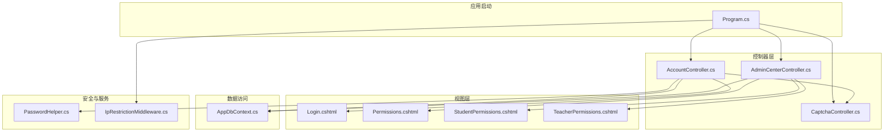
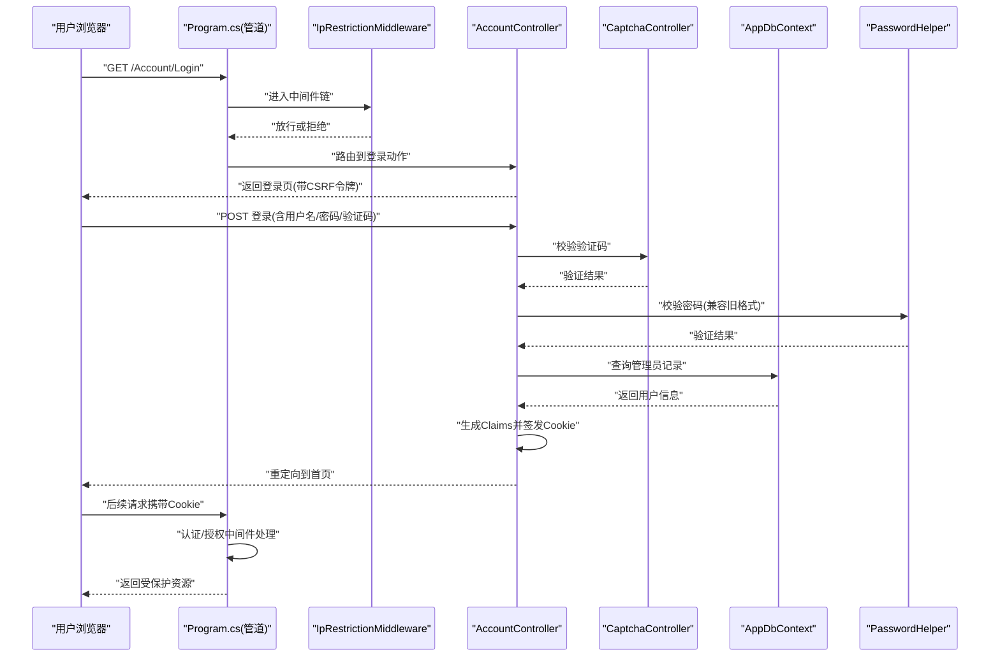
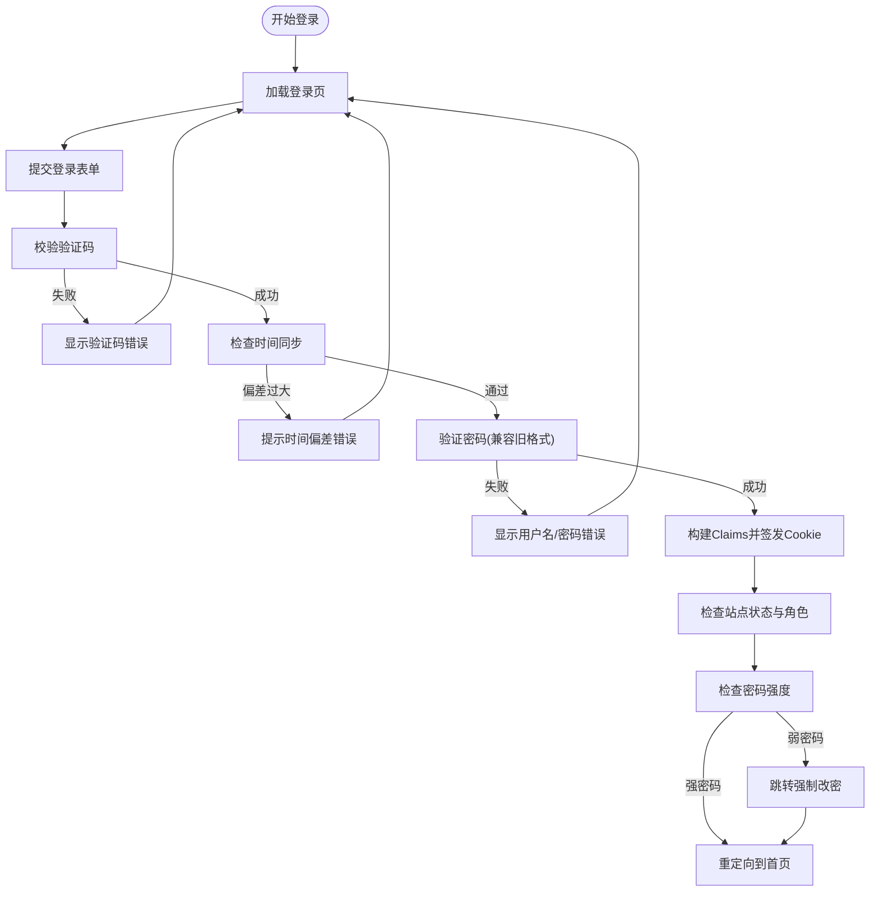
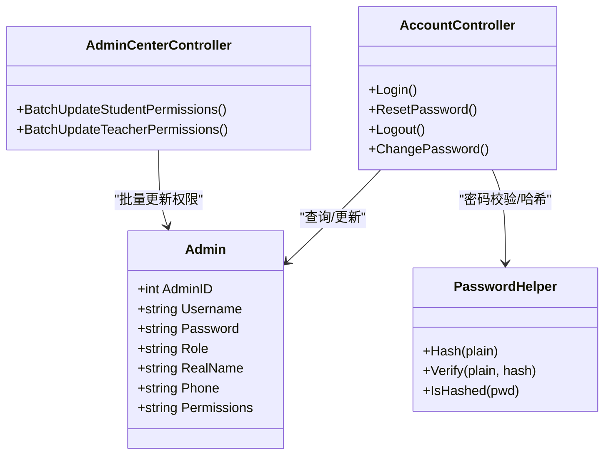
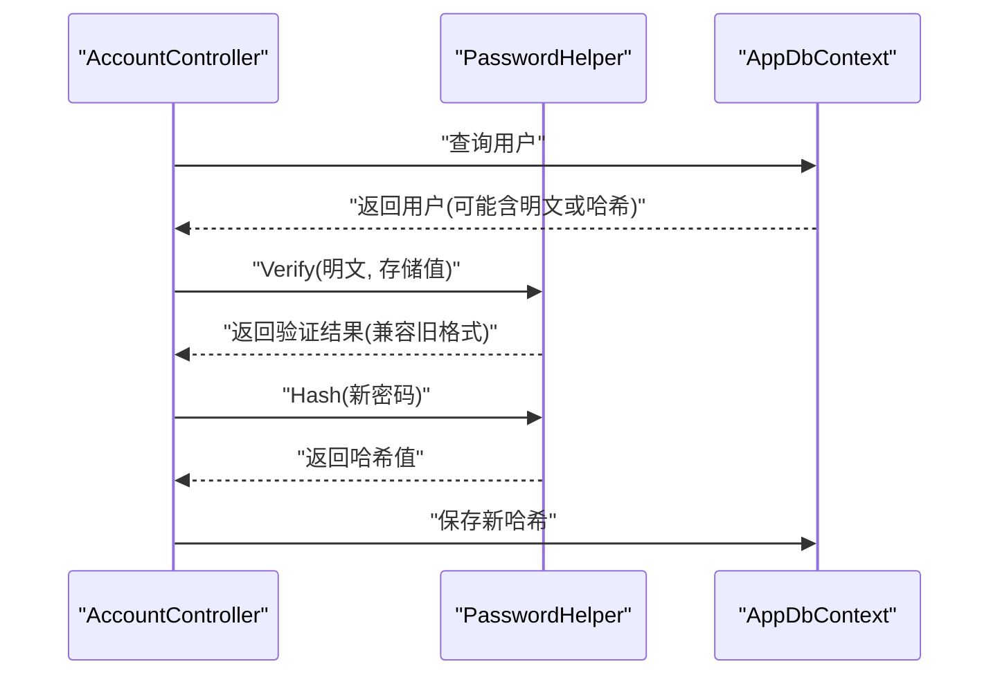
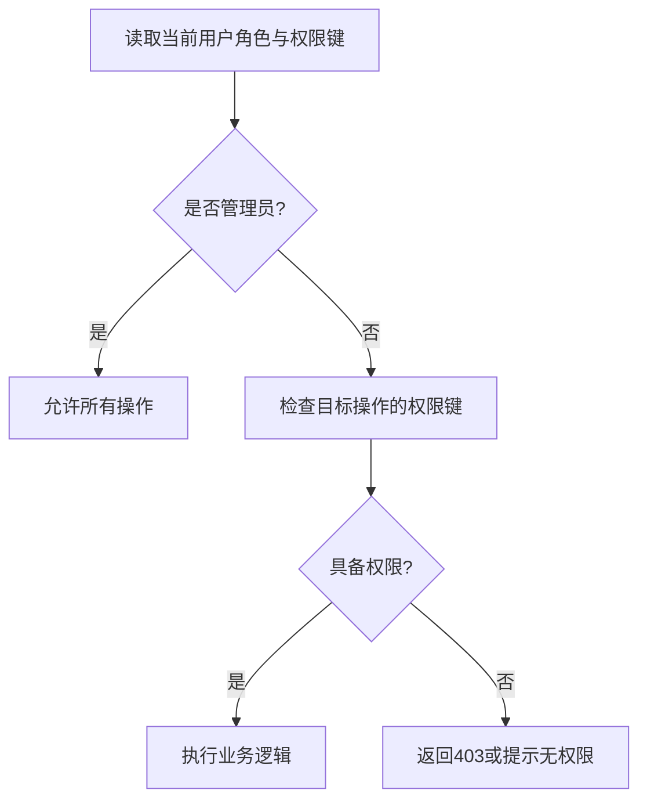
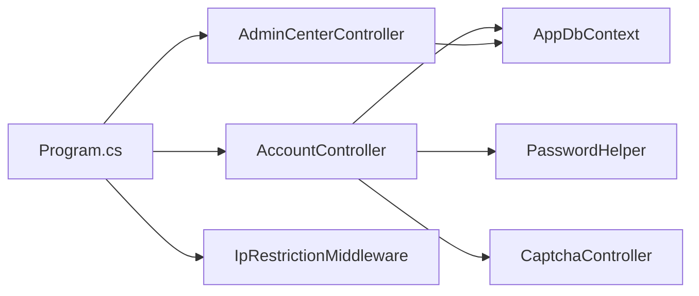

# 用户认证与权限管理

<cite>
**本文档引用的文件**
- [Program.cs](file://Program.cs)
- [AccountController.cs](file://Controllers/AccountController.cs)
- [AppDbContext.cs](file://Data/AppDbContext.cs)
- [PasswordHelper.cs](file://Services/PasswordHelper.cs)
- [IpRestrictionMiddleware.cs](file://Middleware/IpRestrictionMiddleware.cs)
- [CaptchaController.cs](file://Controllers/CaptchaController.cs)
- [Login.cshtml](file://Views/Account/Login.cshtml)
- [Permissions.cshtml](file://Views/AdminCenter/Permissions.cshtml)
- [StudentPermissions.cshtml](file://Views/AdminCenter/StudentPermissions.cshtml)
- [TeacherPermissions.cshtml](file://Views/AdminCenter/TeacherPermissions.cshtml)
- [AdminCenterController.cs](file://Controllers/AdminCenterController.cs)
</cite>

## 目录
1. [简介](#简介)
2. [项目结构](#项目结构)
3. [核心组件](#核心组件)
4. [架构总览](#架构总览)
5. [详细组件分析](#详细组件分析)
6. [依赖关系分析](#依赖关系分析)
7. [性能考虑](#性能考虑)
8. [故障排除指南](#故障排除指南)
9. [结论](#结论)
10. [附录](#附录)

## 简介
本文件面向“用户认证与权限管理”主题，系统性梳理基于Cookie的身份认证机制、会话管理与自动登出策略，角色权限体系设计（管理员、教师、学生相关角色），以及ASP.NET Core Identity框架在项目中的集成与使用。同时，结合项目现状说明自定义授权策略、权限配置最佳实践（继承、组合、动态检查），并给出针对CSRF、XSS、SQL注入等常见安全风险的防护建议。

## 项目结构
该项目采用典型的分层架构：
- 表现层：Controllers、Views、静态资源
- 数据访问层：Data/AppDbContext.cs（Entity Framework Core）
- 安全与中间件：Program.cs（认证、会话、全局异常）、IpRestrictionMiddleware.cs（IP白名单）
- 辅助服务：PasswordHelper.cs（密码哈希/校验）

图表来源
- [Program.cs:1-123](file://Program.cs#L1-L123)
- [AccountController.cs:15-261](file://Controllers/AccountController.cs#L15-L261)
- [AppDbContext.cs:6-295](file://Data/AppDbContext.cs#L6-L295)
- [PasswordHelper.cs:1-42](file://Services/PasswordHelper.cs#L1-L42)
- [IpRestrictionMiddleware.cs:1-98](file://Middleware/IpRestrictionMiddleware.cs#L1-L98)
- [CaptchaController.cs:1-96](file://Controllers/CaptchaController.cs#L1-L96)
- [Login.cshtml:1-463](file://Views/Account/Login.cshtml#L1-L463)
- [Permissions.cshtml:1-27](file://Views/AdminCenter/Permissions.cshtml#L1-L27)
- [StudentPermissions.cshtml:1-82](file://Views/AdminCenter/StudentPermissions.cshtml#L1-L82)
- [TeacherPermissions.cshtml:1-87](file://Views/AdminCenter/TeacherPermissions.cshtml#L1-L87)

章节来源
- [Program.cs:1-123](file://Program.cs#L1-L123)
- [AccountController.cs:15-261](file://Controllers/AccountController.cs#L15-L261)
- [AppDbContext.cs:6-295](file://Data/AppDbContext.cs#L6-L295)

## 核心组件
- Cookie身份认证与会话管理：通过Program.cs中AddAuthentication/AddCookie配置，设置登录/登出路径、过期时间与滑动过期。
- 登录控制器：AccountController.cs负责登录表单处理、验证码校验、时间同步检测、密码校验、Claims生成与持久化、强制改密逻辑。
- 密码安全：PasswordHelper.cs封装Identity的PBKDF2算法，支持新旧密码格式兼容。
- 权限管理：AdminCenterController.cs提供批量权限配置接口，视图层通过Permissions.cshtml、StudentPermissions.cshtml、TeacherPermissions.cshtml展示与编辑。
- IP白名单：IpRestrictionMiddleware.cs限制访问来源，保障部署环境安全。
- 验证码：CaptchaController.cs生成SVG验证码并存入Session，AccountController在登录时校验。

章节来源
- [Program.cs:23-32](file://Program.cs#L23-L32)
- [AccountController.cs:50-125](file://Controllers/AccountController.cs#L50-L125)
- [PasswordHelper.cs:8-41](file://Services/PasswordHelper.cs#L8-L41)
- [AdminCenterController.cs:250-321](file://Controllers/AdminCenterController.cs#L250-L321)
- [IpRestrictionMiddleware.cs:10-98](file://Middleware/IpRestrictionMiddleware.cs#L10-L98)
- [CaptchaController.cs:5-96](file://Controllers/CaptchaController.cs#L5-L96)

## 架构总览
下图展示了从请求进入至响应返回的关键流程，涵盖认证、授权、权限检查与异常处理。

图表来源
- [Program.cs:47-96](file://Program.cs#L47-L96)
- [IpRestrictionMiddleware.cs:34-96](file://Middleware/IpRestrictionMiddleware.cs#L34-L96)
- [AccountController.cs:50-125](file://Controllers/AccountController.cs#L50-L125)
- [CaptchaController.cs:85-94](file://Controllers/CaptchaController.cs#L85-L94)
- [AppDbContext.cs:10-12](file://Data/AppDbContext.cs#L10-L12)
- [PasswordHelper.cs:18-34](file://Services/PasswordHelper.cs#L18-L34)

## 详细组件分析

### 组件A：基于Cookie的身份认证与会话管理
- 认证方案：使用Cookie认证，默认滑动过期，登录/登出/访问受限路径均在Program.cs中集中配置。
- 登录流程：表单提交→验证码校验→时间同步检测→密码校验→生成Claims→签发Cookie→根据角色与密码强度决定是否跳转强制改密。
- 会话策略：登录时可选择“记住我”，并设置固定过期时间；后台统一滑动过期。
- 自动登出：通过Cookie过期时间到达触发；也可在服务端主动SignOutAsync实现即时登出。

图表来源
- [AccountController.cs:50-125](file://Controllers/AccountController.cs#L50-L125)
- [CaptchaController.cs:85-94](file://Controllers/CaptchaController.cs#L85-L94)
- [Program.cs:24-32](file://Program.cs#L24-L32)

章节来源
- [Program.cs:23-32](file://Program.cs#L23-L32)
- [AccountController.cs:50-125](file://Controllers/AccountController.cs#L50-L125)

### 组件B：角色权限体系与访问控制
- 角色字段：Admin实体包含Role字段，用于标识管理员角色（例如“管理员”、“教师”等）。
- RBAC实现：登录时将角色作为Claim写入Cookie；视图层与控制器中通过角色判断实现基础访问控制（如仅管理员可见的权限管理页面）。
- 权限存储：除角色外，还支持通过字符串字段存储细粒度权限键（如student_edit、student_delete、student_add等），便于动态权限检查与批量配置。
- 访问控制示例：
  - 角色级：在视图中直接判断角色，非管理员直接提示无权限。
  - 权限键级：在控制器中读取权限键集合，逐项判断是否允许执行某操作。

图表来源
- [AppDbContext.cs:34-48](file://Data/AppDbContext.cs#L34-L48)
- [AccountController.cs:80-88](file://Controllers/AccountController.cs#L80-L88)
- [AdminCenterController.cs:260-321](file://Controllers/AdminCenterController.cs#L260-L321)
- [PasswordHelper.cs:12-40](file://Services/PasswordHelper.cs#L12-L40)

章节来源
- [AppDbContext.cs:34-48](file://Data/AppDbContext.cs#L34-L48)
- [Permissions.cshtml:1-27](file://Views/AdminCenter/Permissions.cshtml#L1-L27)
- [StudentPermissions.cshtml:1-82](file://Views/AdminCenter/StudentPermissions.cshtml#L1-L82)
- [TeacherPermissions.cshtml:1-87](file://Views/AdminCenter/TeacherPermissions.cshtml#L1-L87)
- [AdminCenterController.cs:250-321](file://Controllers/AdminCenterController.cs#L250-L321)

### 组件C：ASP.NET Core Identity集成与密码安全
- 集成方式：PasswordHelper.cs使用Identity的PasswordHasher进行PBKDF2哈希，兼容旧版明文密码，保证平滑迁移。
- 安全策略：
  - 新密码规则：长度≥8、包含字母与数字。
  - 强制改密：非管理员且密码不符合新规则时，登录后强制跳转改密。
  - 密码验证：优先识别Identity格式哈希，其次兼容明文，避免暴力破解与重放攻击。

图表来源
- [AccountController.cs:84-88](file://Controllers/AccountController.cs#L84-L88)
- [AccountController.cs:168-169](file://Controllers/AccountController.cs#L168-L169)
- [PasswordHelper.cs:18-40](file://Services/PasswordHelper.cs#L18-L40)

章节来源
- [PasswordHelper.cs:8-41](file://Services/PasswordHelper.cs#L8-L41)
- [AccountController.cs:205-225](file://Controllers/AccountController.cs#L205-L225)

### 组件D：自定义授权策略与权限配置最佳实践
- 基于角色的访问控制（RBAC）：通过ClaimTypes.Role与视图/控制器的角色判断实现。
- 基于资源的访问控制：通过Permissions字段存储权限键集合，实现细粒度控制（如学生档案编辑、删除、添加）。
- 最佳实践：
  - 权限继承：管理员拥有最高权限，无需显式列出；普通角色按需授予。
  - 权限组合：使用逗号分隔的权限键集合，支持多权限叠加。
  - 动态权限检查：在控制器中读取当前用户权限键集合，逐项判断。
  - 批量配置：AdminCenterController提供批量更新接口，前端表格化展示与操作。

图表来源
- [Permissions.cshtml:8-12](file://Views/AdminCenter/Permissions.cshtml#L8-L12)
- [StudentPermissions.cshtml:62-68](file://Views/AdminCenter/StudentPermissions.cshtml#L62-L68)
- [TeacherPermissions.cshtml:66-73](file://Views/AdminCenter/TeacherPermissions.cshtml#L66-L73)
- [AdminCenterController.cs:260-321](file://Controllers/AdminCenterController.cs#L260-L321)

章节来源
- [Permissions.cshtml:1-27](file://Views/AdminCenter/Permissions.cshtml#L1-L27)
- [StudentPermissions.cshtml:1-82](file://Views/AdminCenter/StudentPermissions.cshtml#L1-L82)
- [TeacherPermissions.cshtml:1-87](file://Views/AdminCenter/TeacherPermissions.cshtml#L1-L87)
- [AdminCenterController.cs:250-321](file://Controllers/AdminCenterController.cs#L250-L321)

### 组件E：安全防护措施
- CSRF保护：启用Antiforgery并配置Header名称，登录页与表单均包含AntiForgeryToken，AJAX请求通过RequestVerificationToken头部传递令牌。
- XSS防护：视图中对用户输入进行HTML转义与最小化直接输出，避免脚本注入。
- SQL注入防护：使用Entity Framework Core的参数化查询与LINQ，避免拼接SQL。
- IP白名单：IpRestrictionMiddleware仅允许配置的IP访问，登录页与静态资源除外，支持反向代理场景下的X-Forwarded-For解析。
- 时间同步：登录前检测服务器与互联网时间偏差，超限时拒绝登录，降低时序攻击风险。

章节来源
- [Program.cs:15-16](file://Program.cs#L15-L16)
- [Login.cshtml:408-410](file://Views/Account/Login.cshtml#L408-L410)
- [Program.cs:47-96](file://Program.cs#L47-L96)
- [IpRestrictionMiddleware.cs:34-96](file://Middleware/IpRestrictionMiddleware.cs#L34-L96)
- [AccountController.cs:72-78](file://Controllers/AccountController.cs#L72-L78)

## 依赖关系分析
- 控制器依赖：
  - AccountController依赖AppDbContext进行用户查询、PasswordHelper进行密码校验、CaptchaController进行验证码校验。
  - AdminCenterController依赖AppDbContext进行批量权限更新。
- 中间件依赖：Program.cs注册认证、会话、异常处理与状态码页面；IpRestrictionMiddleware独立于认证链但前置执行。
- 数据模型：Admin实体承载角色与权限键，作为RBAC与权限检查的基础。

图表来源
- [AccountController.cs:17-26](file://Controllers/AccountController.cs#L17-L26)
- [AdminCenterController.cs:1-20](file://Controllers/AdminCenterController.cs#L1-L20)
- [Program.cs:1-123](file://Program.cs#L1-L123)
- [IpRestrictionMiddleware.cs:10-32](file://Middleware/IpRestrictionMiddleware.cs#L10-L32)

章节来源
- [AccountController.cs:17-26](file://Controllers/AccountController.cs#L17-L26)
- [AdminCenterController.cs:1-20](file://Controllers/AdminCenterController.cs#L1-L20)
- [Program.cs:1-123](file://Program.cs#L1-L123)

## 性能考虑
- Cookie过期与滑动过期：合理设置ExpireTimeSpan与SlidingExpiration，平衡安全性与用户体验。
- 密码哈希成本：Identity PBKDF2默认成本适中，若硬件资源紧张可评估调整，但需权衡安全与性能。
- 验证码缓存：验证码存储在Session中，注意分布式部署时使用Redis等共享缓存。
- 数据库查询：登录与权限检查尽量使用索引列（如Username、AdminID），减少全表扫描。

## 故障排除指南
- 登录失败（用户名/密码错误）：检查密码哈希与明文兼容逻辑，确认用户是否存在。
- 验证码无效：确认Session中验证码存在且未被重复使用，检查CaptchaController/Index与Validate流程。
- 时间同步错误：检查CheckTimeSyncAsync调用的第三方API可用性与网络连通性。
- 会话丢失：确认Cookie域与路径、HttpOnly与SameSite策略，以及滑动过期配置。
- IP被拒绝：核对IpRestrictionMiddleware的AllowedIPs配置与X-Forwarded-For解析逻辑。

章节来源
- [AccountController.cs:62-88](file://Controllers/AccountController.cs#L62-L88)
- [CaptchaController.cs:85-94](file://Controllers/CaptchaController.cs#L85-L94)
- [Program.cs:23-32](file://Program.cs#L23-L32)
- [IpRestrictionMiddleware.cs:16-32](file://Middleware/IpRestrictionMiddleware.cs#L16-L32)

## 结论
本系统基于Cookie实现了完整的身份认证与会话管理，并通过ASP.NET Core Identity提供安全的密码存储与校验。权限体系采用RBAC与资源级权限键相结合的方式，辅以批量配置与动态检查，满足管理员、教师等多角色场景需求。配合CSRF、XSS、SQL注入与IP白名单等安全措施，整体具备较好的安全性与可维护性。

## 附录
- 关键配置参考
  - Cookie认证：登录/登出/访问受限路径与过期时间
  - Anti-XSRF：Header名称与表单令牌
  - Session：超时与HttpOnly
  - IP白名单：AllowedIPs与放行路径

章节来源
- [Program.cs:23-41](file://Program.cs#L23-L41)
- [Login.cshtml:408-410](file://Views/Account/Login.cshtml#L408-L410)
- [IpRestrictionMiddleware.cs:16-32](file://Middleware/IpRestrictionMiddleware.cs#L16-L32)