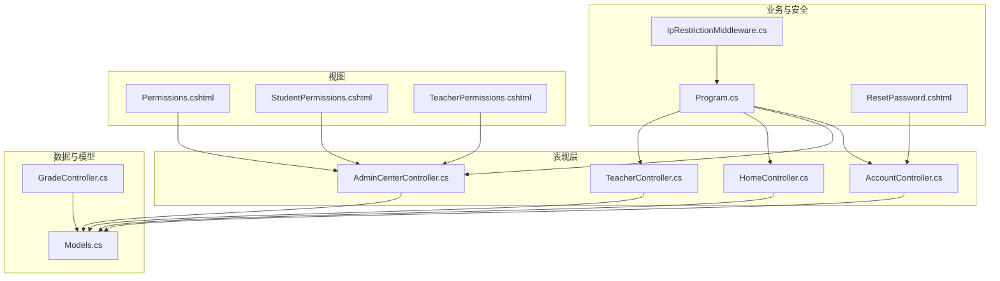
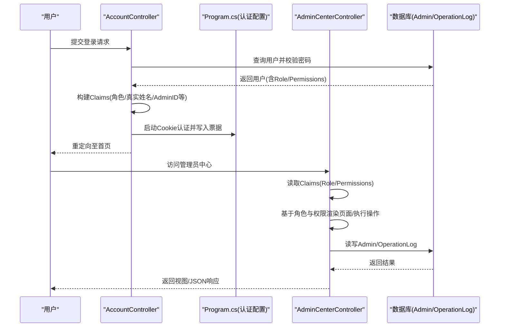
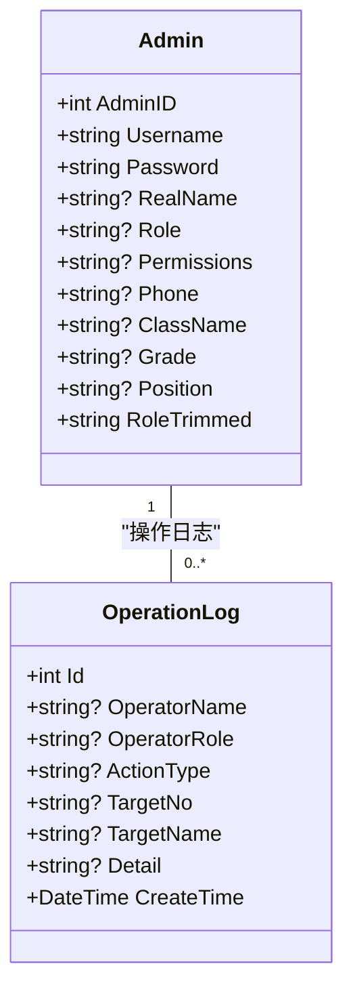
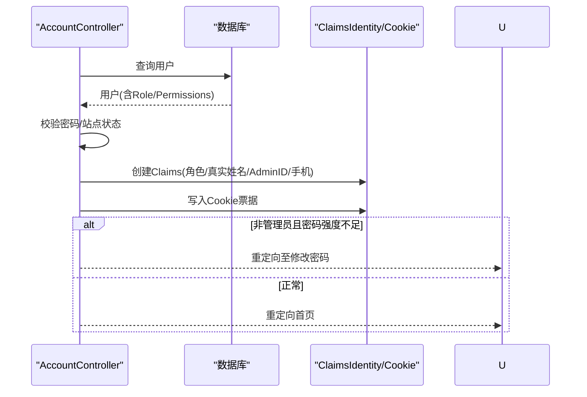
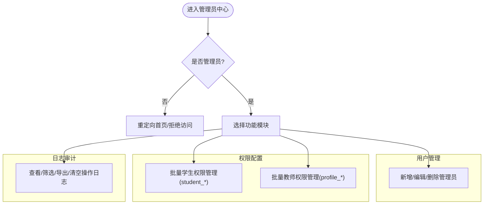
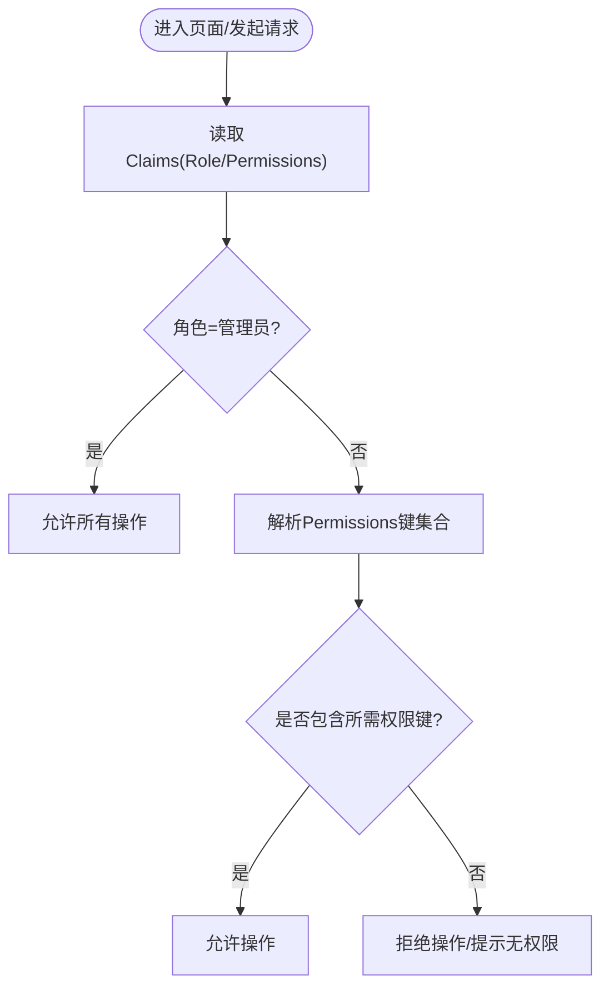
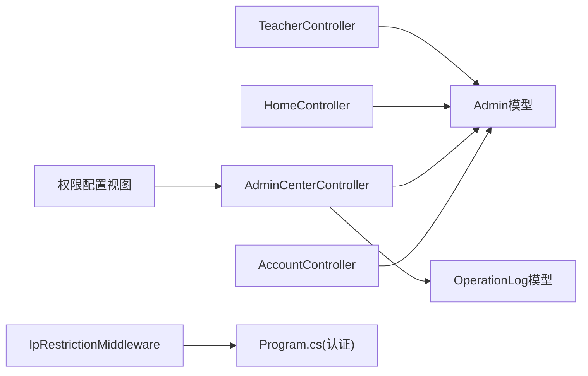

# 角色权限体系

<cite>
**本文引用的文件**
- [Program.cs](file://Program.cs)
- [AccountController.cs](file://Controllers/AccountController.cs)
- [AdminCenterController.cs](file://Controllers/AdminCenterController.cs)
- [HomeController.cs](file://Controllers/HomeController.cs)
- [TeacherController.cs](file://Controllers/TeacherController.cs)
- [Models.cs](file://Models/Models.cs)
- [IpRestrictionMiddleware.cs](file://Middleware/IpRestrictionMiddleware.cs)
- [Permissions.cshtml](file://Views/AdminCenter/Permissions.cshtml)
- [StudentPermissions.cshtml](file://Views/AdminCenter/StudentPermissions.cshtml)
- [TeacherPermissions.cshtml](file://Views/AdminCenter/TeacherPermissions.cshtml)
- [ResetPassword.cshtml](file://Views/Account/ResetPassword.cshtml)
- [GradeController.cs](file://Controllers/GradeController.cs)
</cite>

## 目录
1. [引言](#引言)
2. [项目结构](#项目结构)
3. [核心组件](#核心组件)
4. [架构总览](#架构总览)
5. [详细组件分析](#详细组件分析)
6. [依赖关系分析](#依赖关系分析)
7. [性能考量](#性能考量)
8. [故障排查指南](#故障排查指南)
9. [结论](#结论)
10. [附录](#附录)

## 引言
本文件系统性梳理学生成绩管理系统的角色权限体系，明确“管理员”“教师（含班主任）”两类角色的职责边界与权限范围，解释基于角色的访问控制（RBAC）实现方式，包括角色声明、权限字段、权限验证与动态配置策略。文档覆盖管理员中心的功能权限分配（用户管理、权限配置、操作日志等），并总结权限设计最佳实践与安全注意事项。

## 项目结构
系统采用经典的分层架构：
- 表现层：控制器（Controllers）、视图（Views）
- 业务层：控制器内处理权限判断与业务逻辑
- 数据层：模型（Models）、数据库上下文（AppDbContext）
- 安全与中间件：Cookie认证、声明（Claims）、IP白名单中间件
- 日志：操作日志实体与写入

图表来源
- [Program.cs:1-43](file://Program.cs#L1-L43)
- [AccountController.cs:80-151](file://Controllers/AccountController.cs#L80-L151)
- [AdminCenterController.cs:12-491](file://Controllers/AdminCenterController.cs#L12-L491)
- [HomeController.cs:11-37](file://Controllers/HomeController.cs#L11-L37)
- [TeacherController.cs:12-34](file://Controllers/TeacherController.cs#L12-L34)
- [Models.cs:6-86](file://Models/Models.cs#L6-L86)
- [IpRestrictionMiddleware.cs:1-63](file://Middleware/IpRestrictionMiddleware.cs#L1-L63)
- [Permissions.cshtml:1-27](file://Views/AdminCenter/Permissions.cshtml#L1-L27)
- [StudentPermissions.cshtml:1-82](file://Views/AdminCenter/StudentPermissions.cshtml#L1-L82)
- [TeacherPermissions.cshtml:1-82](file://Views/AdminCenter/TeacherPermissions.cshtml#L1-L82)
- [ResetPassword.cshtml:1-83](file://Views/Account/ResetPassword.cshtml#L1-L83)
- [GradeController.cs:384-400](file://Controllers/GradeController.cs#L384-L400)

章节来源
- [Program.cs:1-43](file://Program.cs#L1-L43)
- [Models.cs:6-86](file://Models/Models.cs#L6-L86)

## 核心组件
- 角色与声明
  - 登录时构建声明集合，包含角色（ClaimTypes.Role）、用户标识、手机号、真实姓名、管理员ID等，用于后续授权判断与界面展示。
  - 角色值来自Admin.Role字段，系统区分“管理员”与“教师（非管理员）”两类角色。
- 权限字段
  - Admin.Permissions为逗号分隔的权限键集合，用于细粒度控制功能权限（如学生增删改、个人资料编辑等）。
- 控制器授权
  - 使用[Authorize]与[Authorize(Roles="...")]进行基于角色的访问控制。
- 操作日志
  - 写入OperationLog，记录操作人、角色、操作类型、目标、详情与时间，便于审计与追踪。

章节来源
- [AccountController.cs:97-115](file://Controllers/AccountController.cs#L97-L115)
- [Models.cs:46-48](file://Models/Models.cs#L46-L48)
- [AdminCenterController.cs:12](file://Controllers/AdminCenterController.cs#L12)
- [TeacherController.cs:12](file://Controllers/TeacherController.cs#L12)
- [GradeController.cs:384-400](file://Controllers/GradeController.cs#L384-L400)

## 架构总览
系统以Cookie认证为核心，结合Claims与自定义权限键实现RBAC。登录成功后，根据角色与权限决定页面可见性与操作能力；管理员可集中管理用户与权限，并查看/导出/清理操作日志。

图表来源
- [AccountController.cs:80-125](file://Controllers/AccountController.cs#L80-L125)
- [Program.cs:23-32](file://Program.cs#L23-L32)
- [AdminCenterController.cs:34-151](file://Controllers/AdminCenterController.cs#L34-L151)
- [Models.cs:46-48](file://Models/Models.cs#L46-L48)

## 详细组件分析

### 角色与权限模型
- 角色
  - 管理员：拥有最高权限，可管理用户、配置权限、查看/导出/清理操作日志。
  - 教师（含班主任）：非管理员，权限由Permissions字段控制，可按需授予学生增删改与个人资料编辑等子权限。
- 权限键
  - 学生相关：student_edit、student_delete、student_add
  - 个人资料编辑：profile_basic、profile_phone、profile_idcard、profile_cert
  - 其他：如批量操作、站点安全码等（视具体页面与控制器逻辑）

图表来源
- [Models.cs:6-86](file://Models/Models.cs#L6-L86)
- [Models.cs:236-260](file://Models/Models.cs#L236-L260)

章节来源
- [Models.cs:6-86](file://Models/Models.cs#L6-L86)
- [Models.cs:236-260](file://Models/Models.cs#L236-L260)

### 登录与角色声明
- 登录流程
  - 校验用户名与密码；若站点关闭且非管理员，则拒绝登录。
  - 构建Claims：角色、真实姓名、管理员ID、手机号等。
  - 写入Cookie认证票据，设置过期与滑动过期。
  - 非管理员且密码强度不足时，强制跳转修改密码。
- 角色判断
  - 通过User.FindFirst(ClaimTypes.Role)获取角色字符串，用于页面与控制器的授权判断。

图表来源
- [AccountController.cs:80-125](file://Controllers/AccountController.cs#L80-L125)
- [Program.cs:23-32](file://Program.cs#L23-L32)

章节来源
- [AccountController.cs:80-125](file://Controllers/AccountController.cs#L80-L125)
- [Program.cs:23-32](file://Program.cs#L23-L32)

### 管理员中心：用户管理与权限配置
- 用户管理
  - 新增/编辑/删除管理员账户；删除超级管理员受保护。
- 批量学生权限管理
  - 仅管理员可访问；勾选后更新对应student_*权限键，保留其他权限不变。
- 批量教师权限管理
  - 仅管理员可访问；勾选后更新profile_*权限键，保留学生权限不变。
- 操作日志
  - 管理员可查看、筛选、导出、清空操作日志。

图表来源
- [AdminCenterController.cs:243-337](file://Controllers/AdminCenterController.cs#L243-L337)
- [AdminCenterController.cs:339-460](file://Controllers/AdminCenterController.cs#L339-L460)
- [Permissions.cshtml:1-27](file://Views/AdminCenter/Permissions.cshtml#L1-L27)
- [StudentPermissions.cshtml:1-82](file://Views/AdminCenter/StudentPermissions.cshtml#L1-L82)
- [TeacherPermissions.cshtml:1-82](file://Views/AdminCenter/TeacherPermissions.cshtml#L1-L82)

章节来源
- [AdminCenterController.cs:170-241](file://Controllers/AdminCenterController.cs#L170-L241)
- [AdminCenterController.cs:243-337](file://Controllers/AdminCenterController.cs#L243-L337)
- [AdminCenterController.cs:339-460](file://Controllers/AdminCenterController.cs#L339-L460)
- [Permissions.cshtml:1-27](file://Views/AdminCenter/Permissions.cshtml#L1-L27)
- [StudentPermissions.cshtml:1-82](file://Views/AdminCenter/StudentPermissions.cshtml#L1-L82)
- [TeacherPermissions.cshtml:1-82](file://Views/AdminCenter/TeacherPermissions.cshtml#L1-L82)

### 教师角色：功能差异与数据边界
- 功能差异
  - 教师通过[Authorize]访问首页，系统根据角色区分教师仪表盘与管理员首页。
  - 教师控制器部分接口使用[Authorize(Roles="管理员")]，确保仅管理员可访问。
- 数据边界
  - 教师的在线录入权限与所教学科、班级绑定，但本仓库未提供直接的SubjectTeacher/SubjectClass权限判定代码片段，建议在评分录入等敏感操作处补充基于SubjectTeacher的权限校验。

章节来源
- [HomeController.cs:21-37](file://Controllers/HomeController.cs#L21-L37)
- [TeacherController.cs:12-34](file://Controllers/TeacherController.cs#L12-L34)

### 权限验证与动态配置
- 基于角色的访问控制
  - [Authorize]与[Authorize(Roles="...")]用于控制器级授权。
- 基于权限键的细粒度控制
  - 在视图与控制器中读取Claims与Admin.Permissions，逐项判断是否允许某操作（如编辑手机号、身份证、证书等）。
- 动态配置
  - 管理员中心提供批量更新权限键的能力，支持保留其他权限组，仅变更目标权限键集合。

图表来源
- [AdminCenterController.cs:45-51](file://Controllers/AdminCenterController.cs#L45-L51)
- [AdminCenterController.cs:264-289](file://Controllers/AdminCenterController.cs#L264-L289)
- [AdminCenterController.cs:311-336](file://Controllers/AdminCenterController.cs#L311-L336)

章节来源
- [AdminCenterController.cs:45-51](file://Controllers/AdminCenterController.cs#L45-L51)
- [AdminCenterController.cs:264-289](file://Controllers/AdminCenterController.cs#L264-L289)
- [AdminCenterController.cs:311-336](file://Controllers/AdminCenterController.cs#L311-L336)

### 操作日志与审计
- 写入位置
  - 在关键业务操作（如成绩管理）中调用日志写入函数，记录操作人、角色、操作类型、目标、详情与时间。
- 管理员中心
  - 提供日志列表、筛选、导出Excel、清空日志等能力，保障审计闭环。

章节来源
- [GradeController.cs:384-400](file://Controllers/GradeController.cs#L384-L400)
- [AdminCenterController.cs:339-460](file://Controllers/AdminCenterController.cs#L339-L460)

### 安全与合规
- Cookie认证配置
  - 登录路径、登出路径、访问拒绝路径、过期时间与滑动过期均在Program.cs中配置。
- IP白名单中间件
  - 通过配置项限定允许访问的IP范围，登录静态资源路径与登录页不受限制，支持反向代理场景获取真实IP。
- 密码策略
  - 非管理员首次登录或被强制修改密码时，需满足长度与字符集要求；登录时若密码强度不足也会触发修改流程。

章节来源
- [Program.cs:23-32](file://Program.cs#L23-L32)
- [IpRestrictionMiddleware.cs:1-63](file://Middleware/IpRestrictionMiddleware.cs#L1-L63)
- [AccountController.cs:117-122](file://Controllers/AccountController.cs#L117-L122)
- [ResetPassword.cshtml:19-26](file://Views/Account/ResetPassword.cshtml#L19-L26)

## 依赖关系分析
- 控制器依赖
  - AdminCenterController依赖Admin模型与操作日志模型，负责权限配置与日志管理。
  - AccountController负责认证与密码强度校验。
  - HomeController根据角色区分教师/管理员首页。
  - TeacherController部分接口限制管理员访问。
- 中间件依赖
  - IP白名单中间件在请求进入前进行IP过滤，避免未授权访问。
- 视图依赖
  - 管理员中心权限配置视图依赖Claims与Permissions，实现前端勾选与后端持久化。

图表来源
- [AccountController.cs:80-125](file://Controllers/AccountController.cs#L80-L125)
- [AdminCenterController.cs:12-491](file://Controllers/AdminCenterController.cs#L12-L491)
- [HomeController.cs:21-37](file://Controllers/HomeController.cs#L21-L37)
- [TeacherController.cs:12-34](file://Controllers/TeacherController.cs#L12-L34)
- [IpRestrictionMiddleware.cs:34-63](file://Middleware/IpRestrictionMiddleware.cs#L34-L63)
- [Models.cs:6-86](file://Models/Models.cs#L6-L86)
- [Models.cs:236-260](file://Models/Models.cs#L236-L260)

章节来源
- [AccountController.cs:80-125](file://Controllers/AccountController.cs#L80-L125)
- [AdminCenterController.cs:12-491](file://Controllers/AdminCenterController.cs#L12-L491)
- [HomeController.cs:21-37](file://Controllers/HomeController.cs#L21-L37)
- [TeacherController.cs:12-34](file://Controllers/TeacherController.cs#L12-L34)
- [IpRestrictionMiddleware.cs:34-63](file://Middleware/IpRestrictionMiddleware.cs#L34-L63)
- [Models.cs:6-86](file://Models/Models.cs#L6-L86)
- [Models.cs:236-260](file://Models/Models.cs#L236-L260)

## 性能考量
- 权限判断复杂度
  - 当前实现为O(n)遍历Permissions数组进行包含判断，建议在权限键较多时引入哈希集合缓存，降低重复计算成本。
- 数据查询
  - 管理员中心的批量权限更新涉及多次数据库读写，建议合并为事务批量更新，减少往返次数。
- 认证票据
  - Cookie票据包含必要声明，避免频繁查询数据库；合理设置过期时间与滑动过期，平衡安全性与用户体验。

## 故障排查指南
- 登录失败
  - 检查用户名/密码是否正确；确认站点状态；非管理员且密码强度不足会触发强制修改。
- 无权限访问
  - 确认Claims中的角色与权限键；检查控制器授权特性与视图中的角色判断。
- IP受限
  - 检查IP白名单配置；确认反向代理场景下是否正确传递X-Forwarded-For头。
- 操作日志缺失
  - 确认关键业务是否调用了日志写入函数；检查管理员中心日志筛选条件与导出范围。

章节来源
- [AccountController.cs:80-95](file://Controllers/AccountController.cs#L80-L95)
- [IpRestrictionMiddleware.cs:34-63](file://Middleware/IpRestrictionMiddleware.cs#L34-L63)
- [AdminCenterController.cs:339-460](file://Controllers/AdminCenterController.cs#L339-L460)

## 结论
本系统采用基于角色与权限键的RBAC模型，通过Cookie认证与Claims实现身份识别，借助Admin.Permissions实现细粒度权限控制。管理员中心提供完善的用户与权限管理能力，并配套操作日志审计。建议在高并发场景优化权限判断与批量更新流程，在评分录入等敏感环节补充学科与班级维度的权限校验，持续提升系统的安全性与可维护性。

## 附录
- 最佳实践
  - 将权限键标准化命名，建立权限字典与变更审批流程。
  - 对高频权限判断引入缓存，减少字符串分割与包含判断开销。
  - 在关键操作前后增加审计点，确保操作可追溯。
  - 对外暴露的接口统一进行IP白名单与速率限制。
- 安全考虑
  - 强制密码策略与定期轮换机制。
  - 严格区分管理员与教师权限，避免越权操作。
  - 定期审查与清理无效权限键，最小化权限面。