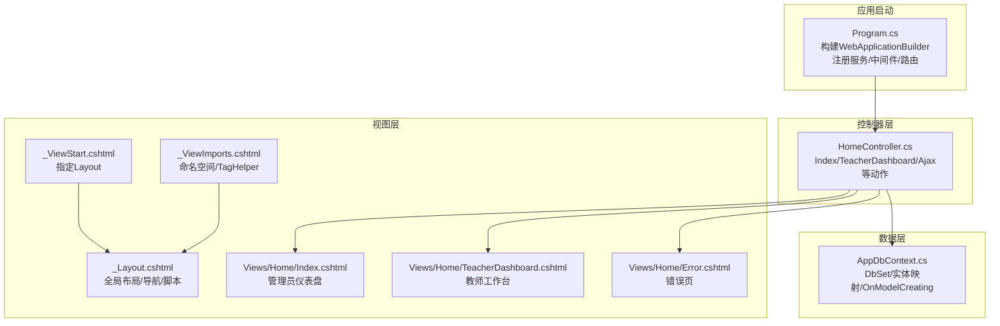
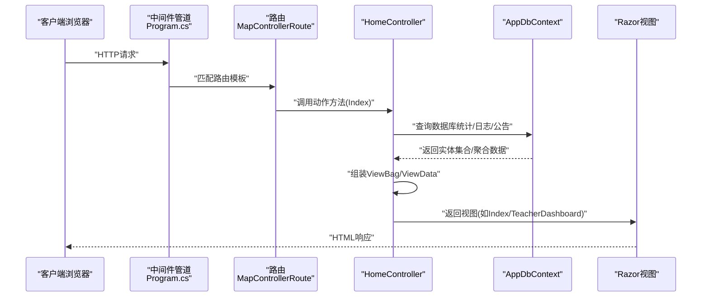
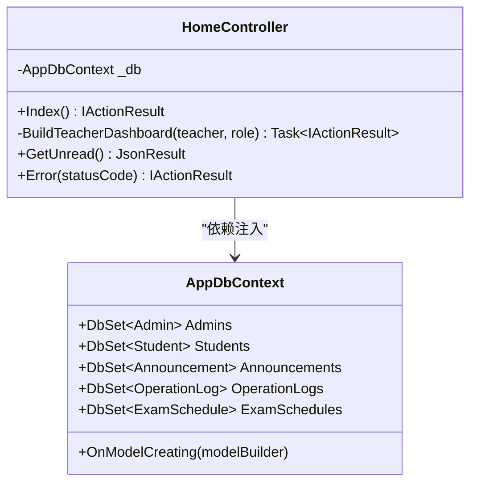
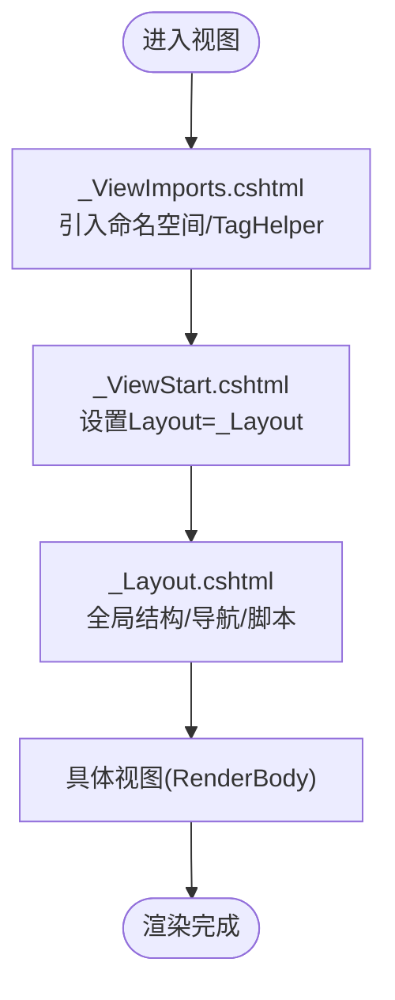
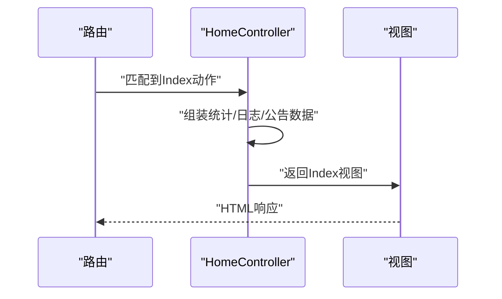
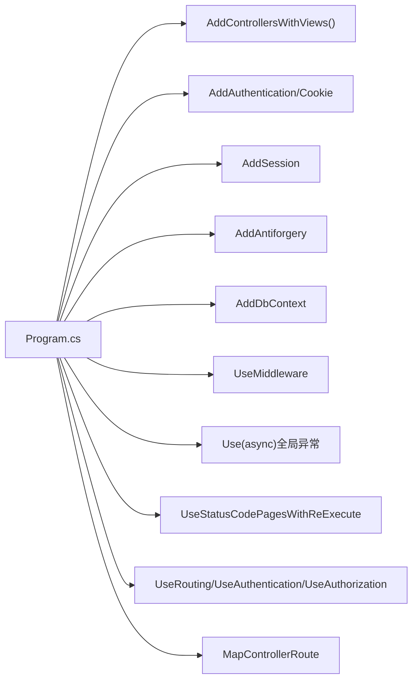

# MVC架构模式

<cite>
**本文引用的文件**
- [Program.cs](file://Program.cs)
- [HomeController.cs](file://Controllers/HomeController.cs)
- [_ViewStart.cshtml](file://Views/_ViewStart.cshtml)
- [_ViewImports.cshtml](file://Views/_ViewImports.cshtml)
- [_Layout.cshtml](file://Views/Shared/_Layout.cshtml)
- [Index.cshtml](file://Views/Home/Index.cshtml)
- [TeacherDashboard.cshtml](file://Views/Home/TeacherDashboard.cshtml)
- [Error.cshtml](file://Views/Home/Error.cshtml)
- [AppDbContext.cs](file://Data/AppDbContext.cs)
- [StudentManagerCore.csproj](file://StudentManagerCore.csproj)
</cite>

## 目录
1. [引言](#引言)
2. [项目结构](#项目结构)
3. [核心组件](#核心组件)
4. [架构概览](#架构概览)
5. [详细组件分析](#详细组件分析)
6. [依赖分析](#依赖分析)
7. [性能考虑](#性能考虑)
8. [故障排除指南](#故障排除指南)
9. [结论](#结论)
10. [附录](#附录)

## 引言
本文件围绕ASP.NET Core MVC框架，结合仓库中的实际代码，系统阐述MVC三元组（模型、视图、控制器）的职责与交互关系，并深入解析控制器如何接收HTTP请求、处理业务逻辑、调用数据层并返回响应；同时说明视图引擎与Razor语法、布局页与部分视图的组织方式；最后覆盖路由配置、动作方法的参数绑定与返回类型、MVC生命周期、过滤器机制与模型绑定的实现细节。

## 项目结构
该项目采用标准的ASP.NET Core MVC分层组织方式：
- 控制器层：位于Controllers目录，承载HTTP请求入口与业务协调
- 视图层：位于Views目录，包含Razor视图、共享布局与部分视图
- 数据访问层：位于Data目录，包含DbContext与实体映射
- 应用启动与中间件：位于根目录Program.cs，配置服务、管道与路由
- 配置与项目文件：位于根目录，包含应用设置与NuGet包引用

图表来源
- [Program.cs:1-123](file://Program.cs#L1-L123)
- [HomeController.cs:1-237](file://Controllers/HomeController.cs#L1-L237)
- [_Layout.cshtml:1-298](file://Views/Shared/_Layout.cshtml#L1-L298)
- [Index.cshtml:1-382](file://Views/Home/Index.cshtml#L1-L382)
- [TeacherDashboard.cshtml:1-313](file://Views/Home/TeacherDashboard.cshtml#L1-L313)
- [Error.cshtml:1-31](file://Views/Home/Error.cshtml#L1-L31)
- [AppDbContext.cs:1-295](file://Data/AppDbContext.cs#L1-L295)

章节来源
- [Program.cs:1-123](file://Program.cs#L1-L123)
- [StudentManagerCore.csproj:1-21](file://StudentManagerCore.csproj#L1-L21)

## 核心组件
- 控制器（Controller）
  - 作为HTTP请求入口，负责接收请求、执行业务逻辑、调用数据访问层、准备视图数据并通过IActionResult返回响应
  - 示例：HomeController.Index根据用户角色返回管理员仪表盘或教师工作台视图
- 视图（View）
  - Razor视图通过强类型模型与布局页渲染HTML，支持脚本注入与局部更新
  - 示例：Index.cshtml与TeacherDashboard.cshtml分别渲染不同角色的主页
- 模型（Model）
  - 实体类与DbContext承载数据结构与EF Core映射
  - 示例：AppDbContext定义多个DbSet并完成实体属性映射
- 布局与部分视图
  - _Layout.cshtml提供全局样式、导航与脚本；_ViewStart.cshtml统一指定布局；_ViewImports.cshtml引入命名空间与TagHelper

章节来源
- [HomeController.cs:21-90](file://Controllers/HomeController.cs#L21-L90)
- [Index.cshtml:1-382](file://Views/Home/Index.cshtml#L1-L382)
- [TeacherDashboard.cshtml:1-313](file://Views/Home/TeacherDashboard.cshtml#L1-L313)
- [_Layout.cshtml:1-298](file://Views/Shared/_Layout.cshtml#L1-L298)
- [_ViewStart.cshtml:1-4](file://Views/_ViewStart.cshtml#L1-L4)
- [_ViewImports.cshtml:1-4](file://Views/_ViewImports.cshtml#L1-L4)
- [AppDbContext.cs:10-295](file://Data/AppDbContext.cs#L10-L295)

## 架构概览
下图展示了从HTTP请求到视图渲染的端到端流程，涵盖路由匹配、控制器动作执行、数据访问与视图呈现：

图表来源
- [Program.cs:98-101](file://Program.cs#L98-L101)
- [HomeController.cs:21-90](file://Controllers/HomeController.cs#L21-L90)
- [Index.cshtml:1-382](file://Views/Home/Index.cshtml#L1-L382)
- [TeacherDashboard.cshtml:1-313](file://Views/Home/TeacherDashboard.cshtml#L1-L313)
- [AppDbContext.cs:10-295](file://Data/AppDbContext.cs#L10-L295)

## 详细组件分析

### 控制器：HomeController
- 职责与交互
  - 处理首页仪表盘与错误页；根据用户角色分支为管理员或教师视图；提供AJAX接口获取未读公告
  - 依赖注入AppDbContext进行数据查询与聚合统计
- 关键动作方法
  - Index：按角色选择视图并填充统计图表数据
  - BuildTeacherDashboard：生成教师工作台所需的数据集
  - GetUnread：返回JSON格式的未读公告列表
  - Error：根据状态码渲染错误页
- 返回类型
  - 视图：返回View()或View("视图名")
  - JSON：返回JsonResult或Json对象
- 参数绑定
  - 动作方法未声明显式参数，但可利用HttpContext.User(Claims)与ViewBag传递上下文数据

图表来源
- [HomeController.cs:12-237](file://Controllers/HomeController.cs#L12-L237)
- [AppDbContext.cs:6-295](file://Data/AppDbContext.cs#L6-L295)

章节来源
- [HomeController.cs:11-237](file://Controllers/HomeController.cs#L11-L237)

### 视图引擎与Razor语法
- 视图组织
  - _ViewStart.cshtml统一设置Layout为_shared/_Layout.cshtml
  - _ViewImports.cshtml引入项目命名空间与TagHelper
- 布局页
  - _Layout.cshtml包含全局样式、导航菜单、用户信息、模态框与脚本；通过RenderBody()渲染具体视图内容
- 视图示例
  - Index.cshtml：管理员仪表盘，展示统计数据与图表
  - TeacherDashboard.cshtml：教师工作台，展示教学信息与待办事项
  - Error.cshtml：根据状态码显示相应错误信息
- AJAX与反CSRF
  - 视图内嵌Anti-Forgery Token；通过jQuery/Ajax与控制器动作交互

图表来源
- [_ViewImports.cshtml:1-4](file://Views/_ViewImports.cshtml#L1-L4)
- [_ViewStart.cshtml:1-4](file://Views/_ViewStart.cshtml#L1-L4)
- [_Layout.cshtml:1-298](file://Views/Shared/_Layout.cshtml#L1-L298)
- [Index.cshtml:1-382](file://Views/Home/Index.cshtml#L1-L382)
- [TeacherDashboard.cshtml:1-313](file://Views/Home/TeacherDashboard.cshtml#L1-L313)
- [Error.cshtml:1-31](file://Views/Home/Error.cshtml#L1-L31)

章节来源
- [_ViewImports.cshtml:1-4](file://Views/_ViewImports.cshtml#L1-L4)
- [_ViewStart.cshtml:1-4](file://Views/_ViewStart.cshtml#L1-L4)
- [_Layout.cshtml:1-298](file://Views/Shared/_Layout.cshtml#L1-L298)
- [Index.cshtml:1-382](file://Views/Home/Index.cshtml#L1-L382)
- [TeacherDashboard.cshtml:1-313](file://Views/Home/TeacherDashboard.cshtml#L1-L313)
- [Error.cshtml:1-31](file://Views/Home/Error.cshtml#L1-L31)

### 路由配置与动作方法
- 路由
  - 默认路由模板：{controller=Home}/{action=Index}/{id?}
  - 匹配规则：按控制器目录与动作名称解析
- 动作方法
  - Index：主入口，返回视图
  - GetUnread：AJAX专用，返回JSON
  - Error：错误页入口，支持状态码参数
- 参数绑定
  - 动作方法未声明显式参数，但可通过HttpContext.User与ViewBag传递上下文数据

图表来源
- [Program.cs:98-101](file://Program.cs#L98-L101)
- [HomeController.cs:21-90](file://Controllers/HomeController.cs#L21-L90)
- [Index.cshtml:1-382](file://Views/Home/Index.cshtml#L1-L382)

章节来源
- [Program.cs:98-101](file://Program.cs#L98-L101)
- [HomeController.cs:21-237](file://Controllers/HomeController.cs#L21-L237)

### MVC生命周期与过滤器机制
- 生命周期要点
  - 请求进入中间件管道，经路由匹配后交由控制器动作处理
  - 动作执行期间可访问依赖注入的服务（如DbContext），完成后返回视图或JSON
- 过滤器
  - 项目中未显式定义自定义过滤器，但使用了认证与授权中间件（UseAuthentication/UseAuthorization）
  - 控制器上使用[Authorize]/[AllowAnonymous]控制访问权限

章节来源
- [Program.cs:45-97](file://Program.cs#L45-L97)
- [HomeController.cs:11-237](file://Controllers/HomeController.cs#L11-L237)

### 模型绑定与数据访问
- 模型绑定
  - 本项目主要通过动作方法参数绑定与HttpContext.User(Claims)传递上下文
- 数据访问
  - 通过AppDbContext访问数据库，使用LINQ进行查询与聚合
  - 视图通过ViewBag传递图表数据（序列化后的JSON字符串）

章节来源
- [HomeController.cs:21-237](file://Controllers/HomeController.cs#L21-L237)
- [AppDbContext.cs:10-295](file://Data/AppDbContext.cs#L10-L295)

## 依赖分析
- 服务注册
  - 添加MVC服务、认证（Cookie）、会话、反CSRF与EF Core上下文
- 中间件链
  - IP限制、全局异常捕获、HSTS、状态码页面、静态文件、会话、路由、认证/授权
- 项目依赖
  - Pomelo.EntityFrameworkCore.MySql、EntityFrameworkCore.Tools、ClosedXML等

图表来源
- [Program.cs:10-101](file://Program.cs#L10-L101)
- [StudentManagerCore.csproj:10-18](file://StudentManagerCore.csproj#L10-L18)

章节来源
- [Program.cs:10-123](file://Program.cs#L10-L123)
- [StudentManagerCore.csproj:1-21](file://StudentManagerCore.csproj#L1-L21)

## 性能考虑
- 视图渲染
  - 合理使用ViewBag传递数据，避免在视图中执行复杂计算
  - 对于图表数据，建议在控制器中预序列化为JSON字符串，减少视图层负担
- 数据访问
  - 使用异步查询（async/await）与必要的索引，避免N+1查询
- 中间件顺序
  - 将静态文件与会话置于路由之前，确保资源与会话正常工作
- 认证与授权
  - 在需要保护的区域启用认证中间件，避免不必要的授权检查

## 故障排除指南
- 404/403/401错误
  - 使用状态码重定向到错误视图，根据状态码显示对应提示
- 全局异常
  - 中间件捕获异常并返回友好错误页面，同时写入日志文件便于排查
- CSRF与AJAX
  - 确保视图中包含Anti-Forgery Token，并在AJAX请求头中携带令牌

章节来源
- [Program.cs:49-81](file://Program.cs#L49-L81)
- [Program.cs:85-86](file://Program.cs#L85-L86)
- [_Layout.cshtml:161-164](file://Views/Shared/_Layout.cshtml#L161-L164)

## 结论
本项目以清晰的MVC分层实现了完整的Web功能：控制器负责请求处理与业务协调，视图通过Razor与布局页提供一致的UI体验，数据层基于EF Core提供稳定的持久化能力。配合路由、中间件与认证授权机制，形成了高内聚、低耦合的架构体系。后续可在以下方面持续优化：引入自定义过滤器、细化模型绑定策略、增强缓存与并发控制、完善单元测试与集成测试。

## 附录
- 关键文件路径与用途
  - Program.cs：应用启动、服务注册、中间件与路由配置
  - HomeController.cs：首页与错误页、教师工作台、AJAX接口
  - Views/_ViewStart.cshtml：统一布局设置
  - Views/_ViewImports.cshtml：命名空间与TagHelper
  - Views/Shared/_Layout.cshtml：全局布局与导航
  - Views/Home/Index.cshtml：管理员仪表盘
  - Views/Home/TeacherDashboard.cshtml：教师工作台
  - Views/Home/Error.cshtml：错误页
  - Data/AppDbContext.cs：实体映射与DbSet定义
  - StudentManagerCore.csproj：项目依赖与SDK配置