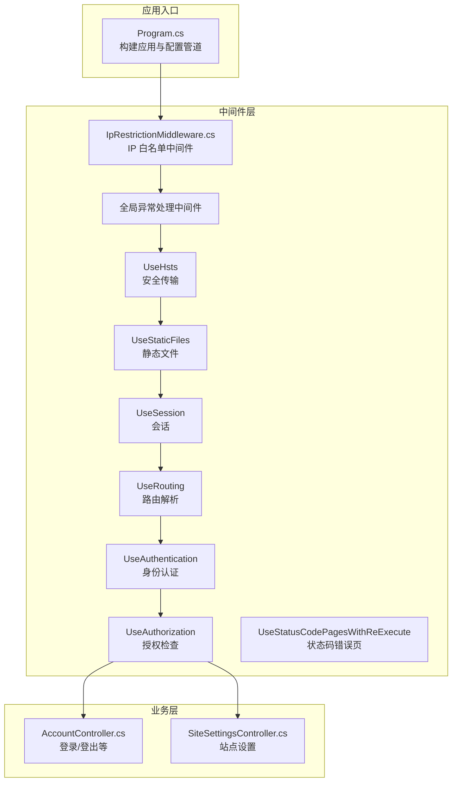
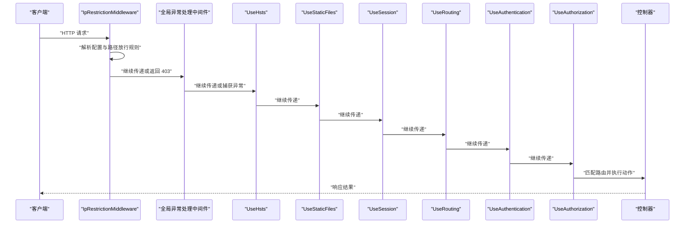
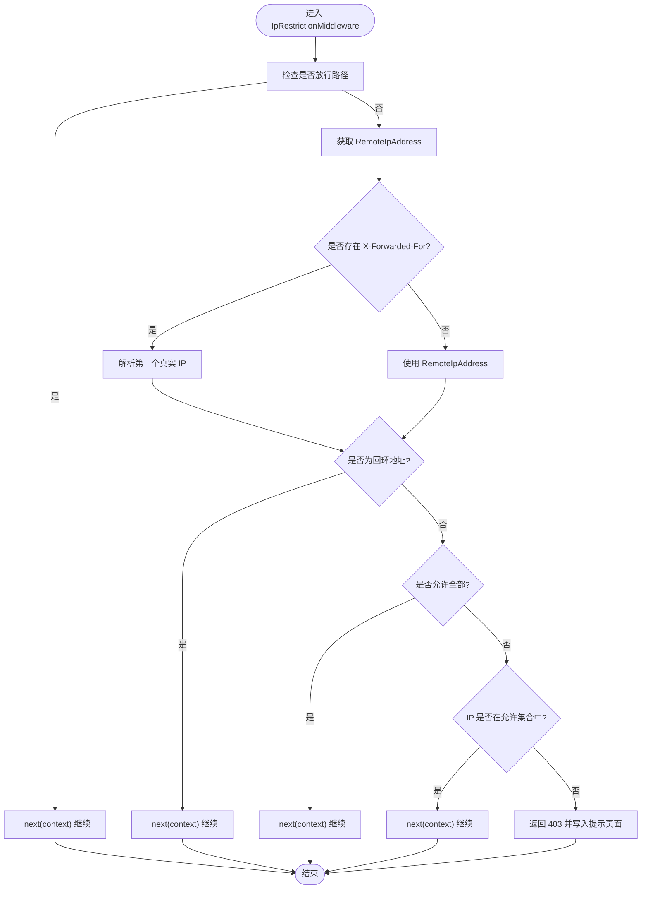
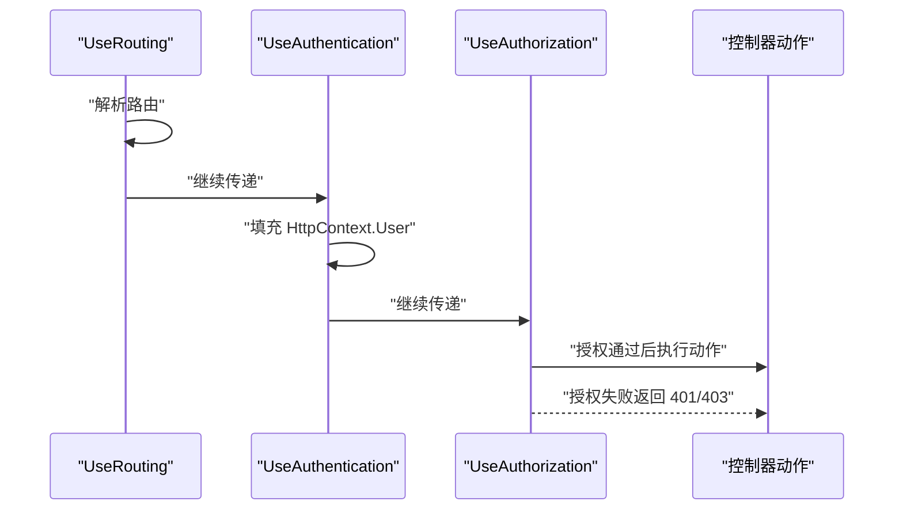
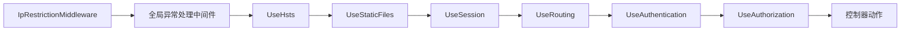

# 中间件系统

<cite>
**本文引用的文件**
- [Program.cs](file://Program.cs)
- [IpRestrictionMiddleware.cs](file://Middleware/IpRestrictionMiddleware.cs)
- [AccountController.cs](file://Controllers/AccountController.cs)
- [SiteSettingsController.cs](file://Controllers/SiteSettingsController.cs)
</cite>

## 目录
1. [引言](#引言)
2. [项目结构](#项目结构)
3. [核心组件](#核心组件)
4. [架构总览](#架构总览)
5. [详细组件分析](#详细组件分析)
6. [依赖关系分析](#依赖关系分析)
7. [性能考量](#性能考量)
8. [故障排除指南](#故障排除指南)
9. [结论](#结论)
10. [附录](#附录)

## 引言
本文件系统性阐述该 ASP.NET Core 应用的中间件体系，覆盖请求委托链的执行顺序与注册方式，内置中间件（路由、认证、授权）的作用与配置要点，以及自定义中间件（以 IpRestrictionMiddleware 为例）的实现规范、参数传递与异常处理。同时给出中间件的执行时机、上下文对象使用、异步处理模式、最佳实践、性能优化与调试技巧，并提供组合使用案例与常见问题解决方案。

## 项目结构
该应用采用典型的 ASP.NET Core 结构，入口在 Program.cs 中构建 WebApplicationBuilder 并配置服务与中间件管道；自定义中间件位于 Middleware 目录；控制器位于 Controllers 目录并在需要时使用 [Authorize]/[AllowAnonymous] 进行授权控制。

图表来源
- [Program.cs:45-100](file://Program.cs#L45-L100)
- [IpRestrictionMiddleware.cs:10-32](file://Middleware/IpRestrictionMiddleware.cs#L10-L32)
- [AccountController.cs:15-26](file://Controllers/AccountController.cs#L15-L26)
- [SiteSettingsController.cs:9-19](file://Controllers/SiteSettingsController.cs#L9-L19)

章节来源
- [Program.cs:1-123](file://Program.cs#L1-L123)

## 核心组件
- 请求委托链与执行顺序
  - 中间件通过 app.Use(...) 或 app.UseMiddleware<T>() 注册，按注册顺序组成请求委托链。
  - 每个中间件可选择调用 next() 继续传递请求，或在特定条件下提前返回响应。
- 内置中间件
  - UseRouting：建立路由表并解析当前请求的目标端点。
  - UseAuthentication：基于配置的身份认证（Cookie），填充 HttpContext.User。
  - UseAuthorization：根据策略与用户角色进行授权决策。
- 自定义中间件
  - IpRestrictionMiddleware：基于配置的 IP 白名单进行访问控制，支持反向代理场景下的 X-Forwarded-For 解析，放行静态资源与登录页，支持“*”或留空放行全部。

章节来源
- [Program.cs:45-100](file://Program.cs#L45-L100)
- [IpRestrictionMiddleware.cs:10-32](file://Middleware/IpRestrictionMiddleware.cs#L10-L32)

## 架构总览
下图展示请求在中间件管道中的流转过程，以及与内置中间件、控制器的交互关系。

图表来源
- [Program.cs:45-100](file://Program.cs#L45-L100)
- [IpRestrictionMiddleware.cs:34-96](file://Middleware/IpRestrictionMiddleware.cs#L34-L96)

## 详细组件分析

### 自定义中间件：IpRestrictionMiddleware
- 设计目标
  - 基于配置的 IP 白名单限制访问；支持通配符“*”或留空放行全部；支持反向代理场景的真实客户端 IP 获取；放行静态资源与登录页；本地回环地址始终放行。
- 关键实现点
  - 构造函数接收 RequestDelegate 与 IConfiguration，从配置中读取允许的 IP 列表，解析为 HashSet<IPAddress>，或标记允许全部。
  - InvokeAsync 中先判断是否应放行的路径，再解析真实客户端 IP（优先 X-Forwarded-For），随后进行白名单校验，若未通过则返回 403。
  - 调用 _next(context) 将请求交由后续中间件处理。
- 参数传递与配置
  - 通过 IConfiguration 读取键值 IpRestriction:AllowedIPs，多个 IP 以逗号分隔；支持“*”或留空表示放行全部。
- 异常处理
  - 该中间件内部不抛出异常，而是直接设置状态码并写入响应内容；全局异常中间件负责捕获后续阶段的异常。
- 执行时机
  - 在全局异常中间件之后注册，确保异常中间件不会拦截其自身逻辑；在 UseRouting 之前，保证路由解析前完成访问控制。

图表来源
- [IpRestrictionMiddleware.cs:34-96](file://Middleware/IpRestrictionMiddleware.cs#L34-L96)

章节来源
- [IpRestrictionMiddleware.cs:10-32](file://Middleware/IpRestrictionMiddleware.cs#L10-L32)
- [IpRestrictionMiddleware.cs:34-96](file://Middleware/IpRestrictionMiddleware.cs#L34-L96)

### 内置中间件：UseRouting、UseAuthentication、UseAuthorization
- UseRouting
  - 建立路由表并解析当前请求的目标端点，决定后续由哪个控制器动作处理。
- UseAuthentication
  - 基于 Cookie 认证方案，从请求中提取身份信息并填充到 HttpContext.User；未认证用户将无法通过后续授权检查。
- UseAuthorization
  - 根据控制器/动作上的 [Authorize]/[AllowAnonymous] 与策略进行授权判定；未授权将返回 401/403。

图表来源
- [Program.cs:93-96](file://Program.cs#L93-L96)
- [AccountController.cs:28-35](file://Controllers/AccountController.cs#L28-L35)
- [SiteSettingsController.cs:9](file://Controllers/SiteSettingsController.cs#L9)

章节来源
- [Program.cs:93-96](file://Program.cs#L93-L96)
- [AccountController.cs:28-35](file://Controllers/AccountController.cs#L28-L35)
- [SiteSettingsController.cs:9](file://Controllers/SiteSettingsController.cs#L9)

### 全局异常处理中间件
- 作用
  - 捕获后续中间件与控制器执行过程中抛出的异常，统一返回 500 错误页面，并将异常写入日志文件，避免堆栈泄露。
- 执行位置
  - 在 IP 白名单中间件之后注册，确保其自身逻辑不受影响；在 UseHsts 之前，保证异常处理在安全头设置之前生效。

章节来源
- [Program.cs:49-81](file://Program.cs#L49-L81)

### 静态文件、会话与 HTTPS
- UseStaticFiles：提供静态资源服务（CSS/JS/Lib/图片等）。
- UseSession：启用会话存储（用于验证码等场景）。
- UseHttpsRedirection：将 HTTP 重定向至 HTTPS（结合 UseHsts 提升安全性）。
- UseStatusCodePagesWithReExecute：针对 404/403 等状态码重执行错误页路由。

章节来源
- [Program.cs:88-89](file://Program.cs#L88-L89)
- [Program.cs:91](file://Program.cs#L91)
- [Program.cs:83](file://Program.cs#L83)
- [Program.cs:85-86](file://Program.cs#L85-L86)

## 依赖关系分析
- 中间件之间的耦合
  - IpRestrictionMiddleware 仅依赖 IConfiguration 与下一个委托，耦合度低，职责单一。
  - 全局异常中间件包裹后续所有中间件，形成统一的错误边界。
  - UseRouting、UseAuthentication、UseAuthorization 形成认证授权三元组，彼此依赖顺序固定。
- 控制器与中间件的关系
  - 控制器通过 [Authorize]/[AllowAnonymous] 与 UseAuthorization 协作，实现细粒度权限控制。

图表来源
- [Program.cs:45-100](file://Program.cs#L45-L100)
- [IpRestrictionMiddleware.cs:10-32](file://Middleware/IpRestrictionMiddleware.cs#L10-L32)

章节来源
- [Program.cs:45-100](file://Program.cs#L45-L100)

## 性能考量
- 中间件顺序优化
  - 将快速短路的中间件（如访问控制、静态文件）置于靠前位置，减少后续中间件的处理开销。
- 异步与非阻塞
  - 中间件方法应使用异步签名（如 InvokeAsync），避免阻塞线程池。
- 缓存与解析
  - 对配置项（如 IP 白名单）进行一次性解析并缓存，避免每次请求重复计算。
- 日志与异常
  - 全局异常中间件仅在捕获异常时写日志，避免频繁 IO；生产环境避免输出堆栈细节。

## 故障排除指南
- 访问被拒绝（403）
  - 检查 IpRestriction:AllowedIPs 配置是否正确；确认是否处于反向代理场景且 X-Forwarded-For 已正确传递。
  - 确认是否命中放行路径（登录页与静态资源）。
- 登录页无法访问
  - 确认放行路径逻辑是否覆盖了登录页与静态资源目录。
- 授权失败（401/403）
  - 检查控制器是否标注 [Authorize]；确认 UseAuthentication 与 UseAuthorization 的注册顺序正确。
- 异常未被捕获
  - 确认全局异常中间件注册位置是否在其他可能抛出异常的中间件之前。
- 日志文件未生成
  - 检查运行目录权限与文件路径；确认异常确实发生并到达全局异常中间件。

章节来源
- [IpRestrictionMiddleware.cs:34-96](file://Middleware/IpRestrictionMiddleware.cs#L34-L96)
- [Program.cs:49-81](file://Program.cs#L49-L81)
- [Program.cs:93-96](file://Program.cs#L93-L96)

## 结论
该中间件系统通过清晰的注册顺序与职责划分，实现了从访问控制、异常处理到认证授权的完整链路。自定义中间件遵循最小职责原则，易于维护与扩展；内置中间件配合控制器上的授权特性，提供了灵活的安全控制能力。建议在生产环境中进一步完善日志与监控，持续优化中间件顺序与配置，提升整体性能与可观测性。

## 附录

### 中间件组合使用案例
- 场景一：仅允许特定 IP 访问后台管理功能
  - 在 Program.cs 中注册 IpRestrictionMiddleware，并在配置中设置 IpRestriction:AllowedIPs 为受信任网段；对登录页与静态资源路径进行放行。
- 场景二：启用 HTTPS、静态文件与会话，再进行路由与认证授权
  - 在 Program.cs 中依次注册 UseHttpsRedirection、UseStaticFiles、UseSession、UseRouting、UseAuthentication、UseAuthorization，并在控制器上使用 [Authorize]/[AllowAnonymous]。

章节来源
- [Program.cs:45-100](file://Program.cs#L45-L100)
- [IpRestrictionMiddleware.cs:16-32](file://Middleware/IpRestrictionMiddleware.cs#L16-L32)