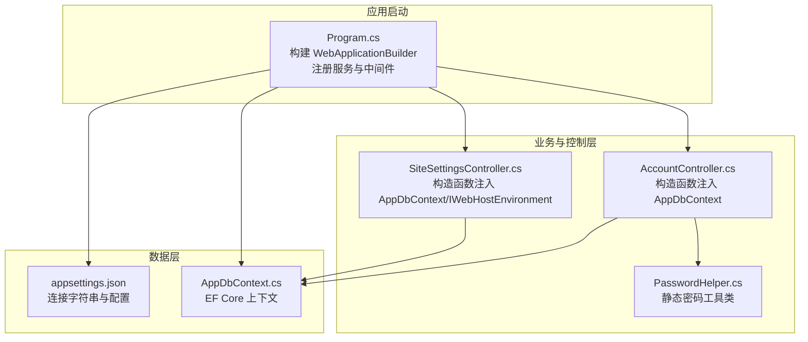
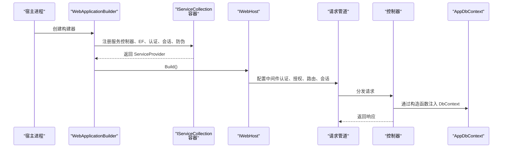
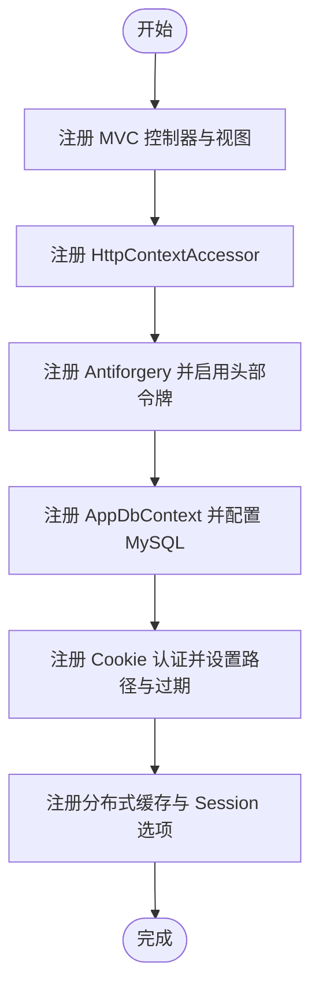
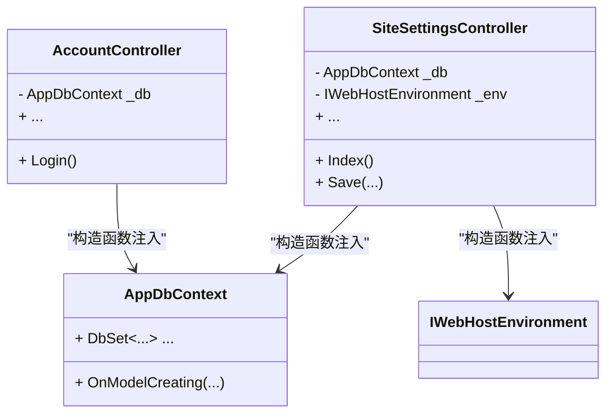
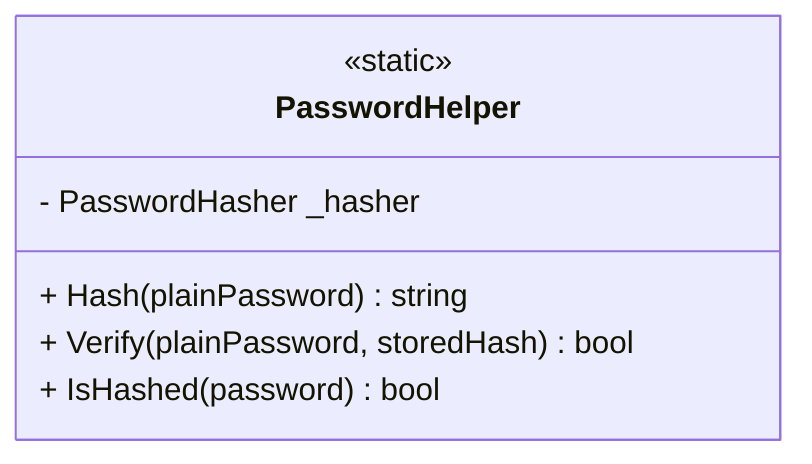
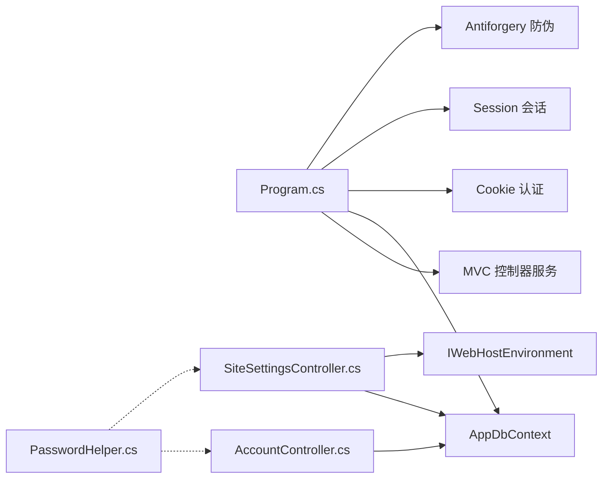

# 依赖注入与服务配置

<cite>
**本文引用的文件**
- [Program.cs](file://Program.cs)
- [AppDbContext.cs](file://Data/AppDbContext.cs)
- [PasswordHelper.cs](file://Services/PasswordHelper.cs)
- [appsettings.json](file://appsettings.json)
- [AccountController.cs](file://Controllers/AccountController.cs)
- [SiteSettingsController.cs](file://Controllers/SiteSettingsController.cs)
- [StudentManagerCore.csproj](file://StudentManagerCore.csproj)
</cite>

## 目录
1. [简介](#简介)
2. [项目结构](#项目结构)
3. [核心组件](#核心组件)
4. [架构总览](#架构总览)
5. [详细组件分析](#详细组件分析)
6. [依赖关系分析](#依赖关系分析)
7. [性能考虑](#性能考虑)
8. [故障排除指南](#故障排除指南)
9. [结论](#结论)
10. [附录](#附录)

## 简介
本文件围绕 ASP.NET Core 依赖注入（DI）容器与服务配置展开，结合项目实际代码，系统阐述以下主题：
- 服务生命周期（瞬态、作用域、单例）的选择策略与实践
- 关键服务注册方法与最佳实践（AddDbContext、AddAuthentication、AddSession 等）
- 构造函数注入的实现方式与依赖解析流程
- 自定义服务的创建与注册（如 PasswordHelper）
- 服务定位器模式的替代方案、循环依赖的避免策略与性能优化建议
- 完整的服务配置示例与故障排除指南

## 项目结构
该项目采用典型的 ASP.NET Core MVC 结构，依赖注入配置集中在应用启动入口中，数据访问通过 Entity Framework Core，认证与会话用于用户登录与验证码等场景。

**图表来源**
- [Program.cs:1-123](file://Program.cs#L1-L123)
- [AppDbContext.cs:1-295](file://Data/AppDbContext.cs#L1-L295)
- [PasswordHelper.cs:1-42](file://Services/PasswordHelper.cs#L1-L42)
- [appsettings.json:1-16](file://appsettings.json#L1-L16)
- [AccountController.cs:1-42](file://Controllers/AccountController.cs#L1-L42)
- [SiteSettingsController.cs:1-47](file://Controllers/SiteSettingsController.cs#L1-L47)

**章节来源**
- [Program.cs:1-123](file://Program.cs#L1-L123)
- [appsettings.json:1-16](file://appsettings.json#L1-L16)

## 核心组件
- 应用启动与服务注册：在应用启动时集中注册控制器、EF Core 上下文、认证、会话、防伪令牌等服务，并在管道中启用相关中间件。
- 数据上下文：AppDbContext 作为 EF Core 上下文，负责数据库模型映射与迁移。
- 自定义服务：PasswordHelper 提供基于 ASP.NET Core Identity 的密码哈希与校验能力，支持新旧密码格式兼容。
- 控制器注入：多个控制器通过构造函数注入 AppDbContext 与其他服务，体现依赖注入的最佳实践。

**章节来源**
- [Program.cs:9-42](file://Program.cs#L9-L42)
- [AppDbContext.cs:6-295](file://Data/AppDbContext.cs#L6-L295)
- [PasswordHelper.cs:8-42](file://Services/PasswordHelper.cs#L8-L42)
- [AccountController.cs:15-27](file://Controllers/AccountController.cs#L15-L27)
- [SiteSettingsController.cs:9-19](file://Controllers/SiteSettingsController.cs#L9-L19)

## 架构总览
下图展示了应用启动阶段的服务注册与运行时依赖解析的关键交互。

**图表来源**
- [Program.cs:7-43](file://Program.cs#L7-L43)
- [Program.cs:45-100](file://Program.cs#L45-L100)
- [AccountController.cs:23-26](file://Controllers/AccountController.cs#L23-L26)

## 详细组件分析

### 服务生命周期选择策略
- 瞬态（Transient）：每次解析都创建新实例，适合无状态、轻量级服务。
- 作用域（Scoped）：每个 HTTP 请求作用域内共享同一实例，适合需要跨组件协作但不跨请求的数据。
- 单例（Singleton）：整个应用生命周期内唯一实例，适合只读或无状态的全局服务。

在本项目中：
- 控制器默认由框架创建并注入，遵循作用域生命周期。
- EF Core 上下文 AppDbContext 默认为作用域，确保线程安全与事务隔离。
- 静态工具类 PasswordHelper 无需注册为服务，直接通过类型名调用其静态成员。

**章节来源**
- [Program.cs:19-21](file://Program.cs#L19-L21)
- [PasswordHelper.cs:8-42](file://Services/PasswordHelper.cs#L8-L42)

### 关键服务注册与最佳实践
- 添加控制器与视图支持：注册 MVC 控制器与视图服务，便于控制器注入与视图渲染。
- HttpContextAccessor：提供对 HttpContext 的访问能力，常用于获取当前用户、请求信息等。
- 防伪令牌（Antiforgery）：启用头部令牌校验，适配 JSON 提交场景。
- EF Core 上下文：注册 AppDbContext 并配置 MySQL 连接字符串与版本。
- Cookie 认证：配置登录/登出路径、过期时间与滑动过期。
- 会话（Session）：注册分布式缓存与会话选项（超时、HttpOnly、Essential Cookie）。

**图表来源**
- [Program.cs:10-41](file://Program.cs#L10-L41)

**章节来源**
- [Program.cs:10-41](file://Program.cs#L10-L41)
- [appsettings.json:12-14](file://appsettings.json#L12-L14)

### 构造函数注入与依赖解析
- 控制器通过构造函数声明所需服务，框架在运行时解析并注入。
- AccountController 注入 AppDbContext，用于数据库操作。
- SiteSettingsController 同时注入 AppDbContext 与 IWebHostEnvironment，用于站点配置与文件系统操作。

**图表来源**
- [AccountController.cs:15-26](file://Controllers/AccountController.cs#L15-L26)
- [SiteSettingsController.cs:9-19](file://Controllers/SiteSettingsController.cs#L9-L19)
- [AppDbContext.cs:6-30](file://Data/AppDbContext.cs#L6-L30)

**章节来源**
- [AccountController.cs:15-26](file://Controllers/AccountController.cs#L15-L26)
- [SiteSettingsController.cs:9-19](file://Controllers/SiteSettingsController.cs#L9-L19)

### 自定义服务：PasswordHelper
- 设计目标：提供基于 ASP.NET Core Identity 的 PBKDF2 哈希算法，兼容旧版明文密码。
- 核心能力：
  - 对明文密码进行哈希
  - 验证明文密码与存储哈希值是否匹配
  - 判断输入是否已为哈希格式
- 使用建议：
  - 在业务层调用静态方法进行密码处理，避免注册为服务实例。
  - 与认证模块配合，确保用户凭据安全存储与校验。

**图表来源**
- [PasswordHelper.cs:8-42](file://Services/PasswordHelper.cs#L8-L42)

**章节来源**
- [PasswordHelper.cs:8-42](file://Services/PasswordHelper.cs#L8-L42)

### 服务定位器模式的替代方案
- 推荐使用构造函数注入，避免在业务逻辑中直接通过静态工厂或全局容器获取服务。
- 若确需在非 DI 场景（如后台任务、静态方法）中使用服务，可通过依赖注入提供的 IServiceProvider 获取，但应谨慎使用并保持最小化范围。

[本节为概念性指导，不直接分析具体文件]

### 循环依赖的避免策略
- 检查控制器与服务之间的相互依赖关系，尽量通过接口抽象或拆分职责消除环路。
- 将共享逻辑抽取到独立服务中，避免双向依赖。
- 使用作用域服务时，注意避免跨作用域持有长生命周期对象导致的隐式循环。

[本节为概念性指导，不直接分析具体文件]

### 性能优化建议
- 合理选择生命周期：仅在必要时使用单例，多数服务采用作用域可降低内存占用。
- 避免在热路径中频繁创建大型对象，优先复用作用域内的服务实例。
- EF Core 查询尽量使用异步 API，减少阻塞。
- 控制器中避免执行耗时操作，将复杂逻辑下沉至专用服务层。

[本节为通用指导，不直接分析具体文件]

## 依赖关系分析
- Program.cs 负责集中注册服务与中间件，是依赖注入的入口。
- AppDbContext 作为数据访问的核心，被多个控制器注入使用。
- PasswordHelper 作为静态工具类，不参与容器注册，直接在业务逻辑中调用。
- 控制器通过构造函数注入 AppDbContext 与 IWebHostEnvironment，体现清晰的依赖边界。

**图表来源**
- [Program.cs:10-41](file://Program.cs#L10-L41)
- [AccountController.cs:15-26](file://Controllers/AccountController.cs#L15-L26)
- [SiteSettingsController.cs:9-19](file://Controllers/SiteSettingsController.cs#L9-L19)
- [PasswordHelper.cs:8-42](file://Services/PasswordHelper.cs#L8-L42)

**章节来源**
- [Program.cs:10-41](file://Program.cs#L10-L41)
- [AccountController.cs:15-26](file://Controllers/AccountController.cs#L15-L26)
- [SiteSettingsController.cs:9-19](file://Controllers/SiteSettingsController.cs#L9-L19)

## 性能考虑
- 服务生命周期选择直接影响内存与并发表现，应根据服务特性合理配置。
- EF Core 查询与数据库交互应使用异步 API，避免阻塞请求线程。
- 控制器应保持薄层职责，将业务逻辑移至服务层，提升可测试性与可维护性。
- 会话与认证配置需平衡安全性与性能，避免不必要的过期检查与重定向开销。

[本节为通用指导，不直接分析具体文件]

## 故障排除指南
- 连接字符串无效或数据库不可达
  - 检查连接字符串配置是否正确，确认数据库服务可用。
  - 参考：[appsettings.json:12-14](file://appsettings.json#L12-L14)
- EF Core 迁移失败
  - 查看自动迁移过程中的异常日志文件，定位具体错误原因。
  - 参考：[Program.cs:108-120](file://Program.cs#L108-L120)
- 登录或权限相关异常
  - 确认认证中间件顺序与 Cookie 配置是否正确。
  - 参考：[Program.cs:95-96](file://Program.cs#L95-L96)、[Program.cs:24-32](file://Program.cs#L24-L32)
- 防伪令牌校验失败
  - 确认前端请求头是否携带正确的令牌名称。
  - 参考：[Program.cs:15-16](file://Program.cs#L15-L16)
- 静态工具类调用异常
  - 确保调用的是静态方法而非实例方法，避免误用生命周期。
  - 参考：[PasswordHelper.cs:8-42](file://Services/PasswordHelper.cs#L8-L42)

**章节来源**
- [appsettings.json:12-14](file://appsettings.json#L12-L14)
- [Program.cs:108-120](file://Program.cs#L108-L120)
- [Program.cs:95-96](file://Program.cs#L95-L96)
- [Program.cs:24-32](file://Program.cs#L24-L32)
- [Program.cs:15-16](file://Program.cs#L15-L16)
- [PasswordHelper.cs:8-42](file://Services/PasswordHelper.cs#L8-L42)

## 结论
本项目在依赖注入与服务配置方面体现了良好的实践：集中注册、明确生命周期、清晰的构造函数注入以及对关键服务（EF Core、认证、会话）的规范配置。通过静态工具类 PasswordHelper 实现密码处理，既满足功能需求又避免了不必要的容器注册。建议在后续扩展中继续坚持这些原则，并关注性能与可维护性的持续优化。

[本节为总结性内容，不直接分析具体文件]

## 附录
- 项目依赖包参考
  - Identity、Entity Framework Core、MySQL Provider 等
  - 参考：[StudentManagerCore.csproj:10-18](file://StudentManagerCore.csproj#L10-L18)

**章节来源**
- [StudentManagerCore.csproj:10-18](file://StudentManagerCore.csproj#L10-L18)