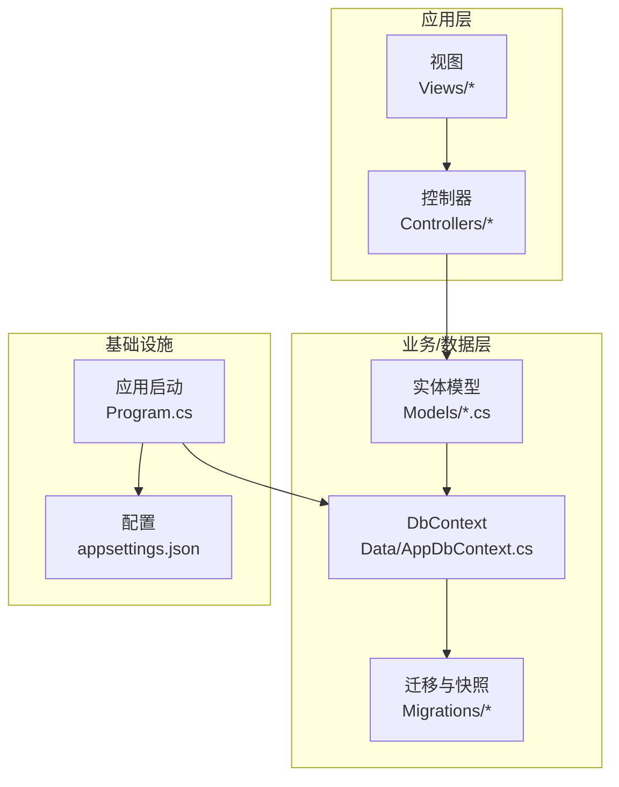
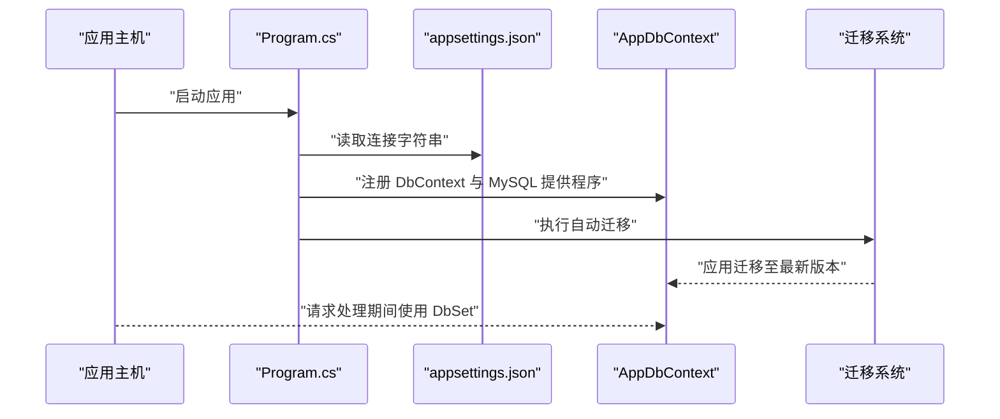
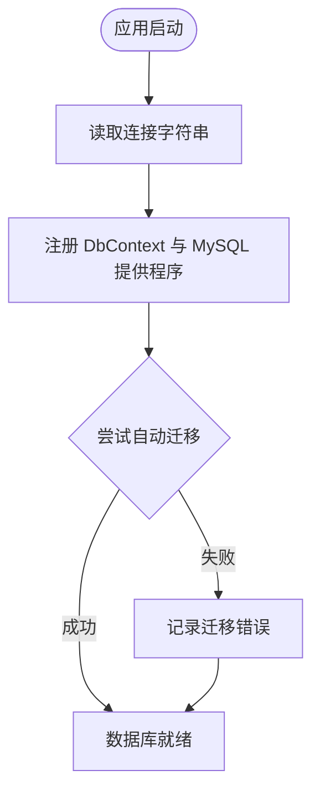
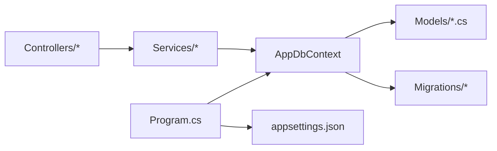
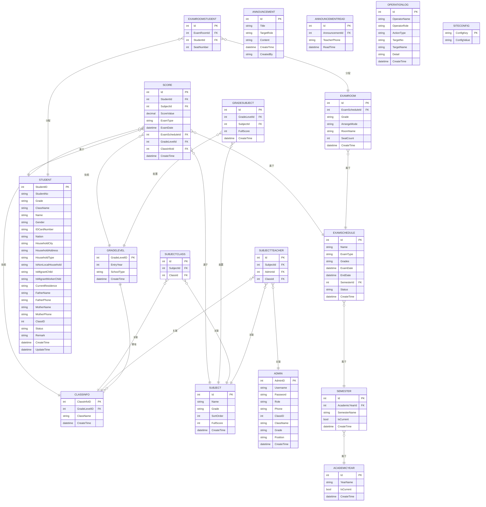

# 数据库设计模式

<cite>
**本文引用的文件**
- [AppDbContext.cs](file://Data/AppDbContext.cs)
- [AppDbContextModelSnapshot.cs](file://Migrations/AppDbContextModelSnapshot.cs)
- [Models.cs](file://Models/Models.cs)
- [GradeModels.cs](file://Models/GradeModels.cs)
- [appsettings.json](file://appsettings.json)
- [Program.cs](file://Program.cs)
- [20260609075559_InitialCreate.cs](file://Migrations/20260609075559_InitialCreate.cs)
- [20260610054012_AddExamRoom.cs](file://Migrations/20260610054012_AddExamRoom.cs)
- [20260611001601_AddExamEndDate.cs](file://Migrations/20260611001601_AddExamEndDate.cs)
- [20260611075107_RefactorScoreModel.cs](file://Migrations/20260611075107_RefactorScoreModel.cs)
</cite>

## 目录
1. [简介](#简介)
2. [项目结构](#项目结构)
3. [核心组件](#核心组件)
4. [架构总览](#架构总览)
5. [详细组件分析](#详细组件分析)
6. [依赖分析](#依赖分析)
7. [性能考虑](#性能考虑)
8. [故障排除指南](#故障排除指南)
9. [结论](#结论)
10. [附录](#附录)

## 简介
本文件系统性阐述本项目的数据库设计模式与实现，围绕以下主题展开：
- DbContext 上下文设计模式：职责划分、配置选项与生命周期管理
- Code First 开发模式：实体类定义、属性配置与关系映射
- 数据库迁移策略：初始迁移、版本管理与回滚机制
- 模型快照与变更追踪：模型快照的作用与 EF Core 变更检测
- 连接字符串配置、数据库提供程序选择与性能优化
- 实体继承、复合主键、外键约束与多对多/一对一/一对多映射
- 最佳实践、索引策略与查询优化技巧

## 项目结构
项目采用典型的 ASP.NET Core + EF Core Code First 架构，核心文件分布如下：
- 数据访问层：DbContext 定义于 Data 层
- 实体模型：位于 Models 层，包含基础实体与分级实体
- 迁移与快照：位于 Migrations 目录，包含多个迁移类与模型快照
- 应用启动与配置：Program.cs 注册服务、配置数据库提供程序与自动迁移
- 配置文件：appsettings.json 提供连接字符串等运行时配置

图表来源
- [Program.cs:18-22](file://Program.cs#L18-L22)
- [AppDbContext.cs:6-29](file://Data/AppDbContext.cs#L6-L29)
- [Models.cs:6-86](file://Models/Models.cs#L6-L86)
- [GradeModels.cs:6-100](file://Models/GradeModels.cs#L6-L100)

章节来源
- [Program.cs:18-22](file://Program.cs#L18-L22)
- [appsettings.json:12-14](file://appsettings.json#L12-L14)

## 核心组件
- DbContext：集中声明 DbSet 属性并完成 Fluent API 映射，承担模型构建、关系配置与约束定义职责
- 实体模型：以 Data Annotations 与 Fluent API 结合的方式定义实体、属性与关系
- 迁移与快照：通过迁移类记录数据库演进历史，通过模型快照固化当前模型结构
- 应用启动：注册 DbContext 与数据库提供程序，执行自动迁移确保数据库一致性

章节来源
- [AppDbContext.cs:10-29](file://Data/AppDbContext.cs#L10-L29)
- [Models.cs:6-463](file://Models/Models.cs#L6-L463)
- [GradeModels.cs:6-100](file://Models/GradeModels.cs#L6-L100)
- [Program.cs:18-22](file://Program.cs#L18-L22)

## 架构总览
EF Core 在本项目中的工作流：
- 启动阶段：应用读取配置，注册 DbContext 与 MySQL 提供程序
- 运行阶段：自动执行数据库迁移，保证数据库结构与模型一致
- ORM 阶段：通过 DbContext 访问 DbSet，执行增删改查与导航属性加载

图表来源
- [Program.cs:18-22](file://Program.cs#L18-L22)
- [Program.cs:107-120](file://Program.cs#L107-L120)
- [appsettings.json:12-14](file://appsettings.json#L12-L14)

## 详细组件分析

### DbContext 设计与职责
- 职责边界
  - 统一暴露各实体的 DbSet
  - 在 OnModelCreating 中完成表名、主键、索引、外键与约束的 Fluent API 配置
  - 保持与模型快照的一致性，避免手动修改快照
- 配置要点
  - 使用 UseMySql 指定 MySQL 提供程序与服务器版本
  - 在 Program.cs 中集中注册，便于依赖注入与生命周期管理
  - 自动迁移在应用启动时执行，确保数据库结构与模型同步

章节来源
- [AppDbContext.cs:6-29](file://Data/AppDbContext.cs#L6-L29)
- [AppDbContext.cs:30-293](file://Data/AppDbContext.cs#L30-L293)
- [Program.cs:18-22](file://Program.cs#L18-L22)

### Code First 实现细节
- 实体类定义
  - 基础实体：Admin、Student、SiteConfig、AcademicYear、Semester、Subject、Score、ExamSchedule、ExamRoom、ExamRoomStudent、GradeSubject、Announcement、AnnouncementRead、OperationLog
  - 分级实体：GradeLevel、ClassInfo、GradeSubject（带表注解）
- 属性配置
  - 字符串长度限制、必填项、数值精度（decimal）、枚举风格的固定长度字符串
  - 特殊类型：decimal(5,1) 用于分数；char(10) 用于角色等
- 关系映射
  - 一对一/一对多：如 GradeLevel 与 ClassInfo、Semester 与 AcademicYear、ExamSchedule 与 ExamSubject、ExamRoom 与 ExamRoomStudent
  - 多对多：SubjectTeacher、SubjectClass、GradeSubject 通过复合主键实现
  - 级联删除：Cascade 删除行为用于父到子的级联

章节来源
- [Models.cs:6-463](file://Models/Models.cs#L6-L463)
- [GradeModels.cs:6-100](file://Models/GradeModels.cs#L6-L100)
- [AppDbContext.cs:34-292](file://Data/AppDbContext.cs#L34-L292)

### 数据库迁移策略
- 初始迁移
  - 迁移类命名包含时间戳，确保顺序与唯一性
  - 初始迁移包含基础表结构与索引
- 版本管理
  - 通过连续迁移逐步引入新表与字段（如考场、结束日期、分数模型重构）
- 回滚机制
  - EF Core 迁移支持 Down 方法（在迁移类中定义），可在需要时回滚到指定版本
  - 生产环境建议谨慎回滚，优先使用新增迁移修复问题
- 自动迁移
  - 应用启动时自动执行迁移，确保数据库结构与模型一致

图表来源
- [Program.cs:107-120](file://Program.cs#L107-L120)
- [20260609075559_InitialCreate.cs:9-20](file://Migrations/20260609075559_InitialCreate.cs#L9-L20)
- [20260610054012_AddExamRoom.cs:9-20](file://Migrations/20260610054012_AddExamRoom.cs#L9-L20)
- [20260611001601_AddExamEndDate.cs:8-20](file://Migrations/20260611001601_AddExamEndDate.cs#L8-L20)
- [20260611075107_RefactorScoreModel.cs:9-20](file://Migrations/20260611075107_RefactorScoreModel.cs#L9-L20)

章节来源
- [Program.cs:107-120](file://Program.cs#L107-L120)
- [20260609075559_InitialCreate.cs:9-20](file://Migrations/20260609075559_InitialCreate.cs#L9-L20)
- [20260610054012_AddExamRoom.cs:9-20](file://Migrations/20260610054012_AddExamRoom.cs#L9-L20)
- [20260611001601_AddExamEndDate.cs:8-20](file://Migrations/20260611001601_AddExamEndDate.cs#L8-L20)
- [20260611075107_RefactorScoreModel.cs:9-20](file://Migrations/20260611075107_RefactorScoreModel.cs#L9-L20)

### 模型快照与变更追踪
- 模型快照作用
  - 固化当前模型结构，作为 EF Core 迁移生成的基线
  - 与 OnModelCreating 的配置共同决定数据库结构
- 变更追踪机制
  - EF Core 通过跟踪实体状态变化进行持久化
  - 导航属性与外键配置影响查询与更新路径
- 快照文件位置
  - AppDbContextModelSnapshot.cs 由 EF Core 自动生成，包含完整模型元数据

章节来源
- [AppDbContextModelSnapshot.cs:16-50](file://Migrations/AppDbContextModelSnapshot.cs#L16-L50)
- [AppDbContext.cs:30-293](file://Data/AppDbContext.cs#L30-L293)

### 连接字符串、提供程序与性能优化
- 连接字符串
  - 来源于 appsettings.json 的 DefaultConnection 键
  - 包含服务器、数据库、用户与密码等关键信息
- 数据库提供程序
  - 使用 Pomelo.EntityFrameworkCore.MySql 提供程序
  - 在 Program.cs 中通过 UseMySql 注册，并指定服务器版本
- 性能优化策略
  - 合理建立索引（见关系映射中的复合唯一索引）
  - 使用投影查询减少不必要的列加载
  - 控制事务范围，避免长事务
  - 使用无跟踪查询（AsNoTracking）进行只读场景
  - 批量操作与批量更新（结合仓储模式）

章节来源
- [appsettings.json:12-14](file://appsettings.json#L12-L14)
- [Program.cs:18-22](file://Program.cs#L18-L22)
- [AppDbContext.cs:193-292](file://Data/AppDbContext.cs#L193-L292)

### 实体继承、复合主键与外键约束
- 实体继承
  - 项目未直接体现 C# 继承映射到数据库表的继承层次
  - 可通过 TPH/TPT 模式扩展（需额外配置）
- 复合主键
  - SubjectTeacher、SubjectClass、ExamSubject、GradeSubject 使用复合主键
  - 通过 HasKey 或 Fluent API 的 Property(x => x.Id).ValueGeneratedOnAdd() 实现
- 外键约束
  - 大多数实体通过 HasOne/WithMany/HasForeignKey 建立外键
  - 级联删除（Cascade）用于父到子的删除行为
  - 唯一索引用于保证关系唯一性（如复合唯一索引）

章节来源
- [Models.cs:361-381](file://Models/Models.cs#L361-L381)
- [Models.cs:384-395](file://Models/Models.cs#L384-L395)
- [AppDbContext.cs:184-292](file://Data/AppDbContext.cs#L184-L292)

### 查询优化与索引策略
- 唯一索引
  - Score 表对 (StudentId, SubjectId, ExamScheduleId) 建唯一索引，避免重复录入
  - 多对多/多对一关系表对 (A,B) 建唯一索引，保证关系唯一性
- 复合索引
  - 常用于过滤条件与连接键，提升查询效率
- 查询建议
  - 对高频过滤字段建立索引
  - 使用 Include/ThenInclude 精准加载导航属性
  - 使用分页查询（Skip/Take）避免一次性加载大量数据

章节来源
- [AppDbContext.cs:223-224](file://Data/AppDbContext.cs#L223-L224)
- [AppDbContext.cs:193-194](file://Data/AppDbContext.cs#L193-L194)
- [AppDbContext.cs:201-202](file://Data/AppDbContext.cs#L201-L202)
- [AppDbContext.cs:251-252](file://Data/AppDbContext.cs#L251-L252)
- [AppDbContext.cs:291-292](file://Data/AppDbContext.cs#L291-L292)

## 依赖分析
- 组件耦合
  - 控制器依赖服务，服务依赖 DbContext
  - DbContext 依赖实体模型与 Fluent API 配置
- 外部依赖
  - Pomelo.EntityFrameworkCore.MySql 提供程序
  - MySQL 数据库
- 循环依赖
  - 项目未发现循环依赖迹象

图表来源
- [Program.cs:18-22](file://Program.cs#L18-L22)
- [AppDbContext.cs:6-29](file://Data/AppDbContext.cs#L6-L29)
- [Models.cs:6-463](file://Models/Models.cs#L6-L463)

章节来源
- [Program.cs:18-22](file://Program.cs#L18-L22)
- [AppDbContext.cs:6-29](file://Data/AppDbContext.cs#L6-L29)

## 性能考虑
- 连接与提供程序
  - 使用 MySQL 提供程序并指定版本，确保兼容性与性能
- 查询与索引
  - 为高频查询字段建立索引，避免全表扫描
  - 使用投影与分页，降低网络与内存压力
- 写入与事务
  - 合理拆分事务，避免长时间持有锁
  - 批量插入/更新时注意数据库容量与锁竞争
- 缓存与静态配置
  - SiteConfig 使用主键索引快速读取配置

章节来源
- [Program.cs:18-22](file://Program.cs#L18-L22)
- [AppDbContext.cs:80-87](file://Data/AppDbContext.cs#L80-L87)

## 故障排除指南
- 迁移失败
  - 检查连接字符串是否正确
  - 查看迁移错误日志文件 migrate_error.txt
- 数据库不一致
  - 确认 OnModelCreating 与模型快照一致
  - 重新生成迁移或修复现有迁移
- 查询性能差
  - 检查是否存在缺失索引
  - 使用 Include/ThenInclude 减少 N+1 查询
- 连接问题
  - 确认 MySQL 服务可用与防火墙放行
  - 校验用户权限与字符集设置

章节来源
- [Program.cs:107-120](file://Program.cs#L107-L120)
- [appsettings.json:12-14](file://appsettings.json#L12-L14)

## 结论
本项目通过清晰的 DbContext 设计、完善的 Code First 映射与系统化的迁移策略，实现了稳定的数据库层。配合合理的索引与查询优化，能够在功能与性能之间取得良好平衡。建议持续关注模型快照与迁移的同步，严格控制生产环境的迁移回滚风险。

## 附录
- 关键实体关系图（基于 Fluent API 映射）

图表来源
- [AppDbContext.cs:34-292](file://Data/AppDbContext.cs#L34-L292)
- [Models.cs:6-463](file://Models/Models.cs#L6-L463)
- [GradeModels.cs:6-100](file://Models/GradeModels.cs#L6-L100)