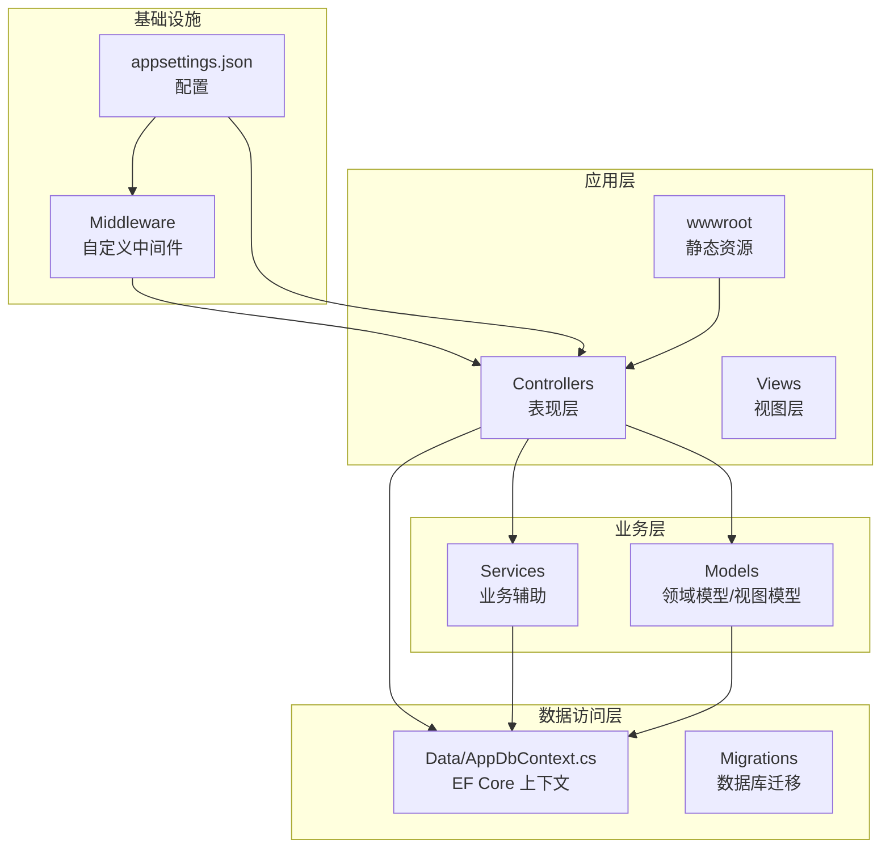
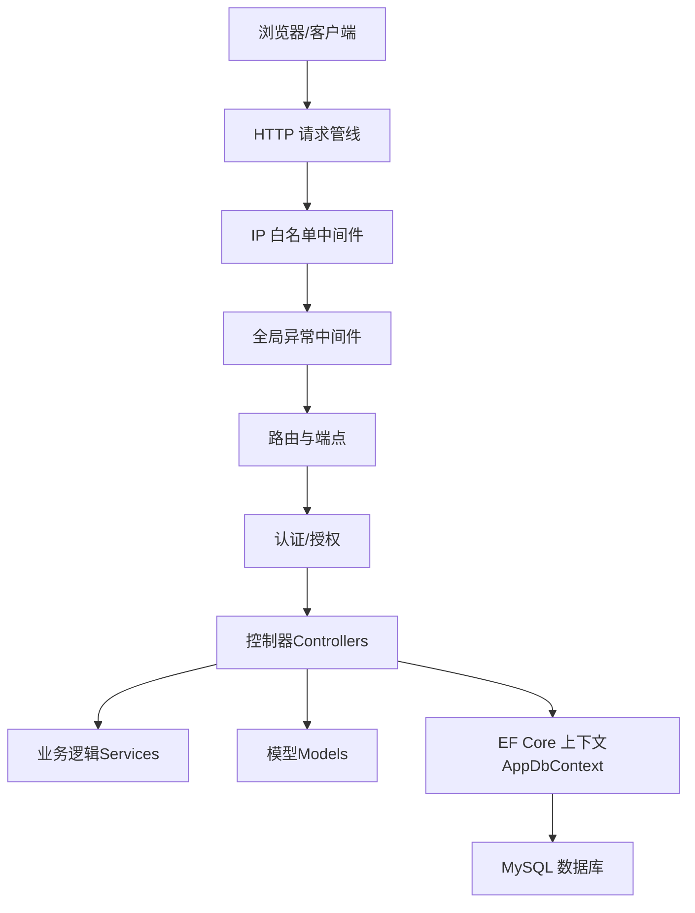
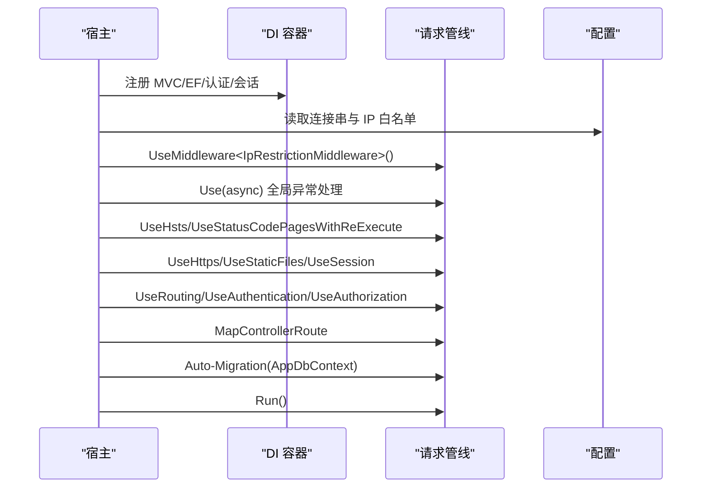
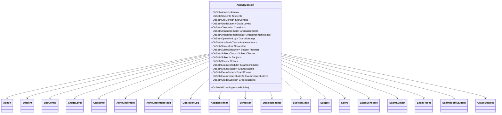
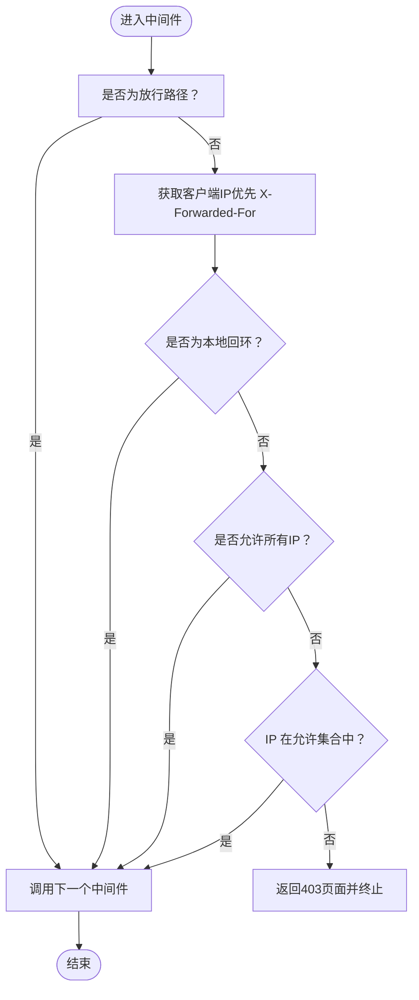
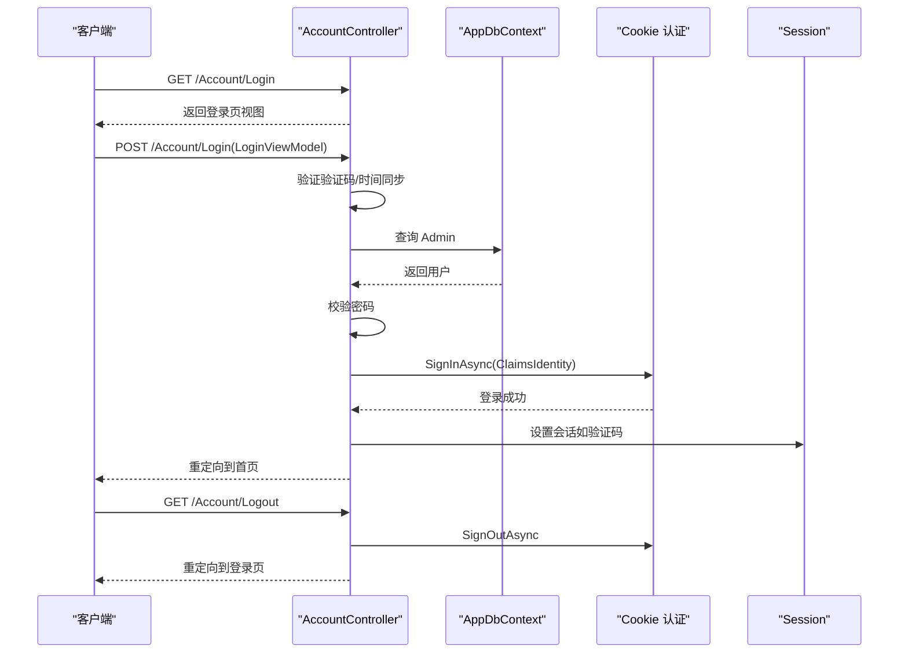
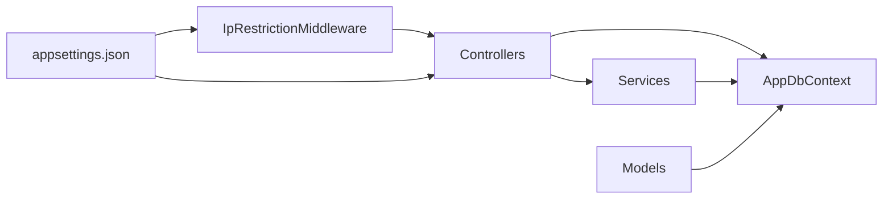
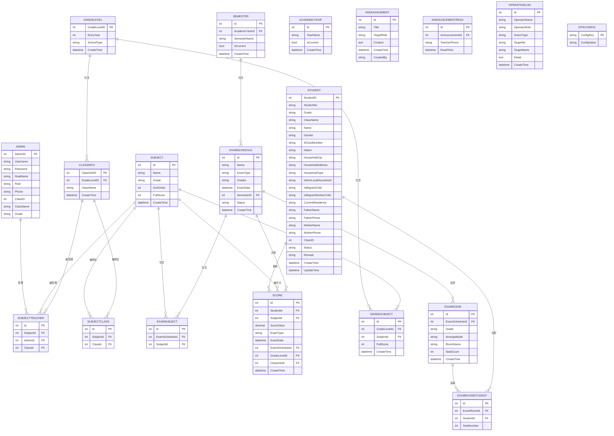

# 系统架构设计

<cite>
**本文引用的文件**
- [Program.cs](file://Program.cs)
- [appsettings.json](file://appsettings.json)
- [AppDbContext.cs](file://Data/AppDbContext.cs)
- [IpRestrictionMiddleware.cs](file://Middleware/IpRestrictionMiddleware.cs)
- [AccountController.cs](file://Controllers/AccountController.cs)
- [HomeController.cs](file://Controllers/HomeController.cs)
- [StudentController.cs](file://Controllers/StudentController.cs)
- [Models.cs](file://Models/Models.cs)
- [GradeModels.cs](file://Models/GradeModels.cs)
- [PasswordHelper.cs](file://Services/PasswordHelper.cs)
- [StudentManagerCore.csproj](file://StudentManagerCore.csproj)
- [20260609075559_InitialCreate.cs](file://Migrations/20260609075559_InitialCreate.cs)
- [20260611075107_RefactorScoreModel.cs](file://Migrations/20260611075107_RefactorScoreModel.cs)
</cite>

## 目录
1. [简介](#简介)
2. [项目结构](#项目结构)
3. [核心组件](#核心组件)
4. [架构总览](#架构总览)
5. [详细组件分析](#详细组件分析)
6. [依赖关系分析](#依赖关系分析)
7. [性能考虑](#性能考虑)
8. [故障排查指南](#故障排查指南)
9. [结论](#结论)
10. [附录](#附录)

## 简介
本文件面向基于 ASP.NET Core MVC 的学生管理系统，系统采用分层架构设计，涵盖表现层（Controllers）、业务逻辑层（服务与领域模型）、数据访问层（Entity Framework Core）。文档重点阐述：
- 依赖注入容器的配置与使用
- EF Core 上下文设计与实体映射策略
- 自定义中间件（IP 白名单、异常处理、会话管理）的实现原理
- 路由、认证授权与全局异常处理策略
- 架构决策的技术考量、性能优化与可扩展性设计
- 系统边界图、组件交互图与数据流向图

## 项目结构
系统采用典型的 ASP.NET Core MVC 分层组织方式：
- Controllers：MVC 控制器，负责请求入口与响应输出
- Data：EF Core 上下文与数据库迁移
- Models：领域模型与视图模型
- Services：业务辅助类（如密码哈希）
- Middleware：自定义中间件（IP 白名单）
- Views：Razor 视图
- wwwroot：静态资源
- Migrations：EF Core 迁移脚本

图表来源
- [Program.cs:1-123](file://Program.cs#L1-L123)
- [appsettings.json:1-16](file://appsettings.json#L1-L16)
- [AppDbContext.cs:1-295](file://Data/AppDbContext.cs#L1-L295)
- [IpRestrictionMiddleware.cs:1-98](file://Middleware/IpRestrictionMiddleware.cs#L1-L98)

章节来源
- [Program.cs:1-123](file://Program.cs#L1-L123)
- [appsettings.json:1-16](file://appsettings.json#L1-L16)

## 核心组件
- 依赖注入与管道配置：在应用启动时注册 MVC、EF Core、身份认证、会话、反 CSRF、以及自定义中间件与路由
- EF Core 上下文：集中声明 DbSet 实体集合，并在 OnModelCreating 中完成表名、主键、字段长度、索引与外键约束映射
- 自定义中间件：IP 白名单中间件在请求管线早期拦截，支持反向代理场景与放行路径
- 控制器：AccountController 负责登录、登出、密码修改；HomeController 提供仪表盘与权限视图；StudentController 实现学生增删改查、导入导出等业务
- 密码服务：PasswordHelper 基于 ASP.NET Core Identity 的 PBKDF2，兼容旧版明文与新格式哈希
- 领域模型：Admin、Student、Score、ExamSchedule、ClassInfo、GradeLevel 等，承载业务语义与约束

章节来源
- [Program.cs:9-123](file://Program.cs#L9-L123)
- [AppDbContext.cs:10-295](file://Data/AppDbContext.cs#L10-L295)
- [AccountController.cs:15-261](file://Controllers/AccountController.cs#L15-L261)
- [HomeController.cs:11-237](file://Controllers/HomeController.cs#L11-L237)
- [StudentController.cs:12-997](file://Controllers/StudentController.cs#L12-L997)
- [PasswordHelper.cs:8-42](file://Services/PasswordHelper.cs#L8-L42)
- [Models.cs:6-463](file://Models/Models.cs#L6-L463)
- [GradeModels.cs:6-100](file://Models/GradeModels.cs#L6-L100)

## 架构总览
系统采用经典的三层架构（表现层-业务层-数据访问层），结合 ASP.NET Core 的中间件管线与依赖注入容器，形成清晰的职责边界与可测试性。

图表来源
- [Program.cs:45-101](file://Program.cs#L45-L101)
- [IpRestrictionMiddleware.cs:34-96](file://Middleware/IpRestrictionMiddleware.cs#L34-L96)
- [AccountController.cs:28-125](file://Controllers/AccountController.cs#L28-L125)
- [AppDbContext.cs:6-8](file://Data/AppDbContext.cs#L6-L8)

## 详细组件分析

### 依赖注入与应用启动
- 注册 MVC、HttpContextAccessor、Anti-Forgery（JSON POST 支持）
- 注册 EF Core 上下文（MySql，版本化）
- 注册 Cookie 认证（登录/登出/无权限跳转、滑动过期）
- 注册分布式缓存与 Session（验证码等）
- 自定义中间件与全局异常处理在管道中顺序装配
- 路由：默认路由 controller/action/id
- 启动时自动迁移数据库

图表来源
- [Program.cs:9-123](file://Program.cs#L9-L123)
- [appsettings.json:9-14](file://appsettings.json#L9-L14)

章节来源
- [Program.cs:9-123](file://Program.cs#L9-L123)
- [appsettings.json:1-16](file://appsettings.json#L1-L16)

### EF Core 上下文与实体映射
- 上下文集中声明实体集合（Admin、Student、SiteConfig、GradeLevel、ClassInfo、Announcement、OperationLog、AcademicYear、Semester、SubjectTeacher、SubjectClass、Score、ExamSchedule、ExamSubject、ExamRoom、ExamRoomStudent、GradeSubject）
- OnModelCreating 中完成：
  - 表名映射与主键配置
  - 字段长度、精度、字符集与类型约束
  - 外键关系与级联删除
  - 唯一索引（如 ExamSubject、GradeSubject、Score 的复合唯一索引）

图表来源
- [AppDbContext.cs:10-295](file://Data/AppDbContext.cs#L10-L295)
- [Models.cs:6-463](file://Models/Models.cs#L6-L463)
- [GradeModels.cs:6-100](file://Models/GradeModels.cs#L6-L100)

章节来源
- [AppDbContext.cs:10-295](file://Data/AppDbContext.cs#L10-L295)
- [20260609075559_InitialCreate.cs:13-508](file://Migrations/20260609075559_InitialCreate.cs#L13-L508)
- [20260611075107_RefactorScoreModel.cs:13-146](file://Migrations/20260611075107_RefactorScoreModel.cs#L13-L146)

### 自定义中间件：IP 白名单
- 从配置读取允许的 IP 列表，支持 "*" 或空表示放行所有
- 放行登录页与静态资源路径
- 支持反向代理场景（X-Forwarded-For）
- 本地回环地址直接放行
- 不满足条件时返回 403 页面

图表来源
- [IpRestrictionMiddleware.cs:34-96](file://Middleware/IpRestrictionMiddleware.cs#L34-L96)

章节来源
- [IpRestrictionMiddleware.cs:1-98](file://Middleware/IpRestrictionMiddleware.cs#L1-L98)
- [appsettings.json:9-11](file://appsettings.json#L9-L11)

### 认证授权与会话管理
- Cookie 认证：登录路径、登出路径、无权限路径、过期时间与滑动过期
- 登录流程：校验验证码、时间同步、查询用户、Claims 身份、持久化登录态
- 会话：验证码等场景使用分布式内存缓存与 Session
- 控制器层面使用 [Authorize] 保护受控动作

图表来源
- [AccountController.cs:28-179](file://Controllers/AccountController.cs#L28-L179)
- [Program.cs:23-41](file://Program.cs#L23-L41)

章节来源
- [AccountController.cs:28-179](file://Controllers/AccountController.cs#L28-L179)
- [Program.cs:23-41](file://Program.cs#L23-L41)

### 控制器：登录与仪表盘
- 登录页：读取站点配置、网站关闭状态、时间同步检测
- 登录提交：验证码校验、时间同步、密码校验、角色限制、签发身份
- 仪表盘：管理员与教师视图差异，聚合统计与待办事项
- 错误页：统一处理 404/403 等状态码

章节来源
- [AccountController.cs:28-179](file://Controllers/AccountController.cs#L28-L179)
- [HomeController.cs:21-237](file://Controllers/HomeController.cs#L21-L237)

### 控制器：学生管理
- 列表：多维筛选、分页、Tab 切换、权限控制（班主任仅可见本班）
- 新增/编辑：表单验证、软删除、日志记录
- 删除/恢复/彻底删除：安全码校验（仅管理员）
- 导入：权限校验、去重、错误收集、批量保存
- 导出：权限与范围控制

章节来源
- [StudentController.cs:22-997](file://Controllers/StudentController.cs#L22-L997)

### 密码服务：PBKDF2 兼容
- 使用 ASP.NET Core Identity 的 PasswordHasher
- 兼容旧版明文与新格式哈希
- 提供哈希与验证方法

章节来源
- [PasswordHelper.cs:8-42](file://Services/PasswordHelper.cs#L8-L42)

## 依赖关系分析
- 组件耦合
  - 控制器依赖 AppDbContext 与服务（如 PasswordHelper）
  - AppDbContext 依赖模型定义与迁移
  - 中间件独立于业务，仅依赖配置与上下文
- 外部依赖
  - Pomelo.EntityFrameworkCore.MySql
  - Microsoft.AspNetCore.Identity
  - ClosedXML（Excel 导入导出）
- 可能的循环依赖
  - 当前结构清晰，控制器与服务通过接口/上下文解耦，未见循环依赖迹象

图表来源
- [Program.cs:9-123](file://Program.cs#L9-L123)
- [AppDbContext.cs:6-8](file://Data/AppDbContext.cs#L6-L8)
- [IpRestrictionMiddleware.cs:16-32](file://Middleware/IpRestrictionMiddleware.cs#L16-L32)

章节来源
- [StudentManagerCore.csproj:10-18](file://StudentManagerCore.csproj#L10-L18)

## 性能考虑
- 数据访问
  - 合理使用 Include/ThenInclude 减少 N+1 查询
  - 对高频查询建立必要索引（如 Score 的复合唯一索引、外键索引）
  - 使用投影（Select）减少传输字段
- 缓存
  - 使用分布式缓存存储验证码等短期数据
  - 会话仅存放必要信息，避免大对象
- 中间件
  - IP 白名单在管道早期执行，减少后续处理开销
- 序列化
  - 统一使用 JSON 序列化统计图表数据
- I/O
  - Excel 导入使用流式处理，避免一次性加载大文件

## 故障排查指南
- 登录失败
  - 检查验证码与时间同步（误差超过 5 分钟会被拒绝）
  - 确认用户是否存在、密码是否匹配（兼容旧版明文）
- 访问被拒绝
  - 检查 appsettings.json 中的 IP 白名单配置
  - 确认是否命中放行路径（登录页/静态资源）
- 数据库迁移
  - 启动时自动迁移，失败会写入 migrate_error.txt
  - 检查连接字符串与数据库权限
- 全局异常
  - 管道中的异常中间件会输出友好错误页并写入 error.log

章节来源
- [AccountController.cs:65-78](file://Controllers/AccountController.cs#L65-L78)
- [IpRestrictionMiddleware.cs:65-93](file://Middleware/IpRestrictionMiddleware.cs#L65-L93)
- [Program.cs:108-120](file://Program.cs#L108-L120)
- [Program.cs:49-81](file://Program.cs#L49-L81)

## 结论
本系统通过清晰的分层架构、完善的依赖注入与中间件管线、严谨的 EF Core 映射与迁移策略，构建了可维护、可扩展的学生管理平台。认证授权与会话管理确保了安全性，而控制器与模型的职责分离提升了可测试性与可演进性。建议持续关注查询性能与索引策略，配合监控与日志进一步提升稳定性。

## 附录
- 数据模型概览（ER 图）

图表来源
- [AppDbContext.cs:10-295](file://Data/AppDbContext.cs#L10-L295)
- [Models.cs:6-463](file://Models/Models.cs#L6-L463)
- [GradeModels.cs:6-100](file://Models/GradeModels.cs#L6-L100)
- [20260609075559_InitialCreate.cs:13-508](file://Migrations/20260609075559_InitialCreate.cs#L13-L508)
- [20260611075107_RefactorScoreModel.cs:13-146](file://Migrations/20260611075107_RefactorScoreModel.cs#L13-L146)