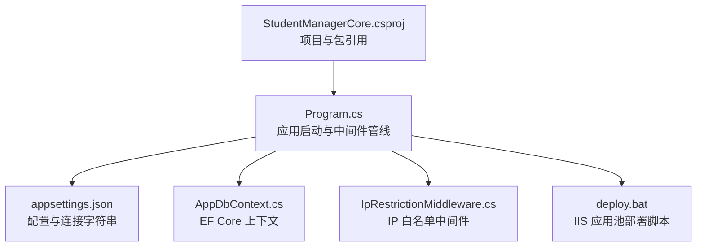
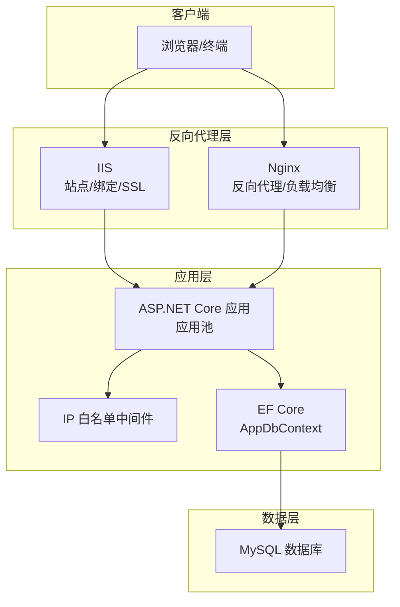
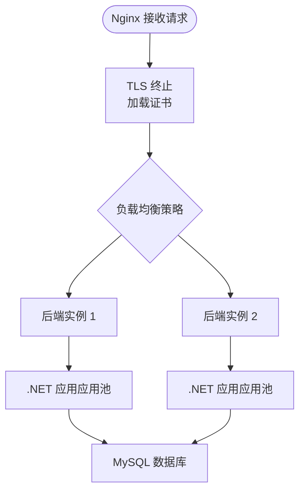
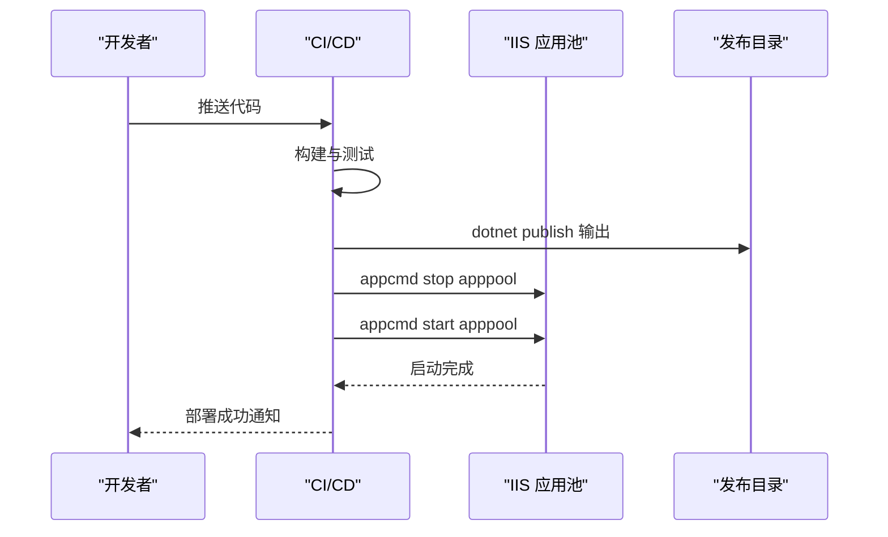
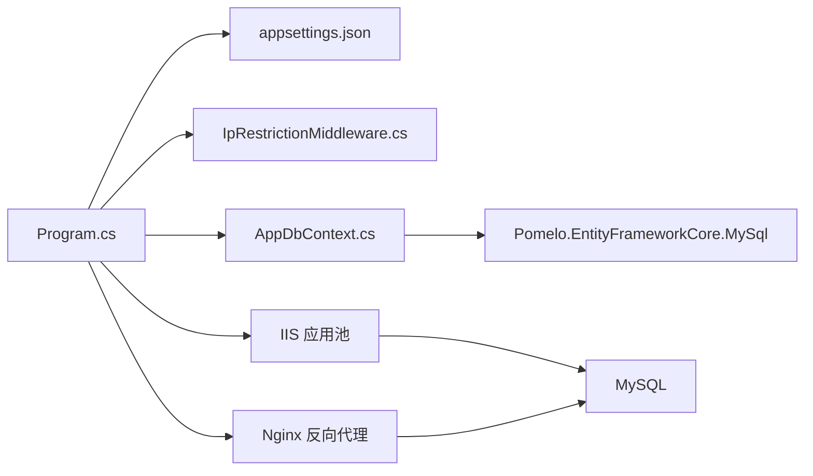

# 生产环境部署

<cite>
**本文档引用的文件**
- [Program.cs](file://Program.cs)
- [appsettings.json](file://appsettings.json)
- [StudentManagerCore.csproj](file://StudentManagerCore.csproj)
- [deploy.bat](file://deploy.bat)
- [AppDbContext.cs](file://Data/AppDbContext.cs)
- [IpRestrictionMiddleware.cs](file://Middleware/IpRestrictionMiddleware.cs)
</cite>

## 目录
1. [简介](#简介)
2. [项目结构](#项目结构)
3. [核心组件](#核心组件)
4. [架构总览](#架构总览)
5. [详细组件分析](#详细组件分析)
6. [依赖关系分析](#依赖关系分析)
7. [性能考虑](#性能考虑)
8. [故障排除指南](#故障排除指南)
9. [结论](#结论)
10. [附录](#附录)

## 简介
本指南面向生产环境部署，围绕 IIS 与 Nginx 的配置、SSL 证书安装、反向代理、环境变量与配置文件管理、数据库连接安全与连接池、应用程序池与进程回收、部署脚本与自动化流程、负载均衡与高可用方案，以及 Docker 容器化最佳实践进行系统阐述。文档内容基于仓库现有代码与配置文件进行分析与提炼，确保可操作性与安全性。

## 项目结构
该应用为 ASP.NET Core MVC 应用，使用 Entity Framework Core 连接 MySQL 数据库，内置 IP 白名单中间件与自动迁移逻辑。关键文件与职责如下：
- Program.cs：应用启动、服务注册、中间件管线、自动迁移与错误处理
- appsettings.json：日志级别、允许主机、IP 白名单、数据库连接字符串
- StudentManagerCore.csproj：目标框架、包引用与默认排除规则
- deploy.bat：IIS 应用池停止/发布/启动的批处理脚本
- AppDbContext.cs：EF Core 上下文与实体映射
- IpRestrictionMiddleware.cs：基于配置的 IP 白名单中间件

**图表来源**
- [Program.cs:1-123](file://Program.cs#L1-L123)
- [appsettings.json:1-16](file://appsettings.json#L1-L16)
- [StudentManagerCore.csproj:1-21](file://StudentManagerCore.csproj#L1-L21)
- [deploy.bat:1-43](file://deploy.bat#L1-L43)
- [AppDbContext.cs:1-295](file://Data/AppDbContext.cs#L1-L295)
- [IpRestrictionMiddleware.cs:1-98](file://Middleware/IpRestrictionMiddleware.cs#L1-L98)

**章节来源**
- [Program.cs:1-123](file://Program.cs#L1-L123)
- [appsettings.json:1-16](file://appsettings.json#L1-L16)
- [StudentManagerCore.csproj:1-21](file://StudentManagerCore.csproj#L1-L21)
- [deploy.bat:1-43](file://deploy.bat#L1-L43)
- [AppDbContext.cs:1-295](file://Data/AppDbContext.cs#L1-L295)
- [IpRestrictionMiddleware.cs:1-98](file://Middleware/IpRestrictionMiddleware.cs#L1-L98)

## 核心组件
- 应用启动与中间件管线
  - 注册控制器视图、HTTP 上下文访问器、防伪令牌头、EF Core、认证（Cookie）、会话（分布式内存缓存）
  - IP 白名单中间件、全局异常处理（生产环境输出友好错误并记录日志）、HSTS、静态文件、路由、认证授权
  - 自动迁移：在应用启动时尝试对数据库执行迁移，失败时写入迁移错误文件
- 配置与连接
  - appsettings.json 提供日志、允许主机、IP 白名单与数据库连接字符串
  - 连接字符串指向 MySQL，版本由 EF Core 指定
- 部署脚本
  - 使用 appcmd 停止应用池、dotnet publish 发布到 IIS 站点目录、再启动应用池

**章节来源**
- [Program.cs:1-123](file://Program.cs#L1-L123)
- [appsettings.json:1-16](file://appsettings.json#L1-L16)
- [deploy.bat:1-43](file://deploy.bat#L1-L43)

## 架构总览
下图展示生产环境部署的关键交互：IIS/Nginx 作为反向代理，.NET 应用通过应用池运行，EF Core 访问 MySQL 数据库。IP 白名单中间件在网络层提供访问控制。

**图表来源**
- [Program.cs:1-123](file://Program.cs#L1-L123)
- [IpRestrictionMiddleware.cs:1-98](file://Middleware/IpRestrictionMiddleware.cs#L1-L98)
- [AppDbContext.cs:1-295](file://Data/AppDbContext.cs#L1-L295)

## 详细组件分析

### IIS 虚拟主机与 SSL 配置
- 站点绑定
  - 在 IIS 管理器中创建站点，绑定到目标端口（建议 HTTPS），选择对应物理路径（如 E:\wwwroot\0008_qu4cz8\web）
  - 设置“允许覆盖”以支持 web.config 中的重写与模块配置
- SSL 证书
  - 通过 IIS 导入 PEM/CER 证书（若为自签名，需确保证书链完整）
  - 在绑定中启用 HTTPS 并选择证书
- 应用程序池
  - 使用无托管代码管道模式（Integrated）
  - .NET 版本选择与项目一致（.NET 8）
  - 回收策略：启用定期回收（如 1740 分钟）、非活动回收（如 20 分钟）、高峰时段避免重启
  - 内存限制：根据服务器资源设定最大工作集（例如 1GB），开启快速失败保护
- 反向代理与 X-Forwarded-For
  - 若前置 Nginx/IIS，确保正确传递 X-Forwarded-For，应用已从该头部解析真实 IP

**章节来源**
- [Program.cs:49-96](file://Program.cs#L49-L96)
- [IpRestrictionMiddleware.cs:50-56](file://Middleware/IpRestrictionMiddleware.cs#L50-L56)

### Nginx 反向代理与负载均衡
- 反向代理
  - upstream 指向多个后端实例（至少 2 个以实现高可用）
  - server 块监听 443，启用 SSL，配置证书与私钥
  - location / 将请求代理至 upstream
- 负载均衡策略
  - 轮询（默认）或健康检查（结合 keepalived/HAProxy）
- 缓存与压缩
  - 对静态资源启用 gzip/deflate，合理设置缓存头
- 安全加固
  - 仅允许 HTTPS、禁用不必要 HTTP 方法、限制请求体大小

**图表来源**
- [Program.cs:1-123](file://Program.cs#L1-L123)
- [AppDbContext.cs:1-295](file://Data/AppDbContext.cs#L1-L295)

### 环境变量与配置文件管理
- 环境变量优先级
  - IIS：通过应用程序设置覆盖 appsettings.json 中的键值
  - Docker：通过环境变量注入（如 ASPNETCORE_URLS、ConnectionStrings:DefaultConnection）
- 环境差异
  - 开发：AllowedHosts 可放宽，日志级别降低，IP 白名单可放开
  - 测试：严格 AllowedHosts，启用 HSTS，IP 白名单按网段配置
  - 生产：严格 AllowedHosts，启用 HSTS，IP 白名单精确到网段或单 IP
- 安全存储
  - 数据库连接字符串建议使用密钥管理服务（Windows DPAPI、Azure Key Vault、HashiCorp Vault）

**章节来源**
- [appsettings.json:1-16](file://appsettings.json#L1-L16)
- [Program.cs:18-21](file://Program.cs#L18-L21)

### 数据库连接安全与连接池
- 连接字符串
  - 使用强密码与最小权限账户，避免明文存储
  - 建议添加连接超时、命令超时、连接池最小/最大大小等参数
- 连接池设置
  - 最小池大小：CPU 核数 × 2
  - 最大池大小：CPU 核数 × 4
  - 连接超时：15 秒，命令超时：60 秒
- 监控与诊断
  - 启用慢查询日志与连接池统计，定期审查

**章节来源**
- [appsettings.json:12-14](file://appsettings.json#L12-L14)
- [Program.cs:18-21](file://Program.cs#L18-L21)

### 应用程序池配置、内存限制与进程回收
- 应用程序池
  - 无托管代码管道模式（Integrated）
  - 托管管道版本：.NET CLR v4.0
- 内存限制
  - 最大工作集：按服务器总内存的 60%-70% 设定
  - 启用快速失败保护，阈值 1800 秒内 5 次失败
- 进程回收
  - 定期回收：每周一次，避开业务高峰期
  - 非活动回收：20 分钟
  - 处理器时间回收：每日 1GB

**章节来源**
- [deploy.bat:9-35](file://deploy.bat#L9-L35)

### 部署脚本与自动化部署流程
- 批处理脚本
  - 停止应用池 → dotnet publish → 启动应用池
  - 错误处理：捕获发布失败并提示
- CI/CD 流程建议
  - 触发条件：主分支推送
  - 步骤：构建（dotnet publish）→ 单元测试 → 部署脚本 → 健康检查 → 回滚策略
- 蓝绿/金丝雀发布
  - 使用 IIS 多站点或多应用池，逐步切换流量

**图表来源**
- [deploy.bat:1-43](file://deploy.bat#L1-L43)

**章节来源**
- [deploy.bat:1-43](file://deploy.bat#L1-L43)

### 负载均衡与高可用部署方案
- 方案一：Nginx + 多实例
  - Nginx upstream 指向多台服务器的应用实例
  - 健康检查：基于 TCP/HTTP 探针
- 方案二：IIS ARR + NLB
  - 使用 ARR 模块与网络负载均衡
- 方案三：云平台
  - Azure Load Balancer/ALB + KEDA 自动扩缩容
- 数据一致性
  - 使用只读副本与读写分离，避免热点写入

**章节来源**
- [Program.cs:49-96](file://Program.cs#L49-L96)

### Docker 容器化部署与最佳实践
- Dockerfile 建议
  - 基于官方 ASP.NET Core 运行时镜像
  - 设置时区与非 root 用户
  - 暴露端口 80/443，设置 HEALTHCHECK
- docker-compose
  - 声明应用、MySQL、Nginx 服务，定义网络与卷
  - 使用 secrets 管理敏感配置
- 安全与合规
  - 只读根文件系统、丢弃不必要的包、扫描镜像漏洞
  - 使用只读挂载与最小权限账号

[本节为通用实践说明，未直接分析具体源文件]

## 依赖关系分析
- 组件耦合
  - Program.cs 依赖 appsettings.json 的连接字符串与中间件配置
  - AppDbContext 依赖 EF Core 包与 MySQL 提供者
  - IpRestrictionMiddleware 依赖配置中心与请求上下文
- 外部依赖
  - MySQL 数据库、IIS/Nginx、操作系统（Windows/Linux）

**图表来源**
- [Program.cs:1-123](file://Program.cs#L1-L123)
- [appsettings.json:1-16](file://appsettings.json#L1-L16)
- [StudentManagerCore.csproj:10-18](file://StudentManagerCore.csproj#L10-L18)
- [AppDbContext.cs:1-295](file://Data/AppDbContext.cs#L1-L295)
- [IpRestrictionMiddleware.cs:1-98](file://Middleware/IpRestrictionMiddleware.cs#L1-L98)

**章节来源**
- [StudentManagerCore.csproj:10-18](file://StudentManagerCore.csproj#L10-L18)
- [Program.cs:1-123](file://Program.cs#L1-L123)

## 性能考虑
- 连接池与并发
  - 合理设置连接池大小，避免过度连接导致数据库压力
- 中间件顺序
  - 将静态文件与缓存置于前部，减少后续中间件开销
- 日志与监控
  - 生产环境降低日志级别，启用结构化日志与指标导出
- 缓存策略
  - 使用分布式缓存（Redis）缓存热点数据与会话

[本节提供通用指导，未直接分析具体源文件]

## 故障排除指南
- 启动失败
  - 检查应用池状态、.NET 运行时版本、IIS 权限
  - 查看错误日志文件与迁移错误文件
- 数据库连接问题
  - 校验连接字符串、防火墙与端口、凭据权限
- IP 白名单误拒
  - 确认 X-Forwarded-For 是否正确传递，允许登录与静态资源路径
- 部署中断
  - 使用部署脚本的错误处理逻辑，确认发布目录权限与应用池回收

**章节来源**
- [Program.cs:49-81](file://Program.cs#L49-L81)
- [Program.cs:108-120](file://Program.cs#L108-L120)
- [IpRestrictionMiddleware.cs:34-96](file://Middleware/IpRestrictionMiddleware.cs#L34-L96)
- [deploy.bat:10-35](file://deploy.bat#L10-L35)

## 结论
本指南基于现有代码与配置，给出了生产环境部署的系统性方案：IIS 与 Nginx 的虚拟主机与反向代理、SSL 证书、IP 白名单访问控制、数据库连接安全与连接池、应用池与回收策略、自动化部署脚本与高可用方案，并补充了 Docker 容器化最佳实践。建议在实施过程中结合企业安全基线与合规要求，持续优化性能与可靠性。

## 附录
- 快速检查清单
  - IIS 站点绑定与 SSL 已配置
  - 应用程序池回收策略与内存限制已设定
  - appsettings.json 的连接字符串与 IP 白名单已按环境调整
  - 部署脚本已验证且具备错误处理
  - Nginx 负载均衡与健康检查已就绪
  - Docker 部署（如适用）已完成镜像扫描与只读根文件系统