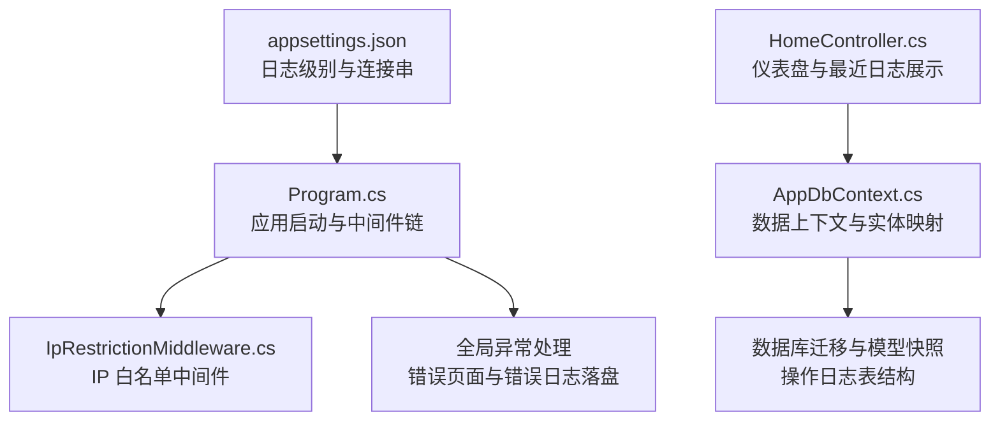
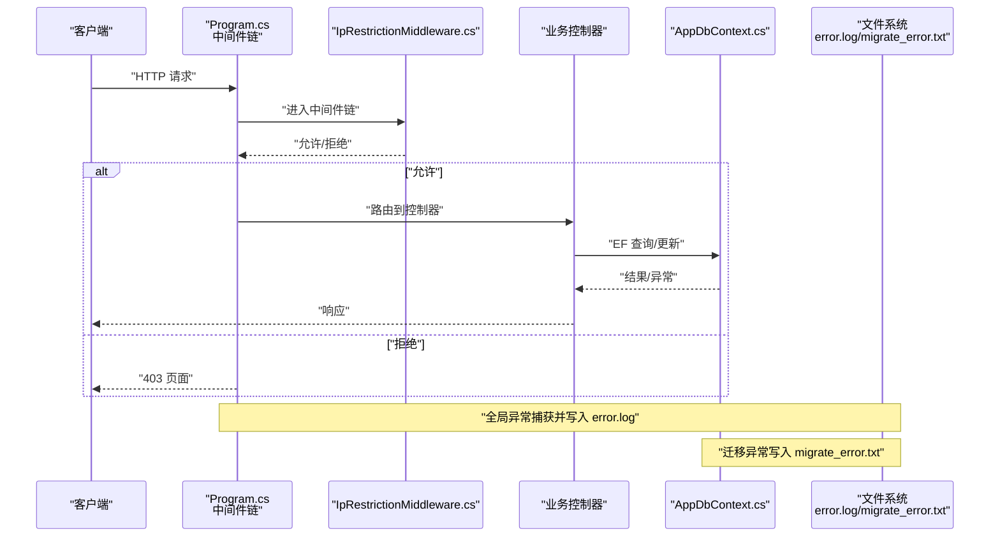
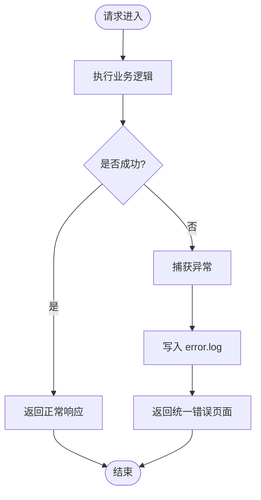
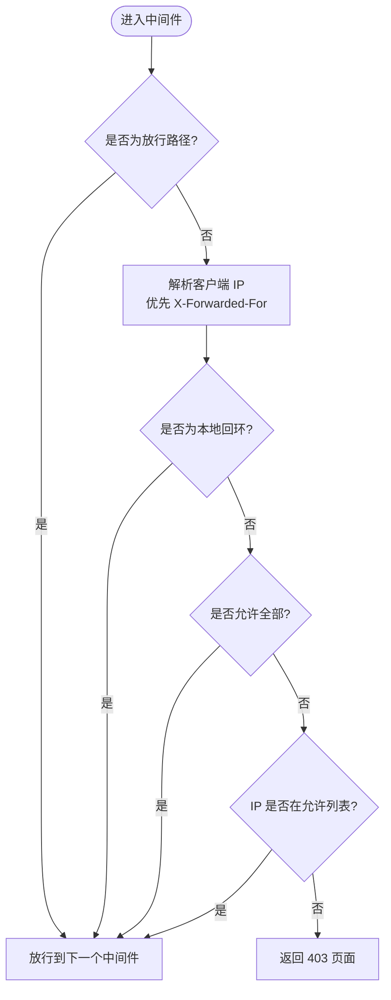
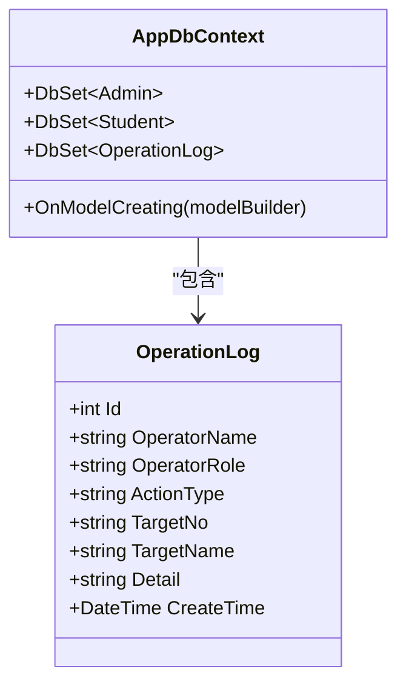
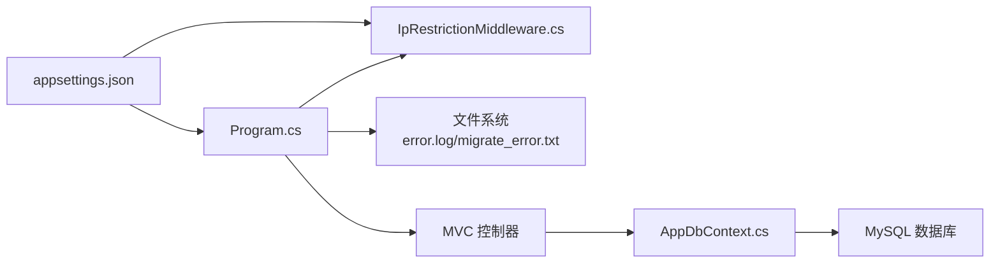

# 监控与日志

<cite>
**本文引用的文件**
- [appsettings.json](file://appsettings.json)
- [Program.cs](file://Program.cs)
- [IpRestrictionMiddleware.cs](file://Middleware/IpRestrictionMiddleware.cs)
- [AppDbContext.cs](file://Data/AppDbContext.cs)
- [HomeController.cs](file://Controllers/HomeController.cs)
- [20260609075559_InitialCreate.cs](file://Migrations/20260609075559_InitialCreate.cs)
- [20260609075559_InitialCreate.Designer.cs](file://Migrations/20260609075559_InitialCreate.Designer.cs)
- [AppDbContextModelSnapshot.cs](file://Migrations/AppDbContextModelSnapshot.cs)
- [20260611001601_AddExamEndDate.Designer.cs](file://Migrations/20260611001601_AddExamEndDate.Designer.cs)
- [20260611075107_RefactorScoreModel.Designer.cs](file://Migrations/20260611075107_RefactorScoreModel.Designer.cs)
</cite>

## 目录
1. [简介](#简介)
2. [项目结构](#项目结构)
3. [核心组件](#核心组件)
4. [架构总览](#架构总览)
5. [详细组件分析](#详细组件分析)
6. [依赖关系分析](#依赖关系分析)
7. [性能考虑](#性能考虑)
8. [故障排查指南](#故障排查指南)
9. [结论](#结论)
10. [附录](#附录)

## 简介
本指南面向学生管理系统（StudentManagerCore）的监控与日志管理，围绕应用性能监控、日志系统配置、错误日志收集与分析、数据库性能监控、系统资源监控、告警与通知以及日志轮转与归档策略展开。文档结合现有代码与配置文件，给出可落地的实践建议与可视化图示，帮助运维与开发团队建立完善的可观测性体系。

## 项目结构
- 应用启动与中间件链路集中在 Program.cs，包含全局异常处理、状态码错误页面、IP 白名单中间件等。
- 日志配置位于 appsettings.json，定义默认日志级别与 ASP.NET Core 框架日志级别。
- 数据访问层通过 AppDbContext 统一管理实体映射与数据库交互。
- 运维相关：IP 白名单中间件独立于主流程，便于扩展安全与审计能力。
- 数据库迁移与模型快照中包含操作日志表结构，支撑日志与审计功能。

图表来源
- [Program.cs:1-123](file://Program.cs#L1-L123)
- [appsettings.json:1-16](file://appsettings.json#L1-L16)
- [IpRestrictionMiddleware.cs:1-98](file://Middleware/IpRestrictionMiddleware.cs#L1-L98)
- [AppDbContext.cs:1-295](file://Data/AppDbContext.cs#L1-L295)
- [20260609075559_InitialCreate.cs:150-172](file://Migrations/20260609075559_InitialCreate.cs#L150-L172)

章节来源
- [Program.cs:1-123](file://Program.cs#L1-L123)
- [appsettings.json:1-16](file://appsettings.json#L1-L16)

## 核心组件
- 日志系统与级别
  - 默认日志级别为 Information，ASP.NET Core 命名空间为 Warning，适合生产环境减少噪音。
  - 可通过 appsettings.json 调整各命名空间的日志级别。
- 错误处理与日志落盘
  - 全局中间件捕获未处理异常，返回统一错误页面，并将异常写入 error.log 文件，便于事后分析。
  - 数据库迁移异常单独写入 migrate_error.txt，包含时间、消息与堆栈。
- IP 白名单中间件
  - 从 appsettings.json 读取允许的 IP 列表，支持反向代理场景下的 X-Forwarded-For 解析，保护系统免受未授权访问。
- 数据库与日志存储
  - OperationLog 实体与迁移脚本表明系统具备操作日志持久化能力，可用于审计与追踪。
- 控制台仪表盘
  - 主页控制器加载最近操作日志用于前端展示，便于快速定位近期变更。

章节来源
- [appsettings.json:1-16](file://appsettings.json#L1-L16)
- [Program.cs:49-81](file://Program.cs#L49-L81)
- [Program.cs:108-120](file://Program.cs#L108-L120)
- [IpRestrictionMiddleware.cs:16-32](file://Middleware/IpRestrictionMiddleware.cs#L16-L32)
- [AppDbContext.cs:136-149](file://Data/AppDbContext.cs#L136-L149)
- [20260609075559_InitialCreate.cs:150-172](file://Migrations/20260609075559_InitialCreate.cs#L150-L172)
- [HomeController.cs:82-87](file://Controllers/HomeController.cs#L82-L87)

## 架构总览
下图展示了请求在应用中的流转、异常捕获与日志落盘的关键节点，以及 IP 白名单中间件对请求的前置校验。

图表来源
- [Program.cs:49-81](file://Program.cs#L49-L81)
- [Program.cs:108-120](file://Program.cs#L108-L120)
- [IpRestrictionMiddleware.cs:34-96](file://Middleware/IpRestrictionMiddleware.cs#L34-L96)
- [AppDbContext.cs:1-295](file://Data/AppDbContext.cs#L1-L295)

## 详细组件分析

### 日志系统与配置
- 日志级别
  - 默认级别 Information，框架日志（Microsoft.AspNetCore）为 Warning，降低噪音，聚焦应用日志。
- 日志格式与输出
  - 当前未配置结构化日志提供程序（如 JSON、Serilog、Seq 等），默认由 ASP.NET Core 内置日志提供程序输出至控制台。
- 输出目标
  - 生产环境建议接入文件、事件日志或集中式日志平台（如 ELK、Splunk、Azure Monitor 等），以满足合规与检索需求。

章节来源
- [appsettings.json:2-7](file://appsettings.json#L2-L7)

### 异常捕获与错误日志
- 全局异常处理
  - 在 Program.cs 的中间件中捕获未处理异常，设置 500 状态码并返回统一错误页面，同时将异常追加写入 error.log。
- 迁移异常处理
  - 数据库迁移失败时写入 migrate_error.txt，包含时间、错误消息与堆栈，便于快速定位迁移问题。
- 建议
  - 对异常进行结构化记录（含请求 ID、用户标识、时间戳、堆栈摘要），并区分严重程度（如 Error/Warn/Info）。
  - 结合日志聚合平台实现异常趋势分析与告警。

图表来源
- [Program.cs:49-81](file://Program.cs#L49-L81)

章节来源
- [Program.cs:49-81](file://Program.cs#L49-L81)
- [Program.cs:108-120](file://Program.cs#L108-L120)

### IP 白名单中间件
- 功能
  - 从 appsettings.json 读取允许的 IP 列表，支持多 IP、通配符“*”放行。
  - 反向代理场景解析 X-Forwarded-For，本地回环地址直接放行。
  - 登录页与静态资源路径自动放行，避免阻断认证与前端资源。
- 配置
  - IpRestriction:AllowedIPs 支持逗号分隔的多个 IP，或“*”表示放行全部。
- 建议
  - 将该中间件置于路由之前，确保在认证与授权前完成访问控制。
  - 记录被拒绝的访问尝试，配合日志平台进行安全审计。

图表来源
- [IpRestrictionMiddleware.cs:34-96](file://Middleware/IpRestrictionMiddleware.cs#L34-L96)
- [appsettings.json:9-11](file://appsettings.json#L9-L11)

章节来源
- [IpRestrictionMiddleware.cs:16-32](file://Middleware/IpRestrictionMiddleware.cs#L16-L32)
- [IpRestrictionMiddleware.cs:34-96](file://Middleware/IpRestrictionMiddleware.cs#L34-L96)
- [appsettings.json:9-11](file://appsettings.json#L9-L11)

### 数据库性能监控与连接池
- 连接池
  - 通过 appsettings.json 的连接字符串配置 MySQL 连接参数，EF Core 默认使用 Pomelo.EntityFrameworkCore.MySql。
- 查询性能
  - 建议启用慢查询日志与查询执行计划分析，结合数据库性能监控工具（如 MySQL Enterprise Monitor、Percona Monitoring and Management）。
- 连接池监控
  - 关注连接池活跃连接数、等待队列长度、超时次数等指标，避免连接泄露与饥饿。
- 日志与审计
  - OperationLog 表用于记录操作行为，可作为审计与回溯依据；建议在高并发场景下对写入路径进行限流与异步化。

图表来源
- [AppDbContext.cs:10-29](file://Data/AppDbContext.cs#L10-L29)
- [AppDbContext.cs:136-149](file://Data/AppDbContext.cs#L136-L149)
- [20260609075559_InitialCreate.cs:150-172](file://Migrations/20260609075559_InitialCreate.cs#L150-L172)

章节来源
- [appsettings.json:12-14](file://appsettings.json#L12-L14)
- [AppDbContext.cs:10-29](file://Data/AppDbContext.cs#L10-L29)
- [AppDbContext.cs:136-149](file://Data/AppDbContext.cs#L136-L149)
- [20260609075559_InitialCreate.cs:150-172](file://Migrations/20260609075559_InitialCreate.cs#L150-L172)

### 系统资源监控
- CPU、内存、磁盘
  - 建议通过操作系统监控工具（如 Windows 任务管理器、性能监视器、Prometheus+Node Exporter）采集应用进程的 CPU 使用率、工作集内存、IO 等指标。
- 建议
  - 设置阈值告警（如 CPU > 80% 持续 5 分钟），并结合日志与指标平台联动定位瓶颈。
  - 定期检查磁盘空间与 IO 延迟，防止因日志文件膨胀导致磁盘不足。

[本节为通用指导，无需特定文件引用]

### 告警规则与通知
- 规则建议
  - 错误率：每分钟错误请求数超过阈值触发告警。
  - 响应时间：P95/P99 响应时间超过阈值触发告警。
  - 资源：CPU/内存/磁盘使用率持续超过阈值触发告警。
- 通知机制
  - 建议集成邮件、企业微信、钉钉或 PagerDuty 等通知渠道，区分严重、警告、恢复三类状态。
  - 告警内容包含时间窗、指标阈值、当前值、受影响实例与关联日志链接。

[本节为通用指导，无需特定文件引用]

### 日志轮转与归档
- 轮转策略
  - 基于大小轮转（如单文件最大 100MB，保留 10 份）与基于时间的滚动（按日/按月）。
- 归档与保留
  - 历史日志压缩归档，按月/季度清理过期日志，保留至少 90 天的审计日志。
- 建议
  - 将 error.log 与 migrate_error.txt 纳入轮转策略，避免单文件过大影响系统稳定性。
  - 结合集中式日志平台实现索引与检索，提升故障排查效率。

[本节为通用指导，无需特定文件引用]

## 依赖关系分析
- 组件耦合
  - Program.cs 作为入口，串联中间件、异常处理与路由；与文件系统存在直接耦合（写日志文件）。
  - IP 白名单中间件依赖配置中心（appsettings.json）。
  - 数据访问层通过 AppDbContext 统一管理实体与数据库交互。
- 外部依赖
  - MySQL 连接字符串来自 appsettings.json。
  - 日志输出依赖 ASP.NET Core 内置日志提供程序（当前未配置第三方提供程序）。

图表来源
- [Program.cs:1-123](file://Program.cs#L1-L123)
- [IpRestrictionMiddleware.cs:16-32](file://Middleware/IpRestrictionMiddleware.cs#L16-L32)
- [appsettings.json:1-16](file://appsettings.json#L1-L16)
- [AppDbContext.cs:1-295](file://Data/AppDbContext.cs#L1-L295)

章节来源
- [Program.cs:1-123](file://Program.cs#L1-L123)
- [appsettings.json:1-16](file://appsettings.json#L1-L16)
- [AppDbContext.cs:1-295](file://Data/AppDbContext.cs#L1-L295)

## 性能考虑
- 请求跟踪
  - 建议引入 Correlation ID 与请求链路追踪（如 OpenTelemetry），在日志中统一标识一次请求的全生命周期。
- 响应时间监控
  - 在中间件层记录请求开始与结束时间，计算响应时间并上报指标。
- 错误率统计
  - 统计 5xx 错误占比，结合异常类型进行分类统计，识别热点问题。
- 数据库查询优化
  - 通过慢查询日志与执行计划分析，优化高频查询与索引缺失问题。
- 连接池调优
  - 根据并发与事务特性调整连接池大小，避免连接不足或过度占用。

[本节为通用指导，无需特定文件引用]

## 故障排查指南
- 常见问题
  - 无法访问系统：检查 IP 白名单配置与反向代理头 X-Forwarded-For。
  - 页面显示 500：查看 error.log 获取异常时间与摘要，必要时补充堆栈信息。
  - 迁移失败：查看 migrate_error.txt，确认数据库权限与连接字符串正确性。
- 建议流程
  - 快速定位：根据时间窗与请求 ID 在日志中检索。
  - 根因分析：结合数据库慢查询与系统资源使用情况判断瓶颈。
  - 回归验证：修复后观察错误率与响应时间指标变化。

章节来源
- [Program.cs:49-81](file://Program.cs#L49-L81)
- [Program.cs:108-120](file://Program.cs#L108-L120)
- [IpRestrictionMiddleware.cs:52-56](file://Middleware/IpRestrictionMiddleware.cs#L52-L56)

## 结论
当前系统已具备基础的全局异常处理与错误日志落盘能力，日志级别与 IP 白名单中间件为生产环境提供了必要的安全与可观测性基础。为进一步提升监控与日志管理能力，建议引入结构化日志、集中式日志平台、请求链路追踪与资源指标监控，并完善告警规则与通知机制，最终形成闭环的可观测性体系。

## 附录
- 操作日志表结构参考
  - 字段：Id、OperatorName、OperatorRole、ActionType、TargetNo、TargetName、Detail、CreateTime。
  - 用途：审计与回溯，建议与用户会话与请求 ID 关联。

章节来源
- [20260609075559_InitialCreate.cs:150-172](file://Migrations/20260609075559_InitialCreate.cs#L150-L172)
- [20260609075559_InitialCreate.Designer.cs:365-400](file://Migrations/20260609075559_InitialCreate.Designer.cs#L365-L400)
- [AppDbContextModelSnapshot.cs:468-500](file://Migrations/AppDbContextModelSnapshot.cs#L468-L500)
- [20260611001601_AddExamEndDate.Designer.cs:435-468](file://Migrations/20260611001601_AddExamEndDate.Designer.cs#L435-L468)
- [20260611075107_RefactorScoreModel.Designer.cs:471-503](file://Migrations/20260611075107_RefactorScoreModel.Designer.cs#L471-L503)