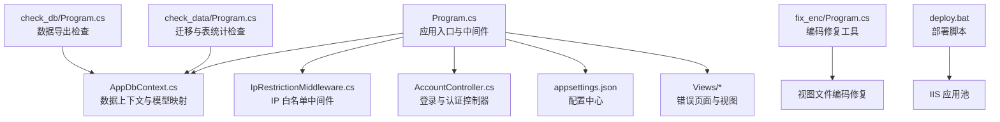
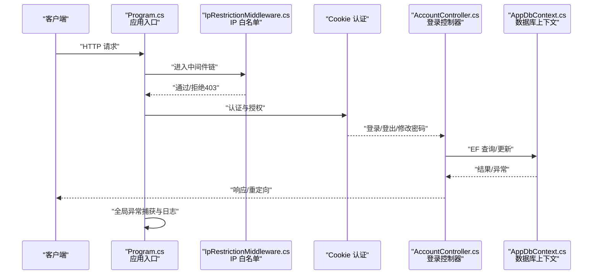
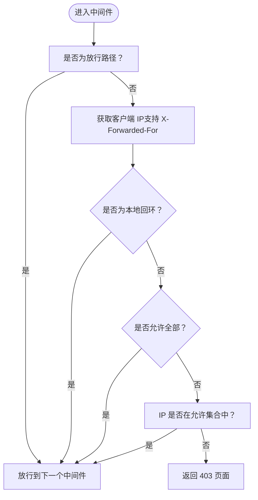
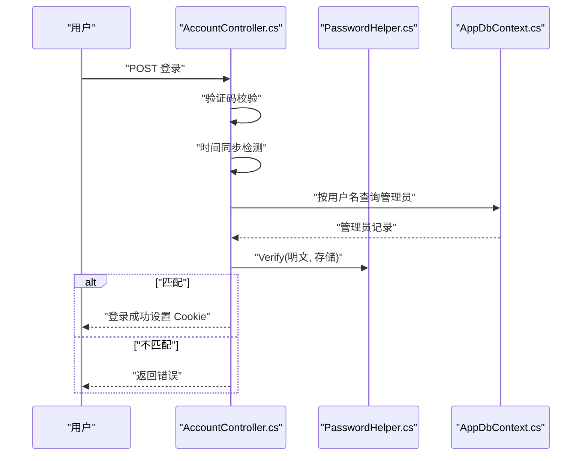
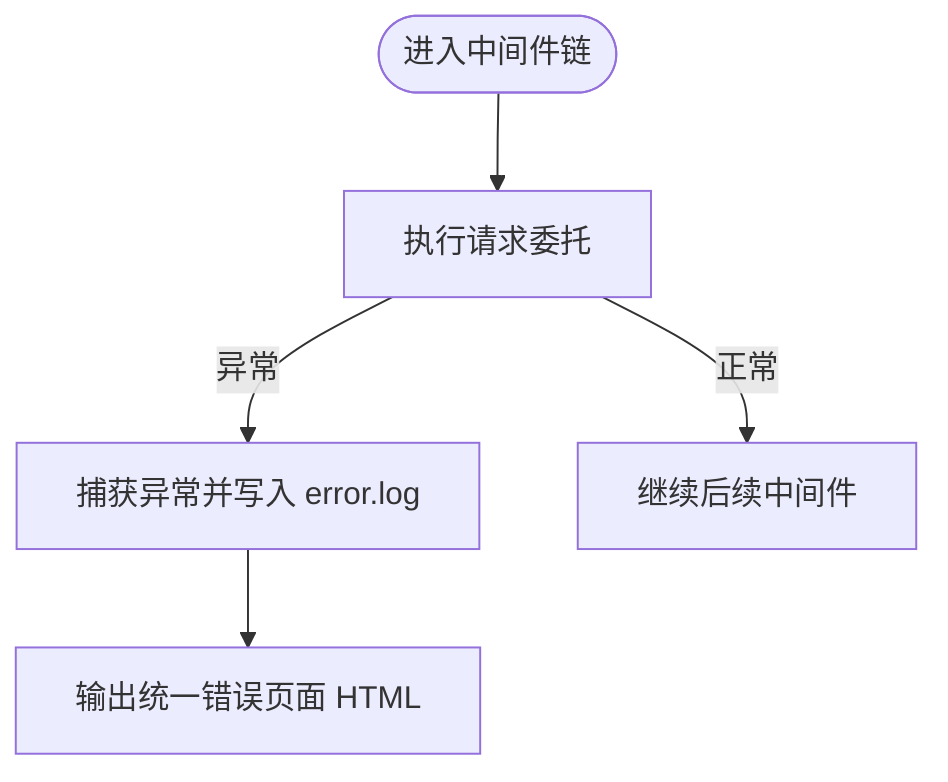
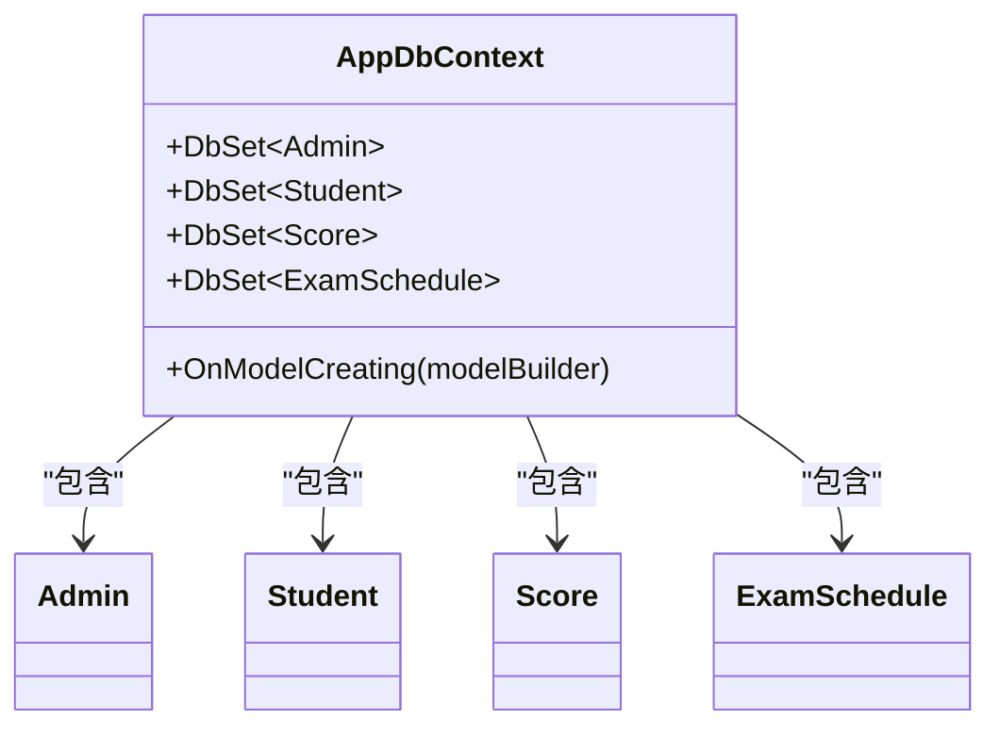
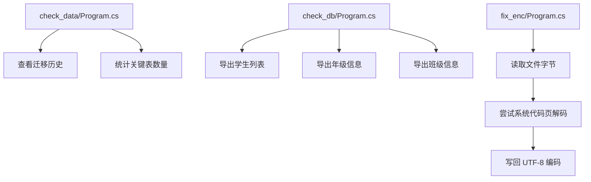
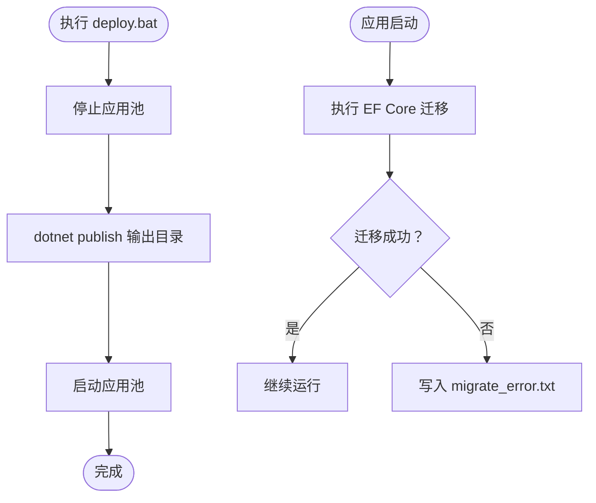
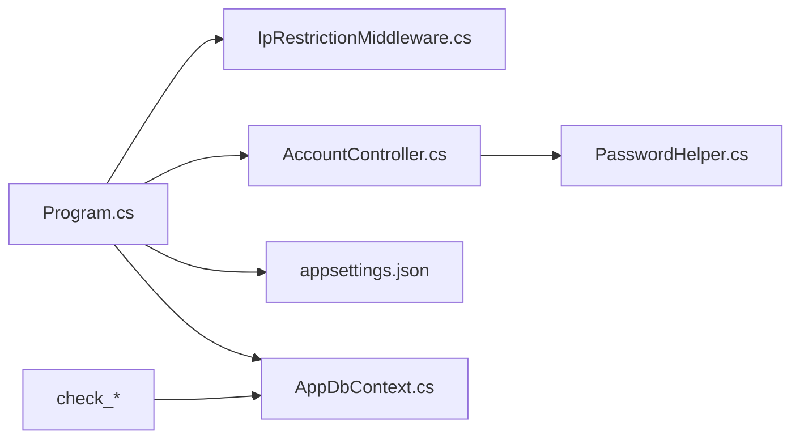

# 维护与故障排除

<cite>
**本文引用的文件**
- [Program.cs](file://Program.cs)
- [appsettings.json](file://appsettings.json)
- [AppDbContext.cs](file://Data/AppDbContext.cs)
- [IpRestrictionMiddleware.cs](file://Middleware/IpRestrictionMiddleware.cs)
- [AccountController.cs](file://Controllers/AccountController.cs)
- [PasswordHelper.cs](file://Services/PasswordHelper.cs)
- [Error.cshtml](file://Views/Home/Error.cshtml)
- [Error.cshtml](file://Views/Shared/Shared.cshtml)
- [Program.cs](file://check_data/Program.cs)
- [Program.cs](file://check_db/Program.cs)
- [Program.cs](file://fix_enc/Program.cs)
- [deploy.bat](file://deploy.bat)
- [Add_GradeManagement_Tables.sql](file://Database/Add_GradeManagement_Tables.sql)
- [Create_Announcement_Tables.sql](file://Database/Create_Announcement_Tables.sql)
- [Update_Student_Fields.sql](file://Database/Update_Student_Fields.sql)
</cite>

## 目录
1. [简介](#简介)
2. [项目结构](#项目结构)
3. [核心组件](#核心组件)
4. [架构总览](#架构总览)
5. [详细组件分析](#详细组件分析)
6. [依赖关系分析](#依赖关系分析)
7. [性能考虑](#性能考虑)
8. [故障排除指南](#故障排除指南)
9. [结论](#结论)
10. [附录](#附录)

## 简介
本指南面向运维与技术支持人员，围绕学生信息管理系统的日常维护与故障排除展开，覆盖数据库备份与恢复、日志与缓存管理、临时文件与静态资源维护、常见运行时错误诊断、性能问题分析与优化、系统崩溃后的恢复流程、安全事件应急响应、定期健康检查与维护计划制定，以及故障排除工具与调试技巧。内容基于仓库中的实际代码与配置文件整理而成，确保可操作性与可追溯性。

## 项目结构
系统采用 ASP.NET Core MVC 架构，核心由以下部分组成：
- 应用入口与管线：Program.cs 定义服务注册、中间件顺序、自动迁移与全局异常处理。
- 配置中心：appsettings.json 提供连接字符串、日志级别、IP 白名单等配置。
- 数据层：AppDbContext 定义实体映射与关系约束。
- 认证与会话：Cookie 认证、分布式缓存与 Session。
- 安全中间件：IP 白名单限制访问。
- 控制器与视图：账户登录、错误页面等。
- 工具集：check_data、check_db、fix_enc 等独立控制台工具用于数据校验与编码修复。
- 部署脚本：deploy.bat 实现 IIS 应用池的停止/发布/启动流程。

图表来源
- [Program.cs:1-123](file://Program.cs#L1-L123)
- [appsettings.json:1-16](file://appsettings.json#L1-L16)
- [AppDbContext.cs:1-295](file://Data/AppDbContext.cs#L1-L295)
- [IpRestrictionMiddleware.cs:1-98](file://Middleware/IpRestrictionMiddleware.cs#L1-L98)
- [AccountController.cs:1-261](file://Controllers/AccountController.cs#L1-L261)
- [check_data/Program.cs:1-27](file://check_data/Program.cs#L1-L27)
- [check_db/Program.cs:1-35](file://check_db/Program.cs#L1-L35)
- [fix_enc/Program.cs:1-40](file://fix_enc/Program.cs#L1-L40)
- [deploy.bat:1-43](file://deploy.bat#L1-L43)

章节来源
- [Program.cs:1-123](file://Program.cs#L1-L123)
- [appsettings.json:1-16](file://appsettings.json#L1-L16)

## 核心组件
- 应用入口与中间件管线
  - 注册 MVC、Anti-Forgery、Entity Framework、Cookie 认证、Session、分布式缓存。
  - 全局异常捕获并写入 error.log，统一错误页面路由。
  - 自动迁移：启动时执行 EF Core 迁移，异常写入 migrate_error.txt。
- 配置中心
  - 日志级别、允许主机、IP 白名单、数据库连接字符串。
- 数据上下文
  - 定义多张业务表（学生、教师、成绩、考试安排等）及外键/唯一索引约束。
- 安全中间件
  - IP 白名单，支持反向代理 X-Forwarded-For，放行登录与静态资源。
- 登录与认证
  - 基于 Cookie 的身份认证，密码哈希与兼容旧版明文，时间同步检测与验证码校验。
- 错误页面
  - 404/403/401/500 状态码的统一错误视图。
- 工具与脚本
  - 数据检查、数据库导出、编码修复、部署自动化。

章节来源
- [Program.cs:1-123](file://Program.cs#L1-L123)
- [appsettings.json:1-16](file://appsettings.json#L1-L16)
- [AppDbContext.cs:1-295](file://Data/AppDbContext.cs#L1-L295)
- [IpRestrictionMiddleware.cs:1-98](file://Middleware/IpRestrictionMiddleware.cs#L1-L98)
- [AccountController.cs:1-261](file://Controllers/AccountController.cs#L1-L261)
- [PasswordHelper.cs:1-42](file://Services/PasswordHelper.cs#L1-L42)
- [Error.cshtml:1-31](file://Views/Home/Error.cshtml#L1-L31)
- [Error.cshtml:1-38](file://Views/Shared/Shared.cshtml#L1-L38)

## 架构总览
下图展示请求从进入系统到数据库访问与错误处理的整体流程，以及关键组件之间的交互。

图表来源
- [Program.cs:45-122](file://Program.cs#L45-L122)
- [IpRestrictionMiddleware.cs:34-96](file://Middleware/IpRestrictionMiddleware.cs#L34-L96)
- [AccountController.cs:50-125](file://Controllers/AccountController.cs#L50-L125)
- [AppDbContext.cs:1-295](file://Data/AppDbContext.cs#L1-L295)

## 详细组件分析

### 组件一：IP 白名单中间件
- 功能要点
  - 从配置读取允许的 IP 列表，支持通配符“*”放行。
  - 放行登录页与静态资源路径，避免登录受限。
  - 支持反向代理场景，优先解析 X-Forwarded-For。
  - 本地回环地址始终放行，便于本机调试。
- 故障排除
  - 若出现 403，检查 appsettings.json 中的 IpRestriction:AllowedIPs 设置。
  - 代理部署需确认 X-Forwarded-For 是否正确传递。
  - 本地测试可用 127.0.0.1 访问。

图表来源
- [IpRestrictionMiddleware.cs:34-96](file://Middleware/IpRestrictionMiddleware.cs#L34-L96)
- [appsettings.json:9-11](file://appsettings.json#L9-L11)

章节来源
- [IpRestrictionMiddleware.cs:1-98](file://Middleware/IpRestrictionMiddleware.cs#L1-L98)
- [appsettings.json:9-11](file://appsettings.json#L9-L11)

### 组件二：登录与认证流程
- 功能要点
  - 登录页加载站点配置与验证码校验。
  - 时间同步检测（与互联网时间对比，偏差超过 5 分钟拒绝登录）。
  - 密码验证兼容旧版明文与新版哈希（PBKDF2）。
  - 强制弱密码用户修改密码。
  - 登出清除 Cookie。
- 故障排除
  - 登录失败：检查用户名/密码、验证码、站点关闭状态、时间同步。
  - 密码错误：确认是否为旧版明文或新规则不满足。
  - 修改密码：确认旧密码正确、新密码符合规则。

图表来源
- [AccountController.cs:50-125](file://Controllers/AccountController.cs#L50-L125)
- [PasswordHelper.cs:18-34](file://Services/PasswordHelper.cs#L18-L34)
- [AppDbContext.cs:10-17](file://Data/AppDbContext.cs#L10-L17)

章节来源
- [AccountController.cs:1-261](file://Controllers/AccountController.cs#L1-L261)
- [PasswordHelper.cs:1-42](file://Services/PasswordHelper.cs#L1-L42)

### 组件三：全局异常处理与错误页面
- 功能要点
  - 全局 try/catch 捕获异常，统一返回 500 友好页面。
  - 异常写入 error.log（位于应用根目录）。
  - 状态码页面路由：/Home/Error?statusCode={0}。
- 故障排除
  - 出现 500 错误时，查看 error.log 获取异常堆栈。
  - 对应 404/403/401 场景，检查路由与权限中间件。

图表来源
- [Program.cs:49-81](file://Program.cs#L49-L81)
- [Error.cshtml:1-31](file://Views/Home/Error.cshtml#L1-L31)
- [Error.cshtml:1-38](file://Views/Shared/Shared.cshtml#L1-L38)

章节来源
- [Program.cs:49-81](file://Program.cs#L49-L81)
- [Error.cshtml:1-31](file://Views/Home/Error.cshtml#L1-L31)
- [Error.cshtml:1-38](file://Views/Shared/Shared.cshtml#L1-L38)

### 组件四：数据库上下文与模型映射
- 功能要点
  - 定义 Admin、Student、Score、ExamSchedule 等实体与关系。
  - 外键约束与唯一索引（如 Score 的唯一组合索引）。
- 故障排除
  - 迁移失败：查看 migrate_error.txt，定位具体异常。
  - 查询异常：检查实体属性映射与外键关系。

图表来源
- [AppDbContext.cs:10-295](file://Data/AppDbContext.cs#L10-L295)

章节来源
- [AppDbContext.cs:1-295](file://Data/AppDbContext.cs#L1-L295)

### 组件五：数据检查与修复工具
- check_data：连接 MySQL，列出 EF Core 迁移历史与关键表数量。
- check_db：导出学生、年级、班级等基础数据，便于核对。
- fix_enc：修复视图文件编码（ANSI→UTF-8），避免中文乱码。

图表来源
- [check_data/Program.cs:1-27](file://check_data/Program.cs#L1-L27)
- [check_db/Program.cs:1-35](file://check_db/Program.cs#L1-L35)
- [fix_enc/Program.cs:1-40](file://fix_enc/Program.cs#L1-L40)

章节来源
- [check_data/Program.cs:1-27](file://check_data/Program.cs#L1-L27)
- [check_db/Program.cs:1-35](file://check_db/Program.cs#L1-L35)
- [fix_enc/Program.cs:1-40](file://fix_enc/Program.cs#L1-L40)

### 组件六：部署脚本与自动迁移
- deploy.bat：停止 IIS 应用池、dotnet publish、启动应用池。
- Program.cs：启动时自动执行 EF Core 迁移，异常写入 migrate_error.txt。

图表来源
- [deploy.bat:1-43](file://deploy.bat#L1-L43)
- [Program.cs:107-121](file://Program.cs#L107-L121)

章节来源
- [deploy.bat:1-43](file://deploy.bat#L1-L43)
- [Program.cs:107-121](file://Program.cs#L107-L121)

## 依赖关系分析
- 组件耦合
  - Program.cs 作为入口，串联中间件、认证、EF、视图与工具。
  - AccountController 依赖 AppDbContext 与 PasswordHelper。
  - IpRestrictionMiddleware 依赖配置中心。
- 外部依赖
  - MySQL（通过 Pomelo.EntityFrameworkCore.MySql）。
  - ASP.NET Core 身份认证与会话。
- 潜在风险
  - IP 白名单配置不当导致 403。
  - 迁移失败影响启动。
  - 视图编码不一致导致页面乱码。

图表来源
- [Program.cs:1-123](file://Program.cs#L1-L123)
- [IpRestrictionMiddleware.cs:1-98](file://Middleware/IpRestrictionMiddleware.cs#L1-L98)
- [AccountController.cs:1-261](file://Controllers/AccountController.cs#L1-L261)
- [PasswordHelper.cs:1-42](file://Services/PasswordHelper.cs#L1-L42)
- [AppDbContext.cs:1-295](file://Data/AppDbContext.cs#L1-L295)
- [appsettings.json:1-16](file://appsettings.json#L1-L16)

章节来源
- [Program.cs:1-123](file://Program.cs#L1-L123)
- [AccountController.cs:1-261](file://Controllers/AccountController.cs#L1-L261)
- [PasswordHelper.cs:1-42](file://Services/PasswordHelper.cs#L1-L42)
- [AppDbContext.cs:1-295](file://Data/AppDbContext.cs#L1-L295)
- [appsettings.json:1-16](file://appsettings.json#L1-L16)

## 性能考虑
- 数据库层面
  - 关注唯一索引与外键约束，避免重复插入与外键冲突引发的慢查询。
  - 使用工具导出关键表数据核对规模，识别异常增长。
- 应用层面
  - Session 与分布式缓存合理配置，避免内存压力。
  - 登录接口涉及网络时间 API 调用，注意超时与降级策略。
- 优化建议
  - 对高频查询建立合适索引（结合实际业务与查询模式）。
  - 合理拆分大事务，减少锁竞争。
  - 监控慢查询日志，定位热点 SQL。

[本节为通用指导，无需特定文件引用]

## 故障排除指南

### 日常维护任务
- 数据库备份
  - 使用 MySQL 官方工具（如 mysqldump）定期备份 StudentManagerDB。
  - 备份后验证恢复流程，确保可回滚。
- 日志清理
  - error.log 位于应用根目录，定期归档与轮转，避免磁盘占满。
  - migrate_error.txt 记录迁移异常，保留近期以便排查。
- 缓存清理
  - 清理分布式缓存与 Session，释放内存。
  - 针对验证码等短期数据，关注过期策略。
- 临时文件与静态资源
  - 确保 wwwroot/imge 目录存在，避免图片加载失败。
  - 定期清理无用静态资源，保持目录整洁。

章节来源
- [Program.cs:102-105](file://Program.cs#L102-L105)
- [Program.cs:78-80](file://Program.cs#L78-L80)
- [Program.cs:117-120](file://Program.cs#L117-L120)

### 常见运行时错误诊断
- 数据库连接问题
  - 检查 appsettings.json 中 DefaultConnection 连接字符串。
  - 启动时自动迁移失败，查看 migrate_error.txt。
- 权限错误（403）
  - 检查 IpRestriction:AllowedIPs 设置。
  - 代理部署确认 X-Forwarded-For。
- 配置错误
  - 站点配置项缺失或拼写错误，检查 SiteConfigs 表与读取逻辑。
  - 视图编码问题导致乱码，使用 fix_enc 工具修复。

章节来源
- [appsettings.json:12-14](file://appsettings.json#L12-L14)
- [Program.cs:116-120](file://Program.cs#L116-L120)
- [IpRestrictionMiddleware.cs:19-31](file://Middleware/IpRestrictionMiddleware.cs#L19-L31)
- [fix_enc/Program.cs:1-40](file://fix_enc/Program.cs#L1-L40)

### 性能问题分析与优化
- 慢查询优化
  - 使用 check_db 导出数据核对规模，结合业务 SQL 分析索引使用情况。
  - 关注 Score、ExamSchedule 等高频表的查询模式。
- 内存泄漏检测
  - 监控 Session 与分布式缓存占用，排查未释放对象。
  - 关注长时间运行任务与定时任务的资源回收。

章节来源
- [check_db/Program.cs:1-35](file://check_db/Program.cs#L1-L35)
- [AppDbContext.cs:204-224](file://Data/AppDbContext.cs#L204-L224)

### 系统崩溃后的恢复流程
- 快速恢复
  - 通过 deploy.bat 重新发布并启动应用池。
  - 检查 error.log 与 migrate_error.txt，定位崩溃原因。
- 数据修复
  - 使用 check_data 与 check_db 核对表结构与数据一致性。
  - 针对视图乱码，使用 fix_enc 修复编码。
- 回滚策略
  - 保留最近一次发布产物，必要时回滚到上一个稳定版本。

章节来源
- [deploy.bat:1-43](file://deploy.bat#L1-L43)
- [Program.cs:78-80](file://Program.cs#L78-L80)
- [Program.cs:117-120](file://Program.cs#L117-L120)
- [check_data/Program.cs:1-27](file://check_data/Program.cs#L1-L27)
- [check_db/Program.cs:1-35](file://check_db/Program.cs#L1-L35)
- [fix_enc/Program.cs:1-40](file://fix_enc/Program.cs#L1-L40)

### 安全事件应急响应与漏洞修复
- 应急响应
  - 立即审查 error.log 与访问日志，定位攻击特征。
  - 临时收紧 IpRestriction:AllowedIPs 或启用更严格的 WAF。
  - 更换受影响账户密码，强制用户修改弱密码。
- 漏洞修复
  - 更新依赖包，修复已知漏洞。
  - 加固登录流程（验证码、时间同步、强密码策略）。
  - 审计配置项与敏感信息存储（连接串、密钥）。

章节来源
- [AccountController.cs:233-259](file://Controllers/AccountController.cs#L233-L259)
- [PasswordHelper.cs:18-34](file://Services/PasswordHelper.cs#L18-L34)
- [IpRestrictionMiddleware.cs:19-31](file://Middleware/IpRestrictionMiddleware.cs#L19-L31)

### 定期健康检查与维护计划
- 健康检查
  - 每日：检查 error.log、migrate_error.txt、数据库连通性。
  - 每周：check_data 与 check_db 核对数据规模与一致性。
  - 每月：备份归档、清理缓存、评估 Session 占用。
- 维护计划
  - 版本升级前在测试环境验证自动迁移。
  - 部署窗口固定，使用 deploy.bat 执行标准化流程。

章节来源
- [Program.cs:78-80](file://Program.cs#L78-L80)
- [Program.cs:117-120](file://Program.cs#L117-L120)
- [check_data/Program.cs:1-27](file://check_data/Program.cs#L1-L27)
- [check_db/Program.cs:1-35](file://check_db/Program.cs#L1-L35)
- [deploy.bat:1-43](file://deploy.bat#L1-L43)

### 故障排除工具使用指南与调试技巧
- check_data
  - 用途：查看迁移历史与关键表数量。
  - 适用场景：部署后快速核对数据库状态。
- check_db
  - 用途：导出学生、年级、班级等基础数据。
  - 适用场景：数据核对与异常定位。
- fix_enc
  - 用途：修复视图文件编码（ANSI→UTF-8）。
  - 适用场景：中文乱码问题。
- 调试技巧
  - 在 Program.cs 中添加最小化日志，逐步缩小问题范围。
  - 使用浏览器开发者工具观察网络请求与状态码。
  - 对登录接口增加超时与降级提示，提升用户体验。

章节来源
- [check_data/Program.cs:1-27](file://check_data/Program.cs#L1-L27)
- [check_db/Program.cs:1-35](file://check_db/Program.cs#L1-L35)
- [fix_enc/Program.cs:1-40](file://fix_enc/Program.cs#L1-L40)
- [Program.cs:49-81](file://Program.cs#L49-L81)

## 结论
本指南基于仓库中的实际实现，提供了从日常维护到故障排除的全流程方法。通过规范的备份与日志管理、严格的 IP 白名单与强密码策略、完善的健康检查与部署流程，以及针对数据库与视图编码的专项工具，能够有效降低系统风险并提升稳定性。建议将本指南纳入团队知识库，并结合实际运行情况进行持续优化。

[本节为总结性内容，无需特定文件引用]

## 附录

### 数据库脚本参考
- 年级与班级表创建脚本
- 公告表与已读记录脚本
- 学生表字段更新脚本（删除冗余字段、新增扩展字段）

章节来源
- [Add_GradeManagement_Tables.sql:1-20](file://Database/Add_GradeManagement_Tables.sql#L1-L20)
- [Create_Announcement_Tables.sql:1-31](file://Database/Create_Announcement_Tables.sql#L1-L31)
- [Update_Student_Fields.sql:1-51](file://Database/Update_Student_Fields.sql#L1-L51)