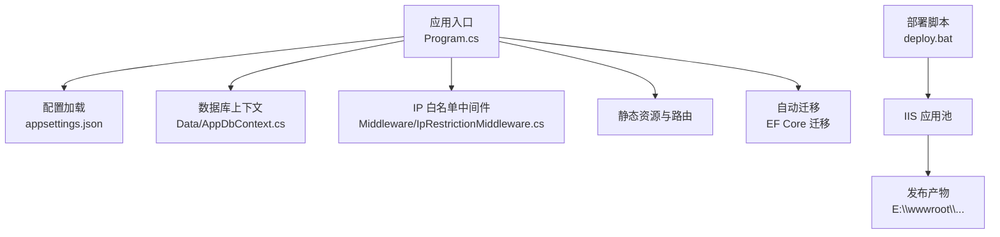
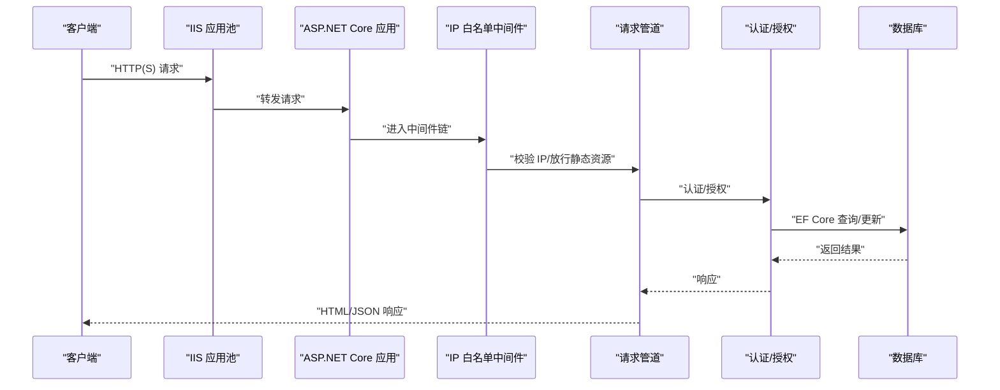
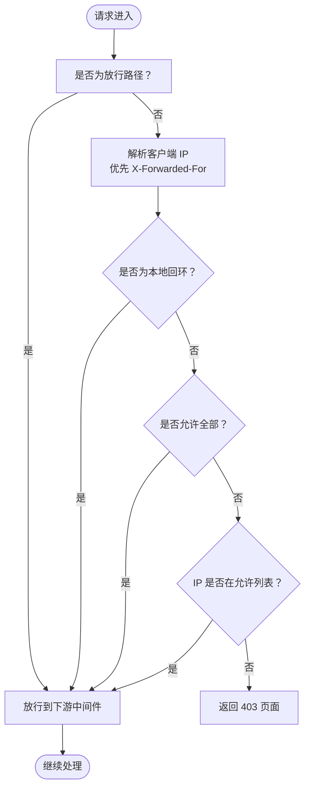
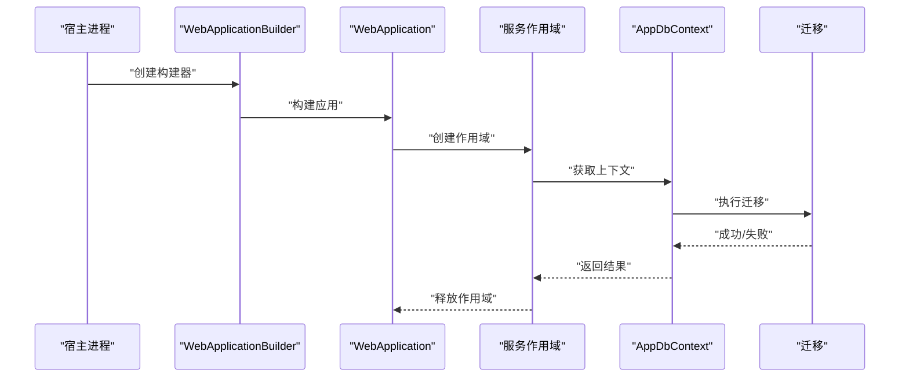
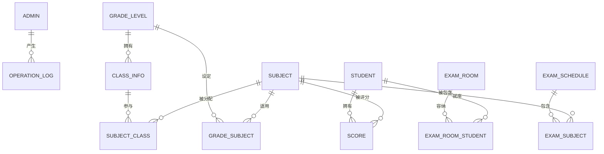
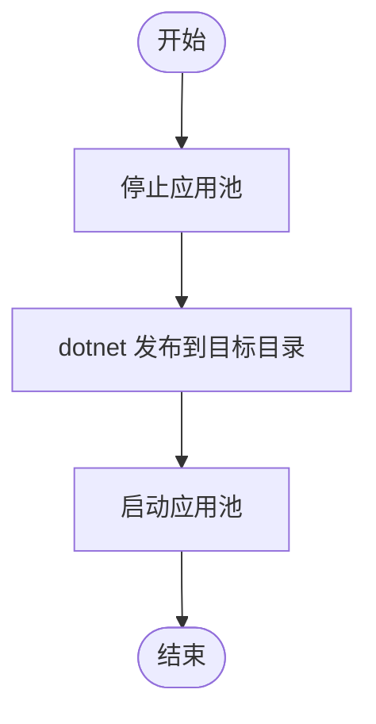
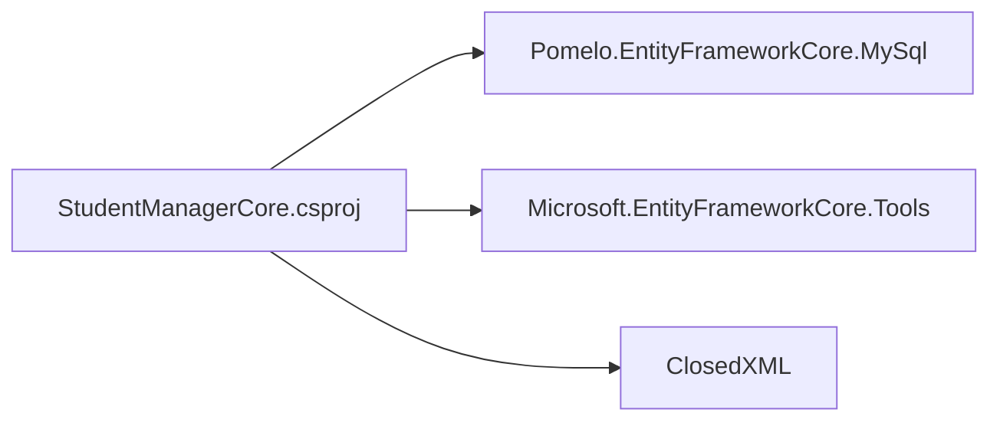

# 部署与运维

<cite>
**本文引用的文件**
- [Program.cs](file://Program.cs)
- [appsettings.json](file://appsettings.json)
- [StudentManagerCore.csproj](file://StudentManagerCore.csproj)
- [deploy.bat](file://deploy.bat)
- [AppDbContext.cs](file://Data/AppDbContext.cs)
- [IpRestrictionMiddleware.cs](file://Middleware/IpRestrictionMiddleware.cs)
- [Create_Announcement_Tables.sql](file://Database/Create_Announcement_Tables.sql)
- [Add_GradeManagement_Tables.sql](file://Database/Add_GradeManagement_Tables.sql)
</cite>

## 目录
1. [简介](#简介)
2. [项目结构](#项目结构)
3. [核心组件](#核心组件)
4. [架构总览](#架构总览)
5. [详细组件分析](#详细组件分析)
6. [依赖关系分析](#依赖关系分析)
7. [性能考虑](#性能考虑)
8. [故障排除指南](#故障排除指南)
9. [结论](#结论)
10. [附录](#附录)

## 简介
本指南面向生产环境部署与运维，围绕该学生管理系统的部署配置、环境与配置管理、数据库策略、日志与监控、故障排除、安全加固以及自动化部署进行系统化说明。文档以仓库现有实现为基础，结合最佳实践给出可操作的步骤与建议。

## 项目结构
该项目为基于 .NET 8 的 ASP.NET Core MVC 应用，采用 Entity Framework Core 进行数据访问，使用 MySQL 数据库。项目通过配置文件集中管理日志级别、主机白名单、IP 访问限制与数据库连接字符串等关键参数。部署脚本支持 IIS 应用池的停止、发布与启动流程。

**图表来源**
- [Program.cs:1-123](file://Program.cs#L1-L123)
- [appsettings.json:1-16](file://appsettings.json#L1-L16)
- [AppDbContext.cs:1-295](file://Data/AppDbContext.cs#L1-L295)
- [IpRestrictionMiddleware.cs:1-98](file://Middleware/IpRestrictionMiddleware.cs#L1-L98)
- [deploy.bat:1-43](file://deploy.bat#L1-L43)

**章节来源**
- [Program.cs:1-123](file://Program.cs#L1-L123)
- [appsettings.json:1-16](file://appsettings.json#L1-L16)
- [StudentManagerCore.csproj:1-21](file://StudentManagerCore.csproj#L1-L21)
- [deploy.bat:1-43](file://deploy.bat#L1-L43)

## 核心组件
- 应用程序入口与管道
  - 初始化服务容器，注册 MVC 控制器视图、认证与会话、反 CSRF、数据库上下文与 MySQL 提供程序。
  - 注册全局异常中间件，捕获未处理异常并写入本地错误日志文件，避免堆栈泄露。
  - 注册 IP 白名单中间件，支持从反向代理头 X-Forwarded-For 解析真实客户端 IP。
  - 启用 HTTPS 重定向、静态文件、路由、认证授权与控制器映射。
  - 启动时执行 EF Core 自动迁移，失败时写入迁移错误文件。
- 配置与环境
  - 日志默认级别为 Information，Microsoft.AspNetCore 警告级别，便于生产环境减少噪音。
  - AllowedHosts 通配符允许跨域访问，需结合实际域名与反向代理配置。
  - IpRestriction:AllowedIPs 默认放行所有 IP，生产环境应明确配置允许列表。
  - ConnectionStrings.DefaultConnection 指向本地 MySQL 实例，生产环境应指向专用数据库实例。
- 数据库上下文
  - 定义多张业务表实体（如公告、班级、科目、成绩、考试安排等），并建立外键与唯一索引约束。
  - 通过 OnModelCreating 映射表名、字段类型、长度与约束，确保与数据库一致。
- 中间件与安全
  - IP 白名单中间件支持多 IP、反向代理场景与本地回环放行，保护登录页与静态资源。
- 部署脚本
  - 停止 IIS 应用池 -> dotnet 发布到目标目录 -> 启动应用池，覆盖发布流程。

**章节来源**
- [Program.cs:1-123](file://Program.cs#L1-L123)
- [appsettings.json:1-16](file://appsettings.json#L1-L16)
- [AppDbContext.cs:1-295](file://Data/AppDbContext.cs#L1-L295)
- [IpRestrictionMiddleware.cs:1-98](file://Middleware/IpRestrictionMiddleware.cs#L1-L98)
- [deploy.bat:1-43](file://deploy.bat#L1-L43)

## 架构总览
下图展示应用启动到请求处理的关键路径，以及数据库交互与自动迁移流程。

**图表来源**
- [Program.cs:45-100](file://Program.cs#L45-L100)
- [IpRestrictionMiddleware.cs:34-96](file://Middleware/IpRestrictionMiddleware.cs#L34-L96)
- [AppDbContext.cs:6-29](file://Data/AppDbContext.cs#L6-L29)

## 详细组件分析

### 组件一：IP 白名单中间件
- 功能要点
  - 从配置读取允许的 IP 列表，支持多 IP 逗号分隔；为空或星号表示放行全部。
  - 放行登录页与静态资源路径，避免阻断正常访问。
  - 支持反向代理场景，优先从 X-Forwarded-For 头解析真实客户端 IP。
  - 本地回环地址始终放行，便于本机调试。
  - 不在白名单内的请求直接返回 403 页面。
- 配置位置
  - appsettings.json 中的 IpRestriction:AllowedIPs 字段。
- 生产建议
  - 明确配置可信网段或具体 IP，避免使用通配符。
  - 在反向代理层（IIS/Nginx）也配置严格的上游限制与健康检查。

**图表来源**
- [IpRestrictionMiddleware.cs:34-96](file://Middleware/IpRestrictionMiddleware.cs#L34-L96)

**章节来源**
- [IpRestrictionMiddleware.cs:1-98](file://Middleware/IpRestrictionMiddleware.cs#L1-L98)
- [appsettings.json:9-11](file://appsettings.json#L9-L11)

### 组件二：应用程序启动与自动迁移
- 关键流程
  - 注册 MVC、认证、会话、反 CSRF、数据库上下文与 MySQL 提供程序。
  - 注册全局异常中间件，捕获异常并写入本地 error.log 文件。
  - 启用 HTTPS 重定向、静态文件、路由、认证授权与控制器映射。
  - 启动时执行 EF Core 迁移，失败时写入 migrate_error.txt。
- 生产注意事项
  - 生产环境建议将自动迁移改为 CI/CD 执行，避免启动时阻塞。
  - error.log 与 migrate_error.txt 作为故障排查依据，需纳入日志轮转与保留策略。

**图表来源**
- [Program.cs:18-41](file://Program.cs#L18-L41)
- [Program.cs:107-120](file://Program.cs#L107-L120)

**章节来源**
- [Program.cs:1-123](file://Program.cs#L1-L123)

### 组件三：数据库上下文与实体模型
- 实体概览
  - 管理员、学生、站点配置、年级、班级、公告、操作日志、学术年、学期、科目、教师-班级关联、成绩、考试安排、考场、考场座位、年级-科目等。
- 映射与约束
  - 表名、主键、字段长度、类型与约束在 OnModelCreating 中统一定义。
  - 外键关系与级联删除策略（如班级删除级联删除科目教师关联）。
  - 唯一索引（如学生-科目-考试唯一组合）。
- 生产建议
  - 使用 EF Core 迁移生成 SQL 并在测试环境验证后再在生产执行。
  - 对高并发写入场景（如成绩导入）评估批量插入与事务边界。

**图表来源**
- [AppDbContext.cs:30-292](file://Data/AppDbContext.cs#L30-L292)

**章节来源**
- [AppDbContext.cs:1-295](file://Data/AppDbContext.cs#L1-L295)

### 组件四：部署脚本与 IIS 集成
- 脚本流程
  - 停止 IIS 应用池（appcmd stop apppool）。
  - dotnet 发布到目标目录（E:\wwwroot\...）。
  - 启动 IIS 应用池（appcmd start apppool）。
- 生产建议
  - 在 CI/CD 中集成此脚本，确保发布前备份与灰度验证。
  - 结合 IIS 站点绑定 SSL 证书与反向代理配置，确保 HTTPS 流量直达应用。

**图表来源**
- [deploy.bat:9-35](file://deploy.bat#L9-L35)

**章节来源**
- [deploy.bat:1-43](file://deploy.bat#L1-L43)

## 依赖关系分析
- 框架与包
  - .NET 8 目标框架，启用隐式 using。
  - Pomelo.EntityFrameworkCore.MySql 用于 MySQL 驱动与版本协商。
  - Microsoft.EntityFrameworkCore.Tools 提供迁移工具。
  - ClosedXML 用于 Excel 导出。
- 项目排除
  - 非运行时相关工具集（DataMigrator、check_*、hash_pwd 等）在默认构建中排除，避免污染发布包。

**图表来源**
- [StudentManagerCore.csproj:10-18](file://StudentManagerCore.csproj#L10-L18)

**章节来源**
- [StudentManagerCore.csproj:1-21](file://StudentManagerCore.csproj#L1-L21)

## 性能考虑
- 数据库层面
  - 为高频查询字段建立索引（如学生编号、科目-班级组合、考试安排-科目组合）。
  - 批量导入场景使用事务包裹与批量写入，降低锁竞争。
  - 定期统计与归档历史日志表（如 OperationLog），避免单表过大。
- 应用层面
  - 合理设置会话超时与 HttpOnly Cookie，平衡用户体验与安全。
  - 静态资源启用压缩与缓存，减少带宽占用。
- 监控与调优
  - 结合应用日志与数据库慢查询日志，定位热点接口与 SQL。
  - 使用性能计数器与 APM 工具（如 Application Insights）观测响应时间与吞吐。

## 故障排除指南
- 启动失败或迁移错误
  - 现象：应用启动时报错或出现 migrate_error.txt。
  - 排查：检查数据库连接字符串、MySQL 服务状态、网络连通性与权限。
  - 处理：在 CI/CD 中先行执行迁移，避免生产启动时迁移阻塞。
- 登录受限或 403
  - 现象：访问登录页或受保护资源返回 403。
  - 排查：确认 IpRestriction:AllowedIPs 配置、反向代理 X-Forwarded-For 是否正确传递、是否命中本地回环放行。
  - 处理：修正允许列表与代理头配置。
- 全局异常与错误页面
  - 现象：出现系统内部错误页面。
  - 排查：查看 error.log，定位异常堆栈与发生时间。
  - 处理：修复业务逻辑或数据库一致性问题，必要时回滚变更。
- 部署后页面空白或静态资源 404
  - 现象：发布后访问空白或样式丢失。
  - 排查：确认发布目录权限、IIS 站点绑定、静态文件中间件顺序与 imge 目录是否存在。
  - 处理：重建发布目录、检查 IIS 权限与静态文件服务。

**章节来源**
- [Program.cs:49-81](file://Program.cs#L49-L81)
- [Program.cs:107-120](file://Program.cs#L107-L120)
- [IpRestrictionMiddleware.cs:34-96](file://Middleware/IpRestrictionMiddleware.cs#L34-L96)

## 结论
本指南基于现有代码与脚本，给出了生产环境部署与运维的实施路径：明确配置与环境差异、规范数据库迁移与备份恢复、建立日志与监控体系、强化安全与访问控制，并通过自动化脚本与 CI/CD 实现稳定发布。建议在生产环境中进一步完善监控告警、备份演练与应急响应流程。

## 附录

### A. 生产环境部署配置清单
- IIS 与反向代理
  - 在 IIS 中配置站点绑定 SSL 证书，启用 HTTPS。
  - 若使用 Nginx 作为反向代理，确保透传 X-Forwarded-For 与 X-Forwarded-Proto。
  - 限制上游 IP，仅允许反向代理访问后端应用。
- 数据库部署
  - 使用 EF Core 迁移在预生产验证后在生产执行。
  - 准备数据库备份与恢复脚本，定期演练。
  - 为关键表建立索引与分区策略，优化查询性能。
- 日志与监控
  - 设置日志级别与输出目标（文件/事件日志/集中式日志）。
  - 配置日志轮转与保留周期，避免磁盘占满。
  - 集成 APM 与数据库性能监控，设置阈值告警。
- 安全加固
  - 严格配置 IpRestriction:AllowedIPs，避免通配符。
  - 启用 HTTPS 重定向与 HSTS，禁用不安全协议。
  - 加强数据库凭据管理，最小权限原则。
- 自动化部署
  - 在 CI/CD 中集成 dotnet publish 与部署脚本。
  - 引入灰度发布与回滚机制，确保变更可控。

### B. 数据库脚本与迁移参考
- 创建公告表与已读记录表
  - 适用于初始化或补充性部署。
- 年级与班级管理表
  - 用于启用班级管理功能的基础表结构。
- 迁移执行
  - 建议在测试环境先执行 SQL 脚本验证，再在生产执行 EF Core 迁移。

**章节来源**
- [Create_Announcement_Tables.sql:1-31](file://Database/Create_Announcement_Tables.sql#L1-L31)
- [Add_GradeManagement_Tables.sql:1-20](file://Database/Add_GradeManagement_Tables.sql#L1-L20)