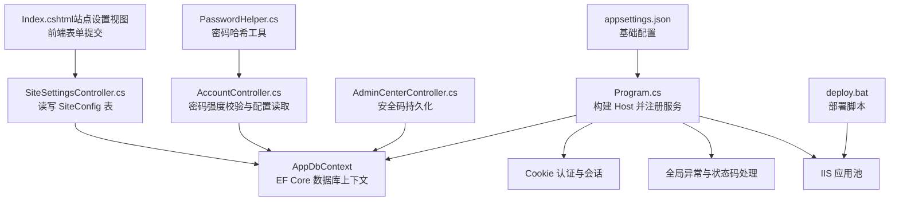
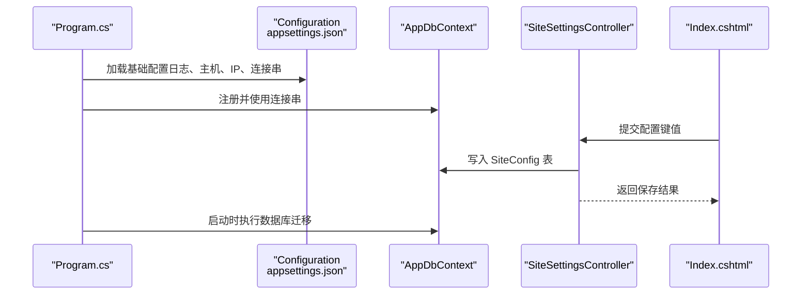
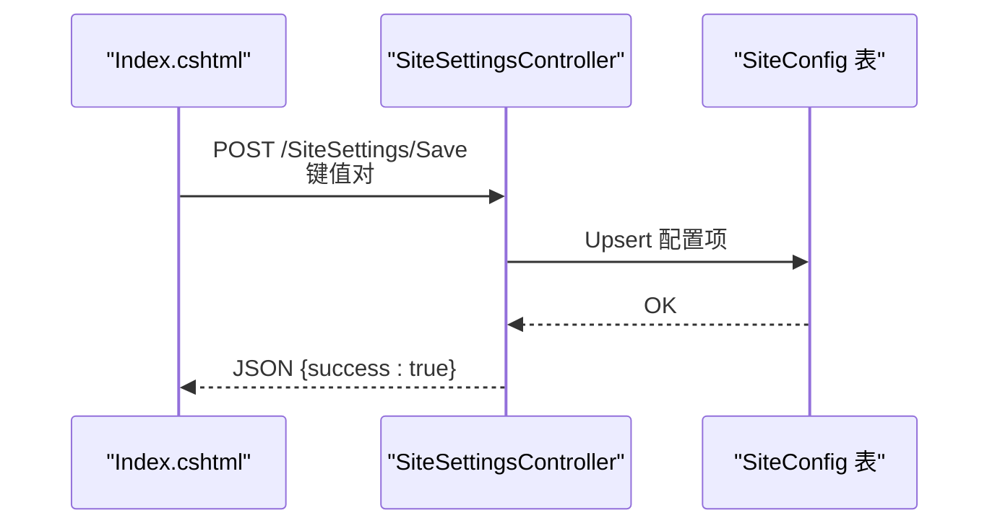
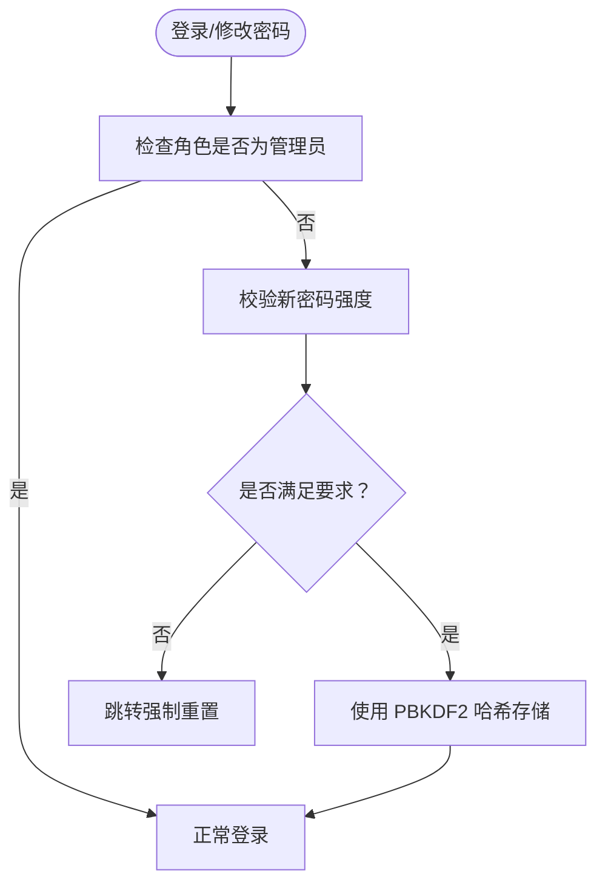
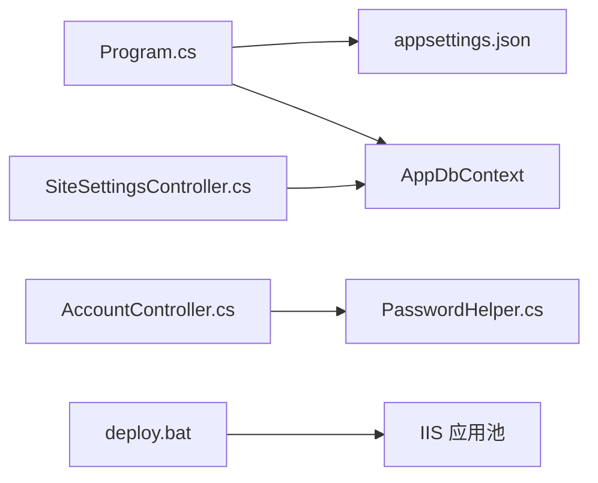

# 配置管理

<cite>
**本文引用的文件**
- [appsettings.json](file://appsettings.json)
- [Program.cs](file://Program.cs)
- [StudentManagerCore.csproj](file://StudentManagerCore.csproj)
- [SiteSettingsController.cs](file://Controllers/SiteSettingsController.cs)
- [Index.cshtml（站点设置视图）](file://Views/SiteSettings/Index.cshtml)
- [AdminCenterController.cs](file://Controllers/AdminCenterController.cs)
- [AccountController.cs](file://Controllers/AccountController.cs)
- [PasswordHelper.cs](file://Services/PasswordHelper.cs)
- [Program.cs（数据迁移工具）](file://DataMigrator/Program.cs)
- [deploy.bat](file://deploy.bat)
</cite>

## 目录
1. [简介](#简介)
2. [项目结构](#项目结构)
3. [核心组件](#核心组件)
4. [架构总览](#架构总览)
5. [详细组件分析](#详细组件分析)
6. [依赖关系分析](#依赖关系分析)
7. [性能考量](#性能考量)
8. [故障排除指南](#故障排除指南)
9. [结论](#结论)
10. [附录](#附录)

## 简介
本指南围绕学生管理系统中的配置管理展开，重点覆盖以下方面：
- appsettings.json 的结构与关键配置项（连接字符串、日志级别、IP 白名单等）及其在运行时的使用方式
- 环境特定配置的管理方法（开发、测试、预生产、生产）
- 敏感信息的安全存储与加密策略（数据库密码、会话与认证）
- 配置热更新与默认值设置的最佳实践
- 配置验证与版本控制、变更管理流程建议

## 项目结构
该系统采用 ASP.NET Core 默认项目布局，配置主要集中在根目录的 appsettings.json 中，运行时通过 Host 构建器加载；部分运行时可变配置通过数据库表 SiteConfig 持久化，由控制器提供读写接口。

图表来源
- [Program.cs:1-123](file://Program.cs#L1-L123)
- [appsettings.json:1-16](file://appsettings.json#L1-L16)
- [SiteSettingsController.cs:1-84](file://Controllers/SiteSettingsController.cs#L1-L84)
- [Index.cshtml（站点设置视图）:20-198](file://Views/SiteSettings/Index.cshtml#L20-L198)
- [AdminCenterController.cs:448-460](file://Controllers/AdminCenterController.cs#L448-L460)
- [AccountController.cs:115-243](file://Controllers/AccountController.cs#L115-L243)
- [PasswordHelper.cs:1-41](file://Services/PasswordHelper.cs#L1-L41)
- [deploy.bat:1-42](file://deploy.bat#L1-L42)

章节来源
- [Program.cs:1-123](file://Program.cs#L1-L123)
- [appsettings.json:1-16](file://appsettings.json#L1-L16)

## 核心组件
- appsettings.json：集中存放日志、主机限制、IP 白名单、数据库连接字符串等基础配置。应用启动时由 Host 自动加载。
- Program.cs：应用入口，负责注册服务（EF Core、认证、会话）、中间件管线、自动迁移等。
- SiteSettingsController 与 SiteConfig 表：用于运行时可变配置（如站点名称、描述、版权、背景图路径、站点开关等）的读写。
- PasswordHelper：封装 ASP.NET Core Identity 的密码哈希算法，用于安全存储用户口令。
- deploy.bat：部署脚本，负责停止应用池、发布、启动应用池。

章节来源
- [appsettings.json:1-16](file://appsettings.json#L1-L16)
- [Program.cs:1-123](file://Program.cs#L1-L123)
- [SiteSettingsController.cs:1-84](file://Controllers/SiteSettingsController.cs#L1-L84)
- [PasswordHelper.cs:1-41](file://Services/PasswordHelper.cs#L1-L41)
- [deploy.bat:1-42](file://deploy.bat#L1-L42)

## 架构总览
下图展示配置在系统中的流向与交互：

图表来源
- [Program.cs:1-123](file://Program.cs#L1-L123)
- [appsettings.json:1-16](file://appsettings.json#L1-L16)
- [SiteSettingsController.cs:1-84](file://Controllers/SiteSettingsController.cs#L1-L84)
- [Index.cshtml（站点设置视图）:20-198](file://Views/SiteSettings/Index.cshtml#L20-L198)

## 详细组件分析

### appsettings.json 结构与配置项说明
- Logging.LogLevel.Default：默认日志级别为 Information，有助于在开发与生产中平衡可观测性与噪声。
- Logging.LogLevel.Microsoft.AspNetCore：将框架日志降级到 Warning，避免过多噪音。
- AllowedHosts：允许的主机名通配符，用于保护响应头中的主机字段。
- IpRestriction.AllowedIPs：IP 白名单策略，结合自定义中间件实现访问控制。
- ConnectionStrings.DefaultConnection：数据库连接字符串，当前示例指向本地 MySQL/MariaDB 实例。

章节来源
- [appsettings.json:1-16](file://appsettings.json#L1-L16)

### 运行时配置读取与使用（Program.cs）
- EF Core 注册：通过 builder.Configuration.GetConnectionString 获取连接串，配置数据库提供程序与版本。
- Cookie 认证：配置登录/登出/过期路径与滑动过期。
- 会话：启用内存缓存与 Session，设置过期与 Cookie 属性。
- 中间件：IP 白名单中间件、全局异常捕获、HSTS、静态文件、路由、认证授权、控制器路由。
- 自动迁移：应用启动时执行数据库迁移，确保模型与数据库一致。

章节来源
- [Program.cs:1-123](file://Program.cs#L1-L123)

### 可变运行时配置（SiteConfig 表与控制器）
- SiteConfig 表：键值对形式存储运行时可变配置（如站点名称、描述、版权、背景图路径、站点开关等）。
- 控制器职责：
  - 读取：将 SiteConfig 表转换为字典供视图使用。
  - 保存：接收键值并更新或新增记录。
  - 文件上传：支持背景图上传并回写配置项。
- 视图交互：前端表单提交多个键值，统一通过控制器批量保存。

图表来源
- [SiteSettingsController.cs:1-84](file://Controllers/SiteSettingsController.cs#L1-L84)
- [Index.cshtml（站点设置视图）:20-198](file://Views/SiteSettings/Index.cshtml#L20-L198)

章节来源
- [SiteSettingsController.cs:1-84](file://Controllers/SiteSettingsController.cs#L1-L84)
- [Index.cshtml（站点设置视图）:20-198](file://Views/SiteSettings/Index.cshtml#L20-L198)

### 安全码与密码策略
- 安全码持久化：通过 AdminCenterController 将安全码写入 SiteConfig，用于额外防护。
- 密码策略：AccountController 对非管理员用户强制要求强密码（长度、字母、数字），并提供重置流程。
- 密码存储：PasswordHelper 使用 ASP.NET Core Identity 的 PBKDF2 哈希算法，兼容旧版明文，确保口令安全。

图表来源
- [AdminCenterController.cs:448-460](file://Controllers/AdminCenterController.cs#L448-L460)
- [AccountController.cs:115-243](file://Controllers/AccountController.cs#L115-L243)
- [PasswordHelper.cs:1-41](file://Services/PasswordHelper.cs#L1-L41)

章节来源
- [AdminCenterController.cs:448-460](file://Controllers/AdminCenterController.cs#L448-L460)
- [AccountController.cs:115-243](file://Controllers/AccountController.cs#L115-L243)
- [PasswordHelper.cs:1-41](file://Services/PasswordHelper.cs#L1-L41)

### 部署与配置一致性
- deploy.bat：停止应用池、发布、启动应用池，确保配置文件与二进制一致部署。
- appsettings.json：随发布包一起部署，运行时由宿主加载。

章节来源
- [deploy.bat:1-42](file://deploy.bat#L1-L42)
- [appsettings.json:1-16](file://appsettings.json#L1-L16)

## 依赖关系分析
- Program.cs 依赖 appsettings.json 提供的基础配置，并据此注册 EF Core、认证、会话与中间件。
- SiteSettingsController 依赖 AppDbContext 访问 SiteConfig 表，实现运行时配置持久化。
- PasswordHelper 作为通用工具被 AccountController 使用，保障口令安全。
- 部署脚本 deploy.bat 与 IIS 应用池耦合，影响配置生效时机。

图表来源
- [Program.cs:1-123](file://Program.cs#L1-L123)
- [appsettings.json:1-16](file://appsettings.json#L1-L16)
- [SiteSettingsController.cs:1-84](file://Controllers/SiteSettingsController.cs#L1-L84)
- [AccountController.cs:115-243](file://Controllers/AccountController.cs#L115-L243)
- [PasswordHelper.cs:1-41](file://Services/PasswordHelper.cs#L1-L41)
- [deploy.bat:1-42](file://deploy.bat#L1-L42)

章节来源
- [Program.cs:1-123](file://Program.cs#L1-L123)
- [SiteSettingsController.cs:1-84](file://Controllers/SiteSettingsController.cs#L1-L84)
- [AccountController.cs:115-243](file://Controllers/AccountController.cs#L115-L243)
- [PasswordHelper.cs:1-41](file://Services/PasswordHelper.cs#L1-L41)
- [deploy.bat:1-42](file://deploy.bat#L1-L42)

## 性能考量
- 日志级别：默认 Information，框架日志 Warning，有助于减少不必要的 IO 与 CPU 占用。
- IP 白名单中间件：在请求早期拦截无效来源，降低后续中间件与业务处理开销。
- 会话与 Cookie：合理设置过期与 HttpOnly，兼顾安全性与性能。
- 自动迁移：仅在启动阶段执行，建议在生产中通过发布前迁移策略替代运行时迁移，减少启动延迟。

## 故障排除指南
- 数据库连接失败：检查 appsettings.json 中 DefaultConnection 是否正确，确认网络可达与凭据有效。
- 登录异常：查看全局异常中间件生成的错误日志文件，定位具体异常堆栈。
- 配置未生效：确认部署脚本已成功发布并重启应用池；核对运行时配置是否写入 SiteConfig 表。
- 密码校验失败：确认新密码符合长度与字符要求；若为旧版明文，系统会兼容处理，但建议尽快迁移至哈希存储。

章节来源
- [Program.cs:45-122](file://Program.cs#L45-L122)
- [appsettings.json:1-16](file://appsettings.json#L1-L16)

## 结论
本系统通过 appsettings.json 管理基础配置，借助 SiteConfig 表实现运行时可变配置，配合严格的密码哈希与访问控制中间件，形成较为完善的配置管理体系。建议在生产环境中进一步引入环境变量与密钥管理服务，完善配置热更新与审计机制。

## 附录

### 环境特定配置管理建议
- 使用多份 appsettings 文件按环境分离：appsettings.Development.json、appsettings.Production.json 等，通过 ASP.NET Core 环境变量选择对应配置集。
- 生产环境优先使用环境变量或密钥管理服务覆盖敏感配置，避免将明文写入仓库。
- 在 CI/CD 流程中注入环境变量，确保部署一致性。

### 敏感信息的安全存储
- 数据库连接字符串：使用环境变量或密钥管理服务（如 Azure Key Vault、AWS Secrets Manager）存储，运行时注入。
- 会话与 Cookie：启用 HttpOnly、Secure（HTTPS 环境）、合理过期时间，避免跨站脚本窃取。
- 密码：始终使用 PBKDF2 或更优算法哈希存储，定期轮换密钥与证书。

### 配置热更新与默认值
- 运行时配置：通过 SiteConfig 表与控制器实现热更新，注意并发写入与事务一致性。
- 默认值：在读取配置时提供合理的默认值，避免空引用与异常传播。
- 验证：对用户输入的配置值进行类型与范围校验，必要时提供回滚策略。

### 版本控制与变更管理
- 将 appsettings.json 与 SiteConfig 表结构纳入版本控制，记录每次变更的意图与影响面。
- 变更流程：评审 → 预发布验证 → 回滚预案 → 上线 → 观察与监控。
- 发布策略：生产环境采用灰度发布或蓝绿部署，降低配置变更风险。