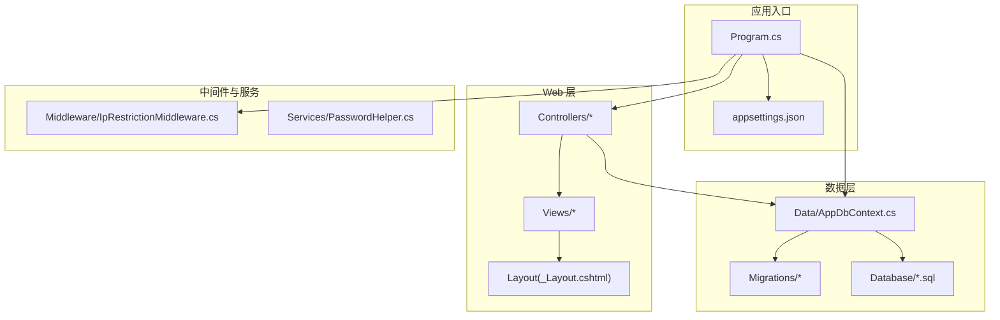
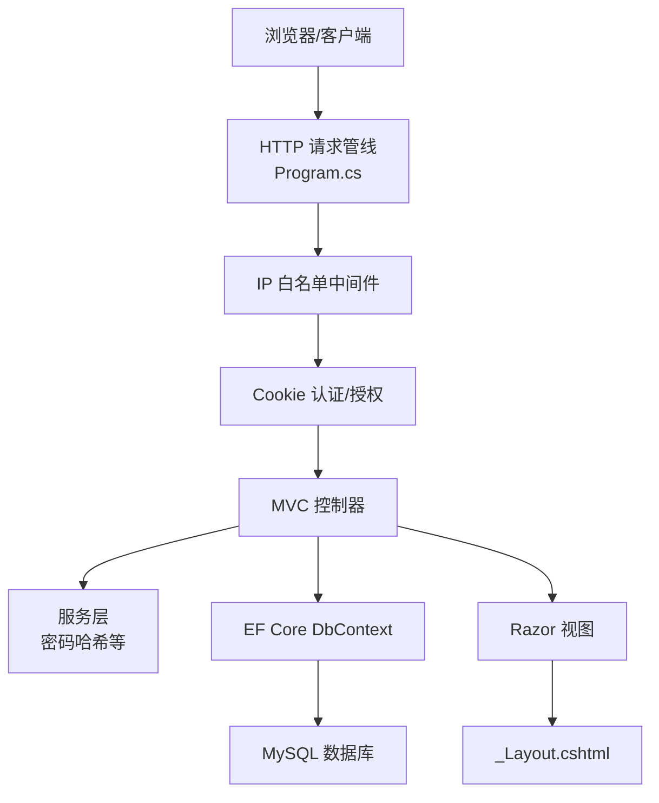
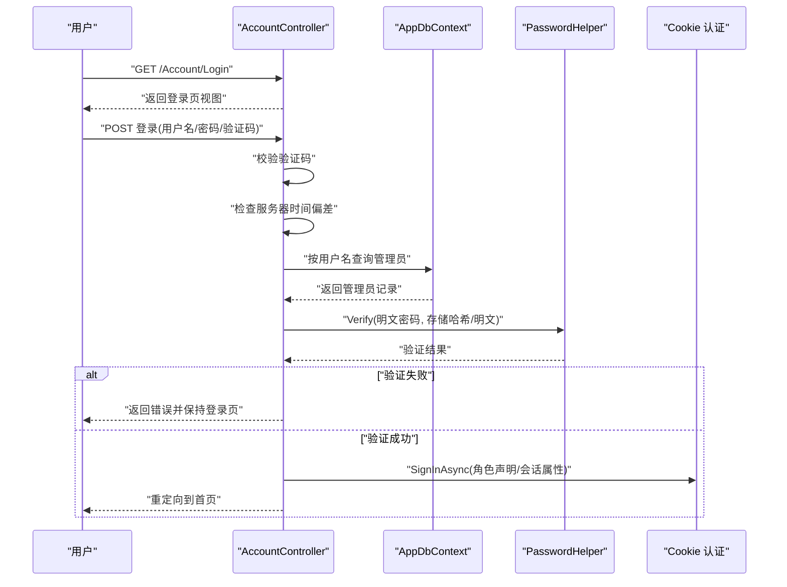
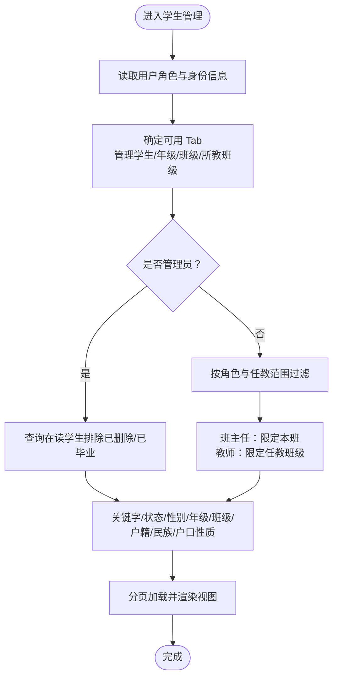
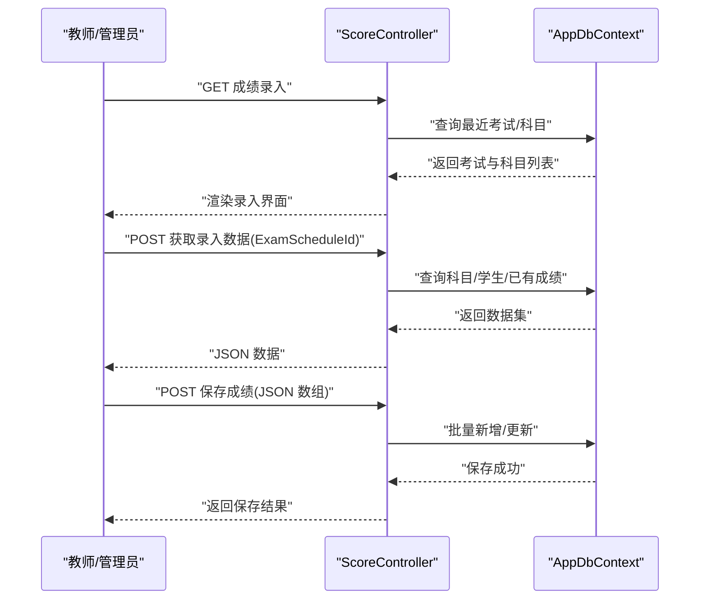
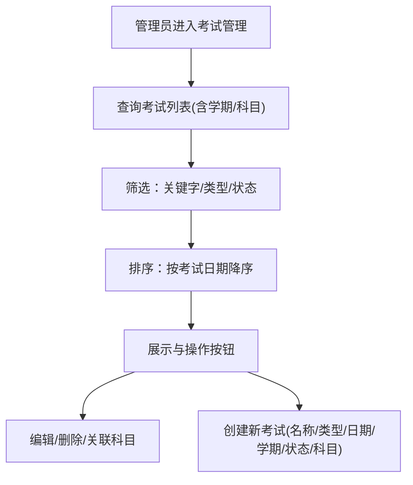
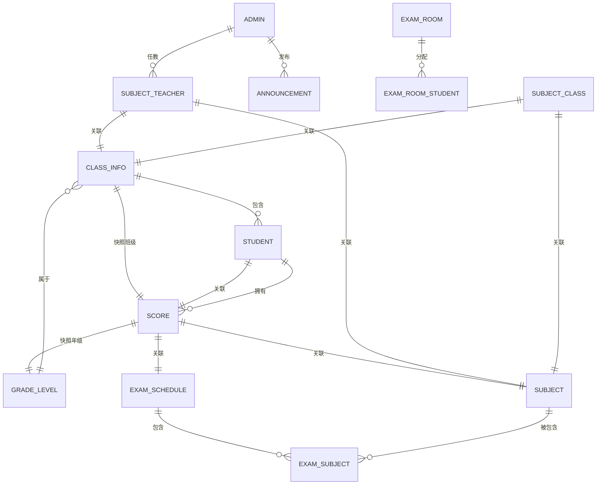
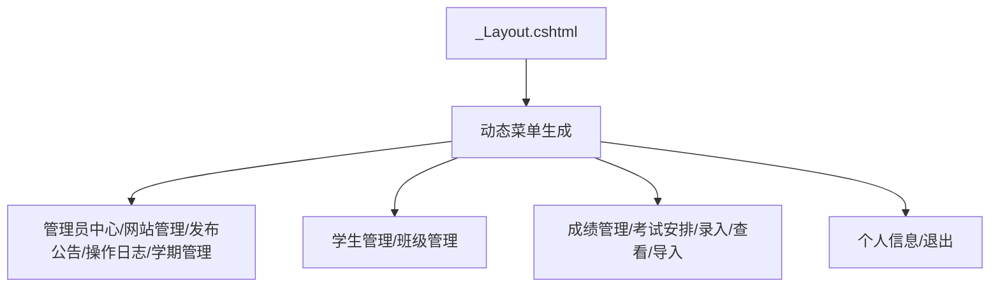
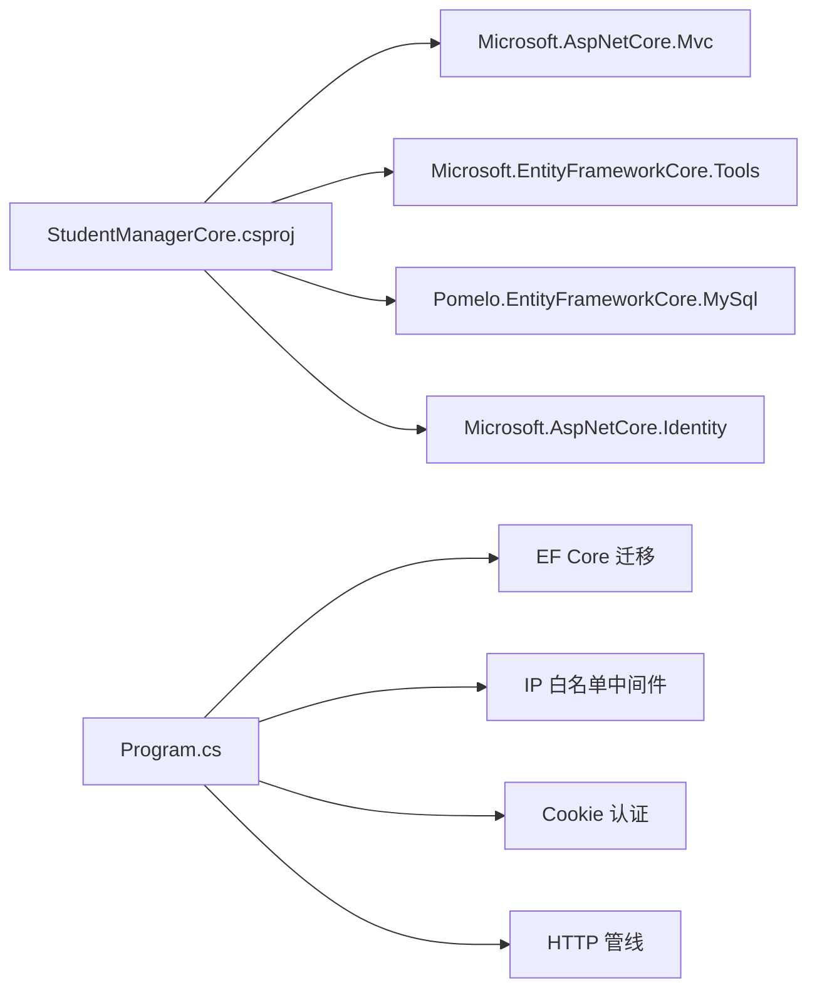

# 项目概述

<cite>
**本文档引用的文件**
- [Program.cs](file://Program.cs)
- [StudentManagerCore.csproj](file://StudentManagerCore.csproj)
- [appsettings.json](file://appsettings.json)
- [AppDbContext.cs](file://Data/AppDbContext.cs)
- [Models.cs](file://Models/Models.cs)
- [IpRestrictionMiddleware.cs](file://Middleware/IpRestrictionMiddleware.cs)
- [PasswordHelper.cs](file://Services/PasswordHelper.cs)
- [AccountController.cs](file://Controllers/AccountController.cs)
- [HomeController.cs](file://Controllers/HomeController.cs)
- [StudentController.cs](file://Controllers/StudentController.cs)
- [_Layout.cshtml](file://Views/Shared/_Layout.cshtml)
- [20260609075559_InitialCreate.cs](file://Migrations/20260609075559_InitialCreate.cs)
- [Create_Announcement_Tables.sql](file://Database/Create_Announcement_Tables.sql)
</cite>

## 目录
1. [引言](#引言)
2. [项目结构](#项目结构)
3. [核心组件](#核心组件)
4. [架构总览](#架构总览)
5. [详细组件分析](#详细组件分析)
6. [依赖关系分析](#依赖关系分析)
7. [性能考虑](#性能考虑)
8. [故障排除指南](#故障排除指南)
9. [结论](#结论)
10. [附录](#附录)

## 引言
本学生管理系统面向教育管理场景，围绕“学生信息管理、成绩管理、考试安排”等核心业务，采用 ASP.NET Core MVC 架构、Entity Framework Core ORM 与 MySQL 数据库存储，结合 Cookie 认证与会话管理实现安全可控的后台管理平台。系统支持多角色（管理员、班主任、科任教师等），提供数据驱动的权限控制、公告发布、成绩录入与统计分析、考试安排与考场座位编排等功能。

## 项目结构
项目遵循经典的分层与按功能域组织方式：
- 控制器层：Controllers，按业务模块划分（账户、学生、成绩、考试、教师、公告等）
- 数据访问层：Data（DbContext）、Migrations（EF Core 迁移）、Database（SQL 初始化脚本）
- 视图层：Views（按模块组织，共享布局与验证脚本）
- 中间件：Middleware（如 IP 白名单限制）
- 服务：Services（如密码哈希工具）
- 应用入口：Program.cs（DI 容器、管道配置、自动迁移）

**图表来源**
- [Program.cs:1-123](file://Program.cs#L1-L123)
- [appsettings.json:1-16](file://appsettings.json#L1-L16)
- [AppDbContext.cs:1-295](file://Data/AppDbContext.cs#L1-L295)
- [IpRestrictionMiddleware.cs:1-98](file://Middleware/IpRestrictionMiddleware.cs#L1-L98)
- [_Layout.cshtml:1-298](file://Views/Shared/_Layout.cshtml#L1-L298)

**章节来源**
- [Program.cs:1-123](file://Program.cs#L1-L123)
- [StudentManagerCore.csproj:1-21](file://StudentManagerCore.csproj#L1-L21)
- [appsettings.json:1-16](file://appsettings.json#L1-L16)

## 核心组件
- 应用程序入口与管线
  - 依赖注入容器注册：控制器、EF Core、Anti-Forgery、Cookie 认证、会话、HTTP 上下文访问器
  - 请求管道：IP 白名单中间件、全局异常捕获、状态码页面、HTTPS、静态文件、会话、路由、认证/授权
  - 自动迁移：启动时执行 EF Core 迁移
- 数据访问层
  - AppDbContext：集中声明 DbSet 与 Fluent API 映射，定义实体关系与索引
  - 迁移与脚本：EF Core 迁移与 SQL 初始化脚本共同保证数据库演进
- 安全与认证
  - Cookie 认证：登录、登出、滑动过期、角色声明
  - 会话：验证码缓存、防 CSRF
  - 密码：PBKDF2 哈希兼容旧版明文
  - IP 白名单：基于配置的访问控制
- 视图与布局
  - Bootstrap 响应式布局，动态菜单根据角色与权限生成
  - 顶部导航、个人中心、全局确认弹窗、空闲自动登出等交互

**章节来源**
- [Program.cs:1-123](file://Program.cs#L1-L123)
- [AppDbContext.cs:1-295](file://Data/AppDbContext.cs#L1-L295)
- [PasswordHelper.cs:1-42](file://Services/PasswordHelper.cs#L1-L42)
- [IpRestrictionMiddleware.cs:1-98](file://Middleware/IpRestrictionMiddleware.cs#L1-L98)
- [_Layout.cshtml:1-298](file://Views/Shared/_Layout.cshtml#L1-L298)

## 架构总览
系统采用经典的三层架构与 MVC 模式：
- 表现层：MVC 控制器负责请求处理与视图渲染
- 业务层：控制器内聚合业务逻辑，调用仓储式数据访问
- 数据层：EF Core 提供 ORM 能力，MySQL 作为持久化存储
- 安全层：Cookie 认证、会话、IP 白名单、CSRF 令牌
- 中间件层：异常捕获、状态码页面、IP 限制

**图表来源**
- [Program.cs:45-96](file://Program.cs#L45-L96)
- [AccountController.cs:1-261](file://Controllers/AccountController.cs#L1-L261)
- [HomeController.cs:1-237](file://Controllers/HomeController.cs#L1-L237)
- [AppDbContext.cs:1-295](file://Data/AppDbContext.cs#L1-L295)

## 详细组件分析

### 登录与认证流程
登录流程涵盖验证码校验、时间同步检测、密码验证、角色声明与会话建立，并对弱密码进行强制改密。

**图表来源**
- [AccountController.cs:28-125](file://Controllers/AccountController.cs#L28-L125)
- [PasswordHelper.cs:1-42](file://Services/PasswordHelper.cs#L1-L42)
- [Program.cs:23-32](file://Program.cs#L23-L32)

**章节来源**
- [AccountController.cs:1-261](file://Controllers/AccountController.cs#L1-L261)
- [PasswordHelper.cs:1-42](file://Services/PasswordHelper.cs#L1-L42)
- [Program.cs:23-32](file://Program.cs#L23-L32)

### 学生信息管理（按角色与权限）
学生控制器根据当前用户角色与权限，动态开放不同 Tab 与筛选能力，班主任仅能查看本班学生，教师可查看所教学科与班级的学生列表。

**图表来源**
- [StudentController.cs:22-200](file://Controllers/StudentController.cs#L22-L200)

**章节来源**
- [StudentController.cs:1-200](file://Controllers/StudentController.cs#L1-L200)

### 成绩管理（录入、查看、导入）
成绩控制器提供“一键表格式录入”与“批量导入”，支持按考试、科目、班级维度查看与导出，内置并发与重复键处理。

**图表来源**
- [ScoreController.cs:32-157](file://Controllers/ScoreController.cs#L32-L157)

**章节来源**
- [ScoreController.cs:1-200](file://Controllers/ScoreController.cs#L1-L200)

### 考试安排（管理员）
考试控制器为管理员提供考试创建、编辑、科目关联与状态管理，支持按学期、类型、状态筛选。

**图表来源**
- [ExamScheduleController.cs:20-70](file://Controllers/ExamScheduleController.cs#L20-L70)

**章节来源**
- [ExamScheduleController.cs:1-200](file://Controllers/ExamScheduleController.cs#L1-L200)

### 数据模型与关系
系统通过 Fluent API 在 AppDbContext 中集中定义实体映射、主外键关系与索引，确保数据一致性与查询效率。

**图表来源**
- [AppDbContext.cs:30-292](file://Data/AppDbContext.cs#L30-L292)
- [Models.cs:6-463](file://Models/Models.cs#L6-L463)

**章节来源**
- [AppDbContext.cs:1-295](file://Data/AppDbContext.cs#L1-L295)
- [Models.cs:1-463](file://Models/Models.cs#L1-L463)

### 视图与布局
布局根据用户角色动态生成菜单，管理员可见更多管理入口，教师仅展示与其相关的功能；顶部导航包含个人中心、公告、学期管理等。

**图表来源**
- [_Layout.cshtml:44-115](file://Views/Shared/_Layout.cshtml#L44-L115)

**章节来源**
- [_Layout.cshtml:1-298](file://Views/Shared/_Layout.cshtml#L1-L298)

## 依赖关系分析
- 框架与包
  - ASP.NET Core MVC、Entity Framework Core、Pomelo.EntityFrameworkCore.MySql、Microsoft.AspNetCore.Identity
- 运行时依赖
  - MySQL 连接字符串来自 appsettings.json
  - 启动时自动执行 EF Core 迁移
- 中间件链
  - IP 白名单中间件优先于认证/路由，异常捕获与状态码页面位于路由之后

**图表来源**
- [StudentManagerCore.csproj:10-18](file://StudentManagerCore.csproj#L10-L18)
- [Program.cs:1-123](file://Program.cs#L1-L123)

**章节来源**
- [StudentManagerCore.csproj:1-21](file://StudentManagerCore.csproj#L1-L21)
- [Program.cs:1-123](file://Program.cs#L1-L123)

## 性能考虑
- 数据访问
  - 使用 Include/ThenInclude 进行必要关联加载，避免 N+1 查询
  - 对高频查询字段建立索引（如 ExamSchedule.SemesterId、Score.StudentId/SubjectId 等）
- 缓存与会话
  - 使用分布式内存缓存与会话存储验证码，避免重复计算
- 安全与稳定性
  - Cookie 滑动过期与空闲自动登出降低会话泄露风险
  - 全局异常捕获与错误日志记录，避免敏感信息泄露
- 启动与部署
  - 自动迁移减少手动运维成本，生产环境建议使用迁移脚本与 CI/CD 管道

## 故障排除指南
- 登录失败
  - 检查验证码、服务器时间同步、用户状态与角色
  - 查看错误日志文件定位异常
- 数据库连接
  - 确认 appsettings.json 中连接字符串正确
  - 启动时自动迁移失败请检查 migrate_error.txt
- 访问受限
  - 若启用 IP 白名单，确认 AllowedIPs 配置与反向代理 X-Forwarded-For 设置
- 密码问题
  - 使用 PasswordHelper 验证与哈希，兼容旧版明文；新密码需满足长度与字符要求

**章节来源**
- [Program.cs:49-81](file://Program.cs#L49-L81)
- [Program.cs:108-120](file://Program.cs#L108-L120)
- [IpRestrictionMiddleware.cs:16-32](file://Middleware/IpRestrictionMiddleware.cs#L16-L32)
- [AccountController.cs:50-88](file://Controllers/AccountController.cs#L50-L88)
- [PasswordHelper.cs:18-40](file://Services/PasswordHelper.cs#L18-L40)

## 结论
本项目以清晰的分层架构与模块化设计，实现了教育管理场景下的学生信息、成绩与考试安排等核心功能。通过 EF Core 与 MySQL 的稳定组合、Cookie 认证与会话管理的安全机制，以及 IP 白名单与异常捕获等工程实践，系统具备良好的可维护性与可扩展性。建议在生产环境中进一步完善监控、审计与自动化测试体系。

## 附录
- 数据库初始化与迁移
  - EF Core 迁移文件与 SQL 脚本共同保障数据库结构演进
- 配置要点
  - appsettings.json 中的连接字符串与 IP 白名单配置
- 视图与前端
  - Bootstrap 与 jQuery，配合全局确认弹窗与空闲登出增强用户体验

**章节来源**
- [20260609075559_InitialCreate.cs:1-563](file://Migrations/20260609075559_InitialCreate.cs#L1-L563)
- [Create_Announcement_Tables.sql:1-31](file://Database/Create_Announcement_Tables.sql#L1-L31)
- [appsettings.json:12-14](file://appsettings.json#L12-L14)